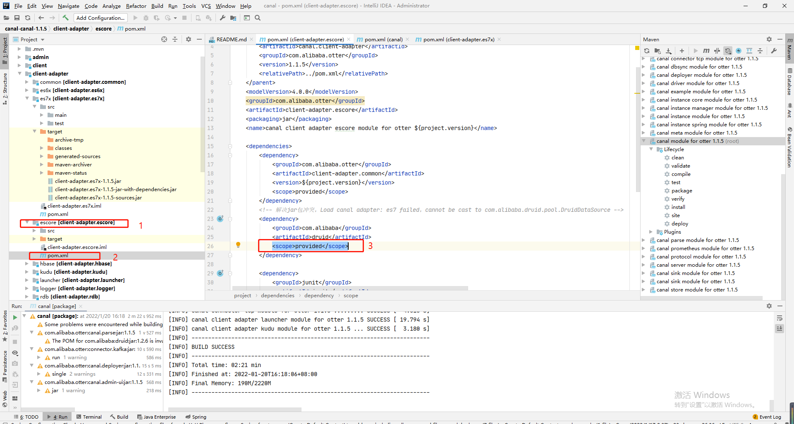
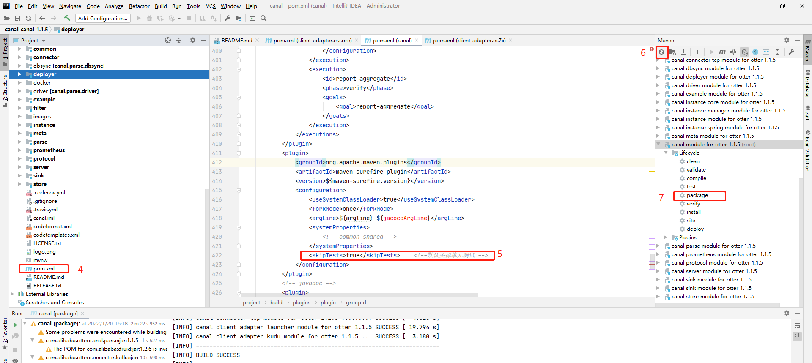
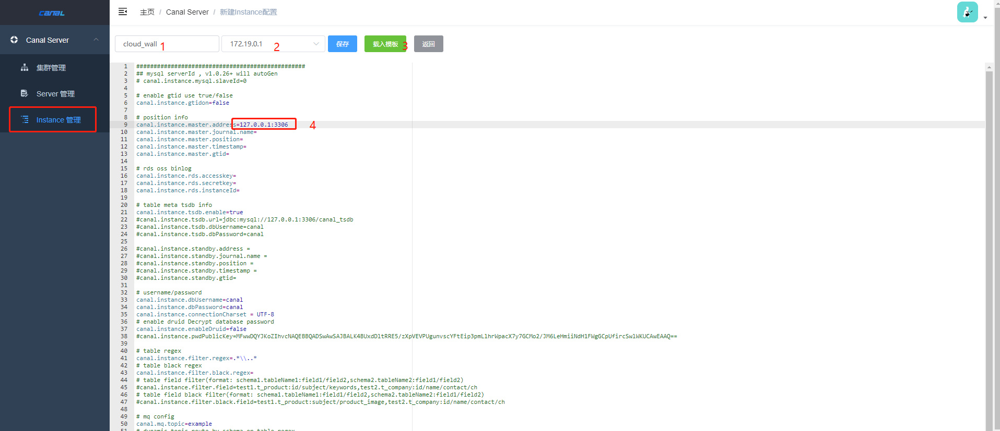

## Canal同步MySQL到ES7


### 环境信息

- docker
- mysql 8.0.19
- elasticsearch 7.3.0

- canal.adapter-1.1.5
- canal-admin 1.1.5

- canal-adapter 1.1.5


### MySQL

> 创建同步库

```sql
CREATE DATABASE IF NOT EXISTS cloud_wall DEFAULT CHARACTER SET utf8;

DROP TABLE IF EXISTS `ana`;
CREATE TABLE `ana`  (
  `id` int(0) NOT NULL AUTO_INCREMENT,
  `user_id` int(0) NULL DEFAULT NULL,
  `ana_type_id` int(0) NULL DEFAULT NULL,
  `ana_title` varchar(50) CHARACTER SET utf8 COLLATE utf8_general_ci NULL DEFAULT NULL,
  `ana_content` text CHARACTER SET utf8 COLLATE utf8_general_ci NULL,
  `comment_num` int(0) NULL DEFAULT 0,
  `prize_num` int(0) NULL DEFAULT 0,
  `create_date` datetime(0) NULL DEFAULT NULL,
  `update_date` datetime(0) NULL DEFAULT NULL,
  PRIMARY KEY (`id`) USING BTREE
) ENGINE = InnoDB AUTO_INCREMENT = 411 CHARACTER SET = utf8 COLLATE = utf8_general_ci ROW_FORMAT = Compact;

-- ----------------------------
-- Records of ana
-- ----------------------------
INSERT INTO `ana` VALUES (35, 2, 2, '你已经知道了答案', '当你不确定做一件事情的时候，你可以选择抛硬币，当你想要抛第二次的时候，你已经知道了答案', 0, 0, '2019-07-31 00:00:00', '2020-05-09 15:29:57');
INSERT INTO `ana` VALUES (39, 2, 2, '野心 才华', '我很喜欢这段话：当你的才华还撑不起你的野心的时候，你就应该静下心来学习；当你的能力还驾驭不了你的目标时，就应该沉下心来，历练；梦想，不是浮躁，而是沉淀和积累，只有拼出来的美丽，没有等出来的辉煌，机会永远是留给最渴望的那个人，学会与内心深处的你对话，问问自己，想要怎样的人生，静心学习，耐心沉淀。', 0, 0, '2019-07-31 00:00:00', '2020-05-09 15:29:57');
INSERT INTO `ana` VALUES (41, 2, 2, '我只知道 你是我的朋友', '高考过后你不用告诉我考了多少分 喜悲之后也不用说志愿填了什么 只要告诉我最后去了哪 我要找你要坐多久的火车 在此停留可否蹭口饭吃 一本二本三本我分不清 我只知道 你是我的朋友', 0, 0, '2019-07-31 00:00:00', '2020-05-09 15:29:57');
INSERT INTO `ana` VALUES (58, 2, 4, '无问西东', '你一生所要追求的功名利禄，没有什么是你的祖上没经历过的，那些只不过是人生的幻光。', 0, 0, '2019-08-06 00:00:00', '2020-05-09 15:29:57');
INSERT INTO `ana` VALUES (59, 2, 4, '无问西东', '看见的和听到的\n经常会令你们沮丧\n世俗是这样强大 \n强大到 生不出改变它们的念头\n可是如果有机会 \n提前了解了你们的人生\n你是否还会有勇气前来\n如果知道青春也不过只有这些日子\n不知你们是否还会在意 \n那些世俗希望你们在意的事情\n比如占有多少才更荣耀\n拥有什么才能被爱\n等你们长大，你们会 \n因绿芽冒出土地而喜悦\n会对初升的朝阳欢呼跳跃\n你会给别人善意和温暖。\n但是却会在赞美别的生命的同时，\n常常甚至永远的忘了自己的珍贵。\n', 0, 0, '2019-08-06 00:00:00', '2020-05-09 15:29:57');
INSERT INTO `ana` VALUES (61, 2, 4, '人性的弱点', '如果你一直是个好人，某天不小心做了一件坏事，大家会说，原来这人不咋地，平时挺会演啊。如果你一直是个坏人呢，某天做了件好事，大家会说，其实这人挺好的，以前没看出来。你说这是不是很狗 血？', 0, 0, '2019-08-06 00:00:00', '2020-05-09 15:29:57');
INSERT INTO `ana` VALUES (133, 2, 4, '大话西游', '我的意中人是个盖世英雄， 有一天他会踩着七色云彩来娶我，我猜中了前头可我猜 不着这结局。', 0, 0, '2019-08-23 00:00:00', '2020-05-09 15:29:57');
INSERT INTO `ana` VALUES (145, 2, 4, '白夜行', '我的天空里没有太阳，总是黑夜，但并不暗，因为有东西代替了太阳。虽然没有太阳那么明亮，但对我来说已经足够。凭借着这份光，我便能把黑夜当成白天。', 0, 0, '2019-08-29 20:53:56', '2020-05-09 15:29:57');
INSERT INTO `ana` VALUES (146, 2, 4, '人间失格', '人间失格里有这样一句话，日日做着同样的事情，循环着与昨日相同的惯例，若能避开猛烈的狂喜，自然不会有悲痛来袭，我说：照顾好自己', 0, 0, '2019-08-29 20:54:46', '2020-05-09 15:29:57');
INSERT INTO `ana` VALUES (180, 2, 1, '毫不在乎的人', '那个看起来毫不在乎你的人，在聊天窗口里写满了要对你说的话，可是却一直没按发送键。\n那个决绝果断拖你进黑名单的人，在别的地方悄悄地关注着你的喜怒哀乐。\n那些你以为与你毫无瓜葛的人，在那么多个容易脆弱的夜里，确实忍住了一万次想要联系你的冲动。\n多的是，你不知道的事。', 0, 0, '2019-08-29 21:03:47', '2020-05-09 15:29:57');
INSERT INTO `ana` VALUES (181, 2, 4, '寄生虫', '不是\"有钱却很善良\"，是\"有钱所以善良\"，懂吗？如果我有这些钱的话，我也会很善良，超级善良。', 0, 0, '2019-08-29 21:04:53', '2020-05-09 15:29:57');
INSERT INTO `ana` VALUES (182, 2, 4, '寄生虫', '有钱人家的小孩连衣服都没有褶皱，钱就是熨斗，把一切都烫平了，所有褶皱都被烫得平平的。', 0, 0, '2019-08-29 21:05:01', '2020-05-09 15:29:57');
INSERT INTO `ana` VALUES (207, 3, 4, '怦然心动', '有的人浅薄，有人的金玉在外，败絮其中。有一天你会遇到一个彩虹般绚烂的人，当你遇到这个人之后，你会觉得其他人都只是浮云而已！', 0, 0, '2019-08-31 00:00:00', '2020-05-09 15:29:57');
INSERT INTO `ana` VALUES (208, 3, 4, '千与千寻', '有些事情经历了，就不会忘记，只是暂时没有想起来罢了。', 0, 0, '2019-08-31 00:00:00', '2020-05-09 15:29:57');
INSERT INTO `ana` VALUES (216, 3, 4, '楚门的世界', '假如再也见不到你，就祝你早安，午安，晚安！', 0, 0, '2019-08-31 00:00:00', '2020-05-09 15:29:57');
INSERT INTO `ana` VALUES (217, 3, 4, '东邪西毒', '当你翻过一片沙漠\r\n才发现\r\n那只不过是另一片沙漠\r\n\r\n\r\n我事先告诉你\r\n即使你相信\r\n却怎么都想去那一边看看', 0, 0, '2019-08-31 00:00:00', '2020-05-09 15:29:57');
INSERT INTO `ana` VALUES (218, 3, 4, '城南旧事', '如果你没有如期归来，这就是离别的意义。', 0, 0, '2019-08-31 00:00:00', '2020-05-09 15:29:57');
INSERT INTO `ana` VALUES (219, 3, 4, '海上钢琴师', '我们笑着说再见\r\n却深知再见遥遥无期', 0, 0, '2019-08-31 00:00:00', '2020-05-09 15:29:57');
INSERT INTO `ana` VALUES (223, 3, 4, '泰坦尼克号', '我甚至连他的一张照片都没有，他只活在我的记忆里。', 0, 0, '2019-08-31 00:00:00', '2020-05-09 15:29:57');
INSERT INTO `ana` VALUES (224, 3, 4, '肖申克的救赎', '生命可以归结为一种简单的选择：要么忙于生存，要么赶着去死', 0, 0, '2019-08-31 00:00:00', '2020-05-09 15:29:57');
INSERT INTO `ana` VALUES (225, 3, 4, '肖申克的救赎', '这些墙很有趣。刚入狱的时候，你痛恨周围的高墙；慢慢地，你习惯了生活在其中；最终你会发现自己不得不依靠它而生存。这叫体制化。', 0, 0, '2019-08-31 00:00:00', '2020-05-09 15:29:57');
INSERT INTO `ana` VALUES (226, 3, 4, '绿皮书', '这世上有各种各样的人，恰巧我们成为了朋友，这不是缘分，只仅仅是因为我们本就应该是朋友。', 0, 0, '2019-08-31 00:00:00', '2020-05-09 15:29:57');
INSERT INTO `ana` VALUES (227, 3, 4, '绿皮书', '世界上孤独的人都害怕迈出第一步', 0, 0, '2019-08-31 00:00:00', '2020-05-09 15:29:57');
INSERT INTO `ana` VALUES (228, 3, 4, '这个杀手不太冷', '我所认为最深处的爱，莫过于分开以后，我将自己活成了你的样子。', 0, 0, '2019-08-31 00:00:00', '2020-05-09 15:29:57');
INSERT INTO `ana` VALUES (229, 3, 4, '无问西东', '愿你被打击时 记起你的珍贵 抵抗恶意\r\n愿你迷茫时 坚信你的珍贵\r\n爱你所爱 信你所行 听从你心 无问西东', 0, 0, '2019-08-31 00:00:00', '2020-05-09 15:29:57');
INSERT INTO `ana` VALUES (230, 3, 4, '阿甘正传', '“你以后想成为什么样的人？”\r\n\r\n“什么意思，难道我以后就不能成为我自己了吗？”', 0, 0, '2019-08-31 00:00:00', '2020-05-09 15:29:57');
INSERT INTO `ana` VALUES (231, 3, 4, '怦然心动', '有人在高楼，有人在深沟。\r\n有人光万丈，有人一身锈。\r\n诗人万千种，浮云莫去求。\r\n斯人若彩虹，遇上方知有。', 0, 0, '2019-08-31 00:00:00', '2020-05-09 15:29:57');
INSERT INTO `ana` VALUES (285, 2, 1, '父亲写的散文诗', '我的爸爸他有点世俗，有点贪小便宜，有点不可理喻，甚至有时候有点虚假，但他却努力教我所有美好的品质，他想我成为好的人，一切的不堪他都一个人承受，只是因为我是他的儿子，他很平凡，什么都给不了我，却又什么都给了我。', 0, 1, '2019-09-12 14:12:34', '2020-05-09 15:29:57');
INSERT INTO `ana` VALUES (296, 2, 4, '月亮与六便士', '据毛姆说，这本小说的书名带有开玩笑的意味。有一个评论家曾说《人性的枷锁》的主人公(菲力普嘉里)像很多青年人一样，终日仰慕月亮，却没有看到脚下的六便士银币。毛姆喜欢这个说法，就用《月亮与六便士》，作为下一本小说的书名。', 0, 0, '2019-09-18 10:38:38', '2020-05-09 15:29:57');
INSERT INTO `ana` VALUES (300, 2, 4, '心灵捕手', '我每天到你住处来接你。我们出去花天酒地，玩得很开心。但你可知我一天中最好的时刻是什么吗？大概只有十秒：从停车到走到你住所门口的这段时间。因为每当我敲门，都希望你不在屋子里面。没有一句\"再见\"或是\"明天见\"，什么都不用说，你就是这样离开了。我懂得不多，但这些我很清楚。', 0, 0, '2019-09-21 10:54:18', '2020-05-09 15:29:57');
INSERT INTO `ana` VALUES (344, 2, 4, '不知反省', '循环着度日的人们啊\n日里夜里请继续好好地反省\n你们终将得到解脱\n而迎接你们的\n会是下一个无尽的循环', 0, 0, '2019-11-11 08:30:52', '2020-05-09 15:29:57');
INSERT INTO `ana` VALUES (349, 2, 4, '海上钢琴师', '在那个无限蔓延的城市里，什么东西都有，可唯独没有尽头。', 1, 1, '2019-12-18 14:07:50', '2020-05-09 15:29:57');
INSERT INTO `ana` VALUES (351, 2, 1, '平凡之路', '小时候跟着父亲去城里卖西瓜，害怕同学会看到我，就拼命地将自己隐藏起来，一路心惊肉跳。\n现在想来，那条路绿树成荫，阳光飒爽，若不是我害怕面对自己的不完美，一定能看到许多美好的景致，那条路，正如其他的所有路，从来都不应该被逃避', 0, 0, '2020-01-10 17:19:04', '2020-05-09 15:29:57');
INSERT INTO `ana` VALUES (352, 2, 4, '闻香识女人', '如今我走到人生十字路口，我知道哪条路是对的，毫无例外，我就知道，但我从不走，为什么？因为他妈的太苦了！', 0, 0, '2020-01-10 17:20:37', '2020-05-09 15:29:57');
INSERT INTO `ana` VALUES (353, 2, 4, '闻香识女人', '探戈里无所谓错步的，不像人生。', 1, 0, '2020-01-10 17:20:53', '2020-05-09 15:29:57');
INSERT INTO `ana` VALUES (372, 2, 3, 'Coco不可以', '今天我去医院看病\n我问医生以后还可以喝奶茶吗\n医生说也不是不可以只能喝一点点\n我问Coco不可以吗 医生把我赶出去了', 0, 0, '2020-02-07 20:49:15', '2020-05-09 15:29:57');
INSERT INTO `ana` VALUES (373, 2, 3, '开玩笑', '朋友问我 会因为年纪大了而随便找个人结婚吗? 开玩笑 随便找就能找到吗', 0, 0, '2020-02-07 20:49:24', '2020-05-09 15:29:57');
INSERT INTO `ana` VALUES (374, 2, 3, '我的朋友是不是太多了?', '最近很多朋友说我长胖了\n这不禁让我陷入思考:\n我怎么会有那么多朋友?\n我的朋友是不是太多了?\n', 0, 0, '2020-02-07 20:49:37', '2020-05-09 15:29:57');
INSERT INTO `ana` VALUES (375, 2, 3, '还不如小时候', '小时候以为长大了就有钱了 现在长大了还不如小时候有钱', 0, 0, '2020-02-07 20:49:47', '2020-05-09 15:29:57');
INSERT INTO `ana` VALUES (376, 2, 3, '是因为不想吗?', '不要再问我为什么不谈恋爱了你为什么不上清华是因为不想吗?', 0, 1, '2020-02-07 20:49:56', '2020-05-09 15:29:57');
INSERT INTO `ana` VALUES (377, 2, 3, '别回了', '我妈打电话问我买了几张票回家，我说一张！她说：别回了', 0, 0, '2020-02-07 20:50:03', '2020-05-09 15:29:57');
INSERT INTO `ana` VALUES (409, 2, 1, '摘录', '清醒的停留胜过盲目的向前', 2, 2, '2021-06-23 16:42:28', NULL);
INSERT INTO `ana` VALUES (410, 1, 1, 'Lemons', 'If life gives you lemons, make lemonade.', 0, 0, '2021-08-26 09:34:34', NULL);

-- ----------------------------
-- Table structure for ana_type
-- ----------------------------
DROP TABLE IF EXISTS `ana_type`;
CREATE TABLE `ana_type`  (
  `id` int(0) NOT NULL AUTO_INCREMENT,
  `ana_type_name` varchar(20) CHARACTER SET utf8 COLLATE utf8_general_ci NULL DEFAULT NULL,
  `create_date` datetime(0) NULL DEFAULT NULL,
  `update_date` datetime(0) NULL DEFAULT NULL,
  PRIMARY KEY (`id`) USING BTREE
) ENGINE = InnoDB AUTO_INCREMENT = 9 CHARACTER SET = utf8 COLLATE = utf8_general_ci ROW_FORMAT = Compact;

-- ----------------------------
-- Records of ana_type
-- ----------------------------
INSERT INTO `ana_type` VALUES (1, '热评', '2019-09-09 00:00:00', '2019-09-09 00:00:00');
INSERT INTO `ana_type` VALUES (2, '短句', '2019-09-09 00:00:00', '2019-09-09 00:00:00');
INSERT INTO `ana_type` VALUES (3, '段子', '2019-09-09 00:00:00', '2019-09-09 00:00:00');
INSERT INTO `ana_type` VALUES (4, '台词', '2019-09-09 00:00:00', '2019-09-09 00:00:00');
INSERT INTO `ana_type` VALUES (8, '首页', '2019-09-09 00:00:00', '2019-09-09 00:00:00');

-- ----------------------------
-- Table structure for user
-- ----------------------------
DROP TABLE IF EXISTS `user`;
CREATE TABLE `user`  (
  `id` int(0) NOT NULL AUTO_INCREMENT,
  `user_name` varchar(50) CHARACTER SET utf8 COLLATE utf8_general_ci NULL DEFAULT NULL,
  `user_password` varchar(50) CHARACTER SET utf8 COLLATE utf8_general_ci NULL DEFAULT NULL,
  `user_nick_name` varchar(50) CHARACTER SET utf8 COLLATE utf8_general_ci NULL DEFAULT '匿名',
  `user_mobile` varchar(50) CHARACTER SET utf8 COLLATE utf8_general_ci NULL DEFAULT NULL,
  `user_signature` varchar(200) CHARACTER SET utf8 COLLATE utf8_general_ci NULL DEFAULT '默认个性签名...',
  `user_head_img` varchar(500) CHARACTER SET utf8 COLLATE utf8_general_ci NULL DEFAULT '/static/upLoadFiles/default.jpg',
  `user_disabled` int(0) NULL DEFAULT 0,
  `create_date` datetime(0) NULL DEFAULT NULL,
  `update_date` datetime(0) NULL DEFAULT NULL,
  PRIMARY KEY (`id`) USING BTREE
) ENGINE = InnoDB AUTO_INCREMENT = 9 CHARACTER SET = utf8 COLLATE = utf8_general_ci ROW_FORMAT = Compact;

-- ----------------------------
-- Records of user
-- ----------------------------
INSERT INTO `user` VALUES (1, '18848848551', 'E10ADC3949BA59ABBE56E057F20F883E', 'Cai Peishen', '18848848551', '人间一趟 看看太阳', '/static/upLoadFiles/psc_20210618092645013.jpg', 0, '2020-02-02 02:02:02', '2020-05-09 15:30:24');
INSERT INTO `user` VALUES (2, '16621701951', 'E10ADC3949BA59ABBE56E057F20F883E', '热评墙', '16621701951', '未来i', '/static/upLoadFiles/default.jpg', 0, '2020-02-02 02:02:02', '2020-05-09 15:30:24');
INSERT INTO `user` VALUES (3, '13353688773', 'F61A67B6F93F92312C743ABF60C66285', '柏柏丶', '13353688773', '慢下来', '/static/upLoadFiles/default.jpg', 0, '2020-02-02 02:02:02', '2020-05-09 15:30:24');
INSERT INTO `user` VALUES (4, '987654321', 'E10ADC3949BA59ABBE56E057F20F883E', '匿名', '18317325792', '默认个性签名...', '/static/upLoadFiles/default.jpg', 0, '2020-02-02 02:02:02', '2020-05-09 15:30:24');
INSERT INTO `user` VALUES (5, '1402333029', 'E10ADC3949BA59ABBE56E057F20F883E', '匿名', '18848848551', '默认个性签名...', '/static/upLoadFiles/default.jpg', 0, '2020-02-02 02:02:02', '2020-05-09 15:30:24');
INSERT INTO `user` VALUES (6, 'douyatingy', '8E6146C02A9DE3D4820D8C46932000B4', '美味而已y', '18538315850', '人海浮沉', '/static/upLoadFiles/default.jpg', 0, '2020-02-02 02:02:02', '2020-05-09 15:30:24');
INSERT INTO `user` VALUES (7, 'caipeishen', '2A486CEECF6C8D88F4602BD21A7D2B56', '匿名', '13661707009', '默认个性签名...', '/static/upLoadFiles/default.jpg', 0, '2020-02-02 02:02:02', '2020-05-09 15:30:24');
INSERT INTO `user` VALUES (8, '123456', 'E10ADC3949BA59ABBE56E057F20F883E', '匿名', '18848848551', '默认个性签名...', '/static/upLoadFiles/default.jpg', 0, '2021-06-16 22:33:14', NULL);

SET FOREIGN_KEY_CHECKS = 1;

```


> 开启Binlog

```sh
# 修改mysql配置文件
vi /etc/my.cnf


# binlog开启
server-id=1
log-bin=mysql-bin
binlog_format=row
binlog-do-db=cloud_wall # 不写表示所有库都开启
```


> 重启mysql

```sh
sudo systemctl restart mysqld
```


> 到mysql存储的数据目录下查看`mysql-bin`文件大小

```sh
# 使用自己的mysql数据目录，默认的是/var/lib
ll /usr/local/mysql/data/
```


> 检查binlog是否开启成功，插入一条数据，查看`mysql-bin`文件大小


> 创建mysql中canal用户

```sql
create user 'canal'@'%' identified by 'canal';
alter user 'canal'@'%' identified with mysql_native_password by 'canal';
grant all privileges on *.* to "canal"@'%';
flush privileges;
```


> 使用canal登录mysql，删除修改数据，看看是否有权限


### ElasticSearch

> 使用docker-compose安装，编写`docker-compose.yml`文件

```yml
version: "3.1"
services:
  elasticsearch:
    image: docker.elastic.co/elasticsearch/elasticsearch:7.3.0
    restart: always
    environment:
     - cluster.name=elasticsearch
     - discovery.type=single-node
     - "ES_JAVA_OPTS=-Xms1024m -Xmx1024m"
    container_name: elasticsearch
    ports:
     - 9200:9200
  kibana:
    image: docker.elastic.co/kibana/kibana:7.3.0
    restart: always
    container_name: kibana
    ports:
     - 5601:5601
    environment:
     - elasticsearch_url=http://192.168.56.117:9200
    depends_on:
     - elasticsearch
```


> 运行docker容器

```sh
# 运行容器
docker-compose up -d

# 查看日志
docker-compose logs -f
```


> 查看ElasticSearch是否启动成功

```sh
# elasticsearch
http://192.168.56.117:9200

# kibana
http://192.168.56.117:5601
```


> 创建索引

```json
# 删除索引
DELETE /ana

# 创建索引
PUT /ana
{
  "mappings": {
    "properties": {
      "id": {
        "type": "long"
      },
      "user_id": {
        "type": "long"
      },
      "user_nick_name": {
        "type": "text"
      },
      "ana_type_id": {
        "type": "long"
      },
      "ana_type_name": {
        "type": "text"
      },
      "ana_title": {
        "type": "text"
      },
      "ana_content": {
        "type": "text"
      },
      "comment_num": {
        "type": "long"
      },
      "prize_num": {
        "type": "long"
      },
      "create_date": {
        "type": "date",
        "format": "yyyy-MM-dd HH:mm:ss||yyyy-MM-dd||epoch_millis"
      },
      "update_date": {
        "type": "date",
        "format": "yyyy-MM-dd HH:mm:ss||yyyy-MM-dd||epoch_millis"
      }
    }
  }
}

# 查询内容
POST /ana/_search
{
  "query": {
    "match_all": {
      
    }
  },
  "size": 200
}
```


### Canal

canal下载并解压：https://github.com/alibaba/canal/releases/tag/canal-1.1.5

- canal.adapter-1.1.5.tar.gz
- canal-admin 1.1.5.tar.gz

- canal-adapter 1.1.5.tar.gz

> canal1.1.5支持es7，但官方的`canal.adapter-1.1.5`的包有问题，会出现数据原问题`DruidDataSource`，我们下载源码打包，替换一个jar包就可以了（canal.adapter-1.1.5/plugin/client-adapter.es7x-1.1.5-jar-with-dependencies.jar）








>client-adapter/escore模块下pom文件，数据源添加作用域`<scope>provided</scope>`

```xml
<dependency>
    <groupId>com.alibaba</groupId>
    <artifactId>druid</artifactId>
    <scope>provided</scope> <!--数据源添加作用域 -->
</dependency>
```


> canal-canal-1.1.5模块下(主pom文件)，添加跳过测试`<skipTests>true</skipTests>`

```xml
<plugin>
    <groupId>org.apache.maven.plugins</groupId>
    <artifactId>maven-surefire-plugin</artifactId>
    <version>${maven-surefire.version}</version>
    <configuration>
        <useSystemClassLoader>true</useSystemClassLoader>
        <forkMode>once</forkMode>
        <argLine>${argline} ${jacocoArgLine}</argLine>
        <systemProperties>
            <!-- common shared -->
        </systemProperties>
        <skipTests>true</skipTests>    <!--默认关掉单元测试 -->
    </configuration>
</plugin>
```


> 刷新maven，重新打包，找到jar包 `canal-canal-1.1.5/client-adapter/es7x/target/client-adapter.es7x-1.1.5-jar-with-dependencies.jar` ，进入canal的adapter目录，canal.adapter-1.1.5/plugin/，进行替换


#### canal.admin-1.1.5

> 解压并进入canal.admin-1.1.5目录，编辑配置文件

```sh
# 解压
mkidr canal.admin-1.1.5
tar -zxvf canal.admin-1.1.5.tar.gz -C canal.admin-1.1.5

# 编辑
vi conf/application.yml
```


> 配置修改

```yml
server:
  port: 8089
spring:
  jackson:
    date-format: yyyy-MM-dd HH:mm:ss
    time-zone: GMT+8

spring.datasource:
  address: 127.0.0.1:3306
  database: canal_manager
  username: root
  password: a9530.A.
  driver-class-name: com.mysql.jdbc.Driver
  url: jdbc:mysql://${spring.datasource.address}/${spring.datasource.database}?useUnicode=true&characterEncoding=UTF-8&useSSL=false
  hikari:
    maximum-pool-size: 30
    minimum-idle: 1

canal:
  adminUser: admin
  adminPasswd: 123456 # 记得改密码，不然登录的时候不让你等(密码少于6位)
```


>初始化元数据库，确保我们在canal.admin-1.1.5目录

```sh
mysql -h127.1 -uroot -p

# 创建数据库
CREATE DATABASE IF NOT EXISTS canal_manager DEFAULT CHARACTER SET utf8;

# 导入初始化SQL
> source conf/canal_manager.sql
```


> 启动

```sh
sh bin/startup.sh
```


>  查看 admin 日志 

```sh
cat logs/admin.log
```


> 访问

```
canal-admin已经启动成功，可以通过 http://192.168.56.117:8089/ 访问，密码：admin/123456
```


#### canal.deployer-1.1.5

> 解压并进入canal.deployer-1.1.5目录，修改文件名

```sh
# 解压
mkidr canal.deployer-1.1.5
tar -zxvf canal.deployer-1.1.5.tar.gz -C canal.deployer-1.1.5

# 修改文件名
mv conf/canal.properties conf/canal_back.properties

# 使用canal-admin中的配置（通过界面配置）
mv conf/canal_local.properties conf/canal.properties
```


> 修改配置

```yml
# register ip
canal.register.ip =

# canal admin config
canal.admin.manager = 192.168.56.117:8089
canal.admin.port = 11110
canal.admin.user = admin
canal.admin.passwd = 6BB4837EB74329105EE4568DDA7DC67ED2CA2AD9 # 从数据库中找密码(canal_manager)
# admin auto register
canal.admin.register.auto = true
canal.admin.register.cluster =
canal.admin.register.name =
```


> 启动成功，我们canal-admin网页中，Server管理就可以看到

```sh
./bin/startup.sh
```


> 通过网页添加一个实例




>启动实例


#### canal.adapter-1.1.5

>解压并进入canal.deployer-1.1.5目录，

```sh
# 解压
mkdir canal.adapter-1.1.5
tar -zxvf canal.adapter-1.1.5.tar.gz -C canal.adapter-1.1.5
```


> 修改配置

```sh
vi ./conf/application.yml
```


>application.yml

```yml
server:
  port: 8081
spring:
  jackson:
    date-format: yyyy-MM-dd HH:mm:ss
    time-zone: GMT+8
    default-property-inclusion: non_null

canal.conf:
  mode: tcp #tcp kafka rocketMQ rabbitMQ
  flatMessage: true
  zookeeperHosts:
  syncBatchSize: 1000
  retries: 0
  timeout:
  accessKey:
  secretKey:
  consumerProperties:
    # canal tcp consumer
    canal.tcp.server.host: 127.0.0.1:11111
    canal.tcp.zookeeper.hosts:
    canal.tcp.batch.size: 500
    canal.tcp.username:
    canal.tcp.password:

  srcDataSources:
    defaultDS:
      url: jdbc:mysql://127.0.0.1:3306/cloud_wall?useUnicode=true
      username: root
      password: a9530.A.
  canalAdapters:
  - instance: cloud_wall # 自己的实例名
    groups:
    - groupId: g1
      outerAdapters:
        - name: logger
        - name: es7
          hosts: http://127.0.0.1:9200 # 127.0.0.1:9200 for rest mode
          properties:
            mode: rest
            cluster.name: elasticsearch
```


> 创建es7下的实例

```sh
vi conf/es7/cloud_wall.yml
```


> cloud_wall.yml

```yml
dataSourceKey: defaultDS
destination: cloud_wall
groupId: g1
esMapping:
  _index: ana
  _id: _id
  upsert: true
#  pk: id
  sql: "SELECT a.id as _id, a.user_id, u.user_nick_name, a.ana_type_id, t.ana_type_name, a.ana_title, a.ana_content, a.comment_num, a.prize_num
        FROM ana a
        INNER JOIN `user` u ON u.id = a.user_id
        INNER JOIN ana_type t ON t.id = a.ana_type_id"
#  objFields:
#    _labels: array:;
#  etlCondition: "where a.create_date>={'0'}"
  commitBatch: 3000
```


> 启动

```sh
./bin/startup.sh
```


> 全量数据迁移

```sh
curl http://127.0.0.1:8081/etl/es7/cloud_wall.yml -X POST
```

