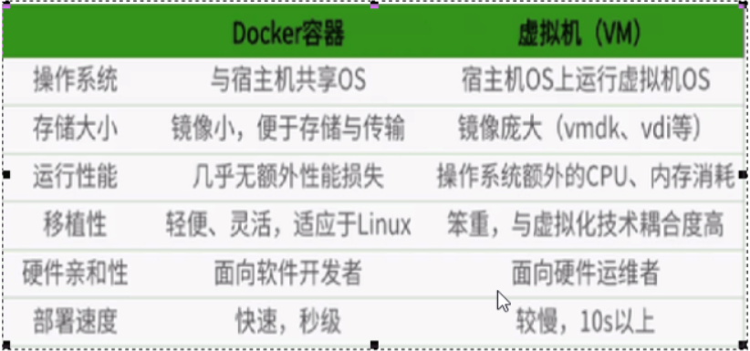
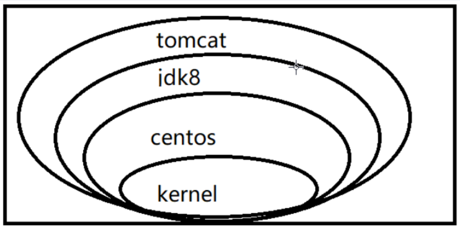

### Docker

参考：[Docker安装](https://www.cnblogs.com/bigben0123/p/11350200.html)  [云镜像](http://hub.daocloud.io/)


#### Docker简介

> 三大要素：镜像 容器 仓库


> 镜像

```
Docker 镜像（images）就是一个只读的模板。镜像可以用来创建 Docker 容器，一个镜像可以创建很多容器。
```


> 容器

```
 Docker 利用容器（Container）独立运行的一个或一组应用。容器是用镜像创建的运行实例。
 
它可以被启动、开始、停止、删除。每个容器都是相互隔离的、保证安全的平台。
 
可以把容器看做是一个简易版的 Linux 环境（包括root用户权限、进程空间、用户空间和网络空间等）和运行在其中的应用程序。


容器的定义和镜像几乎一模一样，也是一堆层的统一视角，唯一区别在于容器的最上面那一层是可读可写的。
```


> 仓库

```
 仓库（Repository）是集中存放镜像文件的场所。
仓库(Repository)和仓库注册服务器（Registry）是有区别的。仓库注册服务器上往往存放着多个仓库，每个仓库中又包含了多个镜像，每个镜像有不同的标签（tag）。
 
仓库分为公开仓库（Public）和私有仓库（Private）两种形式。
最大的公开仓库是 Docker Hub(https://hub.docker.com/)，
存放了数量庞大的镜像供用户下载。国内的公开仓库包括阿里云 、网易云 等
```


> 总结

```
需要正确的理解仓储/镜像/容器这几个概念:
 
Docker 本身是一个容器运行载体或称之为管理引擎。我们把应用程序和配置依赖打包好形成一个可交付的运行环境，这个打包好的运行环境就似乎 images镜像文件。只有通过这个镜像文件才能生成 Docker 容器。images 文件可以看作是容器的模板。Docker 根据 images 文件生成容器的实例。同一个 images 文件，可以生成多个同时运行的容器实例。
 
*  images 文件生成的容器实例，本身也是一个文件，称为镜像文件。
 
*  一个容器运行一种服务，当我们需要的时候，就可以通过docker客户端创建一个对应的运行实例，也就是我们的容器
 
* 至于仓储，就是放了一堆镜像的地方，我们可以把镜像发布到仓储中，需要的时候从仓储中拉下来就可以了。
```


> Docker与虚拟机比较

```
1.Docker有着比虚拟机更少的抽象层，由于Docker不需要Hypervisor实现硬件资源虚拟化，运行在Docker容器上的程序直接使用的都是实际物理机的硬件资源，因此在Cpu、内存利用率上Docker将会在效率上有明显优势。

2.Docker利用的是宿主机的内核，而不需要Guest OS(虚拟机安装的操作系统)，因此，当新建一个容器时，Docker不需要和虚拟机一样重新加载一个操作系统，避免了引导、加载操作系统内核这个比较费时费资源的过程，当新建一个虚拟机时，虚拟机软件需要加载Guest OS，这个新建过程是分钟级别的，而Docker由于直接利用宿主机的操作系统则省略了这个过程，因此新建一个Docker容器只需要几秒钟。
```




#### Docker安装

> 下载Docker依赖的环境

```sh
yum -y install yum-utils device-mapper-persistent-data lvm2
```

> 指定Docker镜像源

```sh
yum-config-manager --add-repo http://mirrors.aliyun.com/docker-ce/linux/centos/docker-ce.repo
```

> 安装Docker

```sh
#依然采用yum的方式安装
yum makacache
yum -y install docker-ce
```

> 启动Docker并测试

```sh
安装成功后，需要手动启动，设置为开机自启，并测试一下Docker

#启动Docker服务
systemctl start docker
#设置开机自动启动
systemctl enable docker
#测试
docker run hello-world
```

> Docker中央仓库

```sh
Docker官方的中央仓库:这个仓库是镜像最全的，但是下载速度较慢。
https://hub.docker.com/

国内的镜像网站:网易蜂巢，daoCloud等，下载速度快，但是镜像相对不全。
https://c.163yun.com/hub#/home
http://hub.daocloud.io/(推荐使用）

在公司内部会采用私服的方式拉取镜像，需要添加配置，如下......
需要创建/etc/docker/daemon.json，并添加如下内容
{
	"registry-mirrors":["https://registry.docker-cn.com"],
	"insecure-registries":["ip:port"]
}
#重启两个服务
systemctl daemon-reload
systemctl restart docker
```


#### Docker常用命令

> Docker 镜像命令

```
systemctl start docker 启动docker

docker --hple	docker常用命令
docker ps		查看docker进程

docker imagess	列出本地主机上的镜像
	-a :列出本地所有的镜像（含中间映像层，含没有运行）
	-q :只显示镜像ID
	--digests :显示镜像的摘要信息
	--no-trunc :显示完整的镜像信息
	说明：REPOSITORY镜像名、TAG标签、images_ID唯一、CREATED创建时间、VIRTUAL SIZE镜像大小
	同一仓库源可以有多个TAG，代表这个仓库源的不同个版本，我们使用REPOSITORY:TAG来定义不同的镜像。如果你不指定一个镜像的版本标答，例如你只体用ubuntu.docker将默认体用ubuntu:latest镜像
	
	
docker search xxx 查询某个镜像
	-s : 列出收藏数不小于指定值的镜像
	--no-trunc :显示完整的镜像信息
	--automated : 只列出 automated build类型的镜像；

    # 星数超过30的tomcat
    docker search -s 30 tomcat
    
    
docker pull xxx[:TAG] 拉取镜像
	docker pull tomcat 等价于 docker pull tomcat:latest
	
	
docker rmi xxx 删除某个镜像/镜像ID
	-f 镜像ID :单个删除某个镜像
	-f 镜像名[:TAG] :单个删除某个镜像
	-f 镜像名[:TAG] 镜像名[:TAG] :多个删除镜像
	-f $(docker imagess -qa) 删除所有镜像
	docker rmi -f hello-world 强制删除某个镜像
	docker rmi hello-world 等价于 docker rmi hello-world:latest


#从容器创建一个新的镜像
docker commit -m=“提交的描述信息” -a=“作者” 容器ID 要创建的目标镜像名:[标签名]
```


> Docker 容器命令

```
有镜像才能创建容器


docker run [OPTIONS] xxx images [COMMAND] 启动交互式容器
	--name="容器新名字": 为容器指定一个名称；
    -d: 后台运行容器，并返回容器ID，也即启动守护式容器；
    -i：以交互模式运行容器，通常与 -t 同时使用；
    -t：为容器重新分配一个伪输入终端，通常与 -i 同时使用；
    -P: 随机端口映射；
    -p: 指定端口映射，有以下四种格式
            ip:hostPort:containerPort
            ip::containerPort
            hostPort:containerPort
            containerPort
     docker run -it centos	启动centos并分配终端      
     docker run -it -p 8081:8080 tomcat  将Linux8081映射到docker的8080

docker ps 查看当前正在进行的docker进程
	-a :列出当前所有正在运行的容器+历史上运行过的
    -l :显示最近创建的容器。
    -n：显示最近n个创建的容器。
    -q :静默模式，只显示容器编号。
    --no-trunc :不截断输出。


docker restart 容器ID  返回容器信息以JSON字符串方式

在容器中
    exit 容器停止退出
    Ctrl+P+Q 容器不停止退出

docker start 容器ID

docker stop 容器ID 停止容器
docker stop $(docker ps -qa) 停止所有容器

docker kill 容器ID 强制关闭容器

docker rm 容器ID 删除已停止的容器
	-f :停止并删除容器
	
	一次性删除多个容器
	docker rm -f $(docker ps -a -q)
	docker ps -a -q | xargs docker rm
	
	
	

docker run -d xxx 启动守护式容器	
    问题：然后docker ps -a 进行查看, 会发现容器已经退出
    很重要的要说明的一点: Docker容器后台运行,就必须有一个前台进程.
    容器运行的命令如果不是那些一直挂起的命令（比如运行top，tail），就是会自动退出的。

    这个是docker的机制问题,比如你的web容器,我们以nginx为例，正常情况下,我们配置启动服务只需要启动响应的
    service即可。例如service nginx start
    但是,这样做,nginx为后台进程模式运行,就导致docker前台没有运行的应用,
    这样的容器后台启动后,会立即自杀因为他觉得他没事可做了.
    所以，最佳的解决方案是,将你要运行的程序以前台进程的形式运行
	
	
docker logs -f -t --tail 容器ID  查看容器日志
	-t 是加入时间戳
	-f 跟随最新的日志打印
	--tail 数字 显示最后多少条


docker top 容器ID	查看容器内运行的进程

docker inspect 容器ID 查看容器内部细节


进入正在运行的容器并以命令行交互
	docker exec -it 容器ID bashShell 	在外部执行docker容器的命令 [/bin/bash运行docker终端]

	docker attach 容器ID	重新进入
    
	exec 是在容器中打开新的终端，并且可以启动新的进程
	
	attach 直接进入容器启动命令的终端，不会启动新的进程

docker cp 容器ID:容器内路径 目的主机路径
```


#### Docker镜像

> UnionFS(联合文件系统)

```
UnionFS（联合文件系统）：Union文件系统（UnionFS）是一种分层、轻量级并且高性能的文件系统，它支持对文件系统的修改作为一次提交来一层层的叠加，同时可以将不同目录挂载到同一个虚拟文件系统下(unite several directories into a single virtual filesystem)。Union 文件系统是 Docker 镜像的基础。镜像可以通过分层来进行继承，基于基础镜像（没有父镜像），可以制作各种具体的应用镜像。
 
特性：一次同时加载多个文件系统，但从外面看起来，只能看到一个文件系统，联合加载会把各层文件系统叠加起来，这样最终的文件系统会包含所有底层的文件和目录
```


> Docker镜像加载原理

```
 
 Docker镜像加载原理：

docker的镜像实际上由一层一层的文件系统组成，这种层级的文件系统UnionFS。
bootfs(boot file system)主要包含bootloader和kernel, bootloader主要是引导加载kernel, Linux刚启动时会加载bootfs文件系统，在Docker镜像的最底层是bootfs。这一层与我们典型的Linux/Unix系统是一样的，包含boot加载器和内核。当boot加载完成之后整个内核就都在内存中了，此时内存的使用权已由bootfs转交给内核，此时系统也会卸载bootfs。
 
rootfs (root file system) ，在bootfs之上。包含的就是典型 Linux 系统中的 /dev, /proc, /bin, /etc 等标准目录和文件。rootfs就是各种不同的操作系统发行版，比如Ubuntu，Centos等等。 
平时我们安装进虚拟机的CentOS都是好几个G，为什么docker这里才200M？？

对于一个精简的OS，rootfs可以很小，只需要包括最基本的命令、工具和程序库就可以了，因为底层直接用Host的kernel，自己只需要提供 rootfs 就行了。由此可见对于不同的linux发行版, bootfs基本是一致的, rootfs会有差别, 因此不同的发行版可以公用bootfs。

以我们的pull为例，在下载的过程中我们可以看到docker的镜像好像是在一层一层的在下载
```


> 为什么 Docker 镜像要采用这种分层结构呢

```
最大的一个好处就是 - 共享资源
 
比如：有多个镜像都从相同的 base 镜像构建而来，那么宿主机只需在磁盘上保存一份base镜像，
同时内存中也只需加载一份 base 镜像，就可以为所有容器服务了。而且镜像的每一层都可以被共享。

Docker镜像都是只读的
当容器启动时，一个新的可写层被加载到镜像的顶部(例如图下的tomcat)。
这一层通常被称作“容器层”，“容器层”之下的都叫“镜像层”。
```




#### Docker数据券

> 创建数据券之后，默认会存放在一个目录下 /var/lib/docker/volumes/数据券名/_data

```sh
docker volume create 数据券名称
```

> 查看数据券详情

```sh
docker volume inspect 数据券名称
```

> 查看全部数据券信息

```sh
docker volume ls
```

> 删除数据券

```sh
docker volume rm 数据券名称
```

> 容器映射数据券

```sh
映射有两种方式:
1.通过路径映射数据卷，直接指定一个路径作为数据卷的存放位置。但是这个路径下是空的。
#通过数据卷名称映射
docker run -v数据卷名称:容器内部的路径镜像id

2.通过数据卷名称映射，如果数据卷不存在。Docker会帮你自动创建，会将容器内部自带的文件，存储在默认的存放路径中。
#通过路径映射数据卷
docker run -v路径:容器内部的路径镜像id

docker run -it -v /宿主机绝对路径目录:/容器内目录 镜像名 	容器宿主共享数据
docker run -it -v /宿主机绝对路径目录:/容器内目录:ro 镜像名	携带权限
docker run -it -v /cps_hose:/cps_contain centos:6.8

数据卷容器 容器间传递共享(--volumes-from 父容器ID)
命名的容器挂载数据卷，其它容器通过挂载这个(父容器)实现数据共享，挂载数据卷的容器，称之为数据卷容器
docker run -it --name dc02 --volumes-from dc01 zzyy/centos

容器之间配置信息的传递，数据卷的生命周期一直持续到没有容器使用它为止
```


#### DockerFile解析

> DockerFile构建过程解析

```
DockerFile是用来构建Docker镜像的构建文件，是由一系列命令和参数构成的脚本。

构建三步骤：DockerFile →(build)→ Docker镜像 →(run)→ Docker容器

从应用软件的角度来看，Dockerfile、Docker镜像与Docker容器分别代表软件的三个不同阶段，
*  Dockerfile是软件的原材料
*  Docker镜像是软件的交付品
*  Docker容器则可以认为是软件的运行态。
Dockerfile面向开发，Docker镜像成为交付标准，Docker容器则涉及部署与运维，三者缺一不可，合力充当Docker体系的基石。
```


> DockerFile体系结构(保留字指令)

```sh
FROM		基础镜像，当前新镜像是基于哪个镜像的
MAINTAINER	镜像维护者的姓名和邮箱地址
RUN			容器构建时需要运行的命令
EXPOSE		当前容器对外暴露出的端口
WORKDIR		指定在创建容器后，终端默认登陆的进来工作目录，一个落脚点
ENV			用来在构建镜像过程中设置环境变量
ADD			将宿主机目录下的文件拷贝进镜像且ADD命令会自动处理URL和解压tar压缩包
COPY		类似ADD，拷贝文件和目录到镜像中。 <源路径> 的文件/新一层的镜像内 <目标路径> 位置
VOLUME		容器数据卷，用于数据保存和持久化工作

CMD			指定一个容器启动时要运行的命令
			Dockerfile 中可以有多个 CMD 指令，但只有最后一个生效，CMD 会被docker run之后的参数替换

ENTRYPOINT 	指定一个容器启动时要运行的命令
			ENTRYPOINT 的目的和 CMD 一样，都是在指定容器启动程序及参数
			
ONBUILD		当构建一个被继承的Dockerfile时运行命令，父镜像在被子继承后父镜像的onbuild被触发
```


>自定义镜像mycentos

```sh
1.编写DockerFile文件
-------------------------------
FROM centosMAINTAINER zzyy<zzyy167@126.com>
ENV MYPATH /usr/localWORKDIR $MYPATH
RUN yum -y install vim 
RUN yum -y install net-tools
EXPOSE 80
CMD echo $MYPATHCMD echo "success--------------ok"CMD /bin/bash 
-------------------------------

2.构建出新镜像
docker build -f myDockerfile -t 新镜像名字:TAG .

3.运行
docker run -it 新镜像名字:TAG 

4.列出镜像变更历史
docker history 镜像名

# tomcat启动容器
docker run -d -p 8888:8080 --name my_tomcat 
-v /myDocker/tomcat/test:/usr/local/apache-tomcat-9.0.8/webapps/test 
-v /myDocker/tomcat/logs/:/usr/local/apache-tomcat-9.0.8/logs/ --privileged=true


docker run -p 12345:3306 
--name mysql 
-v /myDocker/mysql/conf:/etc/mysql/conf.d 
-v /myDocker/mysql/logs:/logs 
-v /myDocker/mysql/data:/var/lib/mysql 
-e MYSQL_ROOT_PASSWORD=123456 
-d mysql:5.7


-p 12345:3306 #将主机的12345端口映射到docker容器的3306端口。
--name mysql #运行服务名字
-v /zzyyuse/mysql/conf:/etc/mysql/conf.d #将主机/zzyyuse/mysql录下的conf/my.cnf 挂载到容器的 /etc/mysql/conf.d
-v /zzyyuse/mysql/logs:/logs #将主机/zzyyuse/mysql目录下的 logs 目录挂载到容器的 /logs。
-v /zzyyuse/mysql/data:/var/lib/mysql #将主机/zzyyuse/mysql目录下的data目录挂载到容器的 /var/lib/mysql 
-e MYSQL_ROOT_PASSWORD=a9530.A. #初始化 root 用户的密码。
-d mysql:5.6 #后台程序运行mysql5.6
 
docker exec -it MySQL运行成功后的容器ID/bin/bash
```


> MyTomcat的DockerFile

```sh
FROM         centos
MAINTAINER   Cai Peishen<peishen.cai@foxmail.com>

#把宿主机当前上下文的Cps.txt拷贝到容器/usr/local/路径下
COPY index.html /usr/local/tomcat/cps/index.html

#把java与tomcat添加到容器中
ADD jdk-8u171-linux-x64.tar.gz /usr/local/
ADD apache-tomcat-9.0.8.tar.gz /usr/local/

#安装vim编辑器
RUN yum -y install vim

#设置工作访问时候的WORKDIR路径，登录落脚点
ENV MYPATH /usr/local
WORKDIR $MYPATH

#配置java与tomcat环境变量
ENV JAVA_HOME /usr/local/jdk1.8.0_171
ENV CLASSPATH $JAVA_HOME/lib/dt.jar:$JAVA_HOME/lib/tools.jar
ENV CATALINA_HOME /usr/local/apache-tomcat-9.0.8
ENV CATALINA_BASE /usr/local/apache-tomcat-9.0.8
ENV PATH $PATH:$JAVA_HOME/bin:$CATALINA_HOME/lib:$CATALINA_HOME/bin

#容器运行时监听的端口
EXPOSE 8080

#启动时运行tomcat
# ENTRYPOINT ["/usr/local/apache-tomcat-9.0.8/bin/startup.sh"]
# CMD ["/usr/local/apache-tomcat-9.0.8/bin/catalina.sh","run"]
CMD /usr/local/apache-tomcat-9.0.8/bin/startup.sh && tail -F /usr/local/apache-tomcat-9.0.8/bin/logs/catalina.out
```


#### Docker Compose

> Compose 简介

```
Compose 是用于定义和运行多容器 Docker 应用程序的工具。通过 Compose，您可以使用 YML 文件来配置应用程序需要的所有服务。然后，使用一个命令，就可以从 YML 文件配置中创建并启动所有服务。

1.使用 Dockerfile 定义应用程序的环境
2.使用 docker-compose.yml 定义构成应用程序服务，这样它们可以在隔离环境中一起运行
3.最后，执行 docker-compose up 命令来启动并运行整个应用程序
```


> 安装

```sh
#去github官网搜索docker-compose，下载1.24.1版本的Docker-Compose 也可以直接再Linux中下载
wget https://github.com/docker/compose/releases/download/1.24.1/docker-compose-Linux-x86_64
#赋予权限 本身就是可以执行的文件 只是权限不够
chmod 777 docker-compose-Linux-x86_64
#放进/usr/local/bin目录下并修改文件名 etc/profile环境变量中会配置该路径 该目录下都是可以直接执行的命令
mv docker-compose-Linux-x86_64 /usr/local/bin/docker-compose
#在任意目录下输入
docker-compose
```


> docker-compose.yml的 配置案例如下（配置参数参考下文）： 

```yml
# yaml 配置实例
version: '3'
services:
  web:
    build: .
    ports:
      - 5000:5000
    volumes:
      - .:/code
      - logvolume01:/var/log
    links:
      - redis
  redis:
    images: redis
  volumes:
    logvolume01: {}
```


> Docker-Compose管理MySQL和Tomcat容器

```yml
version: '3.1'
services:
  mysql: #服务的名称
    restart: always #代表只要docker启动，那么这个容器就跟着一起启动
    images: daocloud.io/library/mysql:5.7.4 #指定镜像路径
    container_name: mysql #指定容器名称
    ports: 
      - 3307:3306 #指定端口号的映射 Linux的3307与容器的3306映射起来
    environment: 
      MYSQL_ROOT_PASSWORD: a9530.A. #指定MySQL的ROOT用户登录密码
      TZ: Asia/Shanghai #指定时区
    volumes: 
      - /opt/docker/docker_mysql_tomcat/mysql_data:/var/lib/mysql #映射数据卷
  tomcat:
    restart: always
    images: daocloud.io/library/tomcat:8.5.15-jre8
    container_name: tomcat
    ports:
      - 8081:8080
    environment: 
      TZ: Asia/Shanghai
    volumes: 
      - /opt/docker/docker_mysql_tomcat/tomcat_webapps:/usr/local/tomcat/webapps
      - /opt/docker/docker_mysql_tomcat/tomcat_logs:/usr/local/tomcat/logs
```


>使用docker-compose命令管理容器

```sh
#在使用docker-compose的命令时，默认会在当前目录下找docker-compose.yml文件

#1.基于docker-compose.yml启动管理的容器
docker-compose up -d

#2.关闭并删除容器
docker-compose down

#3.开启|关闭|重启已经存在的由docker-compose维护的容器
docker-compose start|stop|restart

#4.查看由docker-compose管理的容器
docker-compose ps

#5.查看日志
docker-compose logs -f
```


> docker-compose配合Dockerfile使用

```sh
#使用docker-compose.yml文件以及Dockerfile文件在生成自定义镜像的同时启动当前镜像，并且由docker-compose去管理容器
```

------

```yml
#编写docker-compose.yml文件
# yml文件
version: '3.1'
services:
  ssm:
    restart: always
    build: #构建自定义镜像
      context: ./ #指定dockerfile文件的所在路径
      dockerfile: Dockerfile #指定Dockerfile文件名称
    images: ssm:1.0.1
    container_name: ssm
    ports:
      - 8082:8080
    environment:
      TZ:Asia/Shanghai
```

------

```dockerfile
#编写Dockerfile文件
FROM daocloud.io/library/tomcat:8.5.15-jre8
COPY ssm /usr/local/tomcat/webapps/ssm
#这里ssm是一个文件夹，如果是war包，则后面不用加ssm路径，
#具体查看https://www.cnblogs.com/zdz8207/p/linux-docker-add-copy.html
```

------

```sh
#可以直接启动基于docker-compose .ym1以及Dockerfile文件构建的自定义镜像
docker-compose up -d
#如果自定义镜像不存在，会帮助我们构建出自定义镜像，如果自定义镜像已经存在，会直接运行这个自定义镜像
#重新构建的话。
#重新构建自定义镜像
docker-compose build
#运行当前内容，并重新构建
docker-compose up -d --build
```

