 **愿景："IT路上的持续充电平台，让技术不再难学"**

**更多高级课程请访问 xdclass.net**

### 第一章 ElasticSearch8.X+SpringBoot3.X最佳实践课程介绍


#### 第1集 ElasticSearch8.X+SpringBoot3.X最佳实践课程介绍

**简介：ElasticSearch8.X+SpringBoot3.X最佳实践课程介绍**

* 课程介绍

  - 本套课程 是**全新录制，**从0到1讲解新版ElasticSearch8.X+SpringBoo3.X核心基础+**高级知识点实战**

  - 核心介绍和学后水平

    - 基础板块
      - ElasticStack8.X核心架构和应用场景
      - 实战云服务器选购+Linux服务器源码安装ElasticSearch8.X
      - 源码安装Kibana8.X+ES8.X常用命令操作
      - 多案例实战Index和Document核心操作
      - ES8.X映射Mapping定义和IK中文分词配置实战
      - Query DSL多案例 match/match_all/filter/page/sort
    
    * 高级板块
    
      - **match高级用法多字段匹配和短语搜索案例实战**
    - 单词纠错Fuzzy模糊查询和搜索高亮语法实战
      - **Agg指标metric聚合搜索sum/avg/max多案例实战**
    - **Agg桶bucket聚合Trem/Range/Date Histogram多案例实战**
      - **新版SpringBoot3.X+ElasticSearch8.X整合多案例实战**
    - **Linux服务器多节点搭建ElasticSearc8.X高可用集群实战**
      - **ElasticSearch8.X常见性能优化最佳实践**
    - **高级技术岗提升路线和职业规划建议** 

- 为什么要学习**搜索引擎ElasticSearch8.X+SpringBoo3.X实战**

  - 多数互联网公司里面用的技术，构建业务搜索/日志存储分析/可视化大屏

  - ElasticSearch8可以解决关系型数据库的搜索和存储性能问题

  - 在多数互联网公司中，ElasticSearch 占有率很高，近几年大量流行

  - 可以作为公司内部培训技术分享必备知识，超多案例+实战等

  - 有谁在用，进一线大厂（**国内大厂多数都有用** ）

    - 国内：阿里、字节、腾讯 、微信、网易、虎牙、青云、新浪等

    - 国外：谷歌、Facebook、亚马逊、苹果等
    
    - 产品：维基百科、Github、StackOverFlow都是使用ElasticSearch存储数据


- 如果你想成为下面的一种，则**这个课程是必备**

  - 从传统软件公司过渡到互联网公司的人员，中大厂里面标配技术

  - 海量数据存储和搜索业务场景，任何一个岗位的负责人都离不开这个技术

  - 想往中高级开发工程师（前端、后端、测试、运维方向）

  - **目前是技术leader或者架构师岗位，进阶学习提升**

     

- 课程技术栈和测试环境说明

  - **ElasticSearch8.4+SpringBoo3.2最新稳定版本**

  - 技术不断更新，版本如何选择（跟着课程走，主流版本）

    - 技术框架版本使用这块，不建议做第一个吃螃蟹的人
    - 不同中间件，厂商不一样，不一定及时更新

     

- 学习形式

  - 视频讲解 + 文字笔记 + 原理分析 + 交互流程图
  - 配套源码 + 笔记 + 技术群答疑( 我答疑，联系客服进群)
  - 只要是我的课程和项目-我会一直维护下去，大家不用担心！！！

   

- 【必做事情】更多技术问题+职业规划，可以加我微信
  - 本职工作在比较忙，搬砖+带团队, 没法秒回，有空但都会很快回复的，见谅哈
  
  


#### 第2集 新版Elasticsearch8.X最佳实践课程大纲速览

**简介：新版Elasticsearch8.X最佳实践课程大纲速览**

- 课程学前基础

  - 搜索引擎Elasticsearch8.X+SpringBoot3.X课程需要具备相关基础：**Linux是必备知识点**
  - **项目框架实战会用到SpringBoot3.X+SpringDataElasticsearch等实战，高级岗最好掌握这些知识**
  - 不会的话我们有专题课程学习,联系我这边或者客服小姐姐即可

  

- 目录大纲浏览

- 学习要求：

  - 课程有配套资料，如果有用到就会在对应章集的资料里面
  - 如果自己操作的情况和视频不一样，仔细对比验证基本可以发现问题
  
  
- 遇到和课程效果不一样的，建议看多几次，结合笔记里面的配置
  - 高级后端/高级前端/运维工程师/架构师 都要把这个**搜索引擎ElasticSearch8.X**知识点掌握
  - 保持谦虚好学、术业有专攻、在校的学生，有些知识掌握也比工作好几年掌握的人厉害
  


 **愿景："IT路上的持续充电平台，让技术不再难学"**

**更多高级课程请访问 xdclass.net**

### 第二章 走进新一代Elastic Stack下的ElasticSearch8.X


#### 第1集 新版Elastic Stack 8.X核心架构介绍和应用场景

**简介： 新版Elastic Stack核心架构介绍和应用场景**

- 大家的疑惑

  - **课程学习的Elasticsearch 和 Elastic Stack有什么关系？**
  - Elasticsearch 简称 ES
  - 入口：https://www.elastic.co/cn/elasticsearch/
  
- 什么Elastic Stack

  - 先看日志链路架构图

  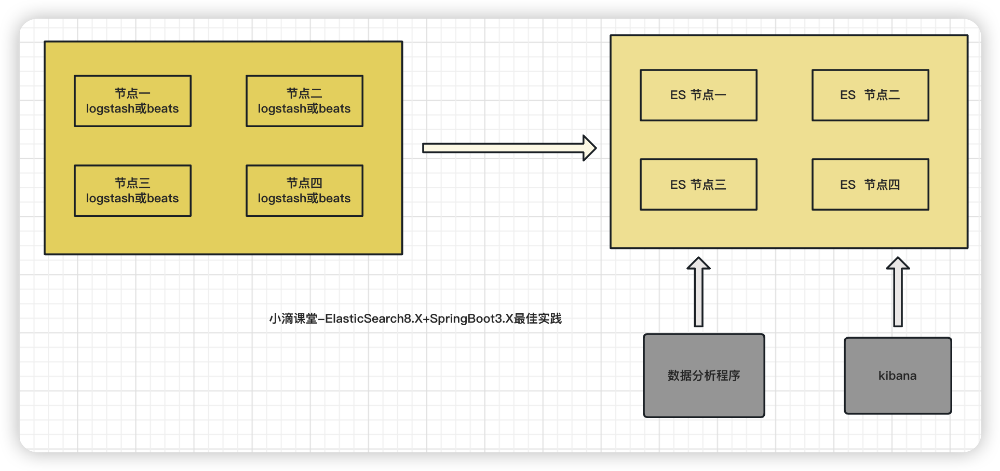

  - 官网：https://www.elastic.co/cn/elastic-stack/

  - 是一个开源的数据分析和可视化平台，由Elasticsearch、Logstash、Kibana和Beats组成

  - 它在各种应用场景中被广泛用于实时数据分析、搜索和可视化

    - **很多同学听说过ELK，实际上ELK是三款软件的简称，分别是Elasticsearch、 Logstash、Kibana组成**
    - **在发展的过程中有新成员Beats的加入，所以就形成了Elastic Stack，ELK是旧的称呼，Elastic Stack是新的名字**

  - ElasticSearch

    - 一个分布式实时搜索和分析引擎，高性能和可伸缩性闻名，能够快速地存储、搜索和分析大量结构化和非结构化数据
    - 基于java开发，它是Elastic Stack的核心组件，提供分布式数据存储和搜索能力。

  - Logstash

    - 是一个用于数据收集、转换和传输的数据处理引擎，支持从各种来源（如文件、日志、数据库等）收集数据
    - 基于java开发，并对数据进行结构化、过滤和转换，然后将数据发送到Elasticsearch等目标存储或分析系统。

  - Kibana

    - 基于node.js开发，数据可视化和仪表盘工具，连接到Elasticsearch，通过简单易用的用户界面创建各种图表、图形和仪表盘
    - 帮助用户快速探索和理解数据，并进行强大的数据分析和可视化

    

  * Beats

    - 是轻量级的数据收集器，用于收集和发送各种类型的数据到Elasticsearch或Logstash
    - Beats提供了多种插件和模块，用于收集和传输日志、指标数据、网络数据和安全数据等

    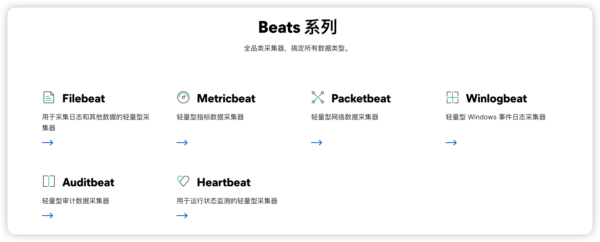

    * 注意
      - beats是用来优化logstash的，因为logstash消耗的性能比较多
      - 如果只是单纯的为了收集日志，使用logstash就有点大材小用了，另外有点浪费资源
      - 而beats是轻量级的用来收集日志的， 而logstash更加专注一件事，那就是数据转换，格式化，等处理工作


* 总结
  - Elastic Stack的架构主要是将各个组件连接起来形成数据处理和分析的流程
  - 数据可以通过Logstash的输入插件进行收集和处理，然后通过输出插件将数据发送到Elasticsearch进行存储和索引
  - Kibana可与Elasticsearch进行连接，提供灵活的可视化界面，将数据分析结果以图表、仪表盘等形式展示出来
  - Beats作为数据收集器，可以直接收集数据并将其发送到Elasticsearch或Logstash。
  - 整个Elastic Stack的架构是高度可扩展和灵活的，可以根据特定需求进行定制和扩展
  - 它被广泛应用于日志分析、实时监控、安全分析、商业智能和搜索等领域，为用户提供强大的数据处理和分析能力
  - **接下去我们就深入学习Elastic Stack架构下的Elasticsearch8.X，并基于多个案例实战**


#### 第2集 分布式搜索引擎ElasticSearch8.X核心概念

**简介： 分布式搜索引擎ElasticSearch8.X核心概念**

* 需求背景

  * 互联网公司里面，要做一个商品检索功能，支持关键词检索、高亮展示，过滤商品属性、价格范围、地理位置等

  

  * 数据团队里面有一个需求，需要实时监控系统日志、网络日志、应用日志等，进行实时分析、搜索和可视化，并可以聚合统计
  * 刚毕业的-小滴课堂老王的做法
    * **由于老王只学过Mysql数据库，精通SQL语法，愉快的接受老板的需求**
    * 新建数据库，把大量数据存储数据表里面，搜索功能 使用like模糊查询，聚合统计使用 sum、group by等进行
    * 项目很顺利的上线了，得到了嘉奖
  * 运行一周后老王就背锅了
    * 由于海量数据产生，Mysql一下子就过千万数据，不能及时响相关的请求
    * 虽然老王使用索引来加速搜索，但对于全文搜索等复杂的搜索需求，上线后性能也下降严重
    * 只能对文本字段进行基本的关键词匹配搜索，无法提供高级的全文搜索功能，如模糊匹配、语义搜索、分词
    * 对于复杂的聚合和分析查询也弱；每当有大量实时写入操作时，MySQL的性能下降严重，被严重吐槽
    * ...

  

* 什么是ElasticSearch

  * 是⼀个开源，是⼀个基于Apache Lucene库构建的Restful搜索引擎. Elasticsearch是在Solr之后⼏年推出的。

  * 它提供了⼀个分布式，多租户能⼒的全⽂搜索引擎，具有HTTP Web界⾯（REST）和⽆架构JSON⽂档

  * Elasticsearch的官⽅客户端库提供Java，Groovy，PHP，Ruby，Perl，Python，.NET和Javascript。

  * 官网：https://www.elastic.co/cn/elasticsearch/

  * 应用场景

    * 搜索引擎
      * 可以快速而准确地搜索大量的结构化和非结构化数据，用于构建搜索引擎、电商网站搜索等。
    * 实时日志分析
      * 提供了强大的实时索引功能和聚合功能，非常适合实时日志分析。
    * 数据分析和可视化
      * Elasticsearch与Kibana（Elastic Stack的一个组件）结合使用，可以进行复杂的数据分析和可视化。
    * 实时推荐系统
      * 基于Elasticsearch的实时搜索和聚合功能，可以用于构建实时推荐系统。
      * 根据用户的行为和兴趣，动态地推荐相关的内容和产品。
    * 电商商品搜索和过滤
      * Elasticsearch具有强大的搜索和过滤能力，使其成为构建电商网站的商品搜索和过滤引擎的理想选择。
      * 可以快速搜索和过滤商品属性、价格范围、地理位置等。
    * 地理空间数据分析
      * Elasticsearch内置了地理空间数据类型和查询功能，可以对地理位置进行索引和搜索
      * 适合于构建地理信息系统（GIS）、位置服务和地理数据分析应用。

  * 业界产品应⽤场景

    - 维基百科、Stack Overflow、GitHub

  * 核心概念快速上手

    - 在新版Elasticsearch中，文档document就是一行记录(json)，而这些记录存在于索引库(index)中, 索引名称必须是小写

    | Mysql数据库 | Elastic Search                                |
    | ----------- | --------------------------------------------- |
    | Database    | 7.X版本前有Type，对比数据库中的表，新版取消了 |
    | Table       | Index                                         |
    | Row         | Document                                      |
    | Column      | Field                                         |

    - 分片shards

      - 数据量特大，没有足够大的硬盘空间来一次性存储，且一次性搜索那么多的数据，响应跟不上
      - ES提供把数据进行分片存储，这样方便进行拓展和提高吞吐

      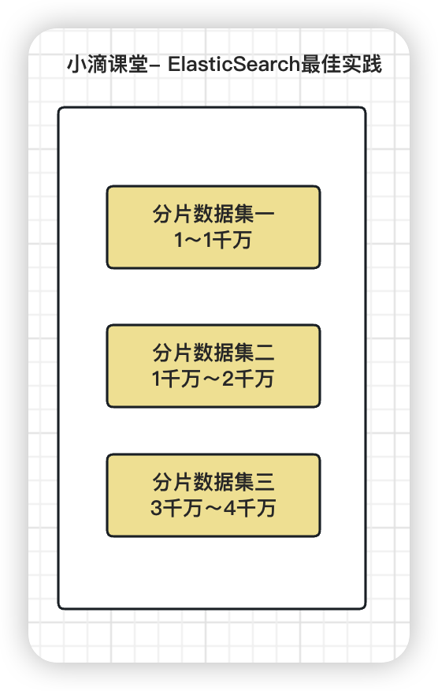

    - 副本replicas

      - 分片的拷贝，当主分片不可用的时候，副本就充当主分片进行使用
      - 索引分片的备份，shard和replica一般存储在不同的节点上，用来提高高可靠性
      - 案例
        - 假如Elasticsearch中的每个索引分配3个主分片和1个副本
        - 如果集群中至少有两个节点，索引将会有3个主分片和另外3个复制分片（1个完全拷贝）这样每个索引总共有6个分片

      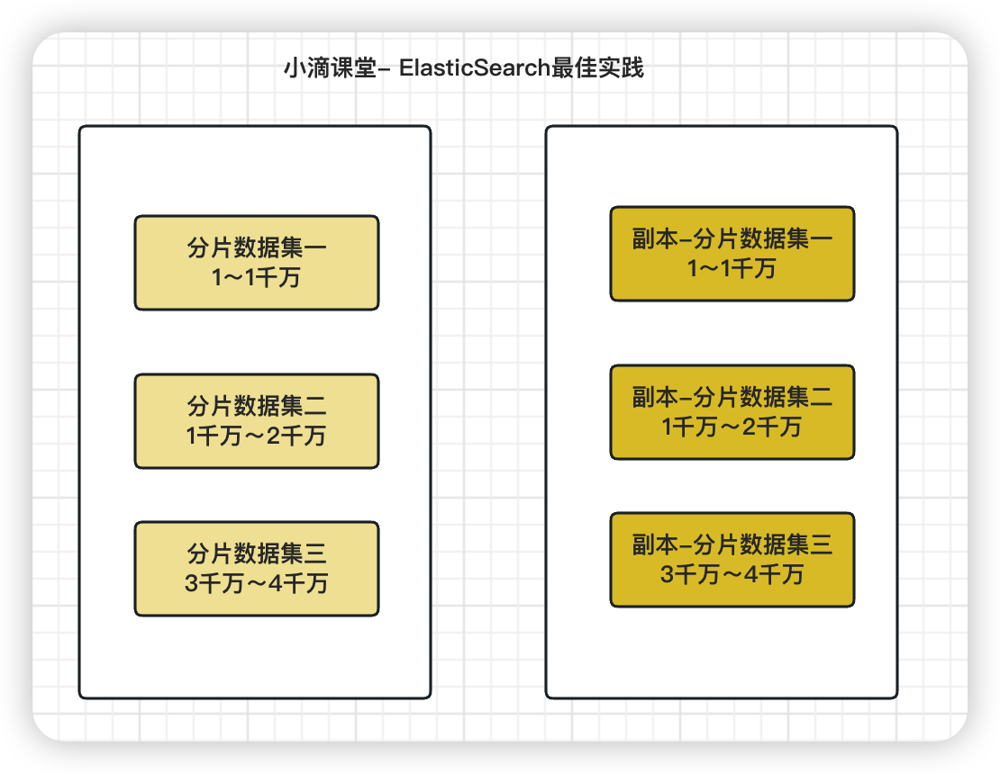

    - 元数据

      - Elasticsearch中以 “ _” 开头的属性都成为元数据，都有自己特定的意思
    

  
- 总结
    - ES默认为一个索引创建1个主分片和1个副本，在创建索引的时候使用settings属性指定，每个分片必须有零到多个副本
  - **注意：索引一旦创建成功，主分片primary shard数量不可以变(只能重建索引)，副本数量可以改变**


#### 第3集 云服务器介绍和阿里云服务器ECS服务器选购

**简介：什么是云服务器及目前主要的几个厂商介绍**


- 特别强调，操作系统和版本务必和课程保持一致！！！！！

  - 不管你看小滴课堂哪个视频，都可以用这个课程的环境
  - 比如：学 Linux、ElasticSearch、Mysql、Prometheus监控告警系统搭建，都可以使用云服务器搭建，再用客户端工具连接使用

   

- 大家纠结的云服务器和虚拟机无非就是一个付费 一个免费

  - 云服务器优点太多（百利无一害）
    - 云服务器不占用电脑资源；虚拟机占用本地电脑资源，运行集群容易卡死
    - 数据不容易丢失且随处可以连接； 虚拟机损坏全部东西都丢失
    - 配置要多强有多强；虚拟机配置低且每次开电脑都要启动
  - 熟悉云服务器，是很多公司招聘要求，大部分公司都是用阿里云服务器
  - 云服务器费用便宜的也就几十块一年，IT行业月薪1~2万很正常，投资自己不香吗？
    - 在云服务器部署技术博客、搭建常用练习环境
    - 部署项目全流程、备案、监控、网络攻击，这些是本地虚拟机没实现的

   

- 系统镜像千千万，都是镜像版本不统一导致的

  - 32位和64位系统：一定要是64位，不然很多软件没法安装
  - Win7+Win8（直接升级，官方都不维护了，很多软件不兼容）
  - 用的最Win10+Win11+Mac苹果
  - vm虚拟机的锅和坑 vmware
    - 问题：按照课程方式安装报错、网络不通等
    - 原因
      - 厂商/ 系统/ 软件版本 但是镜像也有不一样，你电脑系统可能是网上下载、可能是系统自带
      - 虚拟机+系统都是不同公司，他们也没法保证每台电脑一模一样
      - 最佳解决方式：云厂商服务器统一镜像
  - **不要省这个钱：不然别人早就学会课程了，而你还卡在安装相关依赖包或者虚拟机环境上面**

   

- 云厂商

  - 阿里云：https://www.aliyun.com/
  - 腾讯云：https://cloud.tencent.com/
  - 亚马逊云：https://aws.amazon.com/
  - 阿里云新用户地址（如果地址失效，联系我或者客服即可，1折）
    - https://www.aliyun.com/minisite/goods?userCode=r5saexap&share_source=copy_link

- 阿里云服务器选购 (尽量保持一致）

  - 操作系统 Linux CentOS 7.X
  - 配置：推荐2核4g内存以上，带宽选择按量付费
  - 注意：练习使用的阿里云服务器带宽不高，所以页面打开比较慢，可以加带服务器的临时带宽

- 阿里云控制台界面介绍

- 常见远程工具介绍

  - linux**命令行**操作工具，用于远程连接上传文件
    - Windows工具： putty，xshell, security CRT
    - 苹果系统MAC工具 ： 通过终端登录
      - ssh root@ip 回车后输入密码
      - ssh root@120.24.216.117
  - linux**图形操作**工具，用于远程连接上传文件
    - mac: filezilla
      - sftp://120.24.216.117
    - windows: winscp

- 云服务器都是有网络安全组

  - 部署对应的服务器，需要配置网络安全组开放端口才行
  - 部分系统还有selinux防护，云服务器默认是关闭的

- 环境问题说明

  - Win7、Win8、Win10、Mac、虚拟机等等，可能存在兼容问题
  - 务必使用CentOS 7 以上版本，64位系统！！！！


#### 第4集 Linux服务器源码安装JDK17+ElasticSearch8.X实战

**简介：  Linux服务器JDK17+ElasticSearch8.X源码安装实战**

- 需求

  - Linux服务器安装JDK17+ElasticSearch8.X，Elasticsearch是使用Java开发的，8.1版本的ES需要JDK17及以上版本
  - 在默认安装包中带有JDK环境，如果系统配置ES_JAVA_HOME环境变量，那会采用系统配置的JDK。
  - 如果没有配置环境变量，ES会使用自带的JDK，虽然自带的JDK是Elasticsearch推荐的Java版本，但一般建议使用系统配置的JDK 
  - 课程这边配置JDK，因为后续SpringBoot3.X整合也需要使用到JDK17

- 资料包

  - 本章本集资料里面，通过远程工具上传阿里云服务器

- 安装步骤

  - 第一步安装JDK17

    - 上传安装包（JDK17，ElasticSearc8.X）

      - 资料在安装包里面

    - 安装jdk（**本身服务器已经安装**）

      - 配置全局环境变量

        - 解压：`tar -zxvf jdk-17_linux-x64_bin.tar.gz`
        - 重命名
        - `vim /etc/profile`
        - 配置

        ```
        JAVA_HOME=/usr/local/software/elk_test/jdk17
        CLASSPATH=$JAVA_HOME/lib/
        PATH=$PATH:$JAVA_HOME/bin
        export PATH JAVA_HOME CLASSPATH
        ```

        - 环境变量立刻生效
        - `source /etc/profile`

      - 查看安装情况 `java -version`

  * 第二步安装ElasticSearc8.X

    - 上传安装包和解压

    ```
    tar -zxvf elasticsearch-8.4.1-linux-x86_64.tar.gz
    ```

    - 新建一个用户，安全考虑，elasticsearch默认不允许以root账号运行

    ```
    创建用户：useradd es_user
    设置密码：passwd es_user
    ```

    - 修改目录权限

    ```
    # chmod是更改文件的权限   
    # chown是改改文件的属主与属组  
    # chgrp只是更改文件的属组。
    
    
    chgrp -R es_user /usr/local/software/elk_test/elasticsearch-8.4.1
    chown -R es_user /usr/local/software/elk_test/elasticsearch-8.4.1
    chmod -R  777 /usr/local/software/elk_test/elasticsearch-8.4.1
    ```

    - 修改文件和进程最大打开数,需要root用户,如果系统本身有这个文件最大打开数和进程最大打开数配置，则不用

    ```
    在文件内容最后添加后面两行(切记*不能省略)
    vim /etc/security/limits.conf
    
    
    * soft nofile 65536
    * hard nofile 65536
    ```

    - 修改虚拟内存空间，默认太小

    ```
    在配置文件中改配置 最后一行上加上，执行 sysctl -p(立即生效)
    vim /etc/sysctl.conf
    
    vm.max_map_count=262144
    ```

    - 修改elasticsearch的JVM内存，机器内存不足，常规线上推荐16到24G内存

    ```
    vim config/jvm.options
    
    -Xms1g
    -Xmx1g
    ```

    - 修改 elasticsearch相关配置

    ```
    vim config/elasticsearch.yml
    
    cluster.name: my-application
    node.name: node-1
    path.data: /usr/local/software/elk_test/elasticsearch-8.4.1/data
    path.logs: /usr/local/software/elk_test/elasticsearch-8.4.1/logs
    network.host: 0.0.0.0
    http.port: 9200
    cluster.initial_master_nodes: ["node-1"]
    xpack.security.enabled: false
    xpack.security.enrollment.enabled: false
    ingest.geoip.downloader.enabled: false
    ```

    ```
    配置说明
    cluster.name: 指定Elasticsearch集群的名称。所有具有相同集群名称的节点将组成一个集群。
    node.name: 指定节点的名称。每个节点在集群中应该具有唯一的名称。
    path.data: 指定用于存储Elasticsearch索引数据的路径。
    path.logs: 指定Elasticsearch日志文件的存储路径。
    network.host: 指定节点监听的网络接口地址。0.0.0.0表示监听所有可用的网络接口，开启远程访问连接
    http.port: 指定节点上的HTTP服务监听的端口号。默认情况下，Elasticsearch的HTTP端口是9200。
    cluster.initial_master_nodes: 指定在启动集群时作为初始主节点的节点名称。
    xpack.security.enabled: 指定是否启用Elasticsearch的安全特性。在这里它被禁用（false），意味着不使用安全功能。
    xpack.security.enrollment.enabled: 指定是否启用Elasticsearch的安全认证和密钥管理特性。在这里它被禁用（false）。
    ingest.geoip.downloader.enabled: 指定是否启用GeoIP数据库下载功能。在这里它被禁用（false）
    ```

    


#### 第5集 ElasticSearch8.X安装注意事项和常用命令介绍

**简介：  ElasticSearch8.X安装注意事项和常用命令介绍**

* 启动ElasticSearch

```
切换到es_user用户启动, 进入bin目录下启动， &为后台启动,再次提示es消息时 Ctrl + c 跳出

./elasticsearch &

#安装命令，可以检查端口占用情况
yum install lsof -y
```


* 常见命令，可以用postman访问（网络安全组记得开发端口）

```
#查看集群健康情况
http://120.78.85.91:9200/_cluster/health

#查看分片情况
http://120.78.85.91:9200/_cat/shards?v=true&pretty

#查看节点分布情况
http://120.78.85.91:9200/_cat/nodes?v=true&pretty

#查看索引列表
http://120.78.85.91:9200/_cat/indices?v=true&pretty
```

* 常见问题

  - 磁盘空间需要85%以下，不然ES状态会不正常
  - 不要用root用户安装
  - linux内存不够
  - linux文件句柄
  - 没开启远程访问 或者 网络安全组没看开放端口
  - 有9300 tcp端口，和http 9200端口，要区分
  - 没权限访问，重新执行目录权限分配

  ```
  chgrp -R es_user /usr/local/software/elk_test/elasticsearch-8.4.1
  chown -R es_user /usr/local/software/elk_test/elasticsearch-8.4.1
  chmod -R  777 /usr/local/software/elk_test/elasticsearch-8.4.1
  ```

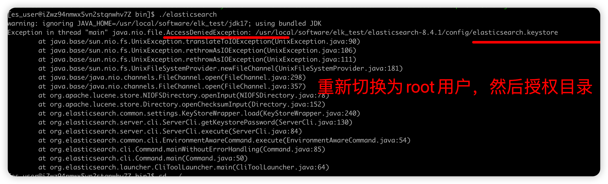


#### 第6集 ES可视化分析之Kibana8.X源码部署实战

**简介：  ES可视化分析之Kibana8.X源码部署实战**

- Kibana
  - 基于node.js开发，数据可视化和仪表盘工具，连接到Elasticsearch，通过简单易用的用户界面创建各种图表、图形和仪表盘
  - 帮助用户快速探索和理解数据，并进行强大的数据分析和可视化
  - **除了使用Kibana，也可以使用其他http请求工具，比如postman等进行测试接口和es语法**

* 安装部署

  - 上传安装包和解压

  ```
  tar -zxvf kibana-8.4.1-linux-x86_64.tar.gz
  ```

  - 配置用户权限

  ```
  chgrp -R es_user /usr/local/software/elk_test/kibana-8.4.1
  chown -R es_user /usr/local/software/elk_test/kibana-8.4.1
  chmod -R  777 /usr/local/software/elk_test/kibana-8.4.1
  ```

  - 修改配置文件 

  ```
  vim config/kibana.yml
  
  server.port: 5601
  server.host: "0.0.0.0"
  elasticsearch.hosts: ["http://112.74.167.42:9200"]
  i18n.locale: "zh-CN" #汉化
  
  
  #配置说明
  server.port: 指定Kibana服务器监听的端口号,Kibana将在5601端口上监听HTTP请求。
  server.host: 指定Kibana服务器绑定的网络接口地址, "0.0.0.0"表示监听所有可用的网络接口。
  elasticsearch.hosts: 指定ES集群的主机地址,可以配置多个,Kibana将连接到位于"120.24.7.58"主机上、使用默认HTTP端口9200的es
  i18n.locale: 指定Kibana界面的语言区域，"zh-CN"表示使用简体中文作为语言。
  ```

  - 启动，切换到es_user 用户, 建议先不用守护进程方式启动，可以直接启动查看日志

  ```
  ./kibana &
  ```

  - 访问（网络安全组记得开发端口）

  ```
  # 验证请求
  http://120.78.85.91:5601
  
  
  #查看集群健康情况
  GET /_cluster/health
  
  
  #查看分片情况
  GET /_cat/shards?v=true&pretty
  
  
  #查看节点分布情况
  GET /_cat/nodes?v=true&pretty
  
  
  #查看索引列表
  GET /_cat/indices?v=true&pretty
  ```

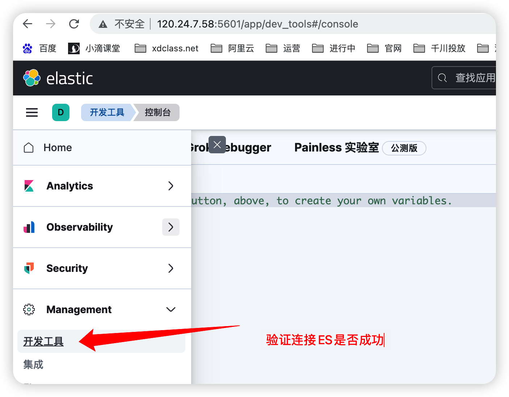


#### 第7集 数据库里面的正排索引和倒排索引

**简介：数据库里面的正排索引和倒排索引**

* 什么是正排索引 (Forward Index )

  * 指将文档的内容按照文档的顺序进行索引，每个文档对应一个索引条目，包含了文档的各个字段的内容
  * 例子假设我们有三个文档的标题和内容
    * 文档1：标题 "Apple iPhone 12"，内容 "The latest iPhone model" 
    * 文档2：标题 "Samsung Galaxy S21"，内容 "Powerful Android smartphone" 
    * 文档3：标题 "Microsoft Surface Laptop"，内容 "Thin and lightweight laptop"
  * 正排索引的结构示意图如下

  ```
  DocumentID | Title                    | Content
  -----------------------------------------------------------
  1          | Apple iPhone 12          | The latest iPhone model
  2          | Samsung Galaxy S21       | Powerful Android smartphone
  3          | Microsoft Surface Laptop | Thin and lightweight laptop
  ```

  * 正排索引的优势在于可以快速的查找某个文档里包含哪些词项。但是 正排不适用于查找包含某个词项的文档有哪些
  * 在数据库系统中，将正排索引类比为表格的结构，每一行是一个记录，每一列是一个字段

  | 学生ID | 姓名          | 年龄 | 成绩 |
  | ------ | ------------- | ---- | ---- |
  | 1      | 小滴课堂-老王 | 20   | 90   |
  | 2      | 小滴课堂-冰冰 | 18   | 85   |
  | 3      | Carol         | 19   | 92   |
  | 4      | David         | 21   | 88   |
  | 5      | Ellen         | 22   | 91   |

  

* 倒排索引（Inverted Index）

  

  * 根据关键词构建的索引结构，记录了每个关键词出现在哪些文档或数据记录中，适用于全文搜索和关键词检索的场景

  * 它将文档或数据记录划分成关键词的集合，并记录每个关键词所出现的位置和相关联的文档或数据记录的信息

  * 案例一

    * 例子假设 使用以下文档构建倒排索引
      *  文档1：标题 "Apple iPhone 12"，内容 "The latest iPhone model" 
      * 文档2：标题 "Samsung Galaxy S21"，内容 "Powerful Android smartphone" 
      * 文档3：标题 "Microsoft Surface Laptop"，内容 "Thin and lightweight laptop Apple"
    * 倒排索引的结构示意图如下：

    ```
    Term      | Documents
    -----------------------------------------
    Apple     | 1,3
    iPhone    | 1
    12        | 1
    latest    | 1
    Samsung   | 2
    Galaxy    | 2
    S21       | 2
    Powerful  | 2
    Android   | 2
    smartphone| 2
    Microsoft | 3
    Surface   | 3
    Laptop    | 3
    Thin      | 3
    lightweight| 3
    ```

  * 案例二
    * 假设我们有以下三个文档
      * 文档1：我喜欢吃苹果 
      * 文档2：我喜欢吃橙子和苹果 
      * 文档3：我喜欢吃香蕉
    * 倒排索引的结构示意图如下
      * 关键词 "我"：文档1、文档2、文档3 
      * 关键词 "喜欢"：文档1、文档2、文档3 
      * 关键词 "吃"：文档1、文档2、文档3 
      * 关键词 "苹果"：文档1、文档2 
      * 关键词 "橙子"：文档2 
      * 关键词 "香蕉"：文档3
    * 通过倒排索引，可以快速地找到包含特定关键词的文档或数据记录
  * 倒排索引记录了每个词语出现在哪些文档中，通过这种方式，我们可以非常快速地得知每个关键词分别出现在哪些文档中。
  * 当我们需要搜索包含特定关键词的文档时，可以直接查找倒排索引，找到包含该关键词的文档

* 总结

  * 正排索引和倒排索引的结构和用途不同
  * 正排索引用于快速访问和提取文档的内容
  * 倒排索引用于快速定位和检索包含特定词语的文档


 **愿景："IT路上的持续充电平台，让技术不再难学"**

**更多高级课程请访问 xdclass.net**

### 第三章 ElasticSearch8.X索引-文档-中文分词案例实战


#### 第1集 ElasticSearch8.X索引Index核心操作

**简介：  ElasticSearch8.X索引Index核心操作**

* Elasticsearch8.X索引的常见CRUD操作

  - 查看索引列表

    ```
    GET /_cat/indices?v=true&pretty
    ```

  - 查看分片情况

    ```
    GET /_cat/shards?v=true&pretty
    ```

  - 创建索引（Create Index）：

    ```
    PUT /<index_name>
    {
      "settings": {
        "number_of_shards": 1,
        "number_of_replicas": 1
      }
    }
    
    PUT /xdclass_shop
    {
      "settings": {
        "number_of_shards": 2,
        "number_of_replicas": 1
      }
    }
    ```

  - 查看索引是否存在( 结果是200 和 404)

    ```
    HEAD /<index_name>
    
    HEAD /xdclass_shop
    ```

     

  - 获取索引（Get Index）

    ```
    GET /<index_name>
    
    GET /xdclass_shop
    ```

  - 更新索引设置（Update Index Settings）：

    ```
    PUT /<index_name>/_settings
    {
      "settings": {
        "number_of_replicas": 2
      }
    }
    
    PUT /xdclass_shop/_settings
    {
      "settings": {
        "number_of_replicas": 2
      }
    }
    ```

  - 删除索引（Delete Index）：

    ```
    DELETE /<index_name>
    
    DELETE /xdclass_shop
    ```

 


#### 第2集 Elastic Search8.X文档Document核心操作

**简介：  Elastic Search8.X文档Document核心操作**

- 文档document

  - 真正的数据，存储一条数据就是一份文档，存储格式为JOSN，等同于mysql中的一条数据

- 文档的基本操作

  - 查询文档

  ```
  GET /xdclass_shop/_doc/1
  ```

  - 新增文档（需要指定ID）

  ```
  PUT /xdclass_shop/_doc/1
  {
    "id":5555,
    "title":"小滴课堂短链平台大课",
    "pv":144
  }
  ```

  - 新增文档（不指定ID或者指定ID都可以）,会自动生成id

  ```
  POST /xdclass_shop/_doc
  {
    "id":123,
    "title":"小滴课堂架构大课",
    "pv":244
  }
  ```

  - 修改（put和post都行，需要指定id）

  ```
  PUT /xdclass_shop/_doc/1
  {
    "id":999,
    "title":"小滴课堂短链平台大课v2",
    "pv":999,
    "uv":55
  }
  
  
  POST /xdclass_shop/_doc/1
  {
    "id":999,
    "title":"小滴课堂短链平台大课v3",
    "pv":999,
    "uv":559
  }
  ```

  - 搜索

  ```
  GET /xdclass_shop/_search
  
  字段解释
    took字段表示该操作的耗时（单位为毫秒）。
    timed_out字段表示是否超时。
    hits字段表示搜到的记录，数组形式。
    total：返回记录数，本例是1条。
    max_score：最高的匹配程度，本例是1.0
  ```

  - 删除数据

  ```
  DELETE /xdclass_shop/_doc/1
  ```

   


#### 第3集 Elastic Search8.X的Mapping和常见字段类型

**简介：  Elastic Search8.X的Mapping和常见字段类型**

- 什么是Mapping
  - 类似于数据库中的表结构定义 schema，
  - 定义索引中的字段的名称，字段的数据类型，比如字符串、数字、布尔等

* 查看索引库的字段类型

  ```
  GET /<index_name>/_mapping
  
  
  GET /my_index/_mapping
  ```

- Dynamic Mapping（动态映射）
  - 用于在索引文档时自动检测和定义字段的数据类型
  - 当我们向索引中添加新文档时，Elasticsearch会自动检测文档中的各个字段，并根据它们的值来尝试推断字段类型
  - 常见的字段类型包括文本（text）、关键词（keyword）、日期（date）、数值（numeric）等
  - 动态映射具备自动解析和创建字段的便利性，但在某些情况下，由于字段类型的不确定性，动态映射可能会带来一些问题
  - 例如字段解析错误、字段类型不一致等，如果对字段类型有明确的要求，最好在索引创建前通过显式映射定义来指定字段类型

- ElasticSearch常见的数据类型

  - 在 ES 7.X后有两种字符串类型：Text 和 Keyword
    - Text类型：用于全文搜索的字符串类型，支持分词和索引建立
    - Keyword类型：用于精确匹配的字符串类型，不进行分词，适合用作过滤和聚合操作。
  - Numeric类型：包括整数类型（long、integer、short、byte）和浮点数类型（double、float）。
  - Date类型：用于存储日期和时间的类型。
  - Boolean类型：用于存储布尔值（true或false）的类型。
  - Binary类型：用于存储二进制数据的类型。
  - Array类型：用于存储数组或列表数据的类型。
  - Object类型：用于存储复杂结构数据的类型

  

* 指定索引库字段类型mapping

  ```
  PUT /my_index
  {
    "mappings": {
      "properties": {
        "id": {
          "type": "keyword"
        },
        "title": {
          "type": "text"
        },
        "price": {
          "type": "float"
        }
      }
    }
  }
  ```

* 最高频使用的数据类型

  - text字段类型

    - text类型主要用于全文本搜索，适合存储需要进行全文本分词的文本内容，如文章、新闻等。
    - text字段会对文本内容进行分词处理，将文本拆分成独立的词项（tokens）进行索引
    - 分词的结果会建立倒排索引，使搜索更加灵活和高效。
    - text字段在搜索时会根据分词结果进行匹配，并计算相关性得分，以便返回最佳匹配的结果。

  - keyword字段类型

    - keyword类型主要用于精确匹配和聚合操作，适合存储不需要分词的精确值，如ID、标签、关键字等。
    - keyword字段不会进行分词处理，而是将整个字段作为一个整体进行索引和搜索
    - 这使得搜索只能从精确的值进行匹配，而不能根据词项对内容进行模糊检索。
    - keyword字段适合用于过滤和精确匹配，同时可以进行快速的基于精确值的聚合操作。

  - 总结

    - 在选择text字段类型和keyword字段类型时，需要根据具体的需求进行权衡和选择：

    - 如果需要进行全文本检索，并且希望根据分词结果计算相关性得分，以获得最佳的匹配结果，则选择text字段类型。
    - 如果需要进行精确匹配、排序或聚合操作，并且不需要对内容进行分词，则选择keyword字段类型。

* 案例实战

  * 创建索引并插入文档

  ```
  PUT /my_index
  {
    "mappings": {
      "properties": {
        "title": {
          "type": "text"
        },
        "tags": {
          "type": "keyword"
        },
        "publish_date": {
          "type": "date"
        },
        "rating": {
          "type": "float"
        },
        "is_published": {
          "type": "boolean"
        },
        "author": {
          "properties": {
            "name": {
              "type": "text"
            },
            "age": {
              "type": "integer"
            }
          }
        },
        "comments": {
          "type": "nested",
          "properties": {
            "user": {
              "type": "keyword"
            },
            "message": {
              "type": "text"
            }
          }
        }
      }
    }
  }
  
  
  POST /my_index/_doc/1
  {
    "title": "小滴课堂最近上线了新课 Elasticsearch Introduction",
    "tags": ["search", "big data", "distributed system", "小滴课堂"],
    "publish_date": "2025-01-01",
    "rating": 4.5,
    "is_published": true,
    "author": {
      "name": "John Doe",
      "age": 30
    },
    "comments": [
      {
        "user": "Alice",
        "message": "Great article!"
      },
      {
        "user": "Bob",
        "message": "Very informative."
      }
    ]
  }
  ```

* 查询匹配关键词的文档一

  ```
  GET /my_index/_search
  {
    "query": {
      "match": {
        "title": "Elasticsearch"
      }
    }
  }
  ```

* 查询匹配关键词的文档二

  ```
  GET /my_index/_search
  {
    "query": {
      "match": {
        "tags": "data"
      }
    }
  }
  ```


#### 第4集 走进搜索引擎的分词和ES默认分词器

**简介：走进搜索引擎的分词和ES默认分词器**

* 什么是搜索引擎的分词

  - 在Elasticsearch 8.X中，分词（tokenization）是将文本内容拆分成独立的单词或词项（tokens）的过程
  - 分词是搜索引擎在建立索引和执行查询时的关键步骤，将文本拆分成单词，并构建倒排索引，可以实现更好的搜索和检索效果。
  - 案例

  ```
  假设我们有两个产品标题：
  
  "Apple iPhone 12 Pro Max 256GB"
  
  "Samsung Galaxy S21 Ultra 128GB"
  
  使用默认的标准分词器（Standard Tokenizer），这些标题会被分割为以下令牌：
  
  标题1：["Apple", "iPhone", "12", "Pro", "Max", "256GB"]
  
  标题2：["Samsung", "Galaxy", "S21", "Ultra", "128GB"]
  
  分词器根据标点符号和空格将标题拆分为独立的词语。当我们执行搜索时，可以将查询进行分词，并将其与标题中的令牌进行匹配。
  
  例如
  	如果我们搜索"iPhone 12"，使用默认的分词器，它会将查询分解为["iPhone", "12"]，然后与令牌进行匹配。 
  	对于标题1，令牌["iPhone", "12"]匹配，它与查询相符。 标题2中没有与查询相符的令牌
  ```

  - 分词规则是指定义如何将文本进行拆分的规则和算法
  - Elasticsearch使用一系列的分词器（analyzer）和标记器（tokenizer）来处理文本内容
  - 分词器通常由一个或多个标记器组成，用于定义分词的具体规则
    - 以下是分词的一般过程：
      - 标记化（Tokenization）：
        - 分词的第一步是将文本内容拆分成单个标记（tokens），标记可以是单词、数字、特殊字符等。
        - 标记化过程由标记器（tokenizer）执行，标记器根据一组规则将文本切分为标记。
      - 过滤（Filtering）：
        - 标记化后，标记会进一步被过滤器（filters）处理。
        - 过滤器执行各种转换和操作，如转换为小写、去除停用词（stop words）,词干提取（stemming）,同义词扩展等。
      - 倒排索引（Inverted Indexing）：
        - 分词处理完成后，Elasticsearch使用倒排索引（inverted index）来存储分词结果。
        - 倒排索引是一种数据结构，通过将标记与其所属文档进行映射，快速确定包含特定标记的文档。
      - 查询匹配：
        - 当执行查询时，查询的文本也会进行分词处理。
        - Elasticsearch会利用倒排索引来快速查找包含查询标记的文档，并计算相关性得分。

  * 常见的分词器，如Standard分词器、Simple分词器、Whitespace分词器、IK分词等，还支持自定义分词器

* 默认的Standard分词器的分词规则
  - 标点符号切分：
    - 标点符号会被删除，并将连字符分隔为两个独立的词。
    - 例如，"Let's go!" 会被切分为 "Let", "s", "go"。
  - 小写转换：
    - 所有的文本会被转换为小写形式。
    - 例如，"Hello World" 会被切分为 "hello", "world"。
  - 停用词过滤：
    - 停用词（stop words）是在搜索中没有实际意义的常见词，如 "a", "an", "the" 等。
    - 停用词会被过滤掉，不会作为独立的词进行索引和搜索。
  - 词干提取：
    - 通过应用Porter2词干提取算法，将单词还原为其原始形式。
    - 例如，running -> run、swimming -> swim、jumped -> jump
  - 词分隔：
    - 按照空格将文本切分成词项（tokens）。


* 如何查看ES分词存储效果？

  - 使用`analyze` API 来对文本进行分词处理并查看分词结果，基本语法如下

    ```json
    GET /_analyze
    {
      "analyzer": "分词器名称",
      "text": "待分析的文本"
    }
    ```

  - 案例

    ```
    #字段是text类型
    POST /my_index/_analyze
    {
      "field": "title",
      "text": "This is some text to analyze"
    }
    
    #字段是text类型
    POST /my_index/_analyze
    {
      "field": "title",
      "text": "今天我在小滴课堂学习架构大课"
    }
    
    
    #字段是keyword类型
    POST /my_index/_analyze
    {
      "field": "tags",
      "text": "This is some text to analyze"
    }
    
    
    #字段是keyword类型
    POST /my_index/_analyze
    {
      "field": "tags",
      "text": ["This is","小滴课堂","Spring Boot" ]
    }
    ```

    - 每个分词结果对象包含
      - 分词后的单词（token）
      - 开始位置（start_offset）
      - 结束位置（end_offset）
      - 类型（type）
        - ALPHANUM是一种数据类型，表示一个字符串字段只包含字母和数字，并且不会进行任何其他的分词或处理
        - 它会忽略字段中的任何非字母数字字符（如标点符号、空格等），只保留字母和数字字符
      - 单词在原始文本中的位置（position）

  

  

  

  

  

  

  

  

   

#### 第5集 Elastic Search8.X的IK中文分词器配置实战

**简介：  新版Elastic Search8.X的IK中文分词器配置实战**

- 背景

  - 在Elasticsearch 8.X中，分词（tokenization）是将文本内容拆分成独立的单词或词项（tokens）的过程
  - 默认的Standard分词器对中文支持不是很友好，比如

  ```
  #字段是text类型
  POST /my_index/_analyze
  {
    "field": "title",
    "text": "我今天去小滴课堂学习spring cloud项目大课"
  }
  
  
  #结果如下，中文每个字单独一个词
  {
    "tokens": [
      {
        "token": "我",
        "start_offset": 0,
        "end_offset": 1,
        "type": "<IDEOGRAPHIC>",
        "position": 0
      },
      {
        "token": "今",
      },
      {
        "token": "天",
      },
      ......
      {
        "token": "spring",
        "start_offset": 10,
        "end_offset": 16,
        "type": "<ALPHANUM>",
        "position": 10
      },
      {
        "token": "cloud",
        "start_offset": 17,
        "end_offset": 22,
        "type": "<ALPHANUM>",
        "position": 11
      },
      {
        "token": "项",
        "start_offset": 22,
        "end_offset": 23,
        "type": "<IDEOGRAPHIC>",
        "position": 12
      },
      {
        "token": "目",
        "start_offset": 23,
        "end_offset": 24,
        "type": "<IDEOGRAPHIC>",
        "position": 13
      },
    ]
  }
  ```

- 什么是IK分词器

  - 是一个基于Java开发的开源中文分词器，用于将中文文本拆分成单个词语（词项）

  - 是针对中文语言的特点和需求而设计的，可以有效处理中文分词的复杂性和多样性

  - 地址

    - 多个版本：https://github.com/medcl/elasticsearch-analysis-ik/releases
    - 课程使用版本：https://github.com/medcl/elasticsearch-analysis-ik/releases/tag/v8.4.1

    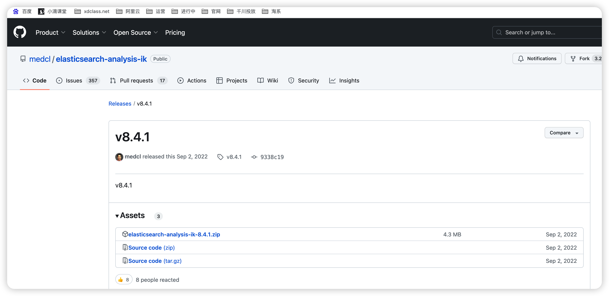

  * **注意：Elastic Search版本和IK分词器版本需要对应**

  * 特点

    - 高效且灵活
      - IK分词器采用了多种算法和数据结构，以提供高效的分词速度。
      - 支持细粒度的分词，可以根据应用需求进行灵活的配置。
    - 分词准确性
      - IK分词器使用了词典和规则来进行分词，可以准确地将句子拆分成词语。
      - 还提供了词性标注功能，可以帮助识别词语的不同含义和用途。
    - 支持远程扩展词库
      - IK分词器可以通过配置和加载外部词典，扩展分词的能力
      - 用户可以根据实际需求，添加自定义的词典，提升分词准确性和覆盖范围。
    - 兼容性与集成性
      - IK分词器兼容了Lucene和Elasticsearch等主流搜索引擎，可以方便地集成到这些系统中。
      - 提供了相应的插件和配置选项，使得分词器的集成变得简单。

  * 安装

    - 解压，上传到Elastic Search的plugins目录
    - 重启Elastic Search即可

    ```
    #关闭Elasticsearch节点
    bin/elasticsearch -d
    
    
    #检查进程是否已经停止
    ps -ef | grep elasticsearch
    ```

- IK有两种颗粒度的拆分

  - ik_smart: 会做最粗粒度的拆分

  - ik_max_word（常用）: 会将文本做最细粒度的拆分

  - 案例实践

    ```
    GET /_analyze
    {
      "text":"今天星期一,我今天去小滴课堂学习spring cloud项目大课",
      "analyzer":"ik_smart"
    }
    
    
    GET /_analyze
    {
      "text":"今天星期一,我今天去小滴课堂学习spring cloud项目大课",
      "analyzer":"ik_max_word"
    } 
    ```


 **愿景："IT路上的持续充电平台，让技术不再难学"**

**更多高级课程请访问 xdclass.net**

### 第四章 ElasticSearch8.X查询DSL语法案例进阶实战


#### 第1集 ElasticSearch8.X的Query DSL语法和应用

**简介：  ElasticSearch8.X的Query DSL语法和应用**

* 什么是Query DSL

  * Query DSL（Domain-Specific Language）是一种用于构建搜索查询的强大的领域特定查询语言
  * 类似我们关系性数据库的SQL查询语法, 
  * ES中用JSON结构化的方式定义和执行各种查询操作，在ES中进行高级搜索和过滤

  

* 基本语法

  ```
  GET /索引库名/_search 
  {	
  	"query":{ 
  		"查询类型":{
  		
  		}
  }
  ```

* 常见Query DSL查询语句和功能

  * `match` 查询：用于执行全文搜索，它会将搜索查询与指定字段中的文本进行匹配

  ```
  {
    "query": {
      "match": {
        "title": "elasticsearch"
      }
    }
  }
  ```

  * `term` 查询：用于精确匹配一个指定字段的关键词，不进行分词处理。

  ```
  {
    "query": {
      "term": {
        "category": "books"
      }
    }
  }
  ```

* 总结
  * Query DSL提供了更多种类的查询和过滤语句，以满足不同的搜索需求。
  * 可以根据具体的业务需求和数据结构，结合不同的查询方式来构建复杂的搜索和过滤操作

* 数据准备

  - 创建索引

  ```
  PUT /xdclass_shop_v1
  {
    "settings": {
      "number_of_shards": 2,
      "number_of_replicas": 0
    },
    "mappings": {
      "properties": {
        "id": {
          "type": "keyword"
        },
        "title": {
          "type": "keyword"
        },
        "summary": {
          "type": "text"
        },
        "price": {
          "type": "float"
        }
      }
    }
  }
  ```

  * 导入数据

  ```
  PUT /xdclass_shop_v1/_bulk
  { "index": { "_index": "xdclass_shop_v1" } }
  { "id": "1", "title": "Spring Boot","summary":"this is a summary Spring Boot video", "price": 9.99 }
  { "index": { "_index": "xdclass_shop_v1" } }
  { "id": "2", "title": "java","summary":"this is a summary java video", "price": 19.99 }
  { "index": { "_index": "xdclass_shop_v1" } }
  { "id": "3", "title": "Spring Cloud","summary":"this is a summary Spring Cloud video", "price": 29.99 }
  { "index": { "_index": "xdclass_shop_v1" } }
  { "id": "4", "title": "Spring_Boot", "summary":"this is a summary Spring_Boot video","price": 59.99 }
  { "index": { "_index": "xdclass_shop_v1" } }
  { "id": "5", "title": "SpringBoot","summary":"this is a summary SpringBoot video", "price": 0.99 }
  ```


#### 第2集 ElasticSearch8.X查询DSL多案例实战

**简介：  ElasticSearch8.X查询DSL多案例实战**

* 搜索案例实战

  - 查询全部数据（match_all）

    - 是一种简单的查询，匹配索引中的所有文档

    ```
    GET /xdclass_shop_v1/_search
    {
      "query": {
        "match_all": {}
      }
    }
    ```

  - 有条件查询数据

    - match，对查询内容进行分词, 然后进行查询,多个词条之间是 **or的关系**
    - 然后在与文档里面的分词进行匹配，匹配度越高分数越高越前面

    ```
    GET /xdclass_shop_v1/_search
    {
      "query": {
        "match": {
          "summary": "Spring"
        }
      }
    }
    
    #包括多个词
    GET /xdclass_shop_v1/_search
    {
      "query": {
        "match": {
          "summary": "Spring Java"
        }
      }
    }
    ```

    

  * 完整关键词查询

    * term查询，不会将查询条件分词，直接与文档里面的分词进行匹配
    * 虽然match也可以完成，但是match查询会多一步进行分词，浪费资源

    ```
    #keyword类型字段，ES不进行分词
    GET /xdclass_shop_v1/_search
    {
      "query": {
        "term": {
          "title": {
            "value": "Spring Boot"
          }
        }
      }
    }
    ```

    

  * 获取指定字段

    * **某些情况场景下，不需要返回全部字段，太废资源，可以指定source返回对应的字段**

    ```
    GET /xdclass_shop_v1/_search
    {
    "_source":["price","title"],
      "query": {
        "term": {
          "title": {
            "value": "Spring Boot"
          }
        }
      }
    }
    ```

    

* 总结
  * match在匹配时会对所查找的关键词进行分词，然后分词匹配查找；term会直接对关键词进行查找
  * 一般业务里面需要模糊查找的时候，更多选择match，而精确查找时选择term查询


#### 第3集 Query DSL布尔-范围和分页-排序实战

**简介：Query DSL布尔-范围和分页-排序实战**

* 常用Query DSL语法案例实战

  * `range` 查询

    * 用于根据范围条件进行查询，例如指定价格在一定区间内的商品
    * 范围符号
      * gte:大于等于 
      * gt:大于 
      * lte:小于等于 
      * lt:小于

    ```
    GET /xdclass_shop_v1/_search
    {
      "query": {
        "range": {
          "price": {
            "gte": 5,
            "lte": 100
          }
        }
      }
    }
    ```

    

  * 分页查询

    * 可以使用 `from` 和 `size` 参数进行分页查询
    * 可以指定要跳过的文档数量（`from`）和需要返回的文档数量（`size`）

    ```
    GET /xdclass_shop_v1/_search
    {
      "size": 10,
      "from": 0,
      "query": {
        "match_all": {}
      }
    }
    ```

  * 查询结果排序

    * `sort`字段可以进行排序 `desc` 和 `asc`

    ```
    GET /xdclass_shop_v1/_search
    {
      "size": 10,
      "from": 0,
      "sort": [
        {
          "price": "asc"
        }
      ],
      "query": {
        "match_all": {}
      }
    }
    ```

  * `bool` 查询

    * 通过组合多个查询条件，使用布尔逻辑（与、或、非）进行复杂的查询操作
    * 语法格式
      * "must"关键字用于指定必须匹配的条件，即所有条件都必须满足
      * "must_not"关键字指定必须不匹配的条件，即所有条件都不能满足
      * "should"关键字指定可选的匹配条件，即至少满足一个条件

    ```
    {
      "query": {
        "bool": {
          "must": [
            // 必须匹配的条件
          ],
          "must_not": [
            // 必须不匹配的条件
          ],
          "should": [
            // 可选匹配的条件
          ],
          "filter": [
            // 过滤条件
          ]
        }
      }
    }
    ```

    * 案例实战

    ```
    GET /xdclass_shop_v1/_search
    {
      "query": {
        "bool": {
          "must": [
            { "match": { "summary": "Cloud" }},
            { "range": { "price": { "gte": 5 }}}
          ]
        }
      }
    }
    ```

    

  


#### 第4集 Query DSL查询过滤Filter多案例实战

**简介：Query DSL查询过滤Filter多案例实战**

* `filter`查询

  * 来对搜索结果进行筛选和过滤，仅返回符合特定条件的文档，而不改变搜索评分
  * Filter查询对结果进行缓存，提高查询性能，用于数字范围、日期范围、布尔逻辑、存在性检查等各种过滤操作。
  * 语法格式
    * "filter"关键字用于指定一个过滤条件，可以是一个具体的过滤器，如term、range等，也可以是一个嵌套的bool过滤器

  ```
  {
    "query": {
      "bool": {
        "filter": {
          // 过滤条件
        }
      }
    }
  }
  ```

  

* 查询案例数据环境准备

  * 创建索引库

  ```
  PUT /product
  {
    "settings": {
      "number_of_shards": 2,
      "number_of_replicas": 0
    },
    "mappings": {
     "properties": {
      "product_id": {
        "type": "integer"
      },
      "product_name": {
        "type": "text"
      },
      "category": {
        "type": "keyword"
      },
      "price": {
        "type": "float"
      },
      "availability": {
        "type": "boolean"
      }
    } }  
  }
  ```

  * 导入数据
    * 通过一次 POST 请求实现批量插入
    * 每个文档都由两部分组成：`index` 指令用于指定文档的元数据，`product_id` 为文档的唯一标识符
    * 插入后查询 `GET /product/_search`

  ```
  POST /product/_bulk
  { "index": { "_id": "1" } }
  { "product_id": 1, "product_name": "Product 1", "category": "books", "price": 19.99, "availability": true }
  { "index": { "_id": "2" } }
  { "product_id": 2, "product_name": "Product 2", "category": "electronics", "price": 29.99, "availability": true }
  { "index": { "_id": "3" } }
  { "product_id": 3, "product_name": "Product 3", "category": "books", "price": 9.99, "availability": false }
  { "index": { "_id": "4" } }
  { "product_id": 4, "product_name": "Product 4", "category": "electronics", "price": 49.99, "availability": true }
  { "index": { "_id": "5" } }
  { "product_id": 5, "product_name": "Product 5", "category": "fashion", "price": 39.99, "availability": true }
  ```


* 案例一 ：使用 `term` 过滤器查询 `category` 为 `books` 的产品：

```
GET /product/_search
{
  "query": {
    "bool": {
      "filter": {
        "term": {
          "category": "books"
        }
      }
    }
  }
}
```

* 案例二：使用 `range` 过滤器查询价格 `price` 在 30 到 50 之间的产品：

```
GET /product/_search
{
  "query": {
    "bool": {
      "filter": {
        "range": {
          "price": {
            "gte": 30,
            "lte": 50
          }
        }
      }
    }
  }
}
```

* 总结
  * 过滤条件通常用于对结果进行筛选，并且比查询条件更高效
  * 而bool查询可以根据具体需求组合多个条件、过滤器和查询子句


#### 第5集 match高级用法之多字段匹配和短语搜索实战

**简介：match高级用法之多字段匹配和短语搜索实战**

* 多字段搜索匹配

  * 业务查询，需要在多个字段上进行文本搜索，用 multi_match
  * 在 match的基础上支持对多个字段进行文本查询匹配

  

  * 语法格式

  ```
  GET /index/_search
  {
    "query": {
      "multi_match": {
        "query": "要搜索的文本",
        "fields": ["字段1", "字段2", ...]
      }
    }
  }
  
  # query：需要匹配的查询文本。
  # fields：一个包含需要进行匹配的字段列表的数组。
  ```

* 短语搜索匹配

  * 是Elasticsearch中提供的一种高级匹配查询类型，用于执行精确的短语搜索
  * 相比于`match`查询，`match_phrase`会在匹配时考虑到单词之间的顺序和位置
  * 语法格式

  ```
  GET /index/_search
  {
    "query": {
      "match_phrase": {
        "field_name": {
          "query": "要搜索的短语"
        }
      }
    }
  }
  
  # field_name：要进行匹配的字段名。
  # query：要搜索的短语。
  ```

* 数据环境准备

  * 创建索引库

  ```
  PUT /product_v2
  {
  	"settings": {
      "number_of_shards": 2,
      "number_of_replicas": 0
    },
    "mappings": {
      "properties": {
        "product_name": {
          "type": "text"
        },
        "description": {
          "type": "text"
        },
        "category": {
          "type": "keyword"
        }
      }
    }
  }
  ```

  * 批量插入数据

  ```
  POST /product_v2/_bulk
  { "index": { "_index": "product_v2", "_id": "1" } }
  { "product_name": "iPhone 12", "description": "The latest iPhone model from Apple", "category": "electronics" }
  { "index": { "_index": "product_v2", "_id": "2" } }
  { "product_name": "Samsung Galaxy S21", "description": "High-performance Android smartphone", "category": "electronics" }
  { "index": { "_index": "product_v2", "_id": "3" } }
  { "product_name": "MacBook Pro", "description": "Powerful laptop for professionals", "category": "electronics" }
  { "index": { "_index": "product_v2", "_id": "4" } }
  { "product_name": "Harry Potter and the Philosopher's Stone", "description": "Fantasy novel by J.K. Rowling", "category": "books" }
  { "index": { "_index": "product_v2", "_id": "5" } }
  { "product_name": "The Great Gatsby", "description": "Classic novel by F. Scott Fitzgerald", "category": "books" }
  ```

* 多字段搜索案例实战

  * 在 `product_name` 和 `description` 字段上执行了一个`multi_match`查询
  * 将查询文本设置为 "iPhone"，对这两个字段进行搜索，并返回包含匹配到的文档，这个是OR的关系，会有最佳匹配

  ```
  GET /product_v2/_search
  {
    "query": {
      "multi_match": {
        "query": "iPhone",
        "fields": ["product_name", "description"]
      }
    }
  }
  ```

* 短语搜索案例实战

  * 使用`match_phrase`查询在`description`字段上执行了一个短语搜索将要搜索的短语设置为 "classic novel"。
  * 使用`match_phrase`查询，Elasticsearch将会返回包含 "classic novel" 短语的文档

  ```
  #match_phrase短语搜索
  GET /product_v2/_search
  {
    "query": {
      "match_phrase": {
        "description": "classic novel"
      }
    }
  }
  
  #match搜索，会进行分词
  GET /product_v2/_search
  {
    "query": {
      "match": {
        "description": "classic novel"
      }
    }
  }
  ```


#### 第6集 日常单词拼写错误-fuzzy模糊查询案例实战

**简介：日常单词拼写错误-fuzzy模糊查询案例实战**

* 什么是fuzzy模糊匹配

  * `fuzzy`查询是Elasticsearch中提供的一种模糊匹配查询类型，用在搜索时容忍一些拼写错误或近似匹配
  * 使用`fuzzy`查询，可以根据指定的编辑距离（即词之间不同字符的数量）来模糊匹配查询词
  * 拓展：编辑距离
    * 是将一个术语转换为另一个术语所需的一个字符更改的次数。
    * 比如
      * 更改字符（box→fox)
      *  删除字符（black→lack）
      * 插入字符（sic→sick） 
      * 转置两个相邻字符（dgo→dog）
  * fuzzy模糊查询是拼写错误的简单解决方案，但具有很高的 CPU 开销和非常低的精准度
  * 用法和match基本一致，Fuzzy query的查询不分词
  * 基本语法格式

  ```
  GET /index/_search
  {
    "query": {
      "fuzzy": {
        "field_name": {
          "value": "要搜索的词",
          "fuzziness": "模糊度"
        }
      }
    }
  }
  ```

  * 解析
    * `field_name`：要进行模糊匹配的字段名。
    * `value`：要搜索的词
    * `fuzziness`参数指定了模糊度，常见值如下
      - `0，1，2`
        - 指定数字，表示允许的最大编辑距离，较低的数字表示更严格的匹配，较高的数字表示更松散的匹配
        -  fuziness的值，表示是针对每个词语而言的，而不是总的错误的数值
      - `AUTO`：Elasticsearch根据词的长度自动选择模糊度
        - 如果字符串的长度大于5，那 funziness 的值自动设置为2
        - 如果字符串的长度小于2，那么 fuziness 的值自动设置为 0

  * 案例操作

    ```
    # 指定模糊度2，更松散匹配
    GET /xdclass_shop_v1/_search
    {
      "query": {
        "fuzzy": {
          "summary": {
            "value": "clo",
            "fuzziness": "2"
          }
        }
      }
    }
    
    # 指定模糊度1，更严格匹配
    GET /xdclass_shop_v1/_search
    {
      "query": {
        "fuzzy": {
          "summary": {
            "value": "clo",
            "fuzziness": "1"
          }
        }
      }
    }
    
    # 使用自动检查，1个单词拼写错误
    GET /xdclass_shop_v1/_search
    {
      "query": {
        "fuzzy": {
          "summary": {
            "value": "Sprina",
            "fuzziness": "auto"
          }
        }
      }
    }
    ```

    


#### 第7集 最靓的仔-DSL搜索高亮显示多案例实战

**简介：最靓的仔-DSL搜索高亮显示案例实战**

* 需求

  * 日常搜索产品的时候，会有关键词显示不一样的颜色，方便用户直观看到区别

  

* Elastic Search搜索引擎如何做到高亮显示

  * 在 ES 中，高亮语法用于在搜索结果中突出显示与查询匹配的关键词
  * 高亮显示是通过标签包裹匹配的文本来实现的，通常是 `<em>` 或其他 HTML 标签
  * 基本用法：在 highlight 里面填写要高亮显示的字段，可以填写多个

* 案例实战

  * 环境和数据准备

  ```
  #创建索引库
  PUT /xdclass_high_light_test
  {
    "mappings": {
      "properties": {
        "title": {
            "type": "text",
            "analyzer": "ik_max_word"
          },
          "content": {
            "type": "text",
            "analyzer": "ik_max_word"
          }
       }
    }, 
    "settings": {
      "number_of_shards": 2,
      "number_of_replicas": 0
    }
  }
  ```

  * 插入数据

  ```
  #插入数据
  PUT /xdclass_high_light_test/_doc/1
  {
    "title": "小滴课堂2028年最新好看的电影推荐",
    "content": "每年都有新电影上线，2028年最新好看的电影有不少，小滴课堂上线了《架构大课》，《低代码平台》，《老王往事》精彩电影"
  }
  
  
  PUT /xdclass_high_light_test/_doc/2
  {
    "title": "写下你认为好看的电影有哪些",
    "content": "每个人都看看很多电影，说下你近10年看过比较好的电影，比如《架构大课》，《海量数据项目大课》，《冰冰和老王的故事》"
  }
  ```

  * 单条件查询高亮显示

  ```
  GET /xdclass_high_light_test/_search 
  {
    "query": {
      "match": {
        "content": "电影"
      }
    },
    "highlight": {
      "fields": {
        "content": {}
      }
    }
  }
  ```

  * 组合多条件查询，highlight里面填写需要高亮的字段

  ```
  GET /xdclass_high_light_test/_search
  {
    "query": {
      "bool": {
        "should": [
          {
            "match": {
              "title": "课堂"
            }
          },
          {
            "match": {
              "content": "老王"
            }
          }
        ]
      }
    },
    "highlight": {
      "fields": {
        "title": {},
        "content": {}
      }
    }
  }
  ```

  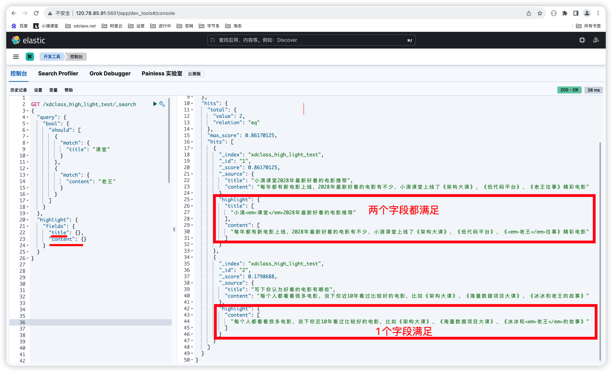

  * match查询，使用highlight属性，可以增加属性，修改高亮样式
    * pre_tags:前置标签 
    * post_tags:后置标签 
    * fields:需要高亮的字段
  * 案例实战

  ```
  GET /xdclass_high_light_test/_search
  {
    "query": {
      "bool": {
        "should": [
          {
            "match": {
              "title": "课堂"
            }
          },
          {
            "match": {
              "content": "老王"
            }
          }
        ]
      }
    },
    "highlight": {
      "pre_tags": "<font color='yellow'>",
      "post_tags": "</font>",
      "fields": [{"title":{}},{"content":{}}]
  	} 
  }
  ```


 **愿景："IT路上的持续充电平台，让技术不再难学"**

**更多高级课程请访问 xdclass.net**

### 第五章 Query DSL高级使用搜索聚合查询多案例实战


#### 第1集 ElasticSearch8.X的聚合查询介绍和应用案例

**简介：  ElasticSearch8.X的聚合查询介绍和应用案例**

* 什么是聚合查询

  * 对大量数据聚合统计处理，类似Mysql数据库操作里面的group by 分组、sum、avg、max等函数处理
  * 是 Elasticsearch 中强大的功能之一，根据数据进行分组、过滤、计算和统计，提取有关数据集信息，进行数据分析
  * 数据可视化大屏里面的饼状图、柱状图、折线图、仪表盘数据等都是聚合查询的关键应用

  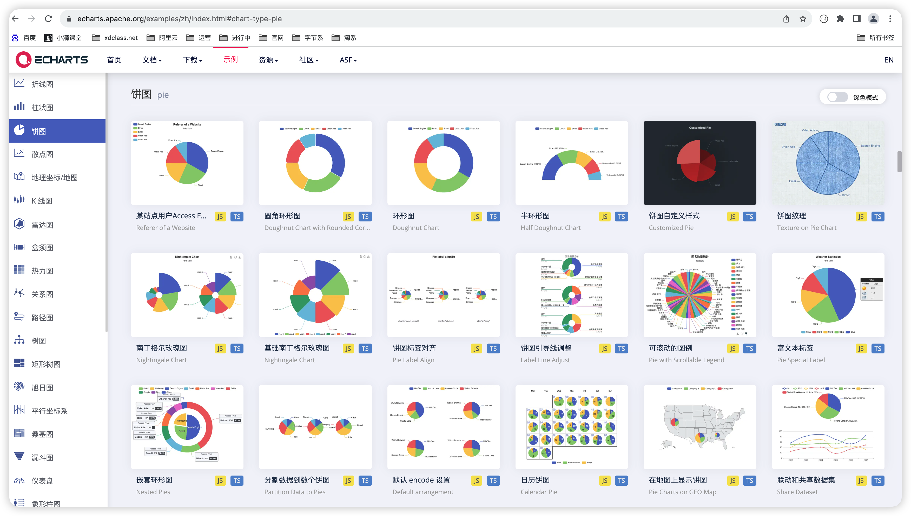

  * 术语一：对数据集求最大、最小、和、平均值等指标的聚合，称为 **指标聚合 metric**

    * 基本语法格式如下

    ```
    GET /index/_search
    {
      "size": 0,
      "aggs": {
        "aggregation_name": {
          "aggregation_type": {
            "aggregation_field": "field_name"
            // 可选参数
          }
        }
        // 可以添加更多的聚合
      }
    }
    
    # 解析
    index：要执行聚合查询的索引名称。
    size: 设置为 0 来仅返回聚合结果，而不返回实际的搜索结果，这里将hits改为0表示返回的原始数据变为0
    aggs：指定聚合操作的容器。
    
    aggregation_name：聚合名称，可以自定义。
    aggregation_type：聚合操作的类型，例如 terms、avg、sum 等。
    aggregation_field：聚合操作的目标字段，对哪些字段进行聚合
    ```

    

  * 术语二：对数据集进行分组group by，然后在组上进行指标聚合，在 ES 中称为**分桶，桶聚合bucketing**

    * 基本语法格式如下（先简单知道，后续会有进一步讲解）

    ```
    GET /index/_search
    {
      "size": 0,
      "aggs": {
        "aggregation_name": {
          "bucket_type": {
            "bucket_options": {
              "bucket_option_name": "bucket_option_value",
              ...
            },
            "aggs": {
              "sub_aggregation_name": {
                "sub_aggregation_type": {
                  "sub_aggregation_options": {
                    "sub_aggregation_option_name": "sub_aggregation_option_value",
                    ...
                  }
                }
              }
            }
          }
        }
      }
    }
    #解析
    index: 替换为要执行聚合查询的索引名称。
    aggregation_name: 替换为自定义的聚合名称。
    bucket_type: 替换为特定的桶聚合类型（如 terms、date_histogram、range 等）。
    bucket_option_name 和 bucket_option_value: 替换为特定桶聚合选项的名称和值。
    
    sub_aggregation_name: 替换为子聚合的名称。
    sub_aggregation_type: 替换为特定的子聚合类型（如 sum、avg、max、min 等）。
    sub_aggregation_option_name 和 sub_aggregation_option_value: 替换为特定子聚合选项的名称和值
    ```

    

* 常见聚合用途和应用场景案例

  * 聚合指标（Aggregation Metrics）：
    - **Avg Aggregation**：计算文档字段的平均值。
    - **Sum Aggregation**：计算文档字段的总和。
    - **Min Aggregation**：找到文档字段的最小值。
    - **Max Aggregation**：找到文档字段的最大值。
  * 聚合桶（Aggregation Buckets）：
    - **Terms Aggregation**：基于字段值将文档分组到不同的桶中。
    - **Date Histogram Aggregation**：按日期/时间字段创建时间间隔的桶。
    - **Range Aggregation**：根据字段值的范围创建桶。
  * 嵌套聚合（Nested Aggregations）、聚合过滤（Aggregation Filtering）。。。

* 案例实战

  * 数据环境准备

  ```
  # 创建索引
  PUT /sales
  {
    "mappings": {
      "properties": {
        "product": {
          "type": "keyword"
        },
        "sales": {
          "type": "integer"
        }
      }
    }
  }
  
  # 批量插入数据
  POST /sales/_bulk
  {"index": {}}
  {"product": "iPhone", "sales": 4}
  {"index": {}}
  {"product": "Samsung", "sales": 60}
  {"index": {}}
  {"product": "iPhone", "sales": 100}
  {"index": {}}
  {"product": "Samsung", "sales": 80}
  {"index": {}}
  {"product": "小滴手机", "sales": 50}
  {"index": {}}
  {"product": "小滴手机", "sales": 5000}
  {"index": {}}
  {"product": "小滴手机", "sales": 200}
  ```

  * 执行聚合查询

    * 分别按照商品名称（`product`）进行分组

    ```
    GET /sales/_search
    {
    	"aggs":{//聚合操作
    		"product_group":{//名称，随意起名
    			"terms":{//分组
    				"field":"product"//分组字段
    			}
    		}
    	}
    }
    ```

    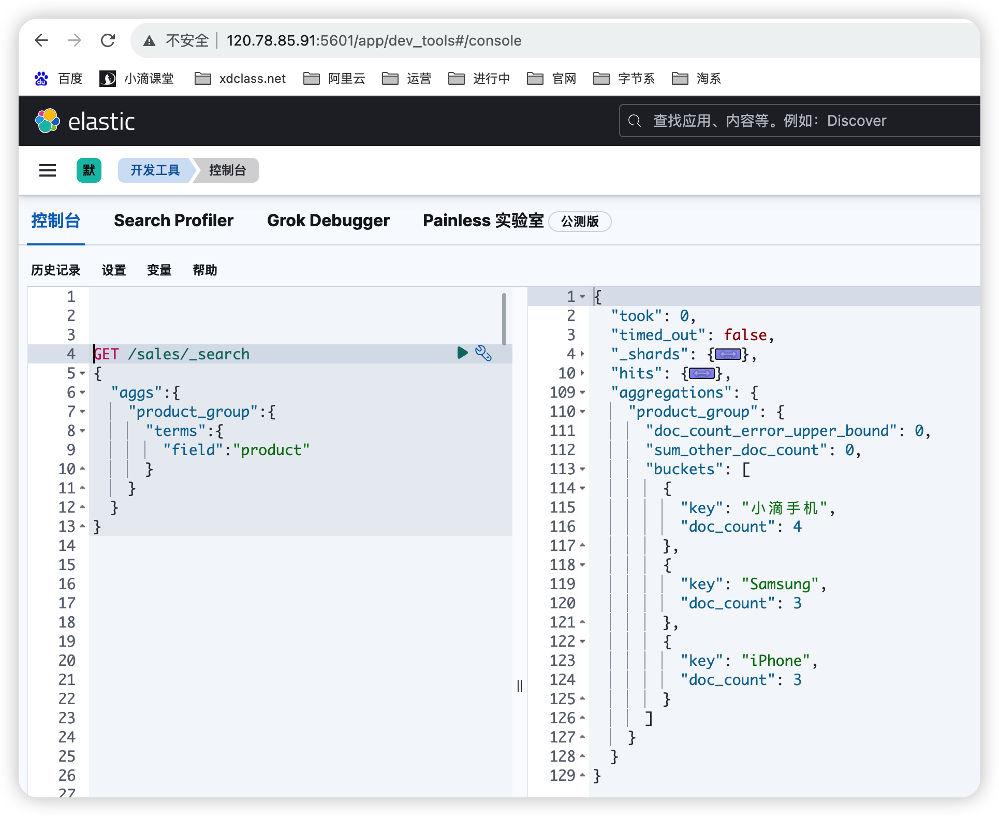

    * 计算每组的销售总量，使用了 `terms` 聚合和 `sum` 聚合来实现
    * 查询结果将返回每个产品的名称和销售总量

  ```
  GET /sales/_search
  {
    "size": 0,
    "aggs": {
      "product_sales": {
        "terms": {
          "field": "product"
        },
        "aggs": {
          "total_sales": {
            "sum": {
              "field": "sales"
            }
          }
        }
      }
    }
  }
  ```

  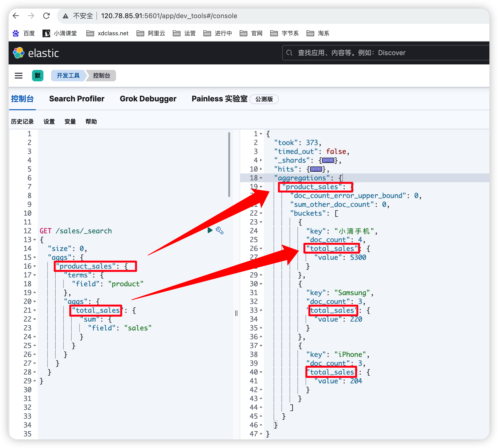


#### 第2集 Query DSL 指标metric聚合和多案例实战

**简介：  Query DSL 指标聚合介绍和多案例实战**

* 什么是指标聚合
  * 对数据集求最大、最小、和、平均值等指标的聚合，称为 **指标聚合 metric**
  * 比如 max、min、avg、sum等函数使用

* 案例实战

  * 聚合查询  `max` 应用案例：

    - 数据准备：假设有一个电商网站的销售记录索引，包含商品名称和销售价格字段

    ```
    POST /sales_v1/_doc
    { "product_name": "手机", "price": 1000 }
    
    POST /sales_v1/_doc
    { "product_name": "电视", "price": 1500 }
    
    POST /sales_v1/_doc
    { "product_name": "小滴课堂老王的黑丝", "price": 4500 }
    ```

    - 案例说明：使用 `max` 聚合查询来获取产品价格的最高值。

    ```
    GET /sales_v1/_search
    {
      "size": 0,
      "aggs": {
        "max_price": {
          "max": {
            "field": "price"
          }
        }
      }
    }
    ```

  * 聚合查询 - `min` 应用案例：

    - 数据准备：一个学生考试成绩索引，包含学生姓名和考试分数字段。

    ```
    POST /exam_scores/_doc
    { "student_name": "小滴课堂-大钊", "score" : 80 }
    
    POST /exam_scores/_doc
    { "student_name": "老王", "score" : 90 }
    
    POST /exam_scores/_doc
    { "student_name": "小滴课堂-D哥", "score" : 40 }
    ```

    - 案例说明：使用 `min` 聚合查询来获取学生的最低考试分数。

    ```
    GET /exam_scores/_search
    {
      "size": 0,
      "aggs": {
        "min_score": {
          "min": {
            "field": "score"
          }
        }
      }
    }
    ```

  * 聚合查询 - `avg` 应用案例：

    - 数据准备（同上）：一个学生考试成绩索引，包含学生姓名和考试分数字段。
    - 使用 `avg` 聚合查询来计算学生的平均考试分数

    ```
    GET /exam_scores/_search
    {
      "size": 0,
      "aggs": {
        "avg_score": {
          "avg": {
            "field": "score"
          }
        }
      }
    }
    ```

  * 聚合查询 - `sum` 应用案例：

    - 数据准备：假设有一个电商网站的销售记录索引，包含商品名称和销售数量字段。

    ```
    POST /sales_order/_doc
    { "product_name": "手机", "sales_count" : 100 }
    
    POST /sales_order/_doc
    { "product_name": "电视", "sales_count" : 50 }
    
    POST /sales_order/_doc
    { "product_name": "小滴课堂永久会员", "sales_count" : 999 }
    ```

    - 案例说明：使用 `sum` 聚合查询来计算销售记录的总销售数量。

    ```
    GET /sales_order/_search
    {
      "size": 0,
      "aggs": {
        "total_sales": {
          "sum": {
            "field": "sales_count"
          }
        }
      }
    }
    ```


#### 第3集 Query DSL 桶聚合语法和Terms案例实战

**简介：  Query DSL 桶聚合Terms案例实战**

* 什么桶bucket聚合

  * 对数据集进行分组group by，然后在组上进行指标聚合，在 ES 中称为**分桶，桶聚合bucketing**
  * 基本语法格式如下

  ```
  GET /index/_search
  {
    "size": 0,
    "aggs": {
      "aggregation_name": {
        "bucket_type": {
          "bucket_options": {
            "bucket_option_name": "bucket_option_value",
            ...
          },
          "aggs": {
            "sub_aggregation_name": {
              "sub_aggregation_type": {
                "sub_aggregation_options": {
                  "sub_aggregation_option_name": "sub_aggregation_option_value",
                  ...
                }
              }
            }
          }
        }
      }
    }
  }
  #解析
  index: 替换为要执行聚合查询的索引名称。
  aggregation_name: 替换为自定义的聚合名称。
  bucket_type: 替换为特定的桶聚合类型（如 terms、date_histogram、range 等）。
  bucket_option_name 和 bucket_option_value: 替换为特定桶聚合选项的名称和值。
  
  sub_aggregation_name: 替换为子聚合的名称。
  sub_aggregation_type: 替换为特定的子聚合类型（如 sum、avg、max、min 等）。
  sub_aggregation_option_name 和 sub_aggregation_option_value: 替换为特定子聚合选项的名称和值
  ```

  

* 案例实战

  * 分桶聚合查询 - `Terms` 案例：

    - 数据准备：假设有一个在线书店的图书销售记录索引，包含图书名称和销售数量字段。

    ```
    #创建索引库
    PUT /book_sales
    {
      "mappings": {
        "properties": {
          "book_title": {
              "type": "keyword"
            },
            "sales_count": {
              "type": "integer"
            }
         }
      }, 
      "settings": {
        "number_of_shards": 2,
        "number_of_replicas": 0
      }
    }
    
    # 批量插入数据
    POST /book_sales/_bulk
    { "index": {} }
    { "book_title": "Elasticsearch in Action", "sales_count" : 100 }
    { "index": {} }
    { "book_title": "小滴课堂微服务最佳实践", "sales_count" : 50 }
    { "index": {} }
    { "book_title": "海量数据项目大课", "sales_count" : 80 }
    { "index": {} }
    { "book_title": "小滴课堂面试宝典", "sales_count" : 120 }
    { "index": {} }
    { "book_title": "数据结构与算法之美", "sales_count" : 90 }
    { "index": {} }
    { "book_title": "Python编程快速上手", "sales_count" : 70 }
    { "index": {} }
    { "book_title": "小滴课堂面试宝典", "sales_count" : 110 }
    { "index": {} }
    { "book_title": "小滴课堂Java核心技术", "sales_count" : 200 }
    { "index": {} }
    { "book_title": "深入理解计算机系统", "sales_count" : 150 }
    { "index": {} }
    { "book_title": "小滴课堂Java核心技术", "sales_count" : 80 }
    ```

    - 案例说明：使用 `terms` 聚合查询将图书按销售数量进行分桶，并获取每个分桶内的销售数量总和。

    ```
    GET /book_sales/_search
    {
      "size": 0,
      "aggs": {
        "book_buckets": {
          "terms": {
            "field": "book_title",
            "size": 10
          },
          "aggs": {
            "total_sales": {
              "sum": {
                "field": "sales_count"
              }
            }
          }
        }
      }
    }
    ```


#### 第4集 Query DSL 桶聚合Date Histogram介绍和案例实战

**简介：  Query DSL 桶聚合Date Histogram介绍和案例实战**

* 分桶聚合查询 - `Date Histogram` 

  * 将日期类型的字段按照固定的时间间隔进行分桶，并对每个时间间隔内的文档进行进一步的操作和计算
  * 基本语法如下

  ```
  GET /index/_search
  {
    "size": 0,
    "aggs": {
      "date_histogram_name": {
        "date_histogram": {
          "field": "date_field_name",
          "interval": "interval_expression"
        },
        "aggs": {
          "sub_aggregation": {
            "sub_aggregation_type": {}
          }
        }
      }
    }
  }
  
  #解析
  index：替换为要执行聚合查询的索引名称。
  date_histogram_name：替换为自定义的 date_histogram 聚合名称。
  date_field_name：替换为要聚合的日期类型字段名。
  interval_expression：指定用于分桶的时间间隔。时间间隔可以是一个有效的日期格式（如 1d、1w、1M），也可以是一个数字加上一个时间单位的组合（如 7d 表示 7 天，1h 表示 1 小时）。
  sub_aggregation：指定在每个日期桶内进行的子聚合操作。
  sub_aggregation_type：替换单独子聚合操作的类型，可以是任何有效的子聚合类型。
  ```

  * 数据准备：一个电商网站的订单索引，包含订单日期和订单金额字段。

  ```
  POST /order_history/_bulk
  { "index": {} }
  { "order_date": "2025-01-01", "amount" : 100 ,"book_title": "小滴课堂Java核心技术"}
  { "index": {} }
  { "order_date": "2025-02-05", "amount" : 150, "book_title": "小滴课堂面试宝典" }
  { "index": {} }
  { "order_date": "2025-03-02", "amount" : 500 ,"book_title": "小滴课堂Java核心技术"}
  { "index": {} }
  { "order_date": "2025-05-02", "amount" : 250 , "book_title": "小滴课堂面试宝典"}
  { "index": {} }
  { "order_date": "2025-05-05", "amount" : 10 ,"book_title": "小滴课堂微服务最佳实践"}
  { "index": {} }
  { "order_date": "2025-02-18", "amount" : 290 , "book_title": "小滴课堂微服务最佳实践"}
  ```

  - 案例说明：使用 `date_histogram` 聚合查询将订单按日期进行分桶，并计算每个分桶内的订单金额总和。

  ```
  GET /order_history/_search
  {
    "size": 0,
    "aggs": {
      "sales_per_month": {
        "date_histogram": {
          "field": "order_date",
          "calendar_interval": "month",
          "format": "yyyy-MM"
        },
        "aggs": {
          "total_sales": {
            "sum": {
              "field": "amount"
            }
          }
        }
      }
    }
  }
  ```

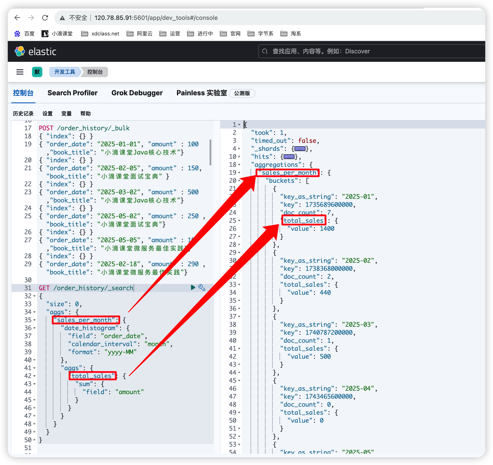


#### 第5集 Query DSL 桶聚合Range介绍和案例实战

**简介：  Query DSL 桶聚合Range介绍和案例实战**

* 分桶聚合查询 - `Range` 

  * 将字段的值划分为不同的范围，并将每个范围内的文档分配给相应的桶，对这些范围进行各种操作和计算。
  * 语法介绍

  ```
  GET /index/_search
  {
    "size": 0,
    "aggs": {
      "range_name": {
        "range": {
          "field": "field_name",
          "ranges": [
            { "key": "range_key_1", "from": from_value_1, "to": to_value_1 },
            { "key": "range_key_2", "from": from_value_2, "to": to_value_2 },
            ...
          ]
        },
        "aggs": {
          "sub_aggregation": {
            "sub_aggregation_type": {}
          }
        }
      }
    }
  }
  
  #解析
  index：替换为要执行聚合查询的索引名称。
  range_name：替换为自定义的 range 聚合名称。
  field_name：替换为要聚合的字段名。
  ranges：指定范围数组，每个范围使用 key、from 和 to 参数进行定义。
  key：范围的唯一标识符。
  from：范围的起始值（包含）。
  to：范围的结束值（不包含）。
  sub_aggregation：指定在每个范围内进行的子聚合操作。
  sub_aggregation_type：替换单独子聚合操作的类型，可以是任何有效的子聚合类型。
  ```

  

  * 数据准备：一个在线商店的商品索引，包括商品名称和价格字段

  ```
  POST /product_v4/_bulk
  { "index": {} }
  { "product_name": "小滴课堂永久会员", "price" : 2000 }
  { "index": {} }
  { "product_name": "JVM专题课程", "price" : 200 }
  { "index": {} }
  { "product_name": "SpringBoot3.X最佳实践", "price" : 300 }
  { "index": {} }
  { "product_name": "高并发项目大课", "price" : 1500 }
  { "index": {} }
  { "product_name": "海量数据项目大课", "price" : 4120 }
  { "index": {} }
  { "product_name": "监控告警Prometheus最佳实践", "price" : 180 }
  { "index": {} }
  { "product_name": "全栈工程师学习路线", "price" : 250 }
  { "index": {} }
  { "product_name": "自动化测试平台大课", "price" : 4770 }
  { "index": {} }
  { "product_name": "小滴课堂-老王分手最佳实践", "price" : 400 }
  { "index": {} }
  { "product_name": "小滴课堂-大钊会所按摩往事", "price" : 150 }
  ```

  - 案例说明：使用 `range` 聚合查询将商品按价格范围进行分桶，并计算每个分桶内的商品数量。
    - 如果没写key，则会默认生成

  ```
  GET /product_v4/_search
  {
    "size": 0,
    "aggs": {
      "price_ranges": {
        "range": {
          "field": "price",
          "ranges": [
            { "to": 100 },
            { "from": 100, "to": 200 },
            { "from": 200 }
          ]
        }
      }
    }
  }
  ```

  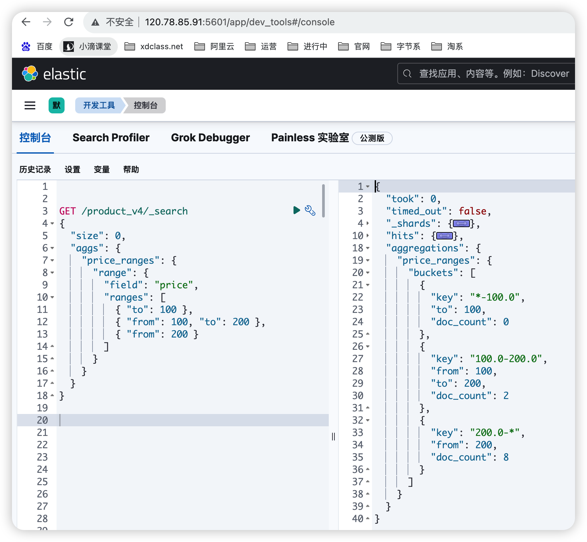


 **愿景："IT路上的持续充电平台，让技术不再难学"**

**更多高级课程请访问 xdclass.net**

### 第六章 新版SpringBoot3.X整合ElasticSearch8.X案例实战


#### 第1集 新版SpringBoot3.X项目环境准备和注意事项

**简介： 新版SpringBoot3.X项目环境准备和注意事项**

- 背景
  - 后端业务开发里面，应用程序如果需要接入搜索引擎，都离不开整合客户端
  - 后端主流语言java框架spring boot是最需要掌握，包括微服务SpringCloud也是使用SpringBoot开发
  - **如果不会SpringBoot，则需要补充相关知识点**

- 环境说明

  - 本地 JDK17安装(SpringBoot3.X要求JDK17)，没相关环境的可以去Oracle官网安装下JDK17
  - 项目开发，快速创建 https://start.spring.io/

  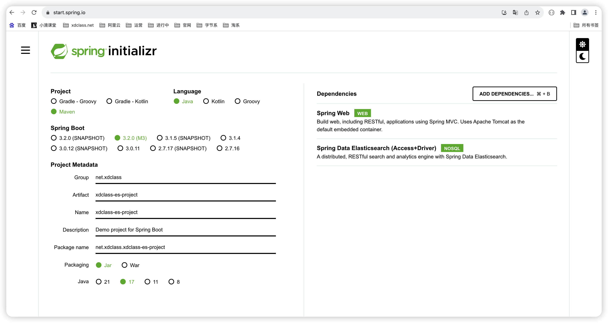

* 依赖包引入

  ```
  <dependencies>
      <dependency>
        <groupId>org.springframework.boot</groupId>
        <artifactId>spring-boot-starter-web</artifactId>
      </dependency>
  
  
      <dependency>
        <groupId>org.springframework.boot</groupId>
        <artifactId>spring-boot-starter-test</artifactId>
        <scope>test</scope>
      </dependency>
    </dependencies>
  ```

  - 启动项目访问

   

- 最佳方案
  - **直接导入本章本集的代码到IDEA里面，进行构建即可**
  - 课程这边使用的是新版IDEA，和旧版差别不大
  - **注意：初次构建下载相关依赖包比较久，可以等待10～20分钟即可**


#### 第2集 ElasticSearch8.X客户端介绍和整合SpringBoot3.X

**简介： ElasticSearch8.X客户端介绍和整合SpringBoot3.X**

* 需求

  * ElasticSearch是搜索引擎，作为服务端程序，提供了HTTP的Restful接口接入
  * 因此多个不同的语言都可以轻松接入ES搜索功能

  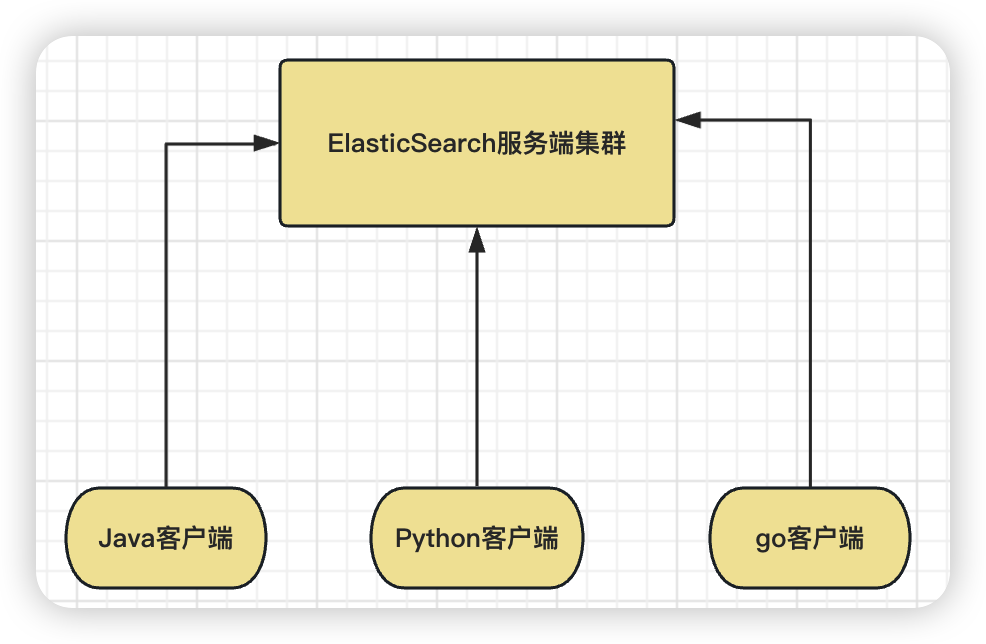

  * ES官方针对java推出多个客户端进行接入ES，也分两种

    * 更旧版的ES会用TransportClient（**7.0版本标记过期**）
    * Java Low Level REST Client（**有继续迭代维护**）
      * 基于低级别的 REST 客户端，通过发送原始 HTTP 请求与 Elasticsearch 进行通信。
      * **自己拼接好的字符串，并且自己解析返回的结果；兼容所有的Elasticsearch版本**
    * Java High Level REST Client（**7.1版本标记过期**）
      * 基于低级别 REST 客户端，提供了更高级别的抽象，简化了与 Elasticsearch 的交互。
      * 提供了更易用的 API，封装了底层的请求和响应处理逻辑，提供了更友好和可读性更高的代码。
      * 自动处理序列化和反序列化 JSON 数据，适用于大多数常见的操作，如索引、搜索、聚合等。
      * 对于较复杂的高级功能和自定义操作，可能需要使用低级别 REST 客户端或原生的 Elasticsearch REST API

    * Java API Client（**8.X版本开始推荐使用**）

      * Elasticsearch在7.1版本之前使用的Java客户端是Java REST Client
      * 从7.1版本开始Elastic官方将Java REST Client标记为弃用（deprecated），推荐使用新版Java客户端Java API Client
      * 新版的java API Client是一个用于与Elasticsearch服务器进行通信的Java客户端库
      * 封装了底层的Transport通信，并提供了同步和异步调用、流式和函数式调用等方法
      * 官网文档地址 
        * https://www.elastic.co/guide/en/elasticsearch/client/java-api-client/8.5/introduction.html

      

* SpringBoot如何整合Elastic Search

  * 方案一：使用 Elasticsearch 官方提供的高级客户端库 - Elasticsearch Api Client

  ```
  <dependency>
        <groupId>co.elastic.clients</groupId>
        <artifactId>elasticsearch-java</artifactId>
        <version>8.5.3</version>
      </dependency>
  ```

  

  * 方案二：使用 Spring Data Elasticsearch

    * 基于 Spring Data 的标准化数据访问技术，简化了与 Elasticsearch 的集成。

    * 提供了丰富的 CRUD 操作和查询方法，简化了数据访问，包括自动化的索引管理和映射
    * Spring Data Elasticsearch 对于一些高级功能和复杂查询可能不够灵活，需要额外定制处理

* 什么是Spring Data框架

  *  是一个用于简化数据访问和持久化的开发框架，提供了一组统一的 API 和抽象
  * 与各种数据存储技术（如关系型数据库、NoSQL 数据库、Elasticsearch 等）进行交互变得更加容易
  * 官网：https://spring.io/projects/spring-data

  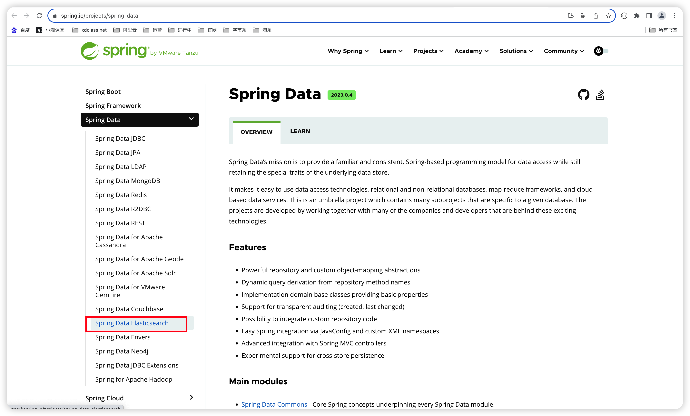

  * 几个核心模块：
    * Spring Data JPA
      * 用于与关系型数据库进行交互，基于 JPA（Java Persistence API）标准
      * 提类似于 Repository 的接口，通过继承这些接口并声明方法，自动生成常见的数据CRUD
    * Spring Data MongoDB
      * 用于与 MongoDB NoSQL 数据库进行交互，提供一种类似于 Repository 的接口
      * 通过继承这些接口并声明方法，自动生成常见的数据CRUD
    * Spring Data Redis
      * 用于与 Redis 键值存储数据库进行交互，提供 Repository 的接口
      * 通过继承这些接口并声明方法，自动生成常见的数据CRUD
    * Spring Data Elasticsearch
      * 用于与 Elasticsearch 搜索引擎进行交互，提供 Repository 的接口
      * 通过继承这些接口并声明方法，自动生成常见的数据CRUD

* SpringBoot3.X项目整合SpringData框架

  * 添加依赖

  ```
  <!--这个starter里面就是依赖 spring-data-elasticsearch-->
  <dependency>
  			<groupId>org.springframework.boot</groupId>
  			<artifactId>spring-boot-starter-data-elasticsearch</artifactId>
  	</dependency>
  ```

  * 增加配置

  ```
  spring.elasticsearch.uris=http://112.74.167.42:9200
  ```


#### 第3集 SpringBoot3.X+ElasticsearchTemplate索引库操作

**简介： SpringBoot3.X+ElasticsearchTemplate索引库操作**

* 什么是ElasticsearchTemplate

  * 是 Spring Data Elasticsearch 提供的一个核心类，是 ElasticsearchClient 的一个具体实现
  * 用于在 Spring Boot 中操作 Elasticsearch 进行数据的存取和查询
  * 提供了一组方法来执行各种操作，如保存、更新、删除和查询文档，执行聚合操作等

* ElasticsearchTemplate 的一些常用方法

  - `save(Object)`: 保存一个对象到 Elasticsearch 中。
  - `index(IndexQuery)`: 使用 IndexQuery 对象执行索引操作。
  - `delete(String, String)`: 删除指定索引和类型的文档。
  - `get(String, String)`: 获取指定索引和类型的文档。
  - `update(UpdateQuery)`: 使用 UpdateQuery 对象执行更新操作。
  - `search(SearchQuery, Class)`: 执行搜索查询，并将结果映射为指定类型的对象。
  - `count(SearchQuery, Class)`: 执行搜索查询，并返回结果的计数

* ElasticsearchTemplate 常见注解配置（都是属于spring data elasticsearch）

  * @Id 指定主键

  * @Document指定实体类和索引对应关系

    ```
    indexName：索引名称
    ```

  * @Field指定普通属性

    ```
    type 对应Elasticsearch中属性类型,使用FiledType枚举快速获取。
    
    text 类型能被分词
    
    keywords 不能被分词
    
    index  是否创建索引，作为搜索条件时index必须为true
    
    analyzer 指定分词器类型。
    ```

* 案例实战

  * 创建DTO

  ```
  @Document(indexName = "video")
  public class VideoDTO {
  
    
      @Id
      @Field(type = FieldType.Text, index = false)
      private Long id;
  
      @Field(type = FieldType.Text)
      private String title;
  
      @Field(type = FieldType.Text)
      private String description;
  
      @Field(type = FieldType.Keyword)
      private String category;
  
      @Field(type = FieldType.Integer)
      private Integer duration;
  
      @Field(type = FieldType.Date, format = DateFormat.date_hour_minute_second)
      private LocalDateTime createTime;
  
      public VideoDTO(){}
  
      public VideoDTO(Long id, String title, String description, Integer duration,String category) {
          this.id = id;
          this.title = title;
          this.description = description;
          this.duration = duration;
          this.createTime = LocalDateTime.now();
          this.category = category;
      }
  
      //省略set get方法
  }
  ```

  * 创建测试方法

  ```
  @SpringBootTest
  class XdclassEsProjectApplicationTests {
  	@Autowired
  	private ElasticsearchTemplate restTemplate;
  	/**
  	 * 判断索引是否存在索引
  	 */
  	@Test
  	void existsIndex() {
  		IndexOperations indexOperations = restTemplate.indexOps(VideoDTO.class);
  		boolean exists = indexOperations.exists();
  		System.out.println(exists);
  	}
  
  	/**
  	 * 创建索引
  	 */
  	@Test
  	void createIndex() {
  		// spring data es所有索引操作都在这个接口
  		IndexOperations indexOperations = restTemplate.indexOps(VideoDTO.class);
  		// 是否存在，存在则删除
  		if(indexOperations.exists()){
  			indexOperations.delete();
  		}
  
  		// 创建索引
  		indexOperations.create();
  
  		//设置映射: 在正式开发中，几乎不会使用框架创建索引或设置映射，这是架构或者管理员的工作，不适合使用代码实现
  		restTemplate.indexOps(VideoDTO.class).putMapping();
  	}
  
  	/**
  	 * 删除索引
  	 */
  	@Test
  	void deleteIndex() {
  		IndexOperations indexOperations = restTemplate.indexOps(VideoDTO.class);
  		boolean delete = indexOperations.delete();
  		System.out.println(delete);
  	}
  }
  ```

  


#### 第4集 SpringBoot3.X操作ES8.X文档Document案例实战

**简介： SpringBoot3.X操作Document案例实战**

* SpringBoot3.X整合ES操作Document

  * 案例一 新增文档

  ```
  @Test
  	void insert(){
  		VideoDTO videoDTO = new VideoDTO();
  		videoDTO.setId(1L);
  		videoDTO.setTitle("小滴课堂架构大课和Spring Cloud");
  		videoDTO.setCreateTime(LocalDateTime.now());
  		videoDTO.setDuration(100);
      videoDTO.setCategory("后端");
  		videoDTO.setDescription("这个是综合大型课程，包括了jvm，redis，新版spring boot3.x，架构，监控，性能优化，算法，高并发等多方面内容");
  
  		VideoDTO saved = restTemplate.save(videoDTO);
  		System.out.println(saved);
  	}
  ```

  * 案例二 更新文档

  ```
  @Test
  	void update(){
  		VideoDTO videoDTO = new VideoDTO();
  		videoDTO.setId(1L);
  		videoDTO.setTitle("小滴课堂架构大课和Spring Cloud V2");
  		videoDTO.setCreateTime(LocalDateTime.now());
  		videoDTO.setDuration(102);
      videoDTO.setCategory("后端");
  		videoDTO.setDescription("这个是综合大型课程，包括了jvm，redis，新版spring boot3.x，架构，监控，性能优化，算法，高并发等多方面内容");
  
  		VideoDTO saved = restTemplate.save(videoDTO);
  		System.out.println(saved);
  	}
  ```

  * 案例三 批量插入

  ```
      @Test
      void batchInsert() {
          List<VideoDTO> list = new ArrayList<>();
          list.add(new VideoDTO(2L, "老王录制的按摩课程", "主要按摩和会所推荐", 123, "后端"));
          list.add(new VideoDTO(3L, "冰冰的前端性能优化", "前端高手系列", 100042, "前端"));
          list.add(new VideoDTO(4L, "海量数据项目大课", "D哥的后端+大数据综合课程", 5432345, "后端"));
          list.add(new VideoDTO(5L, "小滴课堂永久会员", "可以看海量专题课程，IT技术持续充电平台", 6542, "后端"));
          list.add(new VideoDTO(6L, "大钊-前端低代码平台", "高效开发底层基础平台，效能平台案例", 53422, "前端"));
          list.add(new VideoDTO(7L, "自动化测试平台大课", "微服务架构下的spring cloud架构大课，包括jvm,效能平台", 6542, "后端"));
  
  
          Iterable<VideoDTO> result = restTemplate.save(list);
          System.out.println(result);
      }
  ```

  * 案例四 根据主键查询

  ```
  @Test
  	void  searchById(){
  		VideoDTO videoDTO = restTemplate.get("3", VideoDTO.class);
          assert videoDTO != null;
          System.out.println(videoDTO);
  	}
  ```

  * 案例五 根据id删除

  ```
  @Test
  	void  deleteById() {
  		String delete = restTemplate.delete("2", VideoDTO.class);
  		System.out.println(delete);
  	}
  ```

  


#### 第5集 进阶SpringBoot3.X+ES8.X多案例搜索实战

**简介： SpringBoot3.X+ElasticSearch8.X多案例搜索实战**

* 什么是新版的ElasticSearch的Query接口

  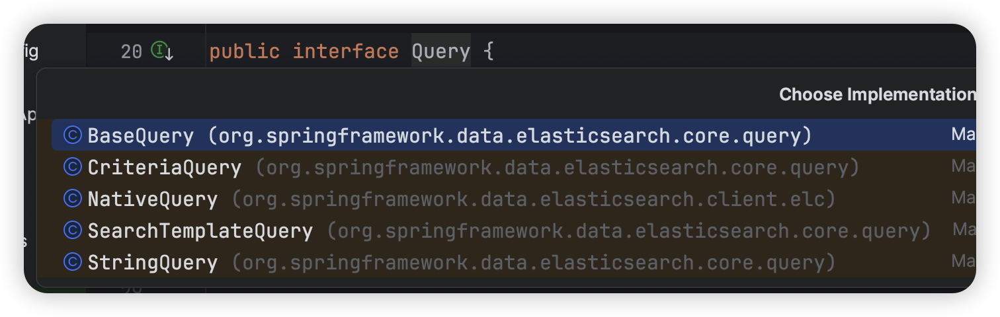

  * Query是Spring Data Elasticsearch的接口，有多种具体实现，**新版官方文档缺少，这边看源码给案例实战**

    * CriteriaQuery
      * 创建Criteria来搜索数据，而无需了解 Elasticsearch 查询的语法或基础知识
      * 允许用户通过简单地连接和组合，指定搜索文档必须满足的对象来构建查询
    * StringQuery 
      * 将Elasticsearch查询作为JSON字符串，更适合对Elasticsearch查询的语法比较了解的人
      * 也更方便使用kibana或postman等客户端工具行进调试
    * NativeQuery
      * 复杂查询或无法使用CriteriaAPI 表达的查询时使用的类，例如在构建查询和使用聚合的场景

    

* 新版的搜索语法案例，查询采用新版的lambda表达式语法，更简洁

  * 案例一：搜索全部

  ```
  	/**
  	 * 查询所有
  	 */
  	@Test
  	void searchAll(){
  
  		SearchHits<VideoDTO> search = restTemplate.search(Query.findAll(), VideoDTO.class);
  		List<SearchHit<VideoDTO>> searchHits = search.getSearchHits();
  		// 获得searchHits,进行遍历得到content
  		List<VideoDTO> videoDTOS = new ArrayList<>();
  		searchHits.forEach(hit -> {
  			videoDTOS.add(hit.getContent());
  		});
  		System.out.println(videoDTOS);
  	}
  ```

  * 案例二：匹配搜索

  ```
  /**
  	 * match查询
  	 */
  	@Test
  	void matchQuery(){
  
  		Query query = NativeQuery.builder().withQuery(q -> q
  				.match(m -> m
  						.field("description") //字段
  						.query("spring") //值
  				)).build();
  		SearchHits<VideoDTO> searchHits = restTemplate.search(query, VideoDTO.class);
  
  		// 获得searchHits,进行遍历得到content
  		List<VideoDTO> videoDTOS = new ArrayList<>();
  		searchHits.forEach(hit -> {
  			videoDTOS.add(hit.getContent());
  		});
  		System.out.println(videoDTOS);
  	}
  ```

  * 案例三：分页搜索

  ```
    /**
       * 分页查询
       */
      @Test
      void pageSearch() {
          Query query = NativeQuery.builder().withQuery(Query.findAll())
                  .withPageable(Pageable.ofSize(3).withPage(0)).build();
  
          SearchHits<VideoDTO> searchHits = restTemplate.search(query, VideoDTO.class);
          // 获得searchHits,进行遍历得到content
          List<VideoDTO> videoDTOS = new ArrayList<>();
          searchHits.forEach(hit -> {
              videoDTOS.add(hit.getContent());
          });
          System.out.println(videoDTOS);
      }
  ```

  * 案例四：搜索排序，withSort() 需要传入 Sort 对象，.by代表根据一个字段进行排序
    - .ascending() 方法：默认的，正序排序
    - .descending()方法：倒叙排序

  ```
     /**
       * 排序查询，根据时长降序排列
       */
      @Test
      void sortSearch() {
          Query query = NativeQuery.builder().withQuery(Query.findAll())
                  .withPageable(Pageable.ofSize(10).withPage(0))
                  .withSort(Sort.by("duration").descending()).build();
  
          SearchHits<VideoDTO> searchHits = restTemplate.search(query, VideoDTO.class);
          // 获得searchHits,进行遍历得到content
          List<VideoDTO> videoDTOS = new ArrayList<>();
          searchHits.forEach(hit -> {
              videoDTOS.add(hit.getContent());
          });
          System.out.println(videoDTOS);
      }
  ```

  


#### 第6集 进阶SpringBoot3.X+ES8.X原始StringQuery搜索

**简介： 进阶SpringBoot3.X+ES8.X原始StringQuery搜索**

* 什么是StringQuery 

  * 将Elasticsearch查询作为JSON字符串，更适合对Elasticsearch查询的语法比较了解的人
  * 也更方便使用kibana或postman等客户端工具行进调试

* 案例实战

  * 案例一：布尔must查询，搜索标题有 架构 关键词，描述有 spring关键字，时长范围是 10～6000之间的

    * 原始DSL查询

    ```
    GET /video/_search
    {
    	"query": {
    		"bool": {
    			"must": [{
    				"match": {
    					"title": "架构"
    				}
    			}, {
    				"match": {
    					"description": "spring"
    				}
    			}, {
    				"range": {
    					"duration": {
    						"gte": 10,
    						"lte": 6000
    					}
    				}
    			}]
    		}
    	}
    }
    ```

    * SpringBoot+SpringData查询

    ```
      @Test
        void stringQuery() {
    
            //搜索标题有 架构 关键词，描述有 spring关键字，时长范围是 10～6000之间的
            String dsl = """
                       {"bool":{"must":[{"match":{"title":"架构"}},{"match":{"description":"spring"}},{"range":{"duration":{"gte":10,"lte":6000}}}]}}
                    """;
            Query query = new StringQuery(dsl);
    
            List<SearchHit<VideoDTO>> searchHitList = restTemplate.search(query, VideoDTO.class).getSearchHits();
    
            // 获得searchHits,进行遍历得到content
            List<VideoDTO> videoDTOS = new ArrayList<>();
            searchHitList.forEach(hit -> {
                videoDTOS.add(hit.getContent());
            });
            System.out.println(videoDTOS);
        }
    ```

    


#### 第7集 进阶SpringBoot3.X+ES8.X聚合搜索案例实战

**简介： 进阶SpringBoot3.X+ES8.X聚合搜索案例实战**

* 聚合搜索案例
  * 方案一：可以使用原始DSL进行处理
  * 方案二：使用NativeQuery完成聚合搜索

* 案例实战：统计不同分类下的视频数量

  ```
    /**
       * 聚合查询
       */
      @Test
      void aggQuery() {
          Query query = NativeQuery.builder()
                  .withAggregation("category_group", Aggregation.of(a -> a
                          .terms(ta -> ta.field("category").size(2))))
                  .build();
  
          SearchHits<VideoDTO> searchHits = restTemplate.search(query, VideoDTO.class);
  
          //获取聚合数据
          ElasticsearchAggregations aggregationsContainer = (ElasticsearchAggregations) searchHits.getAggregations();
          Map<String, ElasticsearchAggregation> aggregations = Objects.requireNonNull(aggregationsContainer).aggregationsAsMap();
  
          //获取对应名称的聚合
          ElasticsearchAggregation aggregation = aggregations.get("category_group");
          Buckets<StringTermsBucket> buckets = aggregation.aggregation().getAggregate().sterms().buckets();
  
          //打印聚合信息
          buckets.array().forEach(bucket -> {
              System.out.println("组名："+bucket.key().stringValue() + ", 值" + bucket.docCount());
          });
  
          // 获得searchHits,进行遍历得到content
          List<VideoDTO> videoDTOS = new ArrayList<>();
          searchHits.forEach(hit -> {
              videoDTOS.add(hit.getContent());
          });
          System.out.println(videoDTOS);
      }
  
  ```

  


 **愿景："IT路上的持续充电平台，让技术不再难学"**

**更多高级课程请访问 xdclass.net**

### 第七章 【高级】ElasticSearch8.X高可用集群搭建实战


#### 第1集 Elastic Search8.X高可用分布集群架构介绍

**简介：  Elastic Search8.X高可用分布集群架构介绍**

- 需求背景

  - 生产环境中 Elastic Search基本不可能单机部署，采用高可用集群架构
  - 高可用集群架构是指在生产环境中使用多台服务器来部署Elasticsearch，以实现数据的冗余和故障容错

- Elasticsearch高可用集群架构常见概念

  - 集群（Cluster）
    - 集群是由多个节点组成的Elasticsearch实例的集合，
    - 集群共享相同的索引和数据，并协同工作以提供高可用性和性能
  - 节点（Node）
    - 节点是运行在单个服务器上的Elasticsearch实例
    - 一个节点可以容纳多个分片，每个节点都有一个唯一的名称和地址。
  - 分片（Shard）
    - 分片是数据的基本单元，在分布式环境中将索引的数据划分成多个分片存储在不同的节点上
    - 主分片负责处理读写请求，副本分片用于数据的冗余和故障转移
    - **search 相关请求可以由主分片处理，也可以由副本分片处理**
  - 选主（Master Election）
    - 在一个集群中，通过选举机制选择一个主节点进行集群管理和控制
    - 主节点负责分配和管理主分片，而非主节点则负责处理读请求和副本分片。
  - 集群发现（Cluster Discovery）
    - 集群发现是指节点之间自动发现和加入集群的过程
    - Elasticsearch提供了多种集群发现机制，如多播发现、单播发现、云发现等。

- 查看节点角色

  - 集群中有多个节点角色的时候，就需要手动设定、配置节点的角色
  - 不手动设置节点角色，默认节点角色如下所示

  ```
  GET _cat/nodes?v
  
  ip         heap.percent ram.percent cpu load_1m load_5m load_15m node.role   master name
  172.17.0.1           57          84   1    0.00    0.02     0.05 cdfhilmrstw *      node-1
  ```

  - 拓展

  ```
  C：Coordinating Node（协调节点）：负责请求的路由和负载均衡，不存储数据。
  D：Data Node（数据节点）：存储数据并执行数据相关的操作，如索引和搜索。
  F：Fetch Node（提取节点）：从其他节点获取数据，协助执行分布式搜索。
  H：HTTP Node（HTTP 节点）：可以使用HTTP协议与之通信的节点。
  I：Ingest Node（摄取节点）：对文档进行预处理，如转换和过滤。
  L：Machine Learning Node（机器学习节点）：运行机器学习任务。
  M：Master Node（主节点）：负责集群管理和控制，如选主、分配分片等。
  R：Remote Client Node（远程客户端节点）：允许远程客户端连接的节点。
  S：Scripting Node（脚本节点）：负责脚本的评估和执行。
  T：Transform Node（转换节点）：执行转换任务，将源索引数据转换为目标索引。
  W：ML Datafeed Node（机器学习数据源节点）：用于处理机器学习数据源。
  ```

- Elasticsearch集群三种主要类型的节点

  - 主节点（Master Node）

    - 功能

      - 主节点负责集群管理、控制和协调操作，包括分配和管理主分片，并参与选主过程。

    - 用途

      - 在集群中，通常有一个或多个主节点，主节点的数量取决于集群的规模和要求
      - 主节点一般不参与数据的读写操作，它只负责协调工作

      ```
      默认的是主节点+数据节点(master+data) ，节点可以成为主节点的资格，又可以存储数据
      node.master: true
      node.data: true
      ```

  - 数据节点（Data Node）

    - 功能

      - 数据节点负责存储和处理数据，包括索引、搜索和查询等操作。数据节点接收客户端的读写请求，执行各种操作
      - 处理数据相关，如 CRUD、搜索和聚合，是 I/O 密集型、内存密集型和 CPU 密集型的，需要大量的CPU、内存和IO

    - 用途

      - 在生产环境中，一般会有多个数据节点，以存储和处理大量的数据
      - 数据节点可以水平扩展，提供更高的性能和容量

      ```
      节点没有成为主节点的资格，不参与选举，只存储数据
      node.master: false
      node.data: true
      ```

  - 协调节点（Coordinating Node）

    - 功能

      - 是一个无数据节点，用于负载均衡和请求协调。它接收客户端的读写请求，并将它们转发给合适的数据节点进行处理。

    - 用途

      - 在高负载情况下，协调节点可以平衡请求的分发，提高系统的性能和吞吐量。还可以缓存结果，减轻数据节点的压力

      ```
      不能成为主节点，也不存储数据，主要是进行负载均衡
      node.master: false
      node.data: false
      ```

  - 总结

    - 一个节点可以充当一个或多个角色，默认三个角色都有
    - 每种节点类型都有不同的功能和用途在生产环境中，通常的配置是将这些节点类型组合使用，实现高可用性和高性能
    - 建议
      - 小规模集群不需严格区分角色；
      - 大规模集群则可以分开角色，并发量大可以增加独立协调节点和数据节点，提升处理能力
      - 节点的数量和规模取决于数据量、性能需求和可用资源等因素
      - 一个典型的Elasticsearch集群配置
        - 3个主节点、5个数据节点和1个或多个协调节点，这样的配置可以实现高可用性、数据冗余和负载均衡
        - 需要根据实际情况评估和调整节点的配置，以满足业务需求，也需要考虑硬件资源、网络带宽和数据量等因素。


#### 第2集 Linux搭建Elastic Search8.X高可用集群实战《上》

**简介：  Linux搭建Elastic Search8.X高可用集群实战《上》**

- 相关服务器准备（阿里云按量付费购买服务器，搭建集群）

  - 购买3个服务器，每个2核4G，时长1小时练习即可

  - 同个区域，内网互通哈，开放相关端口9300，9200

  - 上传ElasticSearch到服务器，3个服务器,新增好用户，并且配置好权限

    - **从本地将文件传输到服务器**
    - scp【本地文件的路径】【服务器用户名】@【服务器地址】：【服务器上存放文件的路径】

    ```
    scp -r /usr/local/software/elk_test/elasticsearch-8.4.1-linux-x86_64.tar.gz root@172.31.101.12:/usr/local/software/elk_test
    ```

- 搭建实战

  - 下面步骤，前面搭建单机实操过

    - 上传安装包和解压

    ```
    tar -zxvf elasticsearch-8.4.1-linux-x86_64.tar.gz
    ```

    - 新建一个用户，安全考虑，elasticsearch默认不允许以root账号运行

    ```
    创建用户：useradd es_user
    设置密码：passwd es_user
    ```

    - 修改目录权限

    ```
    # chmod是更改文件的权限   
    # chown是改改文件的属主与属组  
    # chgrp只是更改文件的属组。
    
    
    chgrp -R es_user /usr/local/software/elk_test/elasticsearch-8.4.1
    chown -R es_user /usr/local/software/elk_test/elasticsearch-8.4.1
    chmod -R  777 /usr/local/software/elk_test/elasticsearch-8.4.1
    ```

    - 修改文件和进程最大打开数,需要root用户,如果系统本身有这个文件最大打开数和进程最大打开数配置，则不用

    ```
    在文件内容最后添加后面两行(切记*不能省略)
    vim /etc/security/limits.conf
    
    * soft nofile 65536
    * hard nofile 65536
    ```

    - 修改虚拟内存空间，默认太小

    ```
    在配置文件中改配置 最后一行上加上，执行 sysctl -p(立即生效)
    vim /etc/sysctl.conf
    
    vm.max_map_count=262144
    ```

    - 修改elasticsearch的JVM内存，机器内存不足，常规线上推荐16到24G内存

    ```
    vim config/jvm.options
    
    -Xms1g
    -Xmx1g
    ```

     


#### 第3集 Linux搭建Elastic Search8.X高可用集群实战《下》

**简介：  Linux搭建Elastic Search8.X高可用集群实战《下》**

- 搭建实战

  - 节点一

    ```
    vim config/elasticsearch.yml
    
    
    cluster.name: xdclass-cluster
    node.name: node-1
    path.data: /usr/local/software/elk_test/elasticsearch-8.4.1/data
    path.logs: /usr/local/software/elk_test/elasticsearch-8.4.1/logs
    network.host: 0.0.0.0
    http.port: 9200
    discovery.seed_hosts: ["172.31.101.11:9300","172.31.101.13:9300","172.31.101.12:9300"]
    cluster.initial_master_nodes: ["172.31.101.11:9300","172.31.101.13:9300","172.31.101.12:9300"]
    xpack.security.enabled: false
    xpack.security.enrollment.enabled: false
    ingest.geoip.downloader.enabled: false
    ```

  - 节点二

    ```
    vim config/elasticsearch.yml
    
    
    cluster.name: xdclass-cluster
    node.name: node-2
    path.data: /usr/local/software/elk_test/elasticsearch-8.4.1/data
    path.logs: /usr/local/software/elk_test/elasticsearch-8.4.1/logs
    network.host: 0.0.0.0
    http.port: 9200
    discovery.seed_hosts: ["172.31.101.11:9300","172.31.101.13:9300","172.31.101.12:9300"]
    cluster.initial_master_nodes: ["172.31.101.11:9300","172.31.101.13:9300","172.31.101.12:9300"]
    xpack.security.enabled: false
    xpack.security.enrollment.enabled: false
    ingest.geoip.downloader.enabled: false
    ```

  - 节点三

    ```
    vim config/elasticsearch.yml
    
    
    cluster.name: xdclass-cluster
    node.name: node-3
    path.data: /usr/local/software/elk_test/elasticsearch-8.4.1/data
    path.logs: /usr/local/software/elk_test/elasticsearch-8.4.1/logs
    network.host: 0.0.0.0
    http.port: 9200
    discovery.seed_hosts: ["172.31.101.11:9300","172.31.101.13:9300","172.31.101.12:9300"]
    cluster.initial_master_nodes: ["172.31.101.11:9300","172.31.101.13:9300","172.31.101.12:9300"]
    xpack.security.enabled: false
    xpack.security.enrollment.enabled: false
    ingest.geoip.downloader.enabled: false
    ```

- 配置说明

  - discovery.seed_hosts参数：

    - 功能：discovery.seed_hosts参数用于配置集群中用于发现其他节点的主机名或IP地址列表。
    - 作用：每个节点通过这个参数指定其他节点的地址，以便在启动时进行发现和加入集群。
    - 配置：在每个节点的elasticsearch.yml配置文件中设置该参数，指定其他节点的地址，多个地址使用逗号分隔。

  - cluster.initial_master_nodes参数：

    - 功能：cluster.initial_master_nodes参数用于配置初始主节点的名称。
    - 作用：当集群启动时，用于指定初始的主节点，以启动集群的选主过程。
    - 配置：只需在初始启动的几个节点的elasticsearch.yml配置文件中设置该参数，列出节点名称。

  - 注意

    - cluster.initial_master_nodes参数和discovery.seed_hosts参数之间的设置应该保持一致，
    - 确保集群中的所有节点都能正确发现和加入。

     

- 启动ElasticSearch

```
切换到es_user用户启动, 进入bin目录下启动， &为后台启动,再次提示es消息时 Ctrl + c 跳出

./elasticsearch &
```

- 常见命令，可以用postman访问（网络安全组记得开发端口）

```
#查看集群健康情况
http://112.74.167.42:9200/_cluster/health


#查看分片情况
http://112.74.167.42:9200/_cat/shards?v=true&pretty


#查看节点分布情况
http://112.74.167.42:9200/_cat/nodes?v=true&pretty


#查看索引列表
http://112.74.167.42:9200/_cat/indices?v=true&pretty
```

*  集群状态说明
  * green：所有的主分片和副本分片都正常运行。
  * yellow：所有的主分片都正常运行，但有部分副本分片运行不正常。
  * red：主分片没能正常运行


#### 第4集 SpringBoot3.X整合Elastic Search8.X集群实战

**简介：  SpringBoot3.X整合Elastic Search8.X集群实战**

* 案例实战

  * 配置文件修改

  ```
  spring.elasticsearch.uris=http://112.74.167.42:9200,http://112.74.50.221:9200,http://120.79.53.241:9200
  ```

  * 准备数据，创建多个索引列表

  ```
  PUT /xdclass_shop_v1
  {
    "settings": {
      "number_of_shards": 3,
      "number_of_replicas": 2
    },
    "mappings": {
      "properties": {
        "id": {
          "type": "keyword"
        },
        "title": {
          "type": "keyword"
        },
        "summary": {
          "type": "text"
        },
        "price": {
          "type": "float"
        }
      }
    }
  }
  
  PUT /xdclass_shop_v1/_bulk
  { "index": { "_index": "xdclass_shop_v1" } }
  { "id": "1", "title": "Spring Boot","summary":"this is a summary Spring Boot video", "price": 9.99 }
  { "index": { "_index": "xdclass_shop_v1" } }
  { "id": "2", "title": "java","summary":"this is a summary java video", "price": 19.99 }
  { "index": { "_index": "xdclass_shop_v1" } }
  { "id": "3", "title": "Spring Cloud","summary":"this is a summary Spring Cloud video", "price": 29.99 }
  { "index": { "_index": "xdclass_shop_v1" } }
  { "id": "4", "title": "Spring_Boot", "summary":"this is a summary Spring_Boot video","price": 59.99 }
  { "index": { "_index": "xdclass_shop_v1" } }
  { "id": "5", "title": "SpringBoot","summary":"this is a summary SpringBoot video", "price": 0.99 }
  ```

* 高可用测试

  * 停掉某个节点服务器，然后测试相关的数据搜索和索引分布情况

  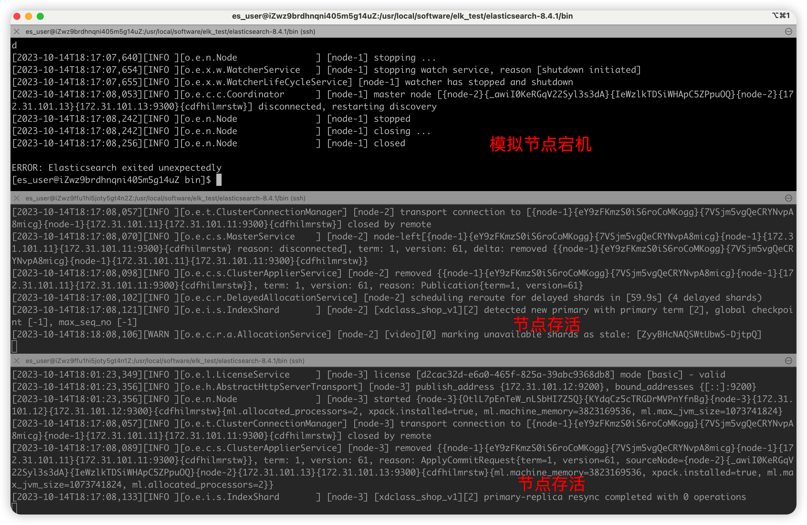

* 常见命令，可以用postman访问（网络安全组记得开发端口）

```
#查看集群健康情况
http://112.74.167.42:9200/_cluster/health


#查看分片情况
http://112.74.167.42:9200/_cat/shards?v=true&pretty


#查看节点分布情况
http://112.74.167.42:9200/_cat/nodes?v=true&pretty


#查看索引列表
http://112.74.167.42:9200/_cat/indices?v=true&pretty
```

*  集群状态说明
  * green：所有的主分片和副本分片都正常运行。
  * yellow：所有的主分片都正常运行，但有部分副本分片运行不正常。
  * red：主分片没能正常运行


#### 第5集 Elastic Search8.X常见性能优化最佳实践

**简介：  Elastic Search8.X常见性能优化最佳实践**

- 背景

  - 官方数据Elastic Search最高的性能可以达到，PB级别数据秒内相应
    - 1PB=1024TB = 1024GB * 1024GB
  - 但是很多同学公司的Elastic Search集群，里面存储了几百万或者几千万数据，但是ES查询就很慢了
  - 记住，ES数量常规是亿级别为起点，之所以达不到官方的数据，多数是团队现有技术水平不够和业务场景不一样
  - 海量数据检索领域榜单：https://db-engines.com/en/ranking/search+engine

- Elastic Search8.X常见性能优化最佳实践

  - 硬件资源优化：

    - 内存分配
      - 将足够的堆内存分配给Elasticsearch进程，以减少垃圾回收的频率
      - ElasticSearch推荐的最大JVM堆空间是30~32G, 所以分片最大容量推荐限制为30GB
      - 30G heap 大概能处理的数据量 10 T，如果内存很大如128G，可在一台机器上运行多个ES节点
      - 比如业务的数据能达到200GB, 推荐最多分配7到8个分片
    - 存储器选择
      - 使用高性能的存储器，如SSD，以提高索引和检索速度
      - SSD的读写速度更快，适合高吞吐量的应用场景。
    - CPU和网络资源
      - 根据预期的负载需求，配置合适的CPU和网络资源，以确保能够处理高并发和大数据量的请求。

  - 分片和副本优化：

    - 合理设置分片数量
      - 过多的分片会增加CPU和内存的开销，因此要根据数据量、节点数量和性能需求来确定分片的数量。
      - 一般建议每个节点上不超过20个分片
    - 考虑副本数量
      - 根据可用资源、数据可靠性和负载均衡等因素，设置合适的副本数量
      - 至少应设置一个副本，以提高数据的冗余和可用性。
      - 不是副本越多，检索性能越高，增加副本数量会消耗额外的存储空间和计算资源，

  - 索引和搜索优化

    - 映射和数据类型
      - 根据实际需求，选择合适的数据类型和映射设置
      - 避免不必要的字段索引，尽可能减少数据在硬盘上的存储空间。
    - 分词和分析器
      - 根据实际需求，选择合适的分词器和分析器，以优化搜索结果。
      - 了解不同分析器的性能特点，根据业务需求进行选择
    - 查询和过滤器
      - 使用合适的查询类型和过滤器，以减少不必要的计算和数据传输
      - 尽量避免全文搜索和正则表达式等开销较大的查询操作。

  - 缓存和缓冲区优化：

    - 缓存大小  
      - 在Elasticsearch的JVM堆内存中配置合适的缓存大小，以加速热数据的访问
      - 可以根据节点的角色和负载需求来调整缓存设置。
    - 索引排序字段
      - 选择合适的索引排序字段，以提高排序操作的性能
      - 对于经常需要排序的字段，可以为其创建索引，或者选择合适的字段数据类型。

  - 监控和日志优化

    - 监控集群性能
      - 使用Elasticsearch提供的监控工具如Elastic Stack的Elasticsearch监控、X-Pack或其他第三方监控工具
      - 实时监控集群的健康状态、吞吐量、查询延迟和磁盘使用情况等关键指标。

  - 集群规划和部署：

    - 多节点集群
      - 使用多个节点组成集群，以提高数据的冗余和可用性。多节点集群还可以分布负载和增加横向扩展的能力。
    - 节点类型和角色
      - 根据节点的硬件配置和功能需求，将节点设置为合适的类型和角色
      - 如数据节点、主节点、协调节点等，以实现负载均衡和高可用性。

  - 性能测试和优化：

    - 压力测试
      - 使用性能测试工具模拟真实的负载，评估集群的性能极限和瓶颈
      - 根据测试结果，优化硬件资源、配置参数和查询操作等。
    - 日常性能调优
      - 通过监控指标和日志分析，定期评估集群的性能表现，及时调整和优化配置，以满足不断变化的需求。

  - 升级和版本管理：

    - 计划升级
      - 定期考虑升级Elasticsearch版本，以获取新功能、性能改进和安全修复。
      - 在升级过程中，确保备份数据并进行合理的测试。
    - 版本管理
      - 跟踪Elasticsearch的发行说明和文档，了解新版本的特性和已知问题，并根据实际需求选择合适的版本。

     

   


 **愿景："IT路上的持续充电平台，让技术不再难学"**

**更多高级课程请访问 xdclass.net**

### 第八章 ElasticSearch8.X+SpringBoot3.X最佳实践课程总结


#### 第1集 ElasticSearch8.X+SpringBoot3.X最佳实践课程总结

**简介： ElasticSearch8.X+SpringBoot3.X最佳实践课程总结**

- 课程总结：目录知识点回顾

  - 基础板块
    - ElasticStack8.X核心架构和案例组建作用场景
    - 实战云服务器选购+Linux服务器源码安装ElasticSearch8.X
    - 源码安装Kibana8.X+ES8.X常用命令操作
    - 多案例实战Index和Document核心操作
    - ES8.X映射Mapping定义和IK中文分词配置实战
    - Query DSL多案例 match/match_all/filter/page/sort

  * 高级板块

    - **match高级用法多字段匹配和短语搜索案例实战**
    - 单词纠错Fuzzy模糊查询和搜索高亮语法实战
    - **Agg指标metric聚合搜索sum/avg/max多案例实战**
    - **Agg桶bucket聚合Trem/Range/Date Histogram多案例实战**
    - **新版SpringBoot3.X+ElasticSearch8.X整合多案例实战**
    - **Linux服务器多节点搭建ElasticSearc8.X高可用集群实战**
    - **ElasticSearch8.X常见性能优化最佳实践**
    - 独立搭建高可用搜索引擎ElasticSearch和多项目案例整合

  

- ElasticSearch内容还很多，包括在业界里面很多中间件也会整合

  - 比如
    - 分布式链路追踪框架Apache Skywalking，底层数据存储就是ES
    - 日志可视化监控体系ELK里面，底层数据存储也是ES
  - 高级拓展还有很多知识点
    - 问题一
      - Elastic Search集群进行升级，不同大版本如何升级，索引读写不兼容，比如ElasticSearch5.X或6.X升级为8.X
    - 问题二：业务一开始规划的索引分片、类型mapping分配不合理
      - 原有数据量太大、分片数太少 ；原有数据量太小、分片数太多 
      - ES索引分片，一旦创建，原索引是不能修改分片数量
    - 问题三
      - Elasticsearch中搜索文档排序里面有个评分，表示相关性，按score得分从高到底排好序的结果集，机制上怎样的?
    - 问题四
      - 海量数据存储，但是有些数据很少方法，也占据比较高的存储资源，如何做冷热数据归档？
    - 问题五
      - ES被称为可以实时的搜索**NRT**，ES索引分片写入原理是怎样的，为什么新加一条数据在下一秒就可以被搜索？
    - 更多。。。

  

- **上述内容如何学习，我们小滴课堂都有对应的体系课程，不简单是ES的知识点了，我作为过来人，给大家的建议**

  - **什么阶段，做什么事情和规划什么事情**
  - 在其位谋其政，目标是其位也要谋其政，才能逐步达到这个水平
  - **现在每个人获取知识的门槛越来越低，市场就存在越来越多竞争，企业用人要求也会水涨船高**
  - **接触知识的门槛不一样，时代在进步；而我们技术人员也要进步，持续学习**
  - **最关键**
    - **持续提高自己核心竞争力，IT行业拼的不是爹妈，而是自己的持续有效的学习+复盘思考总结**
  - 如果需要职业规划，简历审核，直接加我的联系方式，技术交流和内推等也会比较多


#### 第2集 高级技术岗成长路线- IT技术人的职场充电站

**简介：高级技术岗成长路线- IT技术人的职场充电站**

- 技术培训的你应该知道的事情
  - 技术是每年一小变，三年一大变，持续学习是关键
  - 大家也是过来人，小滴课堂-每个技术栈课程不贵，从专题技术到大课，不同阶段你收获也不一样
  - 市面上技术视频很多，但是与其不如四处搜索，还不错选个靠谱的平台持续学习
  - 提升自己技术能力 + 不浪费时间 + 涨薪，是超过N倍的收益
  - 我也在学习每年参加各种技术沙⻰和内部分享会投 入超过6位数，但是我认为是值的，且带来的收益更大
  - 定时复习专题课程笔记+大课里面的笔记和解决方案
  - 技术是不断演进的，后端+大数据，小滴课堂也会不断上架新的技术，做好技术储备，就不会被淘汰！！！


* 为啥说免费的才是最贵的，比如【盗版视频】或者【割韭菜的机构】

  - 视频录制时间旧 或者 讲师水平Low，导致学不到技术甚至还【学错了技术】

  - 课程资料、代码缺少，导致自己花了大量时间去调试最后还不一定解决

  - 项目源码不规范、思考维度缺少，什么样的老师带出什么样的学生

  - 正版学习群的关键性

    - 盗版群里你能结实到什么人员，各种混杂人员，遇到问题卡死，花了几百块还盗版人员跑路不更新
    - 正版学习群里，不少大厂技术负责人，本身内推和招聘，风气也好、价值观也好
    - 遇到问题有群里的学霸和讲师帮你解决，也有更多面经分享等

     

  - 大家计算下自己的时薪、日薪

    - 月薪20k， 一天8小时，一个月工作22天，你一小时值多少钱、一天值多少钱 ，1千块！！
    - 还有很多互联网公司，一年14到16个月工资+股票，那一天就是好几千了，阿里P6级别都是30k月薪
    - 举个跳槽例子
      - 老王月薪10k，花了2k学了课程，一线城市找到了20k Offer
      - 入职第一个月月薪的四分之一就回本了，后续都是自己更高的收入
    - 记住！！！！
      - 跳槽涨薪不是你说跳就跳的，说涨就涨的
      - 你需要有让面试官给你这个薪资的理由
        - 比如你有好项目经历、各种高并发、分布式解决方案
        - 能给公司和技术团队带来新血液，提升一个档次
        - 你学了大课，里面N多技术难点解决方案，就可以让你靠这些去跳槽涨薪！！！

 

- 小滴课堂永久会员 & 小滴课堂年度会员
  - 适合IT人员，零基础就业、在职充电、架构师学习路线-专题技术方向
    - 包括业界主流技术栈，前端、后端、测试、架构、大数据 等等课程，接近上百套视频，深度+广度
    - 包括 从零基础到就业班，高级工程师、技术负责人、架构师技术栈 全套学习路线
    - 永久会员可以观看全部专题IT技术，作为一个终生学习平台，每个月更新多套视频
    - 如何获取最新路线图，有你想学的多数主流技术栈，持续更新！！！
  - 学后水平：一线城市 15~30k
  - 适合人员：校招、应届生、培训机构出来、工作1~10年的同学都适合


- **跳槽涨薪 提升神器：大课综合训练营**

  - 跳槽涨薪不是你说跳就跳的，说涨就涨的，需要有让面试官给你这个薪资的理由

  - **比如你有好项目经历、跟当前公司需要的岗位匹配，那肯定优先了**

  - 从毕业到工作多年 学了多个不同领域的项目，就可以包装到简历里面

  - **简历里面有多个有亮点项目，总比只有一个或者没有的强多了，也可以极大概率避免撞车**

  - 你学了大课，里面N多技术难点解决方案，就可以让你靠这些去跳槽涨薪！！！

  - 适合用于专项拔高，校招进大厂/高级工程师/架构师方向发展的训练营，包括多个方向

    - 综合项目大课训练营 √
    - 海量数据分库分表项目大课 训练营√
    - 架构大课十八式大课训练营 √
    - 小滴云在线教育平台项目大课训练营√
    - 测试开发平台项目大课训练营 ing
    - 前端低代码平台项目大课训练营 ing
    - 大厂算法刷题大课训练营训练营 ing
    - 多语言云原生项目大课训练营
    - Web3.0项目大课训练营
    - 安全攻防大课训练营训练营
    - 大数据大课训练营训练营

     

- 技术人的导航站（涵盖我们主流的技术网站、社区、工具等等，即将上线）

  - 地址：open1024.com
  - 地址：xdclass.net

   

- 后端/前端/测试 一对一小班辅导

  - 适合人员

    - 计算机专业应届毕业生、非IT专业转行/编程爱好者
    - 计划往 后端/前端/测试/运维工程师 方向发展并就业的同学

  - 亮点

    - 远程解决bug+简历辅导+模拟面试，对标一线城市12~20K月薪
    - 7*12小时在线答疑，问题不过夜
    - 人员配置：课程讲师+专业技术人员

  - **不推荐大班课**

    - 大班课一个班就是几十个人，毕业的时候都是同期毕业，简历模板都是一样
    - 同个地方毕业，多数人都在当前城市同时投递竞争，投的时候简历一看到这个就很雷同
    - 而且遇到自己会的知识点，他人不会，讲师就重复讲解，也浪费自己时间

  - **推荐小班私教课**

    - **我们的小班课，就是私教课，针对性提高，毕竟每个人的情况不一样**
    - **包括学历，年纪，是否0基础，目标就业城市等，都是需要调整策略，这样才比较合理**
    - 更多的内容或者疑惑直接加我即可

    

- 后端/前端 保涨薪就业班
  - 小班制学习，培训时间：3~8个月
  - Level1：薪资目标（12-18k）
  - Level2：薪资目标（18-30k）
  - 报名条件
    - 学历：大专及大专以上
    - 年龄：18-32周岁
    - 工作经验：至少1年以上或者 校招是本科以上
    - 就业城市：互联网一线及二线城市
    - 满足基础要求提交简历和入学考试，根据成绩进行老师评估（负责人：二当家小D）
    - 学习时间要求
      - Level1( 保证每周学习时长+作业提交+考核成绩)
      - Level2( 保证每周学习时长+作业提交+考核成绩）

 
