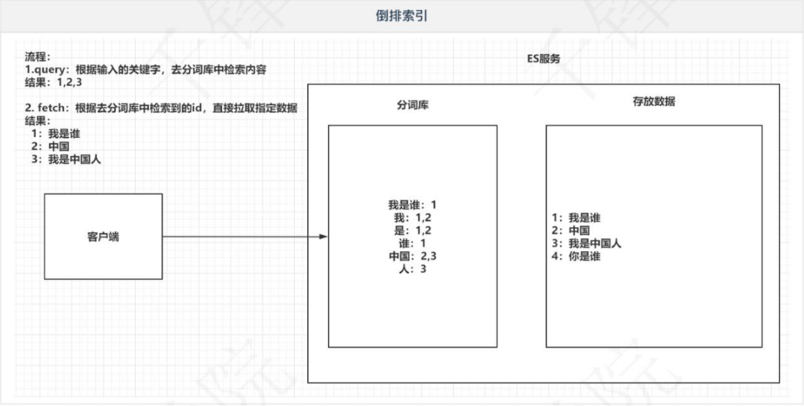
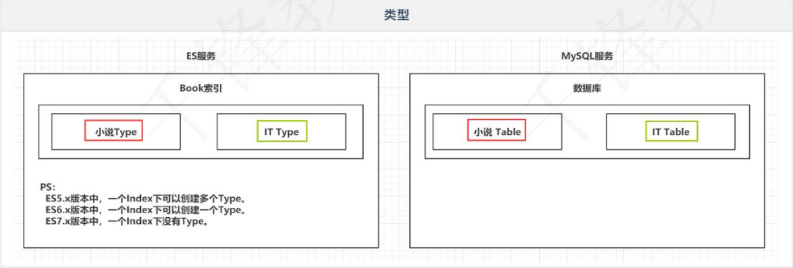
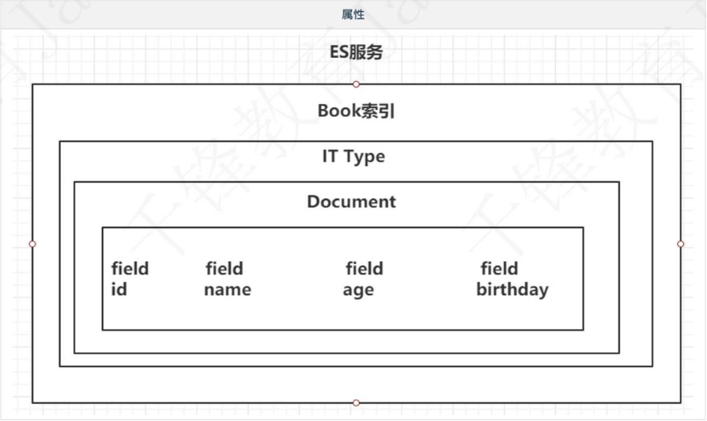

### ElasticSearch

### 一、引言

#### 1.1 海量数据

> 在海量数据中执行搜索功能时，如果使用MySQL， 效率太低。

#### 1.2 全文检索

> 在海量数据中执行搜索功能时，如果使用MySQL, 效率太低。

#### 1.3 高亮显示

> 将搜索关键字，以红色的字体展示。


### 二、ES概述

#### 2.1.介绍

>- ES是一个使用Java语言并且基于Lucene编写的搜索引擎框架，他提供了分布式的全文搜索功能，提供了一个统一的基于RESTful风格的WEB接口，官方客户端也对多种语言都提供了相应的API。
>
>- Lucene: Lucene本身就是一个搜索引擎的底层。
>
>- 分布式:ES主要是为了突出他的横向扩展能力。
>
>- 全文检索:将一段词语进行分词，并且将分出的单个词语统一的放到一个分词库中，在搜索时，根据关键字去分词库中检索，找到匹配的内容。(倒排索引)
>
>- RESTful风格的WEB接口︰操作ES很简单，只需要发送一个HTTP请求，并且根据请求方式的不同，携带参数的同，执行相应的功能。
>
>- 应用广泛:Github.com，WIKI,Gold Man用ES每天维护将近10TB的数据。


#### 2.2.与Solr对比

>- Solr在查询死数据时，速度相对ES更快一些。但是数据如果是实时改变的，Solr的查询速度会降低很多，ES的查询的效率基本没有变化。
>
>- Solr搭建基于需要依赖Zookeeper来帮助管理。ES本身就支持集群的搭建，不需要第三方的介入。
>
>- 最开始Solr的社区可以说是非常火爆，针对国内的文档并不是很多。在ES出现之后，ES的社区火爆程度直线上升，ES的文档非常健全。
>
>- ES对现在云计算和大数据支持的特别好。


#### 2.3.倒排索引

>- 将存放的数据，以一定的方式进行分词，并且将分词的内容存放到一个单独的分词库中。
>- 当用户去查询数据时，会将用户的查询关键字进行分词。
>- 然后去分词库中匹配内容，最终得到数据的id标识。
>- 根据id标识去存放数据的位置拉取到指定的数据。




### 三、ElasticSearch安装

#### 3.1安装ES&Kibana

> ocker-compose.yml

在docker-compose.yml同目录下执行 `docker-compose up -d`

```yml
version: "3.1"
services: 
  elasticsearch: 
    image: daocloud.io/library/elasticsearch:6.5.4
    restart: always
    container_name: elasticsearch
    ports:
     - 9200:9200
  kibana: 
    image: daocloud.io/library/kibana:6.5.4
    restart: always
    container_name: kibana
    ports: 
     - 5601:5601
    environment: 
     - elasticsearch_url=http://192.168.181.22:9200
    depends_on:
     - elasticsearch
```


#### 3.2.安装IK分词器

>下载K分词器的地址: https:/[github.com/medcl/elasticsearch-analysis-ik/releases/download/v6.5.4/elasticsearch-analysis-ik-6.5.4.zip
>
>由于网络问题，采用国内的路径去下载: http:/tomcato1.qfjava.cn:31/elasticsearch-analysis-ik-6.5.4.zip
>进去到ES容器内部，跳转到bin目录下，执行bin目录下的脚本文件: ./elasticsearch-plugin install http://tomcat01.qfjava.cn:81/elasticsearch-analysis-ik-6.5.4.zip
>
>重启ES的容器，让Ik分词器生效。

```
# 测试IK分词器
POST _analyze 
{
  "analyzer": "ik_max_word",
  "text": "千锋教育"
}
```


### 四、ElasticSearch基本操作

#### 4.1 ES的结构

##### 4.1.1 索引Index，分片和备份

>- ES的服务中,可以创建多个索引。每一个索引默认被分成5片存储
>- 每一个分片都会存在至少一个备份分片
>- 备份分片默认不会帮助检索数据，当ES检索压力特别大的时候，备份分片才会帮助检索数据
>- 备份的分片必须放在不同的服务器中


##### 4.1.2 类型 Type

>一个索引下，可以创建多个类型。
>Ps：根据版本不同，类型的创建也不同。




##### 4.1.3 文档 Doc

> 一个类型下，可以有多个文档。这个文档就类似于MySQL表中的多行数据。


##### 4.1.4 属性 Filed

> 一个文档中，可以包含多个属性。类似于MySQL表中的一行数据存在多个列。




#### 4.2 操作ES的RESTful语法

>- GET请求:
>  - ip:port/index：查询索引信息
>    ip:port/index/type/doc_id：查询指定的文档信息
>- POST请求:
>  - ip:port/index/type/_ search：查询文档，可以在请求体中添加json字符串来代表查询条件
>  - ip:port/index/type/doc_ id/_update：修改文档，在请求体中指定json字符串代表修改的具体信息
>- PUT请求:
>  - ip:port/index： 创建一个索引，需要在请求体中指定索引的信息，类型，结构
>  - ip:port/index/type/_ mappings：代表创建索引时，指定索引文档存储的属性的信息
>- DELETE请求:
>  - ip:port/index：删除索引
>  - ip:port/index/type/doc_ id：删除指定的文档


#### 4.3 索引的操作

##### 4.3.1 创建一个索引

> 语法如下

```js
# 创建一个索引
PUT /person
{
    "settings": {
    	"number of_ shards": 5,
    	"number_ of_ replicas": 1
    }
}
```


##### 4.3.2 查看索引信息

> 语法如下

```js
# 查看索引
GET /person
```


##### 4.3.3 删除索引

> 语法如下

```js
# 删除索引
DELETE /person
```


#### 4.4 ES中Filed可以指定的类型

>- 字符串类型：
>  - text：把被用于全文检索。将当前Field进行分词。
>  - keyword：当前Filed不会被分词
>- 数值类型：
>  - long：
>  - integer：
>  - short：
>  - byte：
>  - double：
>  - float：
>  - half_ float：精度比float小-半。
>  - scaled_ float：根据一个long和scaled来表达一 个浮点型，long-345， scaled-100 -> 3.45
>- 时间类型：
>  - date：针对时间类型指定具体格式
>- 布尔类型：
>  - boolean：表达ture和false
>- 二进制类型：
>  - binary：暂时支持Base64 encode string
>- 范围类型：
>  - long_range：赋值时，无需指定具体的内容，只需要存储一个范围即可， 指定gt, It, gte, Ite
>  - integer_range：同上
>  - double_ range：同上
>  - float_range：同上
>  - date_range：同上
>  - ip_range：同上
>- 经纬度类型：
>  - geo_point：用来存储经纬度的
>- ip类型：
>  - ip：可以存储IPV4和IPV6
>
>[其他的数据类型参考官网](https://www.elastic.co/guide/en/elasticsearch/reference/6.5/mapping types.html)


#### 4.5 创建索引并指定数据结构

> 语法如下 

```json
# 创建索引，指定数据结构
PUT /book
{
	"settings": {
        # 分片数
        "number_of_shards": 5,
        # 备份数
        "number_of_replicas": 1
    },
    # 指定数据结构
    "mappings": {
        # 类型 Type
    	"novel": {
    		# 文档存储的Field
    		"properties": {
    			# Field属性名
    			"name": {
    				# 类型
    				"type": "text",
    				# 指定分词器
    				"analyzer": "ik_max_word",
    				# 指定当前Field可以被作为查询的条件		
    				"index": true,
    				# 是否需要额外存储
    				"store": false
				},
				"author": {
                    "type": "keyword"
                },
				"count": {
                    "type": "long"
                },
				"on-sale": {
                    "type": "date",
                    "format": "yyyy-MM-dd HH:mm:ss||yyyy-MM-dd||epoch_millis"    
                },
                "descr": {
                    "type": "text",
                    "analyzer": "ik_max_word"    
                }
			}
		}
    }
}
```


#### 4.6 文档的操作

> 文档在ES服务中的唯一标识，`_index` ，`_ type` ，`_id` 三个内容为组合，锁定一个文档


##### 4.6.1 新增文档

> 自动生成id

```json
# 添加文档，自动生成id
POST /book/novel
{
    "name": "盘龙",
    "author": "我吃西红柿",
    "count": 100000,
    "on-sale": "2000-01-01",
    "descr": "山重水复疑无路，柳暗花明又一村"
}
```

> 手动指定id

```json
# 添加文档，手动指定id
PUT /book/novel/1
{
    "name": "红楼梦",
    "author": "曹雪芹",
    "count": 10000000,
    "on-sale": "1985-01-01",
    "descr": "一个是阆苑仙葩，一个是美玉无瑕"
}
```


##### 4.6.2 修改文档

> 覆盖式修改

```json
# 覆盖文档，指定id
PUT /book/novel/1
{
    "name": "红楼梦",
    "author": "曹雪芹",
    "count": 468189165,
    "on-sale": "1985-01-01",
    "descr": "一个是阆苑仙葩，一个是美玉无瑕"
}
```

> doc修改方式

```json
# 修改文档，基于doc方式
POST /book/novel/1/_update
    "doc": {
    	#指定上需要修改的field和对应的值
   		"count": "1234565"
    }
}
```


##### 4.6.3 删除文档

> 根据id删除

```json
# 根据id删除文档
DELETE /book/nove1/_id
```


### 五、Java操作ElasticSearch【重点】


#### 5.1 Java连接ES

> 创建Maven工程

```xml
<dependencies>
    <!-- 1.elasticsearch -->
    <dependency>
        <groupId>org.elasticsearch</groupId>
        <artifactId>elasticsearch</artifactId>
        <version>6.5.4</version>
    </dependency>

    <!-- 2.elasticsearch的高级API -->
    <dependency>
        <groupId>org.elasticsearch.client</groupId>
        <artifactId>elasticsearch-rest-high-level-client</artifactId>
        <version>6.5.4</version>
    </dependency>

    <!-- 3.junit -->
    <dependency>
        <groupId>junit</groupId>
        <artifactId>junit</artifactId>
        <version>4.12</version>
    </dependency>

    <!-- 4.lombok -->
    <dependency>
        <groupId>org.projectlombok</groupId>
        <artifactId>lombok</artifactId>
        <version>1.16.22</version>
    </dependency>


    <!-- 5.jackson -->
    <dependency>
        <groupId>com.fasterxml.jackson.core</groupId>
        <artifactId>jackson-databind</artifactId>
        <version>2.10.2</version>
    </dependency>
</dependencies>
```

> 创建测试类，连接ES

```java
public class ESClient {

    public static RestHighLevelClient getClient(){

        // 创建HttpHost对象
        HttpHost httpHost = new HttpHost("192.168.181.22",9200);

        // 创建RestClientBuilder
        RestClientBuilder clientBuilder = RestClient.builder(httpHost);

        // 创建RestHighLevelClient
        RestHighLevelClient client = new RestHighLevelClient(clientBuilder);

        // 返回
        return client;
    }

}
```


#### 5.2 Java操作索引

##### 5.2.1 创建索引

> 代码如下

```java
public class Demo2 {

    RestHighLevelClient client = ESClient.getClient();
    String index = "person";
    String type = "man";

    @Test
    public void createIndex() throws IOException {
        // 1.准备关于索引的settings
        Settings.Builder settings = Settings.builder()
                .put("number_of_shards", 3)
                .put("number_of_replicas", 1);

        // 2.准备关于索引的结构mappings
        XContentBuilder mappings = JsonXContent.contentBuilder()
                .startObject()
                    .startObject("properties")
                        .startObject("name")
                            .field("type","text")
                        .endObject()
                        .startObject("age")
                            .field("type","integer")
                        .endObject()
                        .startObject("birthday")
                            .field("type","date")
                            .field("format","yyyy-MM-dd")
                        .endObject()
                    .endObject()
                .endObject();


        // 3.将settings和mappings封装到一个Request对象
        CreateIndexRequest request = new CreateIndexRequest(index)
                .settings(settings)
                .mapping(type,mappings);

        // 4.通过client对象去连接ES并执行创建索引
        CreateIndexResponse resp = client.indices().create(request, RequestOptions.DEFAULT);

        // 5.输出
        System.out.println("resp:" + resp.toString());

    }
    
}

```


##### 5.2.2 检查索引是否存在

> 代码如下

```java
@Test
public void exists() throws IOException {
    //1. 准备request对象
    GetIndexRequest request = new GetIndexRequest();
    request.indices(index);

    //2. 通过client去操作
    boolean exists = client.indices().exists(request, RequestOptions.DEFAULT);


    //3. 输出
    System.out.println(exists);
}
```


##### 5.2.3 删除索引

```java
@Test
public void delete() throws IOException {
    //1. 准备request对象
    DeleteIndexRequest request = new DeleteIndexRequest();
    request.indices(index);

    //2. 通过client对象执行
    AcknowledgedResponse delete = client.indices().delete(request, RequestOptions.DEFAULT);

    //3. 获取返回结果
    System.out.println(delete.isAcknowledged());
}
```


#### 5.3 Java操作文档

##### 5.3.1 添加文档操作 

> 实体类

```java
@Data
@NoArgsConstructor
@AllArgsConstructor
public class Person {

    @JsonIgnore
    private Integer id;

    private String name;

    private Integer age;

    @JsonFormat(pattern = "yyyy-MM-dd")
    private Date birthday;

}
```

> 代码如下

```java
public class Demo3 {

    ObjectMapper mapper = new ObjectMapper();
    RestHighLevelClient client = ESClient.getClient();
    String index = "person";
    String type = "man";

    @Test
    public void createDoc() throws IOException {
        // 1.准备一个json数据
        Person person = new Person(1,"张三",23,new Date());
        String json = mapper.writeValueAsString(person);

        // 2.准备一个request对象（手动指定id）
        IndexRequest request = new IndexRequest(index,type,person.getId().toString());
        request.source(json, XContentType.JSON);

        // 3.通过client对象执行添加
        IndexResponse resp = client.index(request, RequestOptions.DEFAULT);

        // 4.输出返回结果
        System.out.println(resp.getResult().toString());
    }

}
```

