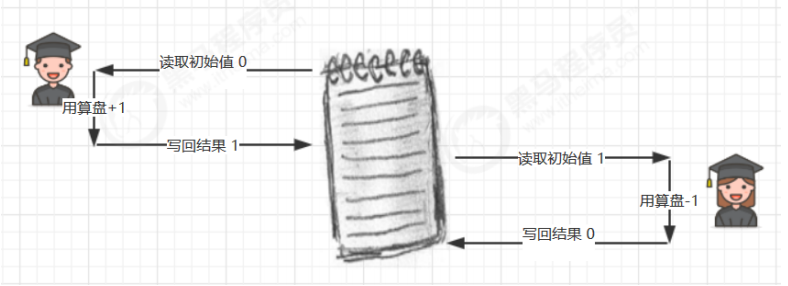
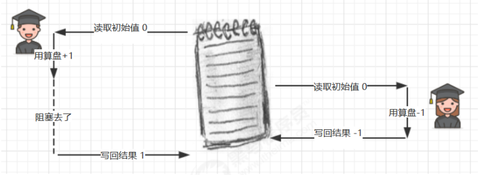
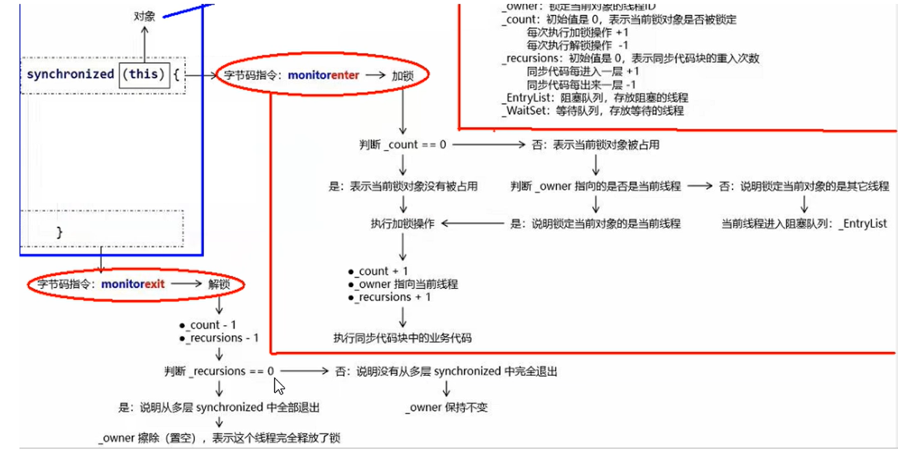

## JUC

> 推荐黑马： https://www.bilibili.com/video/BV16J411h7Rd


> 资料：

+ 并发编程.pdf
+ 并发编程_模式.pdf
+ 并发编程_应用.pdf
+ 并发编程_原理.pdf
+ 尚硅谷-JUC.md


> 如何学习

+ 自己来来回回切换看了50多级，对比下来，黑马更全一些，有助于循序渐进，尚硅谷通俗易懂一些
+ 看黑马视频和资料，不太明白的看尚硅谷资料
+ 加上自己思考
+ 字节码可以不用怎么看，了解就行，这些涉及到JVM


### 栈与栈帧

> Java Virtual Machine Stacks （Java 虚拟机栈） 

我们都知道 JVM 中由堆、栈、方法区所组成，其中栈内存是给谁用的呢？其实就是线程，每个线程启动后，虚拟机就会为其分配一块栈内存。 

+ 每个栈由多个栈帧（Frame）组成，对应着每次方法调用时所占用的内存 
+ 每个线程只能有一个活动栈帧，对应着当前正在执行的那个方法
+ 栈帧中含有：局部变量表、返回地址、锁记录


### 为什么要发生上下文切换？

因为以下一些原因导致 cpu 不再执行当前的线程，转而执行另一个线程的代码

+ 线程的 cpu 时间片用完 
+ 垃圾回收 
+ 有更高优先级的线程需要运行
+ **线程自己调用了 sleep、yield、wait、join、park、synchronized、lock 等方法**


当 Context Switch 发生时，需要由**操作系统保存当前线程的状态**，并恢复另一个线程的状态，Java 中对应的概念 就是程序计数器（Program Counter Register），它的作用是记住下一条 jvm 指令的执行地址，是线程私有的 

+ 状态包括程序计数器、虚拟机栈中每个栈帧的信息，如局部变量、操作数栈、返回地址等 
+ Context Switch 频繁发生会影响性能 


### 为什么多线程不安全？

> 原因就是：1.cpu以时间片形式执行线程，会发生**上下文切换**  2.多个线程**共享写**了同一个资源

+ 老王（操作系统）有一个功能强大的算盘（CPU），现在想把它租出去，赚一点外快 

+ 小南、小女（线程）来使用这个算盘来进行一些计算，并按照时间给老王支付费用

+ 但小南不能一天24小时使用算盘，他经常要小憩一会（sleep），又或是去吃饭上厕所（阻塞 io 操作），有 

  时还需要一根烟，没烟时思路全无（wait）这些情况统称为（阻塞） 

+ 在这些时候，算盘没利用起来（不能收钱了），老王觉得有点不划算 

+ 另外，小女也想用用算盘，如果总是小南占着算盘，让小女觉得不公平

+ 于是，老王灵机一动，想了个办法 [ 让他们每人用一会，轮流使用算盘 ] 

+ 这样，当小南阻塞的时候，算盘可以分给小女使用，不会浪费，反之亦然 

+ 最近执行的计算比较复杂，需要存储一些中间结果，而学生们的脑容量（工作内存）不够，所以老王申请了 

  一个笔记本（主存），把一些中间结果先记在本上

+ 计算流程是这样的 

  

+ 但是由于分时系统，有一天还是发生了事故

+ 小南刚读取了初始值 0 做了个 +1 运算，**还没来得及写回结果**

+ 老王说 [ 小南，你的时间到了，该别人了，记住结果走吧 ]，于是小南念叨着 [ 结果是1，结果是1...]（**保存到操作系统**） 不甘心地 到一边待着去了（上下文切换）

+ 老王说 [ 小女，该你了 ]，小女看到了笔记本上还写着 0 做了一个 -1 运算，将结果 -1 写入笔记本

+ 这时小女的时间也用完了，老王又叫醒了小南：[小南，把你上次的题目算完吧]，小南将他**脑海**(**操作系统**)中的结果 1 写入了笔记本

+ 

+ 小南和小女都觉得自己没做错，但笔记本里的结果是 1 而不是 0


### Monitor原理

加锁的this，指针指向monitor对象（也成为冠城或监视器锁）的起始地址。每个对象都存在一个monitor与之关联，当一个monitor被某个线程持有后，它便处于锁定状态。在Java虚拟机中(HotSpot)中，monitor是由ObjectMonitor实现的，其主要数据结构如下(ObjectMpnitor.hpp文件，C++实现的)


> Monitor流程-加锁


> Monitor流程-解锁




### 六种状态

参考：./并发编程.pdf/3.13六种状态 ；./并发编程.pdf/4.10 重新理解线程状态转换

+ IDEA中线程调试，RUNNABLE展示的是RUNNING，BLOCKED展示的是MONITOR


### 轻量级锁使用在无竞争场景，那么为什么还要用它？

+ 无竞争是事后才知道的 
+ 开始没并发，线程一个执行完了过了会才来一个，这时候是轻量锁，然后程序跑着跑着并发来了，锁就升级了 
+ 使用锁的目的是为了保证竞争下面的数据安全，这个是大前提。
  但是在某些场景下，竞争可能不存在或者不激烈。这种情况下，使用重量级锁性能不佳，也没有必要
  轻量级锁 是优化处理这种情况。后面可能会有的 线程的竞争，就会有锁升级的情况发生。 


### synchronized锁的理解

参考：[synchronized锁的理解](https://blog.csdn.net/Ryanqy/article/details/105351282)   [加深理解](https://blog.dreamtobe.cn/2015/11/13/java_synchronized/)  [偏向锁理解](https://blog.csdn.net/m0_37540696/article/details/113247587)

+ 在第一个线程要求获取对象监视器锁时，会被处于偏向锁状态。
+ 过了一会，第二个线程来请求锁时，偏向锁会被撤销，监视器锁会膨胀为轻量级锁。
+ 最后当有线程在自旋了指定次数后仍然未获取锁，该对象监视器锁就会膨胀为重量级锁。


### synchronized 不能防止指令重排序

参考：https://blog.csdn.net/Hellowenpan/article/details/117750543

+ `volatile`能保证内存可见性、**禁止指令重排序**但是不能保证[原子性](https://so.csdn.net/so/search?q=原子性&spm=1001.2101.3001.7020)。

  `synchronized`能保证原子性、可见性和**有序性**。

+ synchronized保证顺序性是指的将并发执行变成了串行，但并不能保证内部指令重排序问题。


### double-checked locking问题

+ t1线程可能会发生重排序，先把引用赋值给了静态变量（此时对象还没调用构造方法，该对象还不是一个完整的对象）
+ 此时t2线程开始运行了，当t2线程执行到`if (INSTANCE == null)`(第16行代码)语句的时候，t2线程发现`INSTANCE`不为空，此时t2线程直接返回INSTANCE对象。但是此时该对象还是一个不完整的对象，在t2线程使用该对象的时候就会出现问题，发现引用的对象为null。
+ DCL中如果不加volatile，t2返回的对象也是一个引用(值为null)，如果等待t1调用完构造方法，t2的对象是不是也是有值的(引用类型) ， 为了更保险起见(t1调用构造方法特别慢)，所以加了volatile 


```java
public final class Singleton {
    private Singleton() { }
    private static volatile Singleton INSTANCE = null;
    public static Singleton getInstance() {
        if (INSTANCE == null) { // t2
            synchronized (Singleton.class) { 
                if (INSTANCE == null) { 
                    INSTANCE = new Singleton();// t1
                }
            }
        }
        return INSTANCE;
    }
}
```

