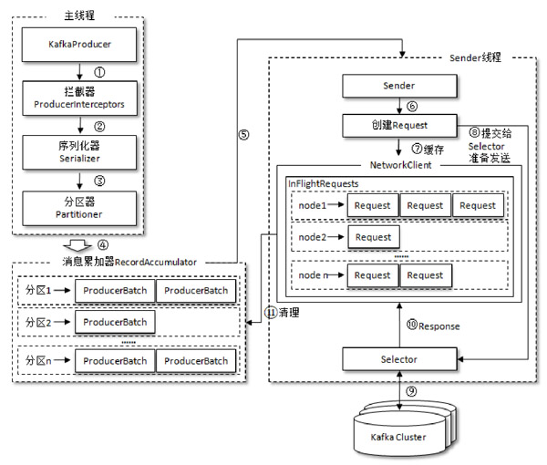

## RecordAccumulator 

整个生产者客户端由两个线程协调工作，分别为主线程和Sender线程。主线程中由KafkaProducer创建消息，然后会依次经过拦截器、序列化器、分区器，然后缓存到消息累加器，也称为RecordAccumulator。

而Sender线程则负责从RecordAccumulator中获取消息，然后发送给Kafka集群。

RecordAccumulator主要用来缓存消息，以便于Sender线程能够批量发送，这里有个生产者客户端参数buffer.memory来配置大小，默认32MB。

主线程过来的消息会被追加到RecordAccumulator的某个双端队列（Deque）中——对应分区号，队列的内容就是Deque<ProducerBatch>，这里的ProduceeBatch包含一个或多个ProducerRecord。

RecordAccumulator内部还有个BufferPool，主要用来复用特定大小的ProducerBatch块，这个特定大小会通过batch.size指定，默认为16KB，例如说当有一条消息（ProducerRecord）流入RecordAccumulator，会先通过分区号寻找双端队列（如果没有则创建），再从队列的尾部获取一个ProducerBatch（如果没有则新建），查看ProducerBatch是否还可以装的下这个ProducerRecord，如果可以则写入，如果不可以则需创建个新的ProducerBatch。在新建ProducerBatch时会评估这个ProducerRecord的大小是否超过batch.size，也就是可复用ProducerBatch的大小，如果没超过，那么可以从BufferPool中拿个闲置的ProducerBatch来使用。如果超过，那么就按实际的大小创建ProducerBatch，这个ProducerBatch不会再被复用。

Sender从RecordAccumulator获取缓存的消息之后，会将原本的<分区，Deque<ProducerBatch>>转换为<Node，List<ProducerBatch>>，其中Node表示Kafka集群的broker节点，之后Sender还会进一步封装成<Node，Request>，这样就可以将Request发送给各个Node了。

## InFlightRequests

请求从Sender线程发往Kafka之前还会保存到InFlightRequests中，InFlightRequests顾名思义——飞行途中的请求，主要作用是缓存已经发出去但还没有收到响应的请求，保存对象的具体形式为Map<NodeId，Deque<Request>>，这里有个重要的配置参数为max.in.flight.requests.per.connection，默认值为5，即每个连接最多只能缓存5个未收到响应的请求，超过这个数值之后便不能再往这个连接发送更多的请求了，除非有缓存的请求收到了响应。这里补充一点就是如果在需要保证消息顺序的场合建议把max.in.flight.requests.per.connection设为1，不过这样也会影响整体的吞吐量

通过比较各个Node的Deque<Request>的size来判断，哪个结点来不及处理消息，哪个结点处理消息很及时。