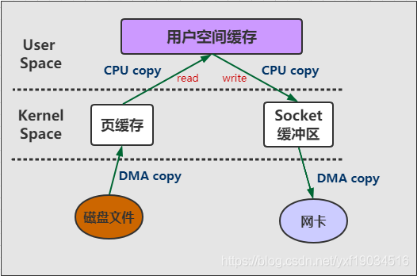

# kafka零拷贝机制

kafka之所以那么快，其中一个很大的原因就是零拷贝（Zero-copy）技术，零拷贝不会kafka的专利，而是操作系统的升级，又比如Netty，也用到了零拷贝。


## 传统IO

kafka的数据是要落入磁盘的，那么必然牵扯到磁盘的IO，传统磁盘IO又叫做缓存IO，效率是很低的，那么为什么效率低下呢？我们先来粗略讲讲操作系统的知识。


> 用户空间以及内核空间的概念：

+ 我们知道现在操作系统都是采用虚拟存储器。那么对32位操作系统而言，它的寻址空间（虚拟存储空间）为4G（2的32次方）。
+ 操作系统的核心是内核，独立于普通的应用程序，可以访问受保护的内存空间，也有访问底层硬件设备的所有权限。
+ 为了保证用户进程不能直接操作内核，保证内核的安全，操作系统将虚拟空间划分为两部分，一部分为内核空间、一部分为用户空间。
+ 针对Linux操作系统而言，将最高的1G字节，供内核使用，称为内核空间，而将较低的3G字节，供各个进程使用，称为用户空间。
+ 每个进程可以通过系统调用进入内核，因此，Linux内核由系统内的所有进程共享。于是，从具体进程的角度来看，每个进程可以拥有4G字节的虚拟空间。
+ 传统的文件读写或者网络传输，通常需要将数据从内核态转换为用户态。应用程序读取用户态内存数据，写入文件/socket之前，需要从用户态转换为内核态之后才可以写入文件或者网卡当中。我们可以称之read/write模式，此模式的步骤为：
  + 首先，调用read时，磁盘文件拷贝到了内核态
  + 之后，CPU控制将内核态数据copy到用户态下
  + 调用write时，先将用户态下的内容copy到内核态下的socket的buffer中
  + 最后将内核态下的socket buffer的数据copy到网卡设备中传送。


## DMA

DMA（直接存储器访问）是所有现代电脑的重要特色，它允许不同速度的硬件装置来沟通，而不需要依赖于CPU的大量中断负载，而不需要依赖于CPU的大量中断负载。

+ 通俗来讲，就是DMA传输数据从一个地址空间复制到另外一个地址空间，当CPU初始化这个传输动作，传输动作本身是由DMA控制器来实行和完成，也就是两个硬件之间完成的，
+ 而没有CPU的参与，那么CPU就可以释放出来做别的事情，这样极大的提高了效率。
+ 我们常见的硬件设备如网卡、磁盘设备、显卡、声卡之类的都支持DMA。所以上面说的read/write模式大概如图所示：




> 传统IO有两个很大的缺点导致很慢：

+ 我们可以清楚的看到共产生了4次copy，从磁盘文件到内核空间的相互读写是支持DMA copy的，但即使这样，从内核空间到用户空间没有硬件的支持所以不支持DMA，还有两次CPU copy。
+ Kafka只是把文件存放到磁盘之后通过网络发出去，中间并不需要修改什么数据，那read和write的两次CPU copy的操作完全是多余的。


## Kafka 零拷贝

​        Linux 2.1版本内核引入了sendfile函数，用于将文件通过socket传送。“零拷贝技术”只用将磁盘文件的数据复制到页面缓存中一次，然后将数据从页面缓存直接发送到网络中（发送给不同的订阅者时，都可以使用同一个页面缓存），避免了重复复制操作。

　　如果有10个消费者，传统方式下，数据复制次数为4*10=40次，而使用“零拷贝技术”只需要1+10=11次，一次为从磁盘复制到页面缓存，10次表示10个消费者各自读取一次页面缓存。零拷贝并不是不需要拷贝。

​		**Kafka用到的零拷贝技术，主要是减少了核心态和用户态之间的两次数据拷贝过程，使得数据可以不用经过用户态直接通过网卡发送到接收方，同时通过DMA技术，可以使CPU得到解放，这样实现了数据的高性能传输。** 


## 聊聊传统IO流程

比如：读取文件，再用socket发送出去
传统方式实现：
先读取、再发送，实际经过1~4四次copy。

```
buffer = File.read 
Socket.send(buffer)
```

1. 第一次：将磁盘文件，读取到操作系统内核缓冲区；
2. 第二次：将内核缓冲区的数据，copy到application应用程序的buffer；
3. 第三步：将application应用程序buffer中的数据，copy到socket网络发送缓冲区(属于操作系统内核的缓冲区)；
4. 第四次：将socket buffer的数据，copy到网卡，由网卡进行网络传输。

