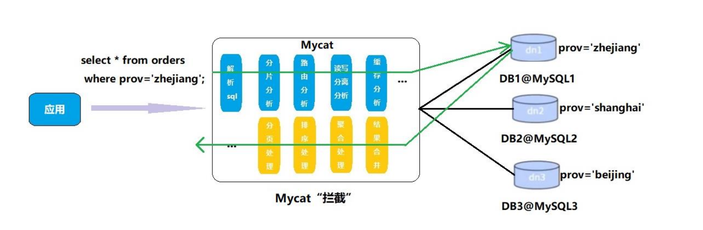

### Mycat分库分表

> 为什么使用Mycat  ->  流程图类似Nginx

```
1.Java与数据库紧耦合
2.高访问量高并发对数据库压力
3.读写请求数据不一致


1.读写分离
2.数据分片(数据库分布式)
	垂直拆分:分库
	水平拆分:分表
3.多数据源整合
```


> 原理



```
Mycat 的原理中最重要的一个动词是“拦截”，它拦截了用户发送过来的 SQL 语句
首先对SQL语句做了一些特定的分析：如分片分析、路由分析、读写分离分析、缓存分析等
然后将此 SQL发往后端的真实数据库，并将返回的结果做适当的处理，最终再返回给用户。

这种方式把数据库的分布式从代码中解耦出来，程序员察觉不出来后台使用Mycat还是MySQL
```


