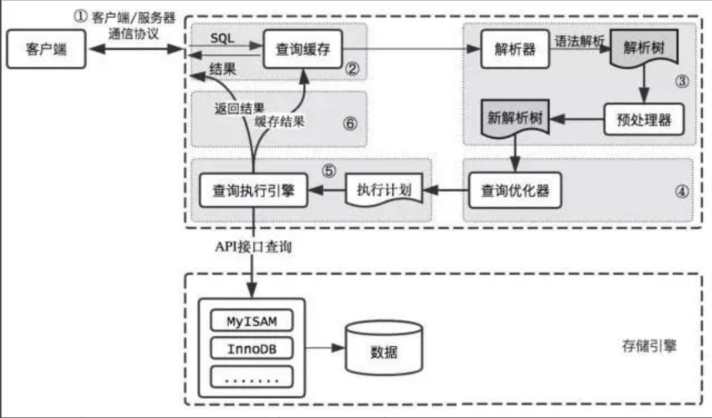
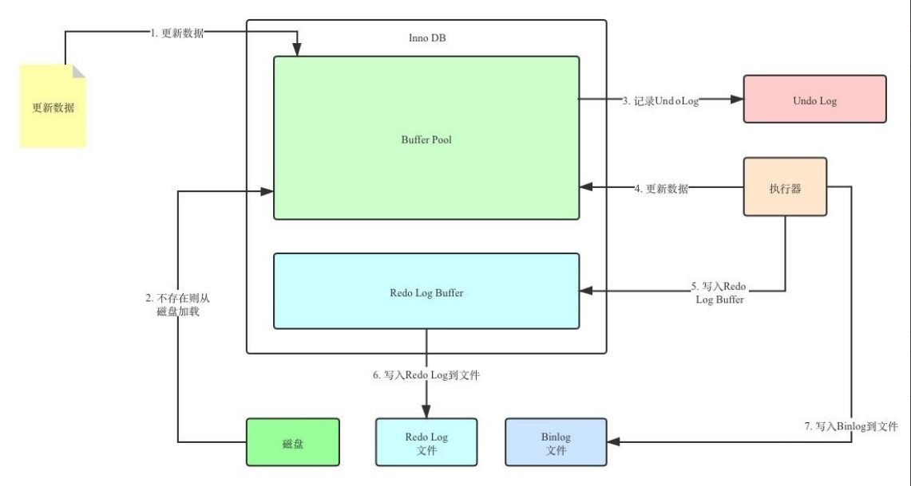

## MySQL

> 推荐黑马的MySQL：https://www.bilibili.com/video/BV1Kr4y1i7ru


> 资料：

+ MySQL-基础篇
+ MySQL-进阶篇
+ MySQL-运维篇
+ 尚硅谷-高级


> 看黑马视频，看尚硅谷的资料(尚硅谷视频时间太长了)


### mysql中explain的type的解释

参考：[mysql中explain的type的解释](https://blog.csdn.net/dennis211/article/details/78170079/)


### 为什么MySQL默认可重复读*

> 为什么MySQL默认可重复读，而大多数数据库(Oracle、SQLServer)是读已提交？

参考： [【原创】互联网项目中mysql应该选什么事务隔离级别](https://www.cnblogs.com/rjzheng/p/10510174.html) [间隙锁RC RR](https://cloud.tencent.com/developer/article/2118849)

+ RR才会有间隙锁，RC没有，RC只有行锁


### 什么是脏读,不可重复读和幻读?

1. 脏读: 读到别的事务未提交的数据
2. 不可重复读: 在同⼀个事务中执⾏同⼀个读取操作,但是结果不⼀致。
3. 幻读: 同样的事务操作,在前后两个时间段内执⾏对同⼀个数据项的读取,可能出现不⼀致的结果。

> tip: 不可重复读和幻读两者有些相似。但不可重复读重点在于update和delete,而**幻读的重点在于insert**。

> tip: select * from tb_user where id<=5 lock in share mode/for update 行锁的共享锁和排它锁只会锁住前五条记录,不会锁住>6的记录不会影响其他事务对其加行锁    

在RC隔离级别,在通过mvcc解决了脏读的前提下可以通过select * from tb_user where id<=5 lock in share mode/for update(手动加锁)
      来锁住这些查询的每行数据(加的是行锁,RC级别下间隙锁和邻键锁不生效,所以虽然锁住这些数据,
      但是这些数据的间隙是无法锁住的也就是无法阻止别的事务insert数据,所以在RC级别是无法解决幻读的
      如果是在没有索引的情况下行锁会升级为表锁,此时是可以阻止幻读,不过这也失去了意义
      因为mvcc本来就是为了提高仅仅用悲观锁处理并发事务的效率,如果升级为表锁那就没效率可言了喔),
      以防别的事务来update或者delete这些数据,从而产生不可重复读

在RR级别下,在通过mvcc解决了脏读和不可重复读的前提下,通过select * from tb_user where id<=5 lock in share mode(手动加锁)
      来锁住这些数据和"这些数据的间隙"(在RR级别下加的是邻键锁或者间隙锁),以防别的事务update,delete这些查询的数据或者insert新的数据从而产生幻读

### 幻读的理解*

参考：[幻读理解防链接失效](https://www.cnblogs.com/shujiying/p/13100324.html)   [幻读理解原文](https://segmentfault.com/a/1190000016566788?utm_source=tag-newest)  [MySQL的幻读是怎么被解决的？](https://blog.csdn.net/qq_34827674/article/details/120365585)

> 可重复读会产生幻读，但是MySQL加了间隙锁解决了幻读

+ mysql在这个可重复读的基础上已经解决了幻读问题，才会出现查不到却不能插入的情况，因为加了间隙锁了解决幻读了。在没有解决幻读的场景下，是事务可能会读到其他事务写入的行，这样才是幻读。


### MVCC多版本并发控制细节

> MVCC的实现原理就是通过 InnoDB表的隐藏字段、UndoLog 版本链、ReadView来实现的。  

+ 原子性 主要是undolog，会触发redolog
+ 一致性则是由redolog 与 undolog保证
+ MVCC + 锁，则实现了事务的隔离性
+ 持久性 redolog


> MVCC带来的好处是？

多版本并发控制（MVCC）是一种用来解决 **读-写** 冲突的无锁并发控制。

+ 在早期的数据库中，只有读读之间的操作才可以并发执行，读写，写读，写写操作都要阻塞，这样就会导致MySQL的并发性能极差采用了MVCC机制后，只有写写之间相互阻塞，其他三种操作都可以并行，这样就可以提高了MySQL的并发性能； 
+ MVCC在MySQL InnoDB中的实现主要是为了提高数据库并发性能，用更好的方式去处理读-写冲突，做到即使有读写冲突时，也能做到不加锁，非阻塞并发读； 
+ 我们都知道并发访问数据库造成的四种问题（脏写（修改丢失）、脏读、不可重复读、幻读），MVCC就是在尽量减少锁使用的情况下高效避免这些问题； 
+ 写写之间相互阻塞如何做到？就是采用行锁（记录锁、间隙锁、临建锁），RR为什么有间隙锁，是为了解决幻读


+ 对于使用READ UNCOMMITTED隔离级别的事务来说，直接读取记录的最新版本就好了；
+ 对于使用SERIALIZABLE隔离级别的事务来说，使用加锁的方式来访问记录。
+ 对于使用READ COMMITTED和REPEATABLE READ隔离级别的事务来说，就需要用到我们上边所说的版本链了，核心问题就是：需要判断一下版本链中的哪个版本是当前事务可见的。所以设计InnoDB提出了ReadView的概念(RC隔离级别下，在事务中每一次执行快照读时生成ReadView；RR隔离级别下，在事务第一次执行快照读生成ReadView)
  + 当前事务ID等于创建ReadView事务ID，说明是当前
  + 小于最小的，说明已提交
  + 大于预分配的(max)，说明未提交
  + 大于最小的，小于预分配的，并且不在活跃的范围内，说明已提交


### 前缀索引

参考：https://blog.csdn.net/wdjnb/article/details/122880079


### B+Tree

在线演示：https://www.cs.usfca.edu/~galles/visualization/BPlusTree.html

+ 树左侧：小于等于
+ 树右侧：大于
+ 下方：形成链表，索引叶子结点上数据之间是有单向链表维系的，从左向右，所以接着第一步查找的结果x，继续向后读取下一条记录，然后重复 2、3、4 步，直到在 user_uuid_index 上取到的值不为x 输入的值时，循环结束(如果唯一索引就只会找一次，不会重复；**非唯一索引，索引列值相同时按照主键排序**)。

+ 


### 分页数据量大时，分页如何优化？

+ 自己理解的事，先缩小范围，再进行limit，例如【limit 200000,10】，MySQL需要排序前2000010记录，仅仅返回2000000-2000010条数据，查询排序的代价太大
+ 官方：通过覆盖索引+子查询，其实就是先通过覆盖索引查询，这样是使用索引的，查询快，再使用子查询查询唯一id，这时数据量就很小了


```sql
优化前：
	select * from tb_sku limit 9000000, 10
	
优化后：

	select * from tb_sku 
	where id in (
		select id from (
			select id from tb_sku order by id limit 9000000, 10
		) a
	)
```


### ACID一致性与CAP一致性浅谈

参考：https://blog.csdn.net/qq_34924156/article/details/112525065


### SQL执行流程

参考：./尚硅谷高级/第04章_逻辑架构.pdf




### redo、undo执行流程

参考：./尚硅谷高级/MySQL事务日志.pdf




### 什么情况会出现死锁

> 死锁是指两个或多个事务在同一资源上相互占用，并请求锁定对方占用的资源，从而导致恶性循环。

参考：./尚硅谷高级/第15章_锁.pdf/3.6 其它锁之：死锁


### 锁细节

参考：./尚硅谷高级/第15章_锁.pdf/附录（了解流程和原理即可）

+ 记录锁（`Record Locks`）

  + 记录锁(行锁)也就是仅仅把一条记录锁上，官方的类型名称为： `LOCK_REC_NOT_GAP` ，对周围的数据没有影响。 

+ 间隙锁（`Gap Locks`）

  gap锁的提出仅仅是为了防止插入幻影记录而提出的。

  + **MySQL** 在 **REPEATABLE READ** 隔离级别下是可以解决幻读问题的，解决方案有两种，可以使用 **MVCC** 方案解决，也可以采用 **加锁** 方案解决。但是在使用加锁方案解决时有个大问题，就是事务在第一次执行读 取操作时，那些幻影记录尚不存在，我们无法给这些 **幻影记录** 加上 **记录锁** 。InnoDB提出了一种称之为 **Gap Locks** 的锁，官方的类型名称为： `LOCK_GAP` ，我们可以简称为 gap锁 。

+ 临键锁（`Next-Key Locks`）

  + 有时候我们既想 **锁住某条记录** ，又想 **阻止** 其他事务在该记录前边的 **间隙插入新记录** ，所以InnoDB就提 出了一种称之为 **Next-Key Locks** 的锁，官方的类型名称为： `LOCK_ORDINARY` ，我们也可以简称为 next-key锁 。Next-Key Locks是在存储引擎 **innodb** 、事务级别在 **可重复读** 的情况下使用的数据库锁， innodb默认的锁就是Next-Key locks。


### -----


### MySQL 常用SQL

```sql
-- 联表更新
UPDATE `ana` a 
INNER JOIN `user` b ON a.user_id = b.id
SET a.comment_num = 66
WHERE b.user_nick_name = 'Cai Peishen'


-- 联表删除
DELETE a
FROM `ana` a
INNER JOIN `user` b ON a.user_id = b.id
WHERE b.user_nick_name = 'Cai Peishen'

-- 联表插入
INSERT INTO ana_new(id,title)
SELECT id,title
FROM ana

-- 复制表数据创建新表
CREATE TABLE ana_back 
SELECT * FROM ana

-- 假如字符串str在由N个子链组成的字符串列表strlist 中, 则返回值的范围在 1 到 N 之间
SELECT FIND_IN_SET('b', 'abcd'); // 0
SELECT FIND_IN_SET('b', 'a,b,c,d'); // 2


-- ID从6000开始插入数据
SELECT @xi:=6000
insert into `pd_port` (`port_id`, `city_id`, `port_name``port_code`)
SELECT @xi:=@xi+1, NULL, '1', '2' FROM `all_undigested_port_copy1` a 
```


>Mysql GROUP_CONCAT获取分组的前几名

参考：[mysql GROUP_CONCAT获取分组的前几名](https://blog.csdn.net/qq_34471305/article/details/83347994)


### MySQL分组取每组前几条记录(排序)

参考：[分组取每组前几条记录](https://www.cnblogs.com/duhuo/p/4385642.html)   [每组的前几条记录的方法和理解](https://blog.csdn.net/junzi528/article/details/84404412)


> 初始化数据

```sql
CREATE TABLE `mygoods` (  
  `goods_id` int(11) unsigned NOT NULL AUTO_INCREMENT,  
  `cat_id` int(11) NOT NULL DEFAULT '0',  
  `price` tinyint(3) NOT NULL DEFAULT '0',  
  `status` tinyint(3) DEFAULT '1',  
  PRIMARY KEY (`goods_id`),  
  KEY `icatid` (`cat_id`)  
) ENGINE=InnoDB  DEFAULT CHARSET=utf8;  
  
INSERT INTO `mygoods` VALUES (1, 101, 90, 0);  
INSERT INTO `mygoods` VALUES (2, 101, 99, 1);  
INSERT INTO `mygoods` VALUES (3, 102, 98, 0);  
INSERT INTO `mygoods` VALUES (4, 103, 96, 0);  
INSERT INTO `mygoods` VALUES (5, 102, 95, 0);  
INSERT INTO `mygoods` VALUES (6, 102, 94, 1);  
INSERT INTO `mygoods` VALUES (7, 102, 93, 1);  
INSERT INTO `mygoods` VALUES (8, 103, 99, 1);  
INSERT INTO `mygoods` VALUES (9, 103, 98, 1);  
INSERT INTO `mygoods` VALUES (10, 103, 97, 1);  
INSERT INTO `mygoods` VALUES (11, 104, 96, 1);  
INSERT INTO `mygoods` VALUES (12, 104, 95, 1);  
INSERT INTO `mygoods` VALUES (13, 104, 94, 1);  
INSERT INTO `mygoods` VALUES (15, 101, 92, 1);  
INSERT INTO `mygoods` VALUES (16, 101, 93, 1);  
INSERT INTO `mygoods` VALUES (17, 101, 94, 0);  
INSERT INTO `mygoods` VALUES (18, 102, 99, 1);  
INSERT INTO `mygoods` VALUES (19, 105, 85, 1);  
INSERT INTO `mygoods` VALUES (20, 105, 89, 0);  
INSERT INTO `mygoods` VALUES (21, 105, 99, 1);
```


> 每个分类找出价格最高的有效的两个商品 

```sql
select a.* 
from mygoods a 
where (
	select count(1) from mygoods 
	where cat_id = a.cat_id and price > a.price and status=1  
	) < 2 
and status=1 
order by a.cat_id,a.price desc ;
```


> 每个分类找出价格最高的有效的两个商品 

```sql
select a.* 
from mygoods a 
left join mygoods b 
on a.cat_id = b.cat_id and a.price < b.price and b.status=1
where a.status=1
group by a.goods_id,a.cat_id,a.price
having count(b.goods_id) < 2
order by a.cat_id,a.price desc;
```


### MySQL内查询构造动态日期表

```sql
#		startDate	  endDate
# 有条件：day1 		- 	day2
# 无条件：now()-7 	- 	now()
# java进行处理过后，向dao层串，startDate, endDate
 
-- SELECT
-- 	DATE( date ) signtime 
-- FROM
-- 	(#           构造当前日期之前31天的日期表
-- 	SELECT @cdate := date_add(@cdate, INTERVAL - 1 DAY) date
--                  FROM (SELECT @cdate := date_add(CURRENT_DATE, INTERVAL 1 DAY) FROM ana LIMIT datediff('2018-06-26','2018-06-25')) a
-- 	) t_date 
 
SELECT
	DATE( date ) signtime 
FROM
	(#           构造动态日期表
	SELECT @cdate := date_add(@cdate, INTERVAL - 1 DAY) date
                 FROM (SELECT @cdate := date_add(endDate, INTERVAL 1 DAY) FROM ana LIMIT datediff(startDate,endDate)) a
	) t_date

```


### MySQL动态数字生成

参考：[MySQL动态数字生成](https://blog.csdn.net/qiuli_liu/article/details/81707562)

> 分析：from后边的 (SELECT @xi:=0) xc0 是定义@xi的初始值为0，另外的两个[union](https://so.csdn.net/so/search?q=union&spm=1001.2101.3001.7020)是为了计算多少个数据 

```sql
SELECT @xi:=@xi+1 as xc from 
(SELECT 1 UNION SELECT 2 UNION SELECT 3 UNION SELECT 4 UNION SELECT 5 UNION SELECT 6 UNION SELECT 7 UNION SELECT 8 UNION SELECT 9 UNION SELECT 10) xc1, 
(SELECT 1 UNION SELECT 2 UNION SELECT 3 UNION SELECT 4 UNION SELECT 5 UNION SELECT 6 UNION SELECT 7 UNION SELECT 8 UNION SELECT 9 UNION SELECT 10) xc2,  
(SELECT 1 UNION SELECT 2 UNION SELECT 3 UNION SELECT 4 UNION SELECT 5 UNION SELECT 6 UNION SELECT 7 UNION SELECT 8 UNION SELECT 9 UNION SELECT 10) xc3,  
(SELECT @xi:=0) xc0 
```

