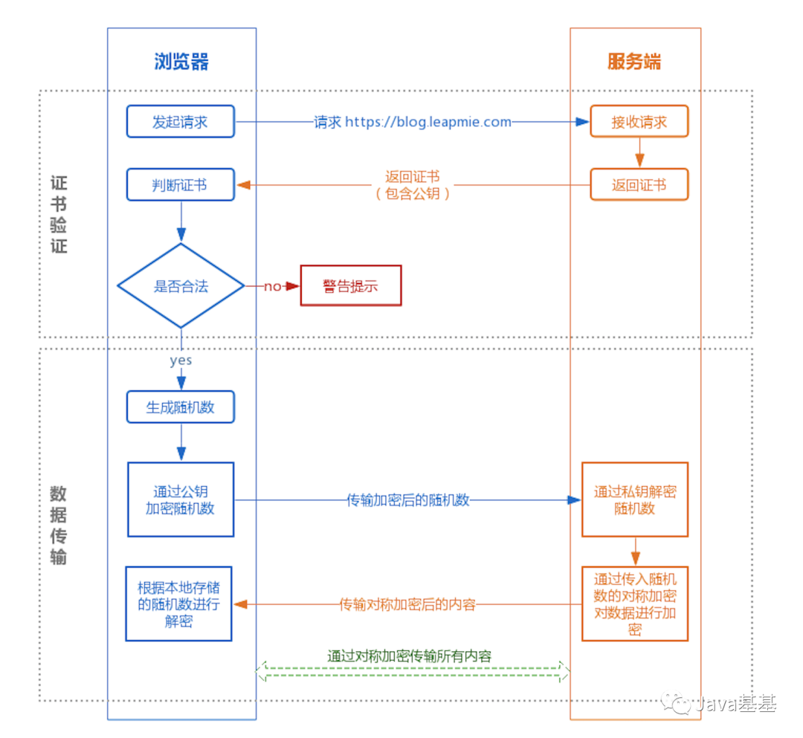
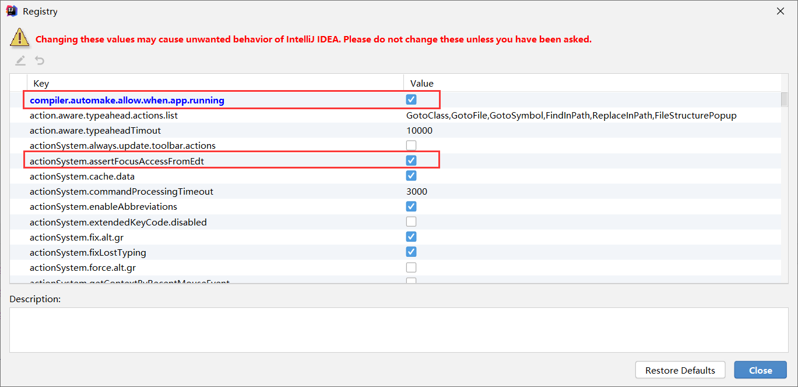
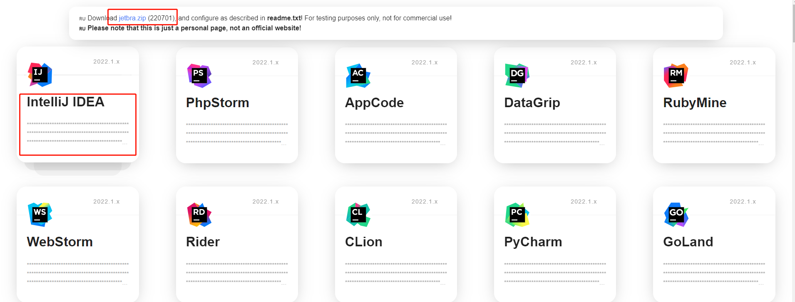
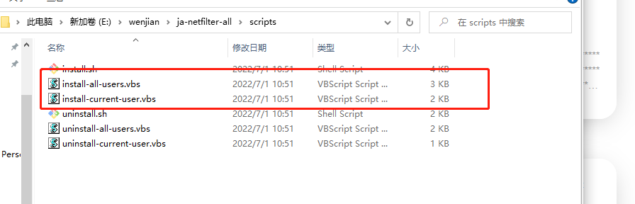

### 取模

```
a % b = a - a / b * b
-10 % 3 = -10 - (-10) / 3 * 3 = -10 + 3 * 3 = -10 + 9 = -1
```


### bit byte 

> **bit：音译为“比特”，指二进制位，由0、1组成；bit 是计算机内存中的最小单位（也称原子单位）；在二进计算机系统中，每 bit 可以代表 0 或 1 的数位讯号。** 

> **Byte：译为“字节”，是计算机系统中最小的存储单位。Byte 是计算机记忆体储存资料的基本单位。当记忆体容量过大时，Byte 这个单位就不够用，因此就有KB\MB\GB等出现。** 
>
> - Byte 可以存储 0-256 范围内的所有整数。
>
>   ```
>   1 Byte 由 8 bits 组成；
>   8 bits 有 256 （2^8）种组合；
>   每种组合分别表示 [0, 255] 范围内的一个整数数字；
>   
>   所以 1Byte 可以存储 [0, 255] 的整数字。
>   ```
>
> - **1个英文字母**(不分大小写)或者 **1个阿拉伯数字(0~9)**通常占1个字节；
>
>   ```
>   1byte，如 01001000 表示英文字母 H 。
>   ```
>
> + **1个中文汉字**通常占2个字节； 
>
> - **标点符号：英文标点符号**占1个字节，**中文标点符号**占2个字节。


### 为什么int 8的取值范围是-128 - 127

```
int8占1个字节,1字节(byte)占8位(bit)

[正负号][][][][][][][]

其中最高位代表符号位 1-负号；0-正号，所以还有7位，2^7=128
本应该 -128 ~ 128，但是0算在了正数里面，所以 -128 ~ 127

如果是uint8(8bit无符号-没有负数) 2^8 = 256
0 占一个数 ，所以最大是255
```


### CRM与ERP

参考：[CRM与ERP](http://baijiahao.baidu.com/s?id=1653409772927548267&wfr=spider&for=pc)


### VO、DTO、DO、PO的概念

参考：[VO、DTO、DO、PO的概念](https://blog.51cto.com/14442094/2432008?source=dra)

```
entity是实体类  vo展示类  to入参类  
```


### JAVA 版本

> JAVA SE 标准版开发 主要用于桌面程序,控制台开发(JFC)

> JAVA EE 企业级开发，主要用于web端(JSP,EJB)       

> JAVA ME嵌入式开发(手机,小家电)


### JVM & GC

参考：[一篇文章彻底搞定所有GC面试问题](https://blog.csdn.net/liewen_/article/details/83151227)


**JVM运行时数据区**

```
JVM运行时数据区主要分为：栈、堆、本地方法栈、程序计数器、方法区（jdk8无）、其中栈、本地方法栈、程序计数器，3个区域随线程生灭(因为是线程私有)，不共享数据。而Java堆和方法区则不一样

Java堆：Java虚拟机管理的内存中最大的一块，所有线程共享，几乎所有的对象实例和数组都在这里分配内存。GC主要就是在Java堆中进行的。JVM根据对象存活周期不同，同时也为了提高对象内存分配和垃圾回收的效率，把堆内存划分为几块。
	1.新生代（新生代又分为Eden80%，SurvivorFrom10%，SurvivorTo10%）
	2.老年代经过了多次GC依然存活，不会频繁做GC

流程：
-----------------------------------------------------------------------------------------
1.新生代有一个Eden区和两个survivor区，首先将对象放入Eden区，如果空间不足就向其中的一个survivor区上放，如果仍然放不下就会引发一次发生在新生代的Minor GC，将存活的对象放入另一个survivor区中，然后清空Eden和之前的那个survivor区的内存。在某次GC过程中，如果发现仍然又放不下的对象，就将这些对象放入老年代内存里去。

2.大对象以及长期存活的对象直接进入老年代。

3.触发Minor GC之前，会检查晋升到老年代的对象大小，是否大于老年代剩余空间，如果大于，则直接触发Full GC
-----------------------------------------------------------------------------------------

GC一共分三种：MinorGC,Major GC 和Full GC。Full GC是清理整个堆空间—包括年轻代和永久代。

方法区：对于JVM的方法区，可能听得最多的是另外一个说法——永久代（Permanent Generation），呼应堆的新生代和老年代。在永久代移除后，字符串常量池也不再放在永久代了，但是也没有放到新的方法区---元空间里，而是留在了堆里（为了方便回收？）。运行时常量池当然是随着搬家到了元空间里，毕竟它是装静态变量、字节码等信息的，有它的地方才称得上方法区。

元空间是方法区的在HotSpot jvm 中的实现，方法区主要用于存储类的信息、常量池、方法数据、方法代码等。方法区逻辑上属于堆的一部分，但是为了与堆进行区分，通常又叫“非堆”。元空间的本质和永久代类似，都是对JVM规范中方法区的实现。不过元空间与永久代之间最大的区别在于：元空间并不在虚拟机中，而是使用本地内存。
```


### JVM中堆和栈的区别

[JVM中堆和栈的区别](https://www.cnblogs.com/benon94/p/10626798.html)

[JVM中堆和栈到底存放了什么](https://www.cnblogs.com/toSeeMyDream/p/5251918.html)


### JVM调优

参考：[JVM调优](https://youzhixueyuan.com/jvm-performance-optimization.html)  // TODO 还有查看dump文件


### JAVA8 的Stream API使用

参考：[JAVA8 的Stream API使用](https://www.cnblogs.com/jimoer/p/10995574.html)


### JAVA静态资源什么时候加载和执行

当类第一次被调用时加载（静态方法，静态属性的加载就是类加载）。 

>1. 类中的静态属性会被加入到类对象（也可以叫做类的模板，是类的描述） 的构造器中，静态方法也会被加入到类对象中。 
>2. 当第一次使用类时，JVM会通过类加载器，加载类对象，从而初始化静态属性，并装入类的方法，包括静态方法和实例方法（方法不会被调用，只是加载，从这个意义上来说，静态方法和实例方法是类似的）。 
>3. 当创建类的实例对象时，JVM会调用类的构造器，从而初始化类的属性。

 类（包括静态方法、属性）加载过程： 

> 1. 加载： 将class字节码文件加载到内存中，并将这些数据转换成方法区中的运行时数据（静态变量、静态代码块、常量池等），在堆中生成一个Class类对象代表这个类（反射原理），作为方法区类数据的访问入口。 
> 2. 连接： 将Java类的二进制代码合并到JVM的运行状态之中。
>    1. 验证：确保加载的类信息符合JVM规范，没有安全方面的问题。 
>    2. 准备：正式为类变量(static变量)分配内存并设置类变量初始值的阶段，这些内存都将在方法区中进行分配。注意此时的设置初始值为默认值，具体赋值在初始化阶段完成。 
>    3. 解析：虚拟机常量池内的符号引用替换为直接引用（地址引用）的过程。 
> 3. 初始化： 初始化阶段是执行类构造器<clinit>()方法的过程。类构造器<clinit>()方法是由编译器自动收集类中的所有类变量的**赋值**动作和**静态语句块(static块)**中的语句合并产生的。 
>    1. 当初始化一个类的时候，如果发现其父类还没有进行过初始化、则需要先初始化其父类。
>    2. 虚拟机会保证一个类的<clinit>()方法在多线程环境中被正确加锁和同步。

> 静态内部类单例模式中实例由内部类创建，由于JVM在加载外部类的过程中，是不会加载静态内部类的，只有内部类的属性/方法被调用时才会被加载，并初始化其静态属性。静态属性由于被static修饰，保证只被实例化一次，并且严格保证实例化顺序。


### JAVA反射机制

参考：[JAVA反射机制](https://www.cnblogs.com/hechenhao/p/8039639.html)  [JAVA反射机制](https://blog.csdn.net/liujiahan629629/article/details/18013523?depth_1-utm_source=distribute.pc_relevant.none-task&utm_source=distribute.pc_relevant.none-task)  

```java
private static object getFieldValueByName(String fieldName, object o) throws Exception {
	String firstLetter = fieldName.substring(0,1).toUpperCase() ;
	String getter = "get" + firstLetter + fieldName.substring(1);
	Method method = o.getClass().getMethod(getter, new Class[] {});
	Object value = method.invoke(o, new Object[] {});
    System.out.println("fieldName>>>>>>"+filedName+" val: "+String.valueOf(value));
	return value;
}
```


### JAVA IO流

参考：[JAVA IO流](https://blog.csdn.net/qq_37875585/article/details/89385688)


### JAVA注解与元注解

参考：[JAVA注解与元注解](https://blog.csdn.net/pengjunlee/article/details/79683621)  [JAVA注解+反射机制](https://baijiahao.baidu.com/s?id=1612408653409570352&wfr=spider&for=pc)  [JAVA框架常用注解](https://www.jianshu.com/p/a4db04398df6)


### JDBC面试题

参考：[JDBC面试题](https://www.cnblogs.com/kevinf/p/3705148.html)


### MyBatis面试题

参考：[MyBatis面试题](https://blog.csdn.net/a745233700/article/details/80977133)


### SpringMVC与Struts2对比

参考：[SpringMVC与Struts2区别与比较总结](https://blog.csdn.net/jishuizhipan/article/details/79385190)


### SpringMVC面试题

参考：[ SpringMVC面试题](https://blog.csdn.net/a745233700/article/details/80963758?depth_1-utm_source=distribute.pc_relevant.none-task&utm_source=distribute.pc_relevant.none-task)


### SpringBoot+SpringCloud

参考：[SpringBoot+SpringCloud面试题整理](https://blog.csdn.net/qq_40117549/article/details/84944840?depth_1-utm_source=distribute.pc_relevant.none-task&utm_source=distribute.pc_relevant.none-task ) 


### 彻底搞清拦截器和过滤器的区别

参考:   [彻底搞清拦截器和过滤器的区别](https://blog.csdn.net/longzhongxiaoniao/article/details/85727725)  [过滤器，拦截器，监听器的区别](https://www.cnblogs.com/lukelook/p/11079113.html)

```
三者使用场景
三者功能类似，但各有优势，从过滤器--》拦截器--》切面，拦截规则越来越细致，执行顺序依次是过滤器、拦截器、切面。一般情况下数据被过滤的时机越早对服务的性能影响越小，因此我们在编写相对比较公用的代码时，优先考虑过滤器，然后是拦截器，最后是aop。比如权限校验，一般情况下，所有的请求都需要做登陆校验，此时就应该使用过滤器在最顶层做校验；日志记录，一般日志只会针对部分逻辑做日志记录，而且牵扯到业务逻辑完成前后的日志记录，因此使用过滤器不能细致地划分模块，此时应该考虑拦截器，然而拦截器也是依据URL做规则匹配，因此相对来说不够细致，因此我们会考虑到使用AOP实现，AOP可以针对代码的方法级别做拦截，很适合日志功能。
```


### Shiro

参考：[Shiro面试知识点](https://www.jianshu.com/p/e6ca8cd7d823)   [Shiro工作流程](https://www.cnblogs.com/insaneXs/p/10999384.html)   [30分钟如何学会使用Shiro](https://blog.csdn.net/mxw2552261/article/details/79674871)   [SpringBoot+Shiro+Jwt实现登录认证](https://www.jianshu.com/p/9b6eb3308294)

```
1.指定配置文件，配置文件中指定authenticator（认证）类型。初始化生成securityManager，初始化securityManager中的authenticator（认证）和realms（源）。securityManager存储为全局变量。

2.创建或获取subject（用于代表当前用户的实体），线程私有变量，存储于threadlocal上。

3.subject调用login（UsernamePasswordToken）方法，用于模拟用户登录，UsernamePasswordToken代表用户名和密码的抽象。

4.委派给securityManager处理。

5.securityManager委派给初始化时指定的authenticator（认证）真正处理。

6.authenticator循环realms，调用realm中的doGetAuthenticationInfo（用于身份验证）进行身份认证。可继承realm，

重写doGetAuthenticationInfo方法，在其中编写身份认证的业务逻辑。验证失败需抛异常。

7.若需判断用户的角色或权限，调用subject（代表当前用户的实体）的hasroles等方法。

8.委派给securityManager处理。

9.securityManager委派给Authorizator（授权）处理。

10.Authorizator调用realm的doGetAuthorizationInfo方法获取角色和权限，用于比较。
```


### 前端知识点

> js解决乱码问题

```js
window.open('revoke/export?'+'&userName='+encodeURIComponent(this.userName));
```


> 对象使用key

```
p{
	//不换行
	white-space: nowrap
}

var user = {};
user["id"] = 1;
console.log(user); //{id:1}

//另外多提一个知识点
return、break不能终止forEach()循环
```


> 引用JS静态数据

```js
/* js数据 */
let list_data = [
  { id: '1', name: '甲', age: '18' },
  { id: '2', name: '乙', age: '14' },
  { id: '3', name: '丙', age: '22' },
  { id: '4', name: '丙', age: '17' }
];
module.exports = {list_data};

/* 使用数据 */
let datas = require('../../datas/listData');
console.log(typeof datas, datas);

--------------------------------------------------------------------------------

export default function request(){
    console.log("request");
}

//引用
let request = require('../../request');
//使用
request();


```


### 静态资源文件无法访问

```xml
<build>
	<resources>
		<resource>
			<directory>src/main/resources</directory>
		</resource>
	</resources>
</build>
```


### 过滤器和拦截器区别

参考：[过滤器和拦截器区别](https://www.jianshu.com/p/7bd0cad17f23)


### 序列化与反序列化

参考：[序列化与反序列化](https://blog.csdn.net/tree_ifconfig/article/details/82766587 )


### SOAP

参考：[SOAP](https://www.runoob.com/soap/soap-tutorial.html)

```
SOAP 是基于 XML 的简易协议，可使应用程序在 HTTP 之上进行信息交换。
或者更简单地说：SOAP 是用于访问网络服务的协议。
```


> 为什么使用 SOAP？
```
对于应用程序开发来说，使程序之间进行因特网通信是很重要的。

目前的应用程序通过使用远程过程调用（RPC）在诸如 DCOM 与 CORBA 等对象之间进行通信，但是 HTTP 不是为此设计的。RPC 会产生兼容性以及安全问题；防火墙和代理服务器通常会阻止此类流量。

通过 HTTP 在应用程序间通信是更好的方法，因为 HTTP 得到了所有的因特网浏览器及服务器的支持。SOAP就是被创造出来完成这个任务的。

SOAP提供了一种标准的方法，使得运行在不同的操作系统并使用不同的技术和编程语言的应用程序可以互相进行通信。
```


> SOAP语法

```xml
一条 SOAP 消息就是一个普通的 XML 文档，包含下列元素：
    必需的 Envelope 元素，可把此 XML 文档标识为一条 SOAP 消息
    可选的 Header 元素，包含头部信息
    必需的 Body 元素，包含所有的调用和响应信息
    可选的 Fault 元素，提供有关在处理此消息所发生错误的信息
    
<?xml version="1.0"?>
<soap:Envelope
xmlns:soap="http://www.w3.org/2001/12/soap-envelope"
soap:encodingStyle="http://www.w3.org/2001/12/soap-encoding">
    <soap:Header>
    ...
    </soap:Header>

    <soap:Body>
    ...
      <soap:Fault>
      ...
      </soap:Fault>
    </soap:Body>
</soap:Envelope>
```


### TCP/IP协议族

```
计算机设备与网络需要通信，双方就必须基于相同的方法。
比如 何如胎侧到通信目标，由哪一边先发起通信，使用哪种语言进行通信，怎样结束通讯等规则都需要事先确定。不同的硬件、操作系统之间的通讯，所有这一切都需要一种规则，而我们把这种规则成为协议。
例如：TCP、IP、FCP、DNC、HTTP等。像这样把与互联网相关联的协议集合起来称为TPC/IP。
```


### TCP/IP分层管理

```
TCP/IP协议族中最重要的一点就是分层。按层次分别分为：应用层、传输层、网络层、数据链路层。
把TCP/IPf分层化是有好处的，比如，如果互联网只由一个协议统筹，某个地方需要修改设计时，就必须把所有部分整体替换掉。而分层之后只需把变动的层替换掉即可。

应用层：应用层决定了向用户提供应用服务时通信的活动
传输层：传输层对上层应用层，提供处于网络连接中的两台计算机之间的数据传输。
网络层：网络层用来处理在网络上流动数据包，数据包时网络传输的最小数据单位
数据链路层(网络接口层)：用来链接网络硬件部分
```


### TCP/IP通信传输流

```
			  客户端			服务端
			  
应用层		  HTTTP客户端		HTTP服务器
				↕				↕
传输层			 TCP			 TCP
				↕				↕
网络层			  IP			  IP
				↕				↕
数据链路层	    网络			   网络
				↓				↑
				→→→→→→→→→→→→→→→→→
利用TCP/IP协议族进行网络通讯时，会通过分层顺序与对方进行通信，发送端从应用层往下走，接收端从链路层往上走	
				
```


### TCP的三次握手

参考：[TCP的三次握手与四次挥手理解及面试题](https://blog.csdn.net/qq_38950316/article/details/81087809)   [TCP三次握手详细过程](https://blog.csdn.net/huaishu/article/details/93739446)

```
为了准确无误得将数据送达目标处，TCP协议采用了三次握手策略。用TCP协议把数据包送出去后，TCP不会对传送后的情况置之不理，它一定会向对方确认是否成功送达。握手过程中使用了TCP的标志(flag)——SYN(synchronize)和ACK(acknowledgement)

发送端首先发送一个带SYN标志的数据包给对方。接收端收到后，回传一个带有SYN/ACK标志的数据包以示传达确认信息。最后，发送端回传一个带ACK标志的数据包，代表'握手'/结束。

若在握手过程中某个阶段莫名中断，TCP协议会再次以相同的顺序发送相同的数据包。
```


### RPC面试题

参考：[RPC面试题](https://www.cnblogs.com/feifeicui/p/10431529.html )


### Https



参考： [小程序Https理解](https://mp.weixin.qq.com/s/aHPZgNFWYT9d_sbuEAYcIA)   [https加密机制](https://blog.csdn.net/iCode_girl/article/details/108541202)   [https原理](http://www.easemob.com/news/3706)

> 大家可能都听说过 Https 协议之所以是安全的是因为 Https 协议会对传输的数据进行加密，而加密过程是使用了非对称加密实现。但其实，Https 在内容传输的加密上使用的是对称加密，非对称加密只作用在证书验证阶段。 


### WebService面试题

参考：[WebService面试题](https://blog.csdn.net/c99463904/article/details/76018436?depth_1-utm_source=distribute.pc_relevant.none-task-blog-BlogCommendFromBaidu-1&utm_source=distribute.pc_relevant.none-task-blog-BlogCommendFromBaidu-1) 


### 负载均衡

[负载均衡分类](https://www.jianshu.com/p/c48af7936329)

[介绍负载均衡的面试话术](https://blog.csdn.net/yuanaili/article/details/81191408)


### Nginx

参考：[安装](https://www.cnblogs.com/taiyonghai/p/6728707.html)  [Nginx面试](<https://blog.csdn.net/a303549861/article/details/88672901>)

参考：[Nginx是什么 ? 能干嘛 ？](<https://blog.csdn.net/forezp/article/details/87887507>)

参考：[Windows 下Nginx重启项目不重新加载](https://www.cnblogs.com/zjfblog/p/11854946.html) 

```
Nignx是一个开源的、高性能的轻量级的HTTP服务器和反向代理服务器；
Nginx可以作为一个HTTP服务器进行网站的发布处理，另外Nginx可以作为反向代理进行负载均衡的实现。

正向代理、反向代理、负载均衡
```


> 设置请求Host地址(默认Nginx会不要很多信息)

```
location / {
	proxy_set_header Host $host;
	proxy_pass http://gulimalll;
}
```


### Lvs + Keeplived + Nginx

> Lvs

```
LVS是一个开源的软件，可以实现传输层四层负载均衡。LVS是Linux Virtual Server的缩写，意思是Linux虚拟服务器。目前有三种IP负载均衡技术（VS/NAT、VS/TUN和VS/DR）；八种调度算法（rr,wrr,lc,wlc,lblc,lblcr,dh,sh）。
```


> Keeplived

```
LVS可以实现负载均衡，但是不能够进行健康检查，比如一个rs出现故障，LVS 仍然会把请求转发给故障的rs服务器，这样就会导致请求的无效性。keepalive 软件可以进行健康检查，而且能同时实现 LVS 的高可用性，解决 LVS 单点故障的问题，其实 keepalive 就是为 LVS 而生的。
```


```
LVS的负载能力强，因为其工作方式逻辑非常简单，仅进行请求分发，而且工作在网络的第4层，没有流量，所以其效率不需要有过多的忧虑。

LVS基本能支持所有应用，因为工作在第4层，所以LVS可以对几乎所有应用进行负载均衡，包括Web、数据库等。

注意：LVS并不能完全判别节点故障，比如在WLC规则下，如果集群里有一个节点没有配置VIP，将会导致整个集群不能使用。还有一些其他问题，目前尚需进一步测试。

Nginx工作在网路第7层，所以可以对HTTP应用实施分流策略，比如域名、结构等。相比之下，LVS并不具备这样的功能，所以Nginx可使用的场合远多于LVS。并且Nginx对网络的依赖比较小，理论上只要Ping得通，网页访问正常就能连通。LVS比较依赖网络环境。只有使用DR模式且服务器在同一网段内分流，效果才能得到保证。

Nginx可以通过服务器处理网页返回的状态吗、超时等来检测服务器内部的故障，并会把返回错误的请求重新发送到另一个节点。目前LVS和LDirectd 也支持对服务器内部情况的监控，但不能重新发送请求。

比如用户正在上传一个文件，而处理该上传信息的节点刚好出现故障，则Nginx会把上传请求重新发送到另一台服务器，而LVS在这种情况下会直接断掉。Nginx还能支持HTTP和Email（Email功能很少有人使用），LVS所支持的应用在这个电商比Nginx更多。

Nginx同样能承受很高负载并且能稳定运行，由于处理流量受限于机器I/O等配置，所以负载能力相对较差。

Nginx 安装、配置及测试相对来说比较简单，因为有相应的错误日志进行提示。LVS的安装、配置及测试所花的时间比较长，因为LVS对网络以来比较大，很多时候有可能因为网络问题而配置不能成功，出现问题时，解决的难度也相对较大。Nginx本身没有现成的热备方案，所以在单机上运行风险较大，建议KeepAlived配合使用。另外，Nginx可以作为LVS的节点机器使用，充分利用Nginx的功能和性能。当然这种情况也可以直接使用Squid等其他具备分发功能的软件。

具体应用具体分析。如果是比较小型的网站（每日PV小于100万），用户Nginx就完全可以应对，如果机器也不少，可以用DNS轮询。LVS后用的机器较多，在构建大型网站或者提供重要服务且机器较多时，可多加考虑利用LVS。
```


### List Map 

参考：[JAVA中的集合](https://blog.csdn.net/weixin_36027342/article/details/79972399)


### List对象去重

```java
List<String> dataList = list.stream().distinct().collect(Collectors.toList());

//根据id去重
personList=
    personList.stream().collect(Collectors.collectingAndThen(Collectors.toCollection(
                // 利用 TreeSet 的排序去重构造函数来达到去重元素的目的
                // 根据firstName去重
                () -> new TreeSet<>(Comparator.comparing(Person::getName))), ArrayList::new));
```


### List交集并集差集

```java
交集	listA.retainAll(listB)	listA内容变为listA和listB都存在的对象	listB不变
差集	listA.removeAll(listB)	listA中存在的listB的内容去重	listB不变
并集	listA.removeAll(listB)	listA.addAll(listB)	listA存在并集	listB不变

//交集
List<Person> listC = listA.stream().filter(item -> listB.contains(item)).collect(Collectors.toList());

//并集
//先合体
listA.addAll(listB);
//再去重
List<Person> listC = listA.stream().distinct().collect(Collectors.toList());

//差集
List<Person> listC = listA.stream().filter(item -> !listB.contains(item)).collect(Collectors.toList());
```


### CAS 实现自旋锁

参考：[CAS 实现自旋锁](https://www.cnblogs.com/fengzheng/p/9018152.html)

> CAS 是实现自旋锁的基础，CAS 利用 CPU 指令保证了操作的原子性，以达到锁的效果，至于自旋呢，看字面意思也很明白，自己旋转，翻译成人话就是循环，一般是用一个无限循环实现。这样一来，一个无限循环中，执行一个 CAS 操作，当操作成功，返回 true 时，循环结束；当返回 false 时，接着执行循环，继续尝试 CAS 操作，直到返回 true 


### HashMap红黑树

参考：[HashMap红黑树](https://www.jianshu.com/p/2c7a4a4e1f53)   [HashMap理解](https://blog.csdn.net/wenyiqingnianiii/article/details/52204136)


### Tomcat优化

参考：[Tomcat优化](https://www.cnblogs.com/xuwc/p/8523681.html)

```
tomcat设置https端口时,8443和443区别:

1. 8443端口在访问时需要加端口号,相当于http的8080,不可通过域名直接访问,需要加上端口号;https://yuming.com:8443。
2. 443端口在访问时不需要加端口号,相当于http的80,可通过域名直接访问;例:https://yuming.com。

https使用域名访问网站,而不显示端口号?

将端口号设置为443,即可通过域名直接访问网站
```


### Tomcat做成系统服务

参考：[Tomcat做成系统服务](<https://jingyan.baidu.com/article/597a0643680371312b52431a.html>)

一：下载tomcat

二：配置tomcat

1.解压tomcat至自定义目录下。


2.如果电脑上面有多个tomcat的话，请修改一下tomcat服务端口，否则tomcat启动将因为端口冲突会失败。

主要对解压目录下conf/server.xml文件进行修改

```xml
<Server port="9001" shutdown="SHUTDOWN">  
<Connector port="9090" protocol="HTTP/1.1"  connectionTimeout="20000" redirectPort="9061" />  
<Connector port="9081" protocol="AJP/1.3" redirectPort="9061" />
```


3.修改tomcat中bin/目录下的service.bat文件

1) 在文件开头部分添加以下内容

```xml
SET JAVA_HOME=C:\Program Files\Java\jdk1.7.0_67  
SET CATALINA_HOME=D:\server\tomcat  
SET PR_DISPLAYNAME=项目名或其他自定义名称 
```

2) 在文件中找到rem Set default Service name  部分并将内容修改为：

```xml
set SERVICE_NAME=myporject(自定义名称)
```


4.修改bin目录下shutdown.bat和startup.bat文件，在文件开头添加内容：

```xml
SET JAVA_HOME=C:\Program Files\Java\jdk1.7.0_67  
SET CATALINA_HOME=D:\server\tomcat
```


5.添加服务

1)在DOS界面下,进入Tomcat解压目录的bin目录,输入命令:

```windows
service.bat remove tomcat6

service.bat install
```

如果安装成功,会提示:The service 'Tomcat6（或者你修改一后的SERVICE_NAME）' has
been installed


### Maven配置激活Spring Boot配置

参考：[Maven配置激活Spring Boot配置](http://dolszewski.com/spring/spring-boot-properties-per-maven-profile/)


### Maven跳过测试环节打包

```cmd
mvn clean package -Dmaven.test.skip=true

# mvn clean package -Dmaven.test.skip=true -P prod
```


### Maven定义规范

```
	GroupId和ArtifactId被统称为“坐标”是为了保证项目唯一性而提出的，如果你要把你项目弄到maven本地仓库去，你想要找到你的项目就必须根据这两个id去查找。

　　GroupId一般分为多个段，这里我只说两段，第一段为域，第二段为公司名称。域又分为org、com、cn等等许多，其中org为非营利组织，com为商业组织。举个apache公司的tomcat项目例子：这个项目的GroupId是org.apache，它的域是org（因为tomcat是非营利项目），公司名称是apache，ArtifactId是tomcat。
　　
　　比如我创建一个项目，我一般会将GroupId设置为cn.mht，cn表示域为中国，mht是我个人姓名缩写，ArtifactId设置为testProj，表示你这个项目的名称是testProj，依照这个设置，在你创建Maven工程后，新建包的时候，包结构最好是cn.zr.testProj打头的，如果有个StudentDao[Dao层的]，它的全路径就是cn.zr.testProj.dao.StudentDao
```


### Maven中include与exclude

参考：[关于Maven resource配制中include与exclude的关系](https://www.cnblogs.com/tusheng/articles/7641336.html)


### 日期格式问题

1. 后台接受前台日期问题

   一、@DateTimeFormat(pattern = "yyyy-MM-dd")

   二、创建配置类注入Spring中

   ```java
   @Configuration
   public class DateConverterConfig implements Converter<String, Date> {
   
           private static final List<String> formarts = new ArrayList<>(4);
   
           static {
               formarts.add("yyyy-MM");
               formarts.add("yyyy-MM-dd");
               formarts.add("yyyy-MM-dd hh:mm");
               formarts.add("yyyy-MM-dd hh:mm:ss");
           }
   
           @Override
           public Date convert(String source) {
               String value = source.trim();
               if ("".equals(value)) {
                   return null;
               }
               if (source.matches("^\\d{4}-\\d{1,2}$")) {
                   return parseDate(source, formarts.get(0));
               } else if (source.matches("^\\d{4}-\\d{1,2}-\\d{1,2}$")) {
                   return parseDate(source, formarts.get(1));
               } else if (source.matches("^\\d{4}-\\d{1,2}-\\d{1,2} {1}\\d{1,2}:\\d{1,2}$")) {
                   return parseDate(source, formarts.get(2));
               } else if (source.matches("^\\d{4}-\\d{1,2}-\\d{1,2} {1}\\d{1,2}:\\d{1,2}:\\d{1,2}$")) {
                   return parseDate(source, formarts.get(3));
               } else {
                   throw new IllegalArgumentException("Invalid boolean value '" + source + "'");
               }
           }
   
           /**
            * 格式化日期
            *
            * @param dateStr String 字符型日期
            * @param format  String 格式
            * @return Date 日期
            */
           public Date parseDate(String dateStr, String format) {
               Date date = null;
               try {
                   DateFormat dateFormat = new SimpleDateFormat(format);
                   date = dateFormat.parse(dateStr);
               } catch (Exception e) {
   
               }
               return date;
           }
   
       }
   
   ```

2. JSON格式字符串日期问题

   一、@JSONField(format = "yyyy-MM-dd HH:mm:ss")

   二、@JsonFormat(pattern="yyyy-MM-dd",timezone="GMT+8")

   三、JSONArray.toJSONStringWithDateFormat(this,"yyyy-MM-dd HH:mm:ss");


### MyBatis date类型引发问题

date类型在判断非空时，这种写法会引发异常：invalid comparison: java.util.Date and java.lang.String

```xml
<if test="createDate != null and createDate !='' " >  
  date(createDate) = #{createDate}  
</if>
```

正确写法应为：

```xml
<if test="createDate != null" >  
  date(createDate) = date#{createDate}
</if> 
```


### Ajax传输JSON数据

```js
$.ajax({
    url:"/user/export",
    data:JSON.stringify(data),
    type:"post",
    contentType:"application/json",//重点
    success:function(fileName){
        console.log(fileName);
        window.open("../user/downLoad?fileName=" + fileName);
    },error:function(){
    	console.log("失败！");
    }
})
```

```java
@ResponseBody
@RequestMapping(value = "/export")
public void export(@RequestBody JSONObject data){
   	 //将字符串解析成JSONObject对象
}
```


### 跨域 预检请求

参考：[options预检请求](https://blog.csdn.net/ayqy42602/article/details/107663187) 

```
options是预检请求，在真正的请求发送出去之前，
浏览器会先发送一个options请求向服务询问此接口是否允许我访问
浏览器在当前真实请求是**非简单**请求且跨域的情况下会发起options预检请求

什么是简单请求
1.请求方法为get，post，head
2.Content-Type限于(application/x-www-form-urlencoded,mutipart/form-data,text/plain)
3.不可以有自定义请求头如xxx-token等

什么是复杂请求
非简单请求即为复杂请求
1.常见请求方法为 put delete
2.Content-Type为application/json
3.添加自定义http header
```


### Jackson FastJson

参考：[性能差异](https://blog.csdn.net/u013433821/article/details/82905222)

```
Jackson相比json-lib框架，Jackson所依赖的jar包较少，简单易用并且性能也要相对高些。而且Jackson社区相对比较活跃，更新速度也比较快。SpringBoot默认的json解析

Fastjson是一个Java语言编写的高性能的JSON处理器,由阿里巴巴公司开发。无依赖，不需要例外额外的jar，能够直接跑在JDK上。FastJson采用独创的算法，将parse的速度提升到极致，超过所有json库。
FastJson在复杂类型的Bean转换Json上会出现一些问题，可能会出现引用的类型，导致Json转换出错，需要制定引用。有的版本存在高危漏洞，不建议生产使用
```


### POI报表引入pom出现jar包冲突

```xml
<!--POI报表-->
<dependency>
    <groupId>org.apache.poi</groupId>
    <artifactId>poi</artifactId>
    <version>3.6</version>
    <exclusions>
        <exclusion>
            <artifactId>jsp-api</artifactId>
            <groupId>javax.servlet.jsp</groupId>
        </exclusion>
        <exclusion>
            <artifactId>servlet-api</artifactId>
            <groupId>javax.servlet</groupId>
        </exclusion>
    </exclusions>
</dependency>
```

### Excel导出导出 - 阿里巴巴

参考：[官方文档](https://alibaba-easyexcel.github.io/quickstart/read.html)  [Excel导入导出](http://www.pianshen.com/article/4672412475/)  [读取excel读复杂表头文件](https://blog.csdn.net/qq_35219282/article/details/108593454)  [操作详解](https://blog.csdn.net/weixin_46146269/article/details/108287892)  [复杂导出合并单元格](https://blog.csdn.net/Violet_201903027/article/details/105724907)


### Restful风格

```
// 需求:
//   1. 查询
//        * URI: emps
//        * 请求方式: GET
//   2. 添加所有员工信息
//        2.1 显示添加页面:
//                * URI: emp
//                * 请求方式: GET
//        2.2 添加员工
//                * URI: emp
//                * 请求方式: POST
//                * 添加完成后,重定向到 list 页面
//   3. 删除
//        * URI: emp/{id}
//        * 请求方式: DELETE
//   4. 修改操作 (其中 lastName 不可修改!!)
//       4.1 显示修改页面
//              * URI: emp/{id}
//              * 请求方式: GET
//       4.2 修改员工信息
//              * URI: emp
//              * 请求方式: PUT
//              * 完成修改,重定向到 list 页面
```


### 树形结构

```sql
-- Oracle

-- 语法
select * from table 
start ··· with ···
Connent By ···

-- 示例
Select * From DEMO
Start With ID = '00001'
Connect By Prior ID = PID
```


> Java 8处理

```java
List<SagAreaInfoVO> areaList = this.areaService.selectAreaList(new SagAreaInfoVO());
if (CollectionUtils.isEmpty(areaList)) {
    return null;
}

Map<String, List<SagAreaInfoVO>> sub = areaList.stream().filter(node -> !"-1".equals(node.getAreaPid())).collect(Collectors.groupingBy(node -> node.getAreaPid()));
areaList.forEach(node -> node.setChildren(sub.get(node.getAreaId())));
// setChildren为什么可以，是因为引用类型

areaList = areaList.stream().filter(node -> "-1".equals(node.getAreaPid())).collect(Collectors.toList());
```


```java
 	/**
     * 获取该节点的子节点
     * @param nodeId
     * @param data
     * @return
     */
    public List<JSONObject> getChildren(String nodeId,List<JSONObject> data){
        List<JSONObject> child = new ArrayList<JSONObject>();
        for(JSONObject object : data){
            if(nodeId.equals(object.getString("depParent"))){
                child.add(object);
            }
        }
        return child;
    }

    /**
     * 部门树
     * 递归处理   数据库树结构数据->树形json
     * @param nodeId
     * @param nodes
     * @return
     */
    public JSONArray getNodeJson(String nodeId, List<JSONObject> nodes){

        //当前层级当前点下的所有子节点（实战中不要慢慢去查,一次加载到集合然后慢慢处理）
        List<JSONObject> childList = getChildren(nodeId,nodes);
        JSONArray childTree = new JSONArray();
        for (JSONObject node : childList) {
            JSONObject o = new JSONObject();
            o.put("key",node.getString("id"));
            o.put("title",node.getString("depName"));
            JSONArray child = getNodeJson(node.getString("id"),nodes);  //递归调用该方法
            if(!child.isEmpty()) {
                o.put("children",child);
            }
            childTree.fluentAdd(o);
        }
        return childTree;
    }

    /**
     * 部门树
     * @param
     * @return
     */
    public JSONArray findDeptRoleTree(){
        List<JSONObject> data = this.iDeptDao.findDeptRoleTree();
        JSONArray treeData =  getNodeJson("0",data);
        return treeData;
    }

	/*
		select depSerial, depNo, depName, depParent from dt_dep
    */
```


### Git

参考：[Git](https://blog.csdn.net/hellow__world/article/details/72529022)   [配置SSH](https://blog.csdn.net/fighting_tl/article/details/76009639) [如何理解集中式与分布式](https://blog.csdn.net/weixin_42476601/article/details/82290902)   [Git vs SVN 与Git命令](https://www.cnblogs.com/qcloud1001/archive/2018/10/31/9884576.html) [GitHub访问慢](https://blog.csdn.net/bowei026/article/details/107106503/) [SwitchHosts](https://www.cnblogs.com/xiaodongxier/p/tui-jian-yi-gegithub-guo-nei-fang-wen-jia-su-shen.html) Git

> git撤销上次commit的命令方法 

```
git reset --soft HEAD~
```


> git恢复到指定版本

```
git reset --hard 7e1b1626

git push -f origin devpay
```


.git目录中的config文件

```
[core]
	repositoryformatversion = 0
	filemode = false
	bare = false
	logallrefupdates = true
	symlinks = false
	ignorecase = true
[remote "origin"]
	url = http://guoyongchao@192.168.2.211:1010/r/dormitory-management-web.git
	fetch = +refs/heads/*:refs/remotes/origin/*
[branch "master"]
	remote = origin
	merge = refs/heads/master

```


> GitHub访问慢

> 1. 打开hosts文件：C:\Windows\System32\drivers\etc\hosts
> 2. 用记事本等打开都行.粘贴代码保存即可(140.82.112.3 github.com)  [查询域名对应的 IP 地址](https://www.ipaddress.com/) 
> 3. 刷新DNS缓存(ipconfig /flushdns)


### 时间转换多少分钟前、几天前

```js
var minute = 1000 * 60;
var hour = minute * 60;
var day = hour * 24;
var month = day * 30;

//获取个性化时间差 
export function getDateDiff(dateStr){
  let dateTimeStamp = dateStr;// Date.parse(dateStr.replace(/-/gi,"/")); //字符串转换为时间戳
  var now = new Date().getTime();
  var diffValue = now - dateTimeStamp;
  if(diffValue < 0){
      //若日期不符则弹出窗口告之
      console.log("结束日期不能小于开始日期！");
  }
  var yearC = diffValue/(12*month);
  var monthC = diffValue/month;
  var weekC = diffValue/(7*day);
  var dayC = diffValue/day;
  var hourC = diffValue/hour;
  var minC = diffValue/minute;
  let result = null;
  if(yearC >= 1){
      result = parseInt(yearC) + "年前";
  }
  else if(monthC >= 1){
      result = parseInt(monthC) + "个月前";
  }
  else if(weekC>=1){
      result = parseInt(weekC) + "周前";
  }
  else if(dayC>=1){
      result = parseInt(dayC) +"天前";
  }
  else if(hourC>=1){
      result = parseInt(hourC) +"个小时前";
  }
  else if(minC>=1){
      result = parseInt(minC) +"分钟前";
  }else{
      result="刚刚";
  }
  return result;
}
```


### 跨域问题

> **跨域不是请求发不出去，而是服务端正常返回结果后被浏览器拦截返回结果**
> **(浏览器为了防止非同源的请求 拿到服务器的返回数据结果)**

```js
1.JSONP	-- 原理就是利用了script标签，添加了一个script标签，利用标签特性达到跨域加载资源的效果。
    JSONP由两部分组成，回调函数和数据
    优点：
    （1）兼容性好，在多古老的浏览器都能运行。
    （2）能直接访问响应文本，支持在浏览器与服务器之间双向通信。
    缺点：
    （1）只支持GET请求，不支持POST请求；
    （2）不够安全。因为JSONP是从其他域中加载代码执行，如果其他域不安全，可能会在响应中带有恶意代码。
    （3）不容易确认请求是否失败。
    
    //jsonp请求，默认携带callback参数，方法回调success上面
    //http://localhost:9090/student?callback=jQuery172022456231109176& =1483893661922
     $.ajax({
         url: "http://localhost:9090/student",
         type: "GET",
         dataType: "jsonp", //指定服务器返回的数据类型
         success: function (data) {
             var result = JSON.stringify(data); //json对象转成字符串
         }
     });
    
2、CORS -- 跨站资源共享，它是跨域的官方解决方案，升级版的JSONP。
	原理是使用自定义的HTTP头部让浏览器与服务器进行沟通，从而决定请求或响应是应该成功还是失败。请求和响应都	不包含cookie信息。
	CORS需要浏览器和后院同时支持，浏览器会自动进行CORS通信，实现CORS通信的关键是后端，只要后端实现了		CORS，就实现了跨域，服务端设置Access-Control-Allow-Origin 就可以开启CORS，该属性表示哪些域名可	以访问资源，如果设置通配符则表示所有网站都可以访问资源。
```


https://blog.csdn.net/WayneLee0809/article/details/100930245)


### GET和POST两种基本请求方法的区别

参考：[GET和POST两种基本请求方法的区别](http://cnblogs.com/songanwei/p/9387815.html)

```
除了一些常见的区别，他们在请求速度上也会所区别，
GET产生一个TCP数据包；POST产生两个TCP数据包。
对于GET方式的请求，浏览器会把http header和data一并发送出去，服务器响应200（返回数据）；
而对于POST，浏览器先发送header，服务器响应100 continue，浏览器再发送data，服务器响应200 ok（返回数据）。

也就是说，GET只需要汽车跑一趟就把货送到了，而POST得跑两趟，第一趟，先去和服务器打个招呼“嗨，我等下要送一批货来，你们打开门迎接我”，然后再回头把货送过去。
因为POST需要两步，时间上消耗的要多一点，看起来GET比POST更有效。因此Yahoo团队有推荐用GET替换POST来优化网站性能。但这是一个坑！跳入需谨慎。为什么？
1. GET与POST都有自己的语义，不能随便混用。
2. 据研究，在网络环境好的情况下，发一次包的时间和发两次包的时间差别基本可以无视。而在网络环境差的情况下，两次包的TCP在验证数据包完整性上，有非常大的优点。
3. 并不是所有浏览器都会在POST中发送两次包，Firefox就只发送一次。
```


### 两个数组取差集

```js
let newUser = res.result;
newUser = newUser.filter(a => {
    return !this.lr.peopleData.find(b => {
     	return a.userSerial == b.userSerial   
    })
})
this.lr.peopleData.push(...newUser)
```


### 过滤器与拦截器的区别

参考：[过滤器与拦截器的区别](https://blog.csdn.net/zxd1435513775/article/details/80556034)


过滤器


### 异步和同步、非阻塞和阻塞

> 异步和同步、非阻塞和阻塞区别是什么？

>  + 针对对象不同
>   + 异步和同步针对调用者，调用者发送请求，如果等着对方回应之后才去做其他事情就是同步，如果发送请求之后不等着对方回应就去做其他事情就是异步
>  + 阻塞和非阻塞针对被调用者，被调用者受到请求之后，做完请求任务之后才给出反馈就是阻塞，受到请求之后马上给出反馈然后再去做事情就是非阻塞


### 秒杀架构

> 1. 独立部署
> 2. 秒杀连接加密
> 3. 库存预热
> 4. 动静分离
> 5. 恶意请求拦截
> 6. 流量错峰
> 7. 限流&熔断&降级
> 8. 队列削峰


### MyBatis-Plus

> Mybatis-Plus（简称MP）是一个 Mybatis 的增强工具，在 Mybatis 的基础上只做增强不做改变，为简化开发、提高效率而生 

```
<!--mybatis-plus-->
<dependency>
    <groupId>com.baomidou</groupId>
    <artifactId>mybatis-plus-boot-starter</artifactId>
    <version>3.0.5</version>
</dependency>

<!--mysql-->
<!--mysql6以及以上是com.mysql.cj.jdbc.Driver 并且在url之后要指定时区-->
<!--如果你的配置数据库文件是 com.mysql.jdbc.Driver 这个jar包版本换成5.1.8的-->
<dependency>
    <groupId>mysql</groupId>
    <artifactId>mysql-connector-java</artifactId>
    <version>5.1.8</version>
</dependency>

mapper 继承 BaseMapper<Entity>
```


> 主键生成策略

```java
/*
    AUTO、INPUT、NONE、
    mp自带策略：ID_WORKER(19位数字)、ID_WORKER_STR(19位字符)
*/
@TalbleId(type=IdType.AUTO)
private Loing id;

1.自动增长
	AUTO_INCREMENT
2.UUID
	每次生成随机唯一的值
3.Redis实现
    可以使用Redis集群来获职更高的贡吐里。假如一个集群中有5台Redis.
    可以初始化每台Redis的值分别是1,2,3,4,5,然后步长都是S。备个Redis生成的ID为:
        A: 1,6,11,16,21
        B: 2,7,12,17,22
        C: 1,3,8,13,18,23
        D: 4,9,14,19,24
        E: 5,10,15,20,25
4.mp自带策略
	snowflake算法
	核心思想是:
		使用41bit作为毫秒数，10bit作为机器的ID (5个bit是数据中心，5个bit的机器ID)
		12bit作为毫秒内的流水号意昧着每个节点在每毫秒可以产生4096个ID)
```


> 自动填充

```java
1.在实体类属性添加注解
	@TableField(fill=Field.INSERT)
	private Date createTime;
	@TableField(file=Field.INSERT_UPDATE)
	private Date updateTime;
2.创建类，实现MetaObjectHandle实现接口的方法
    @Component
    public class MyMetaObjectHandler implements MetaObjectHandler {
        //自动填充：执行插入操作
        @Override
        public void insertFill(MetaObject metaObject) {
            this.setFieldValByName("version",1,metaObject);
            this.setFieldValByName("createDateTime",new Date(),metaObject);
            this.setFieldValByName("updateDateTime",new Date(),metaObject);
        }

        //自动填充：执行更新操作
        @Override
        public void updateFill(MetaObject metaObject) {
            this.setFieldValByName("updateDateTime",new Date(),metaObject);
        }
    }
```


> 乐观锁

```
悲观锁 乐观锁是一种思想。

悲观锁这是一种对数据的修改抱有悲观态度的并发控制方式。我们一般认为数据被并发修改的概率比较大，所以需要在修改之前先加锁。但是在效率方面，处理加锁的机制会让数据库产生额外的开销，还有增加产生死锁的机会。使用的话，先将自动提交事务关闭，开启事务，select…for update会把数据给锁住，更新数据，关闭事务

乐观锁在对数据库进行处理的时候，乐观锁并不会使用数据库提供的锁机制。一般的实现乐观锁的方式就是记录数据版本。解决丢失更新，更新时带上版本号条件。使用的话update items set age = 2where id = 1 and version = 3;
```


> 乐观锁：MyBatisPlus实现

```java
1.再实体类属性添加注解
    @Version
    @TableField(fill = FieldFill.INSERT)
    private Integer version;
2.添加乐观锁插件
    @Bean
    public OptimisticLockerInterceptor optimisticLockerInterceptor() {
        return new OptimisticLockerInterceptor();
    }
3.代码实现
    //测试乐观锁：先查询 再修改
    User user = userMapper.selectById(2);
    user.setUserName("二哥");
    int num = userMapper.updateById(user);
    System.out.println(num);
```


> 分页查询

```java
1.添加分页插件
    //分页插件
    @Bean
    public PaginationInterceptor paginationInterceptor() {
        return new PaginationInterceptor();
    }
2.代码实现
    Page<User> userPage = new Page<>(1,3);
    userPage.setDesc("id");
    userMapper.selectPage(userPage,null);

    System.out.println(userPage.getCurrent());
    System.out.println(userPage.getSize());
    System.out.println(userPage.getTotal());
    System.out.println(userPage.getRecords().toString());
```


> 逻辑删除

```java
1.再实体类属性添加注解
    @TableLogic
	private Integer is_delete;
2.添加逻辑删除插件
    @Bean
    public ISqlInjector sqlInjector() {
        return new LogicSqlInjector();
    }
3.实现代码
    //逻辑删除，底层执行的更新操作
    int num = userMapper.deleteById(2);
	//配置逻辑删除插件，查询时会带上is_delete条件，想查询删除的数据，只能通过.xml查询
    List<User> userList = userMapper.selectList(null);
```


> 性能分析

```java
1.添加性能分析插件
    @Bean
    @Profile({"dev","test"})// 设置 dev test 环境开启
    public PerformanceInterceptor performanceInterceptor() {
        PerformanceInterceptor performanceInterceptor = new PerformanceInterceptor();
        performanceInterceptor.setMaxTime(500);//ms，超过此处设置的ms则sql不执行
        performanceInterceptor.setFormat(true);
        return performanceInterceptor;
    }
```


> 复杂查询

```java
//Wrapper实现类
QueryWrapper<User> userQueryWrapper = new QueryWrapper<>();
//查询条件
userQueryWrapper.eq("user_name","采先生i");
//查询需要的字段
userQueryWrapper.select("id","user_name","create_date_time");
//执行查询
List<User> userList = userMapper.selectList(userQueryWrapper);
```


### ES6

> 对象的所有keys,values 返回一个数组

```js
let user = { name:"张三",age:20 };
Object.keys(user);
Object.values(user);
Object.entries(user);
```


> 解构

```js
let user = {name:'张三',age:18}
let {name,age} = user;
```


> 深拷贝

```js
let user = { name:"张三",age:20 };
let user2 = { ..user };
```


> 箭头函数

```js
var f1 = function(m){
	return m;
}
var f2 = m => m;
```


> 模板字符串

```js
let name = '张三';
let str = `我是${name}`;//我是张三

function f1(){
	return '李四'
}
let str = `我是${f1()}`;//我是李四
```


> 巧妙：

```js
var a = "";
console.log(a || '默认值');//当a为空的时候，会输出默认值

printNum(2);
function printNum(num='默认值'){
    console.log(num);//当不传参数时，会输出默认值
}
```


> sort

```js
let fPersons = persons.sort(function(x,y){
    return x-y;//升序
    //reutrn y-x;//降序
})
```


> filter

```js
let fPersons = persons.filter(p => p.name.indexOf())
```


> map 接收一个函数，将原数组中的所有元素用这个函数处理后放入新数组返回。

```js
let fPersons = persons.map(item => ({
	id:item.userId,
	name:item.userName
    //重新定义对象属性的key
}))
```


> reduce 为数组中的每一个元素依次执行回调函数，不包括数组中被删除或从未被赋值的元素

```js
arr.reduce(callback,[initialValue])
1、previousValue (上一次调用回调返回的值，或者是提供的初始值( initialValue) )
2、currentValue (数组中当前被处理的元素)
3、index (当前元素在数组中的索引) 
4、array (调用reduce的数组) 

let arr = [2,-10,30,13];
let result = arr.reduce((a,b)=>{
	console.log("上次处理后:"+a);
	console.log("上次处理后:"+b);
	return a+b;
})
console.log(result);
```


> promise 封装异步操作

```js
function get(url,data){
	return new Promise(resolve,reject) => {
		$.ajax({
			url: url,
			data: data,
			success: function(data){
				resolve(data)''
			},
			error: function(err){
				reject(err);
			}
		})
	}
}

get("mock/user.json")
    .then((data) =>{
        console.log('用户查询成功:'+data);
        return get(`mock/user_score_${data.id}.json`);
    }).then((data)=>{
		console.log('课程查询成功:'+data);
    	return get(`mock/corse_score_${data.id}.json`);
    }).then((data)=>{
    	console.log('课程成绩查询成功:'+data);
	}).catch((err)=>{
    	console.log('出现异常:'+err);
	});
```


> 模块化

参考：[ES6模块花化](https://blog.csdn.net/qq_33295794/article/details/75338575)

```js
/*es5模块化*/

//创建模块化
const num1 = 1;
const num2 = 2;
module.export = {
	num1,num2
}
//引用模块化
const m = request('./文件名.js');
console.log(m.num1);


/*es6模块化：es6实现模块化操作，不能直接在node.js中直接运行，需要用babel转为ess5*/
//创建模块化
export function fun1(){
    console.log('fun1');
}
export function fun2(){
    console.log('fun2');
}
//引用模块化
import {fun1,fun2} from './文件名.js'
fun1();
fun2();
```


### 阿里云OSS 云存储

参考：[阿里云](https://www.aliyun.com/ )  [学习路径](https://help.aliyun.com/learn/learningpath/oss.html?spm=5176.7933691.1309819.8.7f392a66swxJkC&aly_as=3eLSnC9NS)

#### 直接使用SDK

> 导入pom

```xml
<!-- 阿里云OSS -->
<dependency>
    <groupId>com.aliyun.oss</groupId>
    <artifactId>aliyun-sdk-oss</artifactId>
    <version>3.10.2</version>
</dependency>
```

> 实例代码

```java
@Test
void testOSS() throws FileNotFoundException { 
	// Endpoint以杭州为例，其它Region请按实际情况填写。
    String endpoint = "https://oss-cn-shanghai.aliyuncs.com";
    // 阿里云主账号AccessKey拥有所有API的访问权限，风险很高。强烈建议您创建并使用RAM账号进行API访问或日常运维，请登录RAM控制台创建RAM账号。
    String accessKeyId = "";
    String accessKeySecret = "";

    // 创建OSSClient实例。
    OSS ossClient = new OSSClientBuilder().build(endpoint, accessKeyId, accessKeySecret);

    // 获取文件流
    InputStream inputStream = new FileInputStream("C:\\Users\\peish\\Pictures\\Camera Roll\\头像3.JPG");

    // bucket、fileName、fileStream
    ossClient.putObject("gulimall-ferris", "头像.jpg", inputStream);

    // 关闭OSSClient。
    ossClient.shutdown();

    System.out.println("上传成功...");
}
```


#### spring-cloud阿里巴巴集成OSS

> 导入pom

```xml
<!-- springcloud阿里巴巴集成OSS -->
<dependency>
    <groupId>com.alibaba.cloud</groupId>
    <artifactId>spring-cloud-starter-alicloud-oss</artifactId>
</dependency>
```

> 配置OSS

```properties
spring.cloud.alicloud.access-key=your-ak # 账号
spring.cloud.alicloud.secret-key=your-sk # 密钥
spring.cloud.alicloud.oss.endpoint=***   # 域名
```

> 实例代码

```java
@Autowired
private OSSClient ossClient;

@Test
void testSpringCloudAlibabaOSS() throws FileNotFoundException {
    // 获取文件流
    InputStream inputStream = new FileInputStream("C:\\Users\\peish\\Pictures\\Camera Roll\\头像3.JPG");

    // bucket、fileName、fileStream
    ossClient.putObject("gulimall-ferris", "头像2.jpg", inputStream);

    // 关闭OSSClient。
    ossClient.shutdown();

    System.out.println("上传成功...");
}
```


#### 服务端签名后直传

```
前端
 ↓
自己的服务器(使用oss账号密码生成防伪签名，返回给前端)
 ↓
前端拿到签名，上传文件给阿里云并携带签名
 ↓
阿里云会验证签名，符合才会保存文件
```

>基于spring-cloud阿里巴巴

```java
@Autowired
private OSS ossClient; // 这里要写接口名，OSSClient是它的实现类

@Value("${spring.cloud.alicloud.oss.endpoint}")
private String endpoint;
@Value("${spring.cloud.alicloud.oss.bucket}")
private String bucket;

@Value("${spring.cloud.alicloud.access-key}")
private String accessId;

@RequestMapping("/policy")
public R policy() {
    //https://gulimall-ferris.oss-cn-shanghai.aliyuncs.com/hahaha.jpg
    String host = "https://" + bucket + "." + endpoint; // host的格式为 bucketname.endpoint
    // callbackUrl为 上传回调服务器的URL，请将下面的IP和Port配置为您自己的真实信息。
    //        String callbackUrl = "http://88.88.88.88:8888";
    String format = new SimpleDateFormat("yyyy-MM-dd").format(new Date());
    String dir = format + File.separator; // 用户上传文件时指定的前缀。

    Map<String, String> respMap = null;
    try {
        long expireTime = 30;
        long expireEndTime = System.currentTimeMillis() + expireTime * 1000;
        Date expiration = new Date(expireEndTime);
        PolicyConditions policyConds = new PolicyConditions();
        policyConds.addConditionItem(PolicyConditions.COND_CONTENT_LENGTH_RANGE, 0, 1048576000);
        policyConds.addConditionItem(MatchMode.StartWith, PolicyConditions.COND_KEY, dir);

        String postPolicy = ossClient.generatePostPolicy(expiration, policyConds);
        byte[] binaryData = postPolicy.getBytes("utf-8");
        String encodedPolicy = BinaryUtil.toBase64String(binaryData);
        String postSignature = ossClient.calculatePostSignature(postPolicy);

        respMap = new LinkedHashMap<String, String>();
        respMap.put("accessid", accessId);
        respMap.put("policy", encodedPolicy);
        respMap.put("signature", postSignature);
        respMap.put("dir", dir);
        respMap.put("host", host);
        respMap.put("expire", String.valueOf(expireEndTime / 1000));
        // respMap.put("expire", formatISO8601Date(expiration));


    } catch (Exception e) {
        // Assert.fail(e.getMessage());
        System.err.println(e.getMessage());
    }

    return R.ok().put("data",respMap);
}
```


### Session共享

> cookie受域名限制；子域名共享：JSSESSIONID存放在父域名下（SpringSession更方便解决）

> 1. 客户端cookie存储信息（不安全，传输受限制）
> 2. 服务端tomcat配置session共享（内存限制，10个用户各自1G，100台tomcat，每个tomcat存100G）
> 3. nginx配置hash一致性（固定IP访问固定服务器，服务器压力不平衡，某台服务器宕机，则无法访问）
> 4. redis存储（安全，可扩展，tomcat宕机也没问题，但会增加一次网络调用，修改代码，SpringSession可以解决：JSSESSIONID放在redis中，作用域为父域名下）


#### spring-session

> 能解决父子域名session问题，不同域名需要使用token

> 1. ```xml
>   <!-- spring-session  -->
>   <dependency>
>   <groupId>org.springframework.session</groupId>
>   <artifactId>spring-session-data-redis</artifactId>
>   </dependency>
>   ```
> ```
> 
> ```
>
> ```
> 
> ```
>
> ```
> 
> ```
>
> ```
> 
> ```
>
> ```
> 
> ```
>
> ```
> 
> ```
>
> ```
> 
> ```
>
> ```
> 
> ```
>
> ```
> 
> ```
>
> ```
> 
> ```
>
> ```
> 
> ```
>
> ```
> 
> ```
>
> ```
> 
> 2. ```yml
> 
> ```
>
> ```
> 
> ```
>
> ```
> 
> ```
>
> ```
> 
> ```
>
> ```
> 
> ```
>
> ```
> 
> ```
>
> ```
> # spring-session整合
> spring: 
> session:
> store-type: redis
> ```
>
> 3. ```java
>   // 开启redis 存储session
>   @EnableRedisHttpSession
>   public class Application {
>   public static void main(String[] args) {
>   SpringApplication.run(Application.class, args);
>   }
>   }
>   ```
> ```
> 
> ```
>
> ```
> 
> ```
>
> ```
> 
> ```
>
> ```
> 
> ```
>
> ```
> 
> ```
>
> ```
> 
> ```
>
> ```
> 
> 4. ```java
> /**
> ```
>   * @Author: Cai Peishen
>   * @Date: 2021/3/11 22:41
>   * @Description: 配置cookie作用域和持久化
> **/
> @Configuration
> public class MySessionConfig {
> @Bean
> public CookieSerializer cookieSerializer(){
> DefaultCookieSerializer cookieSerializer = new DefaultCookieSerializer();
> // 明确的指定Cookie的作用域
> cookieSerializer.setDomainName("gulimall.com");
> cookieSerializer.setCookieName("GULIMALL_SESSION");
> return cookieSerializer;
> }
> ```
> 
> ```
>
> ```
> 
> ```
>
> ```
> 
> /**
>            * 自定义序列化机制
>            * 这里方法名必须是：springSessionDefaultRedisSerializer
> */
> @Bean
> public RedisSerializer<Object> springSessionDefaultRedisSerializer(){
> return new GenericJackson2JsonRedisSerializer();
> }
> }
> ```
>
> 5. 核心原理
>
>    + @EnableRedisHttpSession导入RedisHttpSessionConfiguration配置
>
>      1. 给容器中添加了一个组件
>
> SessionRepository ->【RedisOperationsSessionRepository】-> redis操作session。 session的增删改查
>
>      2. SessionRepositoryFilter -> Filter:session 存储过滤器;每个请求过来都必须经过filter
>      
>         + 创建的时候，就自动从容器中获取到了sessionRepository;
>         + 原始的request，response都被包装。SessionRepositoryRequestwrapper，SessionRepositoryResponseWrapper
>         + 以后获取session。request.getSession();
>         + wrappedRequest.getSession( ) -> SessionRepository中获取到的。
>
>
> ```
> 
> ```
>
> ```
> 
> ```
>
> ```
> 
> ```


### 单点登录

参考：[单点登录](https://www.jianshu.com/p/75edcc05acfd)


#### SSO流程

>1. client1访问受保护资源，通过token从redis中获取信息(没有token)，也就获取不到
>
>2. 这时跳转到ssoserver认证中心，并且携带参数redirect_url(访问client1的url)
>
>3. 认证中心判断当前是否曾登录过(认证服务中心的cookie[ssoserver.com域名的cookie])，如果没有跳转到登录界面
>
>4. 登录完成后，生成token存入redis并跳转到redirect_url(client1)同时拼接参数 ?token=
>
>5. 跳到了client1，然后再通过token从redis获取，发现有，则执行业务
>
>6. client2访问受保护资源，通过token从redis中获取信息(没有token，因为上面的步骤token是返回给client1的)，也就获取不到
>
>7. 这时跳转到ssoserver认证中心，并且携带参数redirect_url(访问client2的url)
>
>8. 认证中心判断当前是否曾登录过(认证服务中心的cookie[ssoserver.com域名的cookie])，如果没有跳转到登录界面，如果有则表示曾登陆过，再通过cookie从redis中获取，获取到则表示没有过期
>
>9. 再跳转到client2同时拼接参数 ?token
>
>   
>
>核心： 
>
>	1. 给登录服务器留下登录痕迹 
> 	2. 登录服务器重定向url的时候，要将token信息带上 
> 	3. 其他系统要处理url上的关键token，去redis验证得到登录的信息


### OAuth2

参考：[如何理解OAuth2](http://www.ruanyifeng.com/blog/2019/04/oauth_design.html)  [OAuth 2.0 的四种方式](http://www.ruanyifeng.com/blog/2019/04/oauth-grant-types.html)  

```
单点登录是用户访问A,用户访问B
OAuth2是用户访问A，A去访问B
```


```
JWT，是TOKEN的一种形式，TOKEN说简单了，就是一个秘钥(随机数）。以往的TOKEN，你拿到之后要获取用户信息，需要再去数据库匹配查询，而JWT干脆将用户信息存储在了TOKEN里，你解析就可以获得。所以，两者根本就不是一种东西。

OAUTH2.0是一种授权方式，一种流程规范。比如说你要访问某个论坛，但是你不想重新注册，你想用QQ号登陆！（需要论坛先在QQ开放平台注册），那么你登录的时候，选择QQ，它就会跳转到QQ的登录页面，你登录完，再跳转到论坛。论坛就会获取QQ给的授权信息。我这里只是简单说一下流程，具体会复杂很多。

OAuth2用在使用第三方账号登录的情况(比如使用weibo, qq, github登录某个app)。OAuth2是一个相对复杂的协议, 有4种授权模式, 其中的access code模式在实现时可以使用jwt才生成code, 也可以不用. 它们之间没有必然的联系. 
```


> 微信登陆

```
1.生成二维码
https://open.weixin.qq.com/connect/qrconnect" +
                "?appid=%s" +
                "&redirect_uri=%s" +
                "&response_type=code" +
                "&scope=snsapi_login" +
                "&state=%s" +
                "#wechat_redirect


2.用户扫码会回调一个自定义函数，两个形参code、state
接着根据code获取临时票据,得到accsess_token 和 openid
https://api.weixin.qq.com/sns/oauth2/access_token" +
                    "?appid=%s" +
                    "&secret=%s" +
                    "&code=%s" +
                    "&grant_type=authorization_code
                    
                    
3.拿着得到accsess_token 和 openid，再去请求微信提供固定的地址，获取到扫描人信息
https://api.weixin.qq.com/sns/userinfo" +
                        "?access_token=%s" +
                        "&openid=%s

appid: wxed9954c01bb89b47

# 微信开放平台 appsecret
appsecret: a7482517235173ddb4083788de60b90e

# 微信开放平台 重定向url（guli.shop需要在微信开放平台配置）
redirecturl: http://guli.shop/api/ucenter/wx/callback
```


#### 授权码模式

- ##### 流程

  说明：【A服务客户端】需要用到【B服务资源服务】中的资源

  第一步：【A服务客户端】将用户自动导航到【B服务认证服务】，这一步用户需要提供一个回调地址，以备【B服务认证服务】返回授权码使用。

  第二步：用户点击授权按钮表示让【A服务客户端】使用【B服务资源服务】，这一步需要用户登录B服务，也就是说用户要事先具有B服务的使用权限。

  第三步：【B服务认证服务】生成授权码，授权码将通过第一步提供的回调地址，返回给【A服务客户端】。注意这个授权码并非通行【B服务资源服务】的通行凭证。

  第四步：【A服务认证服务】携带上一步得到的授权码向【B服务认证服务】发送请求，获取通行凭证token。

  第五步：【B服务认证服务】给【A服务认证服务】返回令牌token和更新令牌refresh token。

- ##### 使用场景

  授权码模式是OAuth2中最安全最完善的一种模式，应用场景最广泛，可以实现服务之间的调用，常见的微信，QQ等第三方登录也可采用这种方式实现。
  
  > 为什么OAuth2里面在获取access token之前一定要先获取code，然后再用code去获取access token？
  
  >code 是通过浏览器重定向获取的，你在浏览器地址栏就可以看到，如果这一步不返回code而是直接返回access token，那么这个token其实已经暴露了, 而client拿到code以后换取access token是client后台对认证服务器的访问，不依赖浏览器，access token不会暴露出去

#### 简化模式

- 流程

  说明：简化模式中没有【A服务认证服务】这一部分，全部有【A服务客户端】与B服务交互，整个过程不再有授权码，token直接暴露在浏览器。

  第一步：【A服务客户端】将用户自动导航到【B服务认证服务】，这一步用户需要提供一个回调地址，以备【B服务认证服务】返回token使用，还会携带一个【A服务客户端】的状态标识state。

  第二步：用户点击授权按钮表示让【A服务客户端】使用【B服务资源服务】，这一步需要用户登录B服务，也就是说用户要事先具有B服务的使用权限。

  第三步：【B服务认证服务】生成通行令牌token，token将通过第一步提供的回调地址，返回给【A服务客户端】。

- 使用场景

  适用于A服务没有服务器的情况。比如：纯手机小程序，JavaScript语言实现的网页插件等。

#### 密码模式

- 流程

  第一步：直接告诉【A服务客户端】自己的【B服务认证服务】的用户名和密码

  第二步：【A服务客户端】携带【B服务认证服务】的用户名和密码向【B服务认证服务】发起请求获取token。

  第三步：【B服务认证服务】给【A服务客户端】颁发token。

- 使用场景

  此种模式虽然简单，但是用户将B服务的用户名和密码暴露给了A服务，需要两个服务信任度非常高才能使用。

#### 客户端模式

- 流程

  说明：这种模式其实已经不太属于OAuth2的范畴了。A服务完全脱离用户，以自己的身份去向B服务索取token。换言之，用户无需具备B服务的使用权也可以。完全是A服务与B服务内部的交互，与用户无关了。

  第一步：A服务向B服务索取token。

  第二步：B服务返回token给A服务。

- 使用场景A服务本身需要B服务资源，与用户无关。


### JWT实现Token验证

参考：[JWT](https://www.jianshu.com/p/e88d3f8151db)   [JWT常见问题](https://blog.csdn.net/u013089490/article/details/84443667)  [JWT面试](https://blog.csdn.net/MINGJU2020/article/details/103039418?depth_1-utm_source=distribute.pc_relevant.none-task-blog-BlogCommendFromBaidu-1&utm_source=distribute.pc_relevant.none-task-blog-BlogCommendFromBaidu-1)  Token理解

```
JWT生成的token由三部分组成：
头部：主要设置一些规范信息，签名部分的编码格式就在头部中声明。
载荷：token中存放有效信息的部分，比如用户名，用户角色，过期时间等，但是不要放密码，会泄露！
签名：将头部与载荷分别采用base64编码后，用“.”相连，再加入盐，最后使用头部声明的编码类型进行编
码，就得到了签名。
```


```
1.调用登录接口返回token
2.前端把token放入cookie中(使用插件cnpm install js-cookie)
3.创建前端拦截器，判断cookie里面是否有token字符串，如果有把token字符串放入header(请求头中)
4.根据token值，调用接口根据token获取用户信息，为了首页显示，把返回用户信息放入cookie中
5.首页面显示用户信息，从cookie中获取

jwt生成的token每次请求要携带上,后台解析token就能获取到帐号信息
能很好解决分布式系统中常见的session不同步失效的问题,内容可以自己定义
我们用jwt里时存的是基本信息,JSON格式,只存了用户ID、用户名、昵称
```


> pom.xml

```xml
<!-- JWT-->
<dependency>
    <groupId>io.jsonwebtoken</groupId>
    <artifactId>jjwt</artifactId>
    <version>0.7.0</version>
</dependency>
```


> JWTUtils

```java
package com.atguigu.commonutils;

import io.jsonwebtoken.Claims;
import io.jsonwebtoken.Jws;
import io.jsonwebtoken.Jwts;
import io.jsonwebtoken.SignatureAlgorithm;
import org.springframework.http.server.reactive.ServerHttpRequest;
import org.springframework.util.StringUtils;

import javax.servlet.http.HttpServletRequest;
import java.util.Date;

public class JwtUtils {
    //常量
    public static final long EXPIRE = 1000 * 60 * 60 * 24; //token过期时间
    public static final String APP_SECRET = "ukc8BDbRigUDaY6pZFfWus2jZWLPHO"; //秘钥

    //生成token字符串的方法
    public static String getJwtToken(String id, String nickname){
        String JwtToken = Jwts.builder()
                .setHeaderParam("typ", "JWT")
                .setHeaderParam("alg", "HS256")

                .setSubject("guli-user")
            	//从什么时间计算
                .setIssuedAt(new Date())
            	//过期时间
                .setExpiration(new Date(System.currentTimeMillis() + EXPIRE))
				
            	//设置token主体部分 ，存储用户信息
                .claim("id", id)  
                .claim("nickname", nickname)

                .signWith(SignatureAlgorithm.HS256, APP_SECRET)
                .compact();

        return JwtToken;
    }

    /**
     * 判断token是否存在与有效
     * @param jwtToken
     * @return
     */
    public static boolean checkToken(String jwtToken) {
        if(StringUtils.isEmpty(jwtToken)) return false;
        try {
            Jwts.parser().setSigningKey(APP_SECRET).parseClaimsJws(jwtToken);
        } catch (Exception e) {
            e.printStackTrace();
            return false;
        }
        return true;
    }

    /**
     * 判断token是否存在与有效
     * @param request
     * @return
     */
    public static boolean checkToken(HttpServletRequest request) {
        try {
            String jwtToken = request.getHeader("token");
            if(StringUtils.isEmpty(jwtToken)) return false;
            Jwts.parser().setSigningKey(APP_SECRET).parseClaimsJws(jwtToken);
        } catch (Exception e) {
            e.printStackTrace();
            return false;
        }
        return true;
    }

    /**
     * 根据token字符串获取会员id
     * @param request
     * @return
     */
    public static String getMemberIdByJwtToken(HttpServletRequest request) {
        String jwtToken = request.getHeader("token");
        if(StringUtils.isEmpty(jwtToken)) return "";
        Jws<Claims> claimsJws = Jwts.parser().setSigningKey(APP_SECRET).parseClaimsJws(jwtToken);
        Claims claims = claimsJws.getBody();
        return (String)claims.get("id");
    }
}
```

### 非对称加密RSA介绍 

```
基本原理：同时生成两把密钥：私钥和公钥，私钥隐秘保存，公钥可以下发给信任客户端 

私钥加密，持有私钥或公钥才可以解密 
公钥加密，持有私钥才可解密 

优点：安全，难以破解 

缺点：算法比较耗时，为了安全，可以接受 

历史：三位数学家Rivest、Shamir 和 Adleman 设计了一种算法，可以实现非对称加密。这种算法用他们三 

个人的名字缩写：RSA。
```


### 微信支付接口

通俗来讲，我们就是要和微信进行打交道，你调我API，我调你的API。这里大体思路是先 生成预订单，然后支付完成，但是生成订单需要一些准备条件（code、openId、sign等等）

1. 获取code
2. 通过code获取openId
3. 生成预订单，需要传很多参数（这里的获取sign稍微麻烦了一点），返回与订单信息，然后用户确认支付

```
weixin:
  pay:
    #关联的公众号appid
    appid: wx74862e0dfcf69954
    #商户号
    partner: 1558950191
    #商户key
    partnerkey: T6m9iK73b0kn9g5v426MKfHQH7X8rKwb
    #回调地址
    notifyurl: http://guli.shop/api/order/weixinPay/weixinNotify
    
    
    <dependency>
        <groupId>com.github.wxpay</groupId>
        <artifactId>wxpay-sdk</artifactId>
        <version>0.0.3</version>
    </dependency>
```


>JSAPI支付

参考：[JSAPI支付](https://www.cnblogs.com/wuer888/p/7839139.html)	 [JSAPI支付官网](https://pay.weixin.qq.com/wiki/doc/api/jsapi.php?chapter=7_1)

```
1.统一下单，得到预支付id
其中会用到很多参数，appid mch_id openid sign这些，而openid和sign需要进行一些处理才能得到，
		按照规定将Map的参数转换成一个字符串的形式(字段名=字段值&字段名=字段值)并且进行字段名字典排序
		其实我们最终下单的参数是一个xml的String类型，所以我们还要把那些参数放入Map中转换成xml
```

```
2.组装调起支付的参数
这个步骤其实就是封装参数，预支付id、其他的配置信息sign签名生成请求数据
```

```
3.调起支付
使用jssdk或者h5接口调起支付进行支付，根据支付结果再进行相对应的操作
```


```js
//JS拉取支付
function onBridgeReady(){
   WeixinJSBridge.invoke(
      'getBrandWCPayRequest', {
         "appId":"wx2421b1c4370ec43b",     //公众号名称，由商户传入     
         "timeStamp":"1395712654",         //时间戳，自1970年以来的秒数     
         "nonceStr":"e61463f8efa94090b1f366cccfbbb444", //随机串     
         "package":"prepay_id=u802345jgfjsdfgsdg888",     
         "signType":"MD5",         //微信签名方式：     
         "paySign":"70EA570631E4BB79628FBCA90534C63FF7FADD89" //微信签名 
      },
      function(res){
      if(res.err_msg == "get_brand_wcpay_request:ok" ){
      // 使用以上方式判断前端返回,微信团队郑重提示：
            //res.err_msg将在用户支付成功后返回ok，但并不保证它绝对可靠。
      } 
   }); 
}
if (typeof WeixinJSBridge == "undefined"){
   if( document.addEventListener ){
       document.addEventListener('WeixinJSBridgeReady', onBridgeReady, false);
   }else if (document.attachEvent){
       document.attachEvent('WeixinJSBridgeReady', onBridgeReady); 
       document.attachEvent('onWeixinJSBridgeReady', onBridgeReady);
   }
}else{
   onBridgeReady();
}


//微信小程序
wx.chooseWXPay({
    timestamp: 0, // 支付签名时间戳，注意微信jssdk中的所有使用timestamp字段均为小写。但最新版的支付后台生成签名使用的timeStamp字段名需大写其中的S字符
    nonceStr: '', // 支付签名随机串，不长于 32 位
    package: '', // 统一支付接口返回的prepay_id参数值，提交格式如：prepay_id=***）
    signType: '', // 签名方式，默认为'SHA1'，使用新版支付需传入'MD5'
    paySign: '', // 支付签名
    success: function (res) {
        // 支付成功后的回调函数
    }
});
```


> Native支付

参考：[Native支付](<https://pay.weixin.qq.com/wiki/doc/api/native.php?chapter=9_1>)

1. 使用场景：用户扫描商户展示在各种场景的二维码进行支付。

2. Native支付流程：也称之为扫码支付，是支付指定的商品，所以不需要用户选择商品，客户端直接准备好所有的订单信息，直接调用微信下单API生成预订单，同时接受微信返回的code_url，生成二维码给用户。用户扫码链接，微信会验证该链接有效性，满足的话返回支付授权，也就是拉起支付，输入密码过后，提交授权直接到微信，微信会给予支付的结果，同时也会异步通知客户端。


```

//1 根据订单号查询订单信息
QueryWrapper<Order> wrapper = new QueryWrapper<>();
wrapper.eq("order_no",orderNo);
Order order = orderService.getOne(wrapper);

//2 使用map设置生成二维码需要参数
Map m = new HashMap();
m.put("appid","wx74862e0dfcf69954");
m.put("mch_id", "1558950191");
m.put("nonce_str", WXPayUtil.generateNonceStr());
m.put("body", order.getCourseTitle()); //课程标题
m.put("out_trade_no", orderNo); //订单号
m.put("total_fee", order.getTotalFee().multiply(new BigDecimal("100")).longValue()+"");
m.put("spbill_create_ip", "127.0.0.1");
m.put("notify_url", "http://guli.shop/api/order/weixinPay/weixinNotify\n");
m.put("trade_type", "NATIVE");

//3 发送httpclient请求，传递参数xml格式，微信支付提供的固定的地址
HttpClient client = new HttpClient("https://api.mch.weixin.qq.com/pay/unifiedorder");
//设置xml格式的参数
client.setXmlParam(WXPayUtil.generateSignedXml(m,"T6m9iK73b0kn9g5v426MKfHQH7X8rKwb"));
client.setHttps(true);
//执行post请求发送
client.post();

//4 得到发送请求返回结果
//返回内容，是使用xml格式返回
String xml = client.getContent();

//把xml格式转换map集合，把map集合返回
Map<String,String> resultMap = WXPayUtil.xmlToMap(xml);

//最终返回数据 的封装
Map map = new HashMap();
map.put("out_trade_no", orderNo);
map.put("course_id", order.getCourseId());
map.put("total_fee", order.getTotalFee());
map.put("result_code", resultMap.get("result_code"));  //返回二维码操作状态码
map.put("code_url", resultMap.get("code_url"));        //二维码地址

```


### SOA

```
SOA只是一种架构设计模式，而SOAP、REST、RPC就是根据这种设计模式构建出来的规范，
其中SOAP通俗理解就是http+xml的形式，
REST就是http+json的形式，
RPC是基于socket的形式。
上文提到的CXF就是典型的SOAP/REST框架，dubbo就是典型的RPC框架，而SpringCloud就是遵守REST规范的生态系统。
```


### RPC

```
RPC【Remote Procedure Call】是指远程过程调用，是一种进程间通信方式，他是一种技术的思想，而不是规范。它允许程序调用另一个地址空间（通常是共享网络的另一台机器上）的过程或函数，而不用程序员显式编码这个远程调用的细节。即程序员无论是调用本地的还是远程的函数，本质上编写的调用代码基本相同。

RPC两个核心模块：通讯，序列化
```


### Dubbo + Zookeeper

```
Apache Dubbo是一款高性能、轻量级的开源Java RPC框架，它提供了三大核心能力：面向接口的远程方法调用，智能容错和负载均衡，以及服务自动注册和发现。
阿里2014年停更，后来与当当网的版本DubboX整合，在2018年开源给了apache

特性
1.面向接口代理的高性能RPC调用
2.服务自动注册与发现
3.智能负载均衡
4.高度可扩展
5.运行期间流量调度(多版本)
6.可视化的服务治理与运维
```


> 基本概念

```
服务提供者(Provider): 暴露服务的服务提供方，服务提供者在启动时，向注册中心注册自己提供的服务。

服务消费者(Consumer): 调用远程服务的服务消费方，服务消费者在启动时，向注册中心订阅自己所需的服务，服务消费者，从提供者地址列表中，基于软负载均衡算法，选一台提供者进行调用，如果调用失败，再选另一台调用。

注册中心(Registry): 注册中心返回服务提供者地址列表给消费者，如果有变更，注册中心将基于长连接推送变更数据给消费者

监控中心(Monitor): 服务消费者和提供者，在内存中累计调用次数和调用时间，定时每分钟发送一次统计数据到监控中心
```


> 调用关系

```
1.服务容器负责启动，加载，运行服务提供者。
2.服务提供者在启动时，向注册中心注册自己提供的服务。
3.服务消费者在启动时，向注册中心订阅自己所需的服务。
4.注册中心返回服务提供者地址列表给消费者，如果有变更，注册中心将基于长连接推送变更数据给消费者。
5.服务消费者，从提供者地址列表中，基于软负载均衡算法，选一台提供者进行调用，如果调用失败，再选另一台调用。
6.服务消费者和提供者，在内存中累计调用次数和调用时间，定时每分钟发送一次统计数据到监控中心。
```


> zookeeper宕机与dubbo直连

```
zookeeper注册中心宕机，还可以消费dubbo暴露的服务。

1.监控中心宕掉不影响使用，只是丢失部分采样数据
2.数据库宕掉后，注册中心仍能通过缓存提供服务列表查询，但不能注册新服务
3.注册中心对等集群，任意一台宕掉后，将自动切换到另一台
4.注册中心全部宕掉后，服务提供者和服务消费者仍能通过本地缓存通讯
5.服务提供者无状态，任意一台宕掉后，不影响使用
6.服务提供者全部宕掉后，服务消费者应用将无法使用，并无限次重连等待服务提供者恢复


没有注册中心的dubbo直连

@Reference(url="127.0.0.1:20882")
UserSerice userSerice;
```


> 集群下dubbo负载均衡配置

```
Random LoadBalance
随机，按权重设置随机概率。
在一个截面上碰撞的概率高，但调用量越大分布越均匀，而且按概率使用权重后也比较均匀，有利于动态调整提供者权重。

RoundRobin LoadBalance
轮循，按公约后的权重设置轮循比率。
存在慢的提供者累积请求的问题，比如：第二台机器很慢，但没挂，当请求调到第二台时就卡在那，久而久之，所有请求都卡在调到第二台上。

LeastActive LoadBalance
最少活跃调用数，相同活跃数的随机，活跃数指调用前后计数差。
使慢的提供者收到更少请求，因为越慢的提供者的调用前后计数差会越大。

ConsistentHash LoadBalance
一致性 Hash，相同参数的请求总是发到同一提供者。
当某一台提供者挂时，原本发往该提供者的请求，基于虚拟节点，平摊到其它提供者，不会引起剧烈变动。算法参见：http://en.wikipedia.org/wiki/Consistent_hashing
缺省只对第一个参数 Hash，如果要修改，请配置 <dubbo:parameter key="hash.arguments" value="0,1" />
缺省用 160 份虚拟节点，如果要修改，请配置 <dubbo:parameter key="hash.nodes" value="320" />
```


### WebSocket 

参考：[WebSocket](http://www.ruanyifeng.com/blog/2017/05/websocket.html) [WebSocket](https://www.runoob.com/html/html5-websocket.html)

```
HTTP 协议有一个缺陷：通信只能由客户端发起。

WebSocket它的最大特点就是，服务器可以主动向客户端推送信息，客户端也可以主动向服务器发送信息，是真正的双向平等对话，属于服务器推送技术的一种。
```


### 接口幂等性

> 接口幂等性就是用户对于同一操作发起的一次请求或者多次请求的结果是一致的


### 分布式系统一致性Raft算法

分布式系统中实现一致性的raft算法：[paxos](http://thesecretlivesofdata.com/raft/)


#### token机制

> 1. 服务端提供了发送token的接口。我们在分析业务的时候，哪些业务是存在幂等问题的，就必须在执行业务前，先去获取token，服务器会把token保存到redis中。
> 2. 然后调用业务接口请求时，把token携带过去，一般放在请求头部。
> 3. 服务器判断token是否存在redis中，存在表示第一次请求，然后删除token,继续执行业务。
> 4. 如果判断token不存在redis中，就表示是重复操作，直接返回重复标记给client，这样就保证了业务代码，不被重复执行。
>
> 危险性：
>
> + 先删除token还是后删除token；
>
>   + 先删除可能导致，业务确实没有执行，重试还带上之前token，由于防重设计导致，请求还是不能执行。
>   + 后删除可能导致，业务处理成功，但是服务闪断，出现超时，没有删除token，别人继续重试，导致业务被执行两边
>   + 我们最好设计为先删除token，如果业务调用失败，就重新获取token再次请求。
>
> + Token获取、比较和删除必须是原子性
>
>   + redis.get(token)、token.equals、redis.del(token)如果这两个操作不是原子，可能导致，高并发下，都get到同样的数据，判断都成功，继续业务并发执行
>
>   + 可以在redis使用lua脚本完成这个操作(或者redissson)
>
>     ```lua
>     ifredis.call('get',KEYS[1])==ARGV[1]thenreturnredis.call('del',KEYS[1])elsereturn0end
>     ```


#### 各种锁机制

> + 数据库悲观锁
>
>   select * from tablewhere id = 1 for update;
>   悲观锁使用时一般伴随事务一起使用，数据锁定时间可能会很长，需要根据实际情况选用。另外要注意的是，id字段一定是主键或者唯一索引，不然可能造成锁表的结果，处理起来会非常麻烦。
>
> + 数据库乐观锁：适合在更新的场景中
>
>   update t_goods set count = count -1 , version = version + 1 where good_id=2 and version = 1 
>   根据 version 版本，也就是在操作库存前先获取当前商品的 version 版本号，然后操作的时候 带上此 version 号。 乐观锁主要使用于处理读多写少的问题 。


####  业务层分布式锁 

> 如果多个机器可能在同一时间同时处理相同的数据，比如多台机器定时任务都拿到了相同数 据处理，我们就可以加分布式锁，锁定此数据，处理完成后释放锁。获取到锁的必须先判断 这个数据是否被处理过。 


#### 各种唯一约束 

> + 数据库唯一约束 
>
>   插入数据，应该按照唯一索引进行插入，比如订单号，相同的订单就不可能有两条记录插入。 
>
> +  redis set 防重 
>
>   很多数据需要处理，只能被处理一次，比如我们可以计算数据的 MD5 将其放入 redis 的 set， 每次处理数据，先看这个 MD5 是否已经存在，存在就不处理。 
>
> +  防重表 
>
>   使用订单号 orderNo 做为去重表的唯一索引，把唯一索引插入去重表，再进行业务操作，且 他们在同一个事务中。这个保证了重复请求时，因为去重表有唯一约束，导致请求失败，避免了幂等问题。这里要注意的是，去重表和业务表应该在同一库中，这样就保证了在同一个 事务，即使业务操作失败了，也会把去重表的数据回滚。这个很好的保证了数据一致性。 之前说的 redis 防重也算 
>
> +  全局请求唯一 id 
>
>   调用接口时，生成一个唯一 id，redis 将数据保存到集合中（去重），存在即处理过。 可以使用 nginx 设置每一个请求的唯一 id； proxy_set_header X-Request-Id $request_id; 


### 热部署Devtools

> 1.导入maven依赖

```xml
<dependency>
    <groupId>org.springframework.boot</groupId>
    <artifactId>spring-boot-devtools</artifactId>
    <scope>runtime</scope>
    <optional>true</optional>
</dependency>
```

> 2.工具支持


> 3.再次设置  Ctrl + Shift + Alt + /




### IDEA中设置Run Dashboard

参考：[IDEA中设置Run Dashboard](https://blog.csdn.net/chinoukin/article/details/80577890) 

> 在工程目录下找.idea文件夹下的workspace.xml  ，在其中增加如下组件 

```xml
<component name="RunDashboard">
    <option name="configurationTypes">
        <set>
            <option value="SpringBootApplicationConfigurationType" />
        </set>
    </option>
    <option name="ruleStates">
        <list>
            <RuleState>
                <option name="name" value="ConfigurationTypeDashboardGroupingRule" />
            </RuleState>
            <RuleState>
                <option name="name" value="StatusDashboardGroupingRule" />
            </RuleState>
        </list>
    </option>
</component>
```


### 集成hutool依赖,实现雪花算法工具类


> + 导入依赖
>
>   ```
>   <dependency>
>       <groupId>cn.hutool</groupId>
>       <artifactId>hutool-captcha</artifactId>
>       <version>5.3.9</version>
>   </dependency>
>   ```
>
> + SnowFlakeUtil工具类代码
>
>   ```java
>   package com.myutil.id;
>   
>   import cn.hutool.core.lang.Snowflake;
>   import cn.hutool.core.util.IdUtil;
>   
>   public class SnowFlakeUtil {
>       private long machineId ;
>       private long dataCenterId ;
>   
>   
>       public SnowFlakeUtil(long machineId, long dataCenterId) {
>           this.machineId = machineId;
>           this.dataCenterId = dataCenterId;
>       }
>   
>       /**
>        * 成员类，SnowFlakeUtil的实例对象的保存域
>        */
>       private static class IdGenHolder {
>           private static final SnowFlakeUtil instance = new SnowFlakeUtil();
>       }
>   
>       /**
>        * 外部调用获取SnowFlakeUtil的实例对象，确保不可变
>        */
>       public static SnowFlakeUtil get() {
>           return IdGenHolder.instance;
>       }
>   
>       /**
>        * 初始化构造，无参构造有参函数，默认节点都是0
>        */
>       public SnowFlakeUtil() {
>           this(0L, 0L);
>       }
>   
>       private Snowflake snowflake = IdUtil.createSnowflake(machineId,dataCenterId);
>   
>       public synchronized long id(){
>           return snowflake.nextId();
>       }
>   
>       public static Long getId() {
>           return SnowFlakeUtil.get().id();
>       }
>   
>   }
>   ```
>
> + 使用
>
>   ```java
>   Long id = SnowFlakeUtil.getId();
>   ```
>


### Java泛型中<?>和<T>有什么区别？

参考：[java泛型中<?>和<T>有什么区别?](https://www.cnblogs.com/jpfss/p/9929045.html)   [举例说明](https://blog.csdn.net/weixin_30474613/article/details/101709826)


### Sublime Text3乱码问题

参考：[Sublime Text3乱码问题](https://blog.csdn.net/yanjiangdi/article/details/77869696)


### Sublime Text3禁止打开上次文件

参考：[Sublime Text3禁止打开上次文件](https://jingyan.baidu.com/article/73c3ce2847a638e50343d932.html)

>+ 打开Sublime，点击：Preference->设置 
>+ 弹出窗口就是设置界面，都是代码配置的方式，对功能就行修改 
>+ 左侧是默认的系统设置，右侧才是用户设置。只要右侧配置完毕，即覆盖左侧。这样很好的备份了系统设置，清晰展现了用户自定义的部分。 
>+ 与退出记忆/启动恢复相关的设置项本来有两个，但Sublime Text3现在只有一个了。但还是建议两项对进行修改。在右侧填入"remember_open_files": false,"hot_exit": false,即可 


### Sublime Text3添加到右键快捷菜单

参考：[Sublime Text3添加到右键快捷菜单](https://www.cnblogs.com/leime/p/9441169.html)

> 新建sublime_addright.reg文件 编辑后双击打开就OK 
>
> 注意：括号内是**C:\\**开头是安装路径，**Sublime Text3** 是提示文字 

```
Windows Registry Editor Version 5.00
[HKEY_CLASSES_ROOT\*\shell\SublimeText3]
@="Sublime Text3"
"Icon"="C:\\Program Files\\Sublime Text 3\\sublime_text.exe,0"
[HKEY_CLASSES_ROOT\*\shell\SublimeText3\command]
@="C:\\Program Files\\Sublime Text 3\\sublime_text.exe %1"
[HKEY_CLASSES_ROOT\Directory\shell\SublimeText3]
@="Sublime Text3"
"Icon"="C:\\Program Files\\Sublime Text 3\\sublime_text.exe,0"
[HKEY_CLASSES_ROOT\Directory\shell\SublimeText3\command]
@="C:\\Program Files\\Sublime Text 3\\sublime_text.exe %1"
```


### Sublime Text3右键打开带空格中文路径文件异常解决


### VS Code 舒适代码颜色

> Luke Dark Theme 


### IDEA 舒适代码颜色

> Xcode-Dark 


### IDEA安装插件时搜索不到

参考：[IDEA安装插件时搜索不到,一直在转圈刷新,无法安装](https://blog.csdn.net/qq_41170600/article/details/108537715)


### IDEA格式化代码

参考：[IDEA格式化代码](https://jingyan.baidu.com/article/17bd8e529d627185ab2bb8eb.html) save-action


### IDEA修改java文件后 不用重启Tomcat服务便可自动更新

参考：[IDEA修改java文件后 不用重启Tomcat服务便可自动更新](https://blog.csdn.net/u010865136/article/details/80392212)  [TortoiseGit的ssh key和Git的ssh key](https://www.cnblogs.com/achigwwblog/p/8204572.html)


### spring-boot-data-redis 可能出现的堆外内存移除

```
产生堆外内存溢出:OutOfDirectMemoryError 

springboot2.0以后默认使用Lettuce作为操作redis的客户端。它使用netty进行网络通信
lettuce的bug导致netty堆外内存溢出-Xmx300m; netty如果没有指定堆外内存，默认使用-Xm×300m 可以通过-Dio.netty.maxDirectMemory进行设置
解决方案:不能使用-Dio.netty.maxDirectMemory只去调大堆外内存。
  升级Lettuce客户端
  切换使用jedis
```


### 什么是分库分表

参考：[什么是分库分表](https://blog.csdn.net/qq_35349114/article/details/90484450)


### JetBrains全家桶

> 链接：[工具和破解码](https://jetbra.in/s)  [教程](https://www.jiweichengzhu.com/article/c9a9145dc905413ca6d4b4d02cdc6f07)

> 注意：请选择**安装路径**的exe文件打开，输入激活码，激活成功需要重启







***

技 术 无 他 ，唯 有 熟 尔。
知 其 然		 ，也 知 其 所 以 然。
踏 实 一 些 ，不 要 着 急， 你 想 要 的 岁 月 都 会 给 你。

***