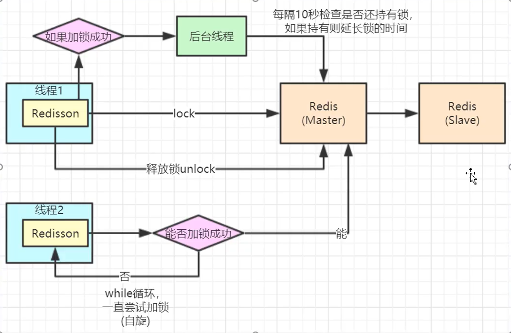
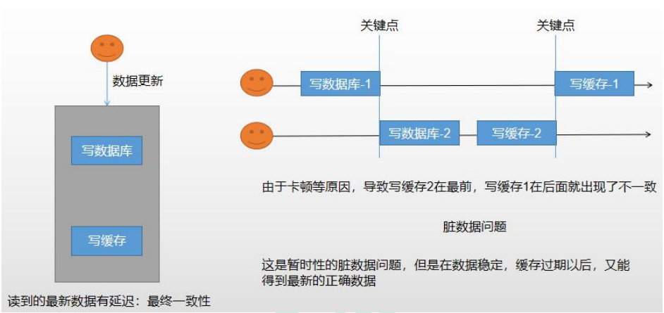
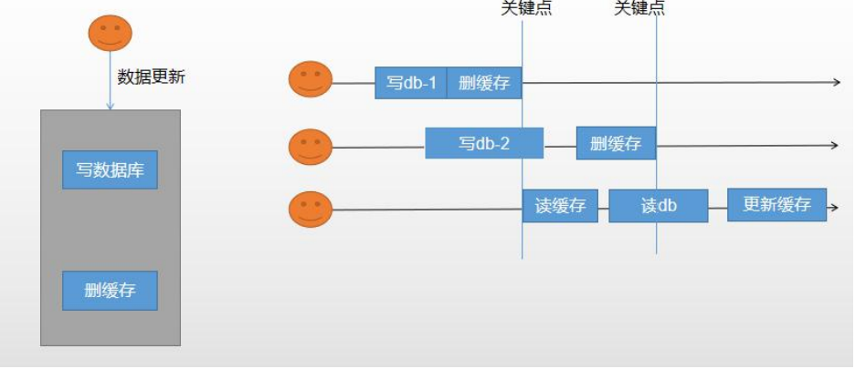
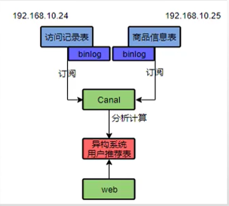

### Redis常见面试题

参考：[几率大的Redis面试题](https://blog.csdn.net/Butterfly_resting/article/details/89668661)  [Redis常见面试题](https://www.cnblogs.com/jasontec/p/9699242.html) [哨兵模式](https://www.jianshu.com/p/06ab9daf921d)


### Redis

> redis.conf

```
Linux中
daemonize no → daemonize yes

redis.conf配置文件中daemonize守护线程，默认是NO

daemonize:yes:redis采用的是单进程多线程的模式。当redis.conf中选项daemonize设置成yes时，代表开启守护进程模式。在该模式下，redis会在后台运行，并将进程pid号写入至redis.conf选项pidfile设置的文件中，此时redis将一直运行，除非手动kill该进程。

daemonize:no: 当daemonize选项设置成no时，当前界面将进入redis的命令行界面，exit强制退出或者关闭连接工具(putty,xshell等)都会导致redis进程退出。
```


> redis密码

```
redis-server
redis-cli -p 6379

ping #出现 PONG

config get requirepass

config set requirepass "123456"

ping #出现 NOAUTH Authentication required

auth 123456

ping #出现 PONG
```


> RDB(Redis DataBase )

```
Redis会单独创建(fork) 一个子进程来进行持久化，会先将数据写入到一个临时文件中，待持久化过程都结束了，再用这个临时文件替换上次持久化好的文件。整个过程中，主进程是不进行任何IO操作的，这就确保了极高的性能
如果需要进行大规模数据的恢复，且对于数据恢复的完整性不是非常敏感，那RDB方式要比AOF方式更加的高效。RDB的缺点是最后一次持久化后的数据可能丢失。

flushall和shutdown 都会触发rdb备份，如果执行该命令前使用了flushall那么数据备份的将是空数据库

dump.rdb

# 默认备份配置
save 60  10000 	# 1分钟内改了1万次
save 300 10		# 5分钟内改了10次
save 900 1		# 15分钟内改了1次
save ""			# 禁用

save命令可以立即备份

优势：适合大规模数据恢复、对数据的完整性和一致性要求不高
劣势：在一定时间做一次备份，所以如果redis意外down掉的话，就会丢失最后一次快照的所有修改、Fork的时候，复制进程，内存相当于扩大了一倍，需要考虑服务器的压力
```


> AOF(Append Only File)

```
以日志的形式来记录每个写操作，将Redis执行过的所有写指令记录下来(读操作不记录)，只许追加文件但不可以改写文件，redis启动之初会读取该文件重新构建数据
换言之，redis重启的话就根据日志文件的内容将写指令从前到后执行一次以完成数据的恢复工作

appendonly.aof

#打开apf备份
appendonly yes

#格式化AOF文件(去除杂乱代码)
redis-check-aof --fix appendonly.aof
#格式化RDB文件
redis-check-dump --fix dump.rdb

Appendsync：
	Always：同步持久化 每次发生数据变更会被立即记录到磁盘  性能较差但数据完整性比较好
	Everysec：出场默认推荐，异步操作，每秒记录，如果一秒内宕机，有数据丢失
	No：从不同步

重写
AOF采用文件追加方式，文件会越来越大为避免出现此种情况，新增了重写机制,当AOF文件的大小超过所设定的阈值时，Redis就会启动AOF文件的内容压缩，只保留可以恢复数据的最小指令集.可以使用命令bgrewriteaof

重写原理
AOF文件持续增长而过大时，会fork出一条新进程来将文件重写(也是先写临时文件最后再rename)，
遍历新进程的内存中数据，每条记录有一条的Set语句。重写aof文件的操作，并没有读取旧的aof文件，
而是将整个内存中的数据库内容用命令的方式重写了一个新的aof文件，这点和快照有点类似

触发机制
Redis会记录上次重写时的AOF大小，默认配置是当AOF文件大小是上次rewrite后大小的一倍且文件大于64M时触发
```


> 主从复制

```
行话：也就是我们所说的主从复制，主机数据更新后根据配置和策略，
自动同步到备机的master/slaver机制，Master以写为主，Slave以读为主，实现读写分离、容灾恢复

info replication #查看redis信息状态

怎么用
	配从不配主
	从库配置：SLAVEOF 主库IP 主库端口
	修改配置文件细节操作
	常用三招：
        一主二仆（主机挂掉，从机还是从机；从机挂掉，直接变成新主机。中心化严重）
        薪火相传
        反客为主(SLAVEOF no one使当前数据库停止与其他数据库的同步，转成主数据库)

复制原理
	slave启动成功连接到master后会发送一个sync命令
    Master接到命令启动后台的存盘进程，同时收集所有接收到的用于修改数据集命令，
    在后台进程执行完毕之后，master将传送整个数据文件到slave,以完成一次完全同步
    全量复制：而slave服务在接收到数据库文件数据后，将其存盘并加载到内存中。
    增量复制：Master继续将新的所有收集到的修改命令依次传给slave,完成同步
    但是只要是重新连接master,一次完全同步（全量复制)将被自动执行
```


> 哨兵模式(sentinel)

```
是什么
	反客为主的自动版，能够后台监控主机是否故障，如果故障了根据投票数自动将从库转换为主库

怎么玩
	自定义的/myredis目录下新建sentinel.conf文件，名字绝不能错
	sentinel.conf内容： sentinel monitor 被监控主库(自己起名字) 127.0.0.1 6379 1
	上面最后一个数字1，表示主机挂掉后salve投票看让谁接替成为主机，得票数多少后成为主机
	redis-sentinel /myredis/sentinel.conf 
```


### Redis缓存

SpringBoot与Redis整合

> pom.xml配置

```pom.xml
<!-- redis -->
<dependency>
    <groupId>org.springframework.boot</groupId>
    <artifactId>spring-boot-starter-data-redis</artifactId>
</dependency>

<!-- spring2.X集成redis所需common-pool2-->
<dependency>
    <groupId>org.apache.commons</groupId>
    <artifactId>commons-pool2</artifactId>
    <version>2.6.0</version>
</dependency>
```


> application.properties配置

```properties
spring.redis.host=127.0.0.1
spring.redis.port=6379
spring.redis.database=0
spring.redis.timeout=1800000

spring.redis.lettuce.pool.max-active=20
spring.redis.lettuce.pool.max-wait=-1
#最大阻塞等待时间(负数表示没限制)
spring.redis.lettuce.pool.max-idle=5
spring.redis.lettuce.pool.min-idle=0
```


> Redis缓存配置类

```java
@EnableCaching //开启缓存
@Configuration  //配置类
public class RedisConfig extends CachingConfigurerSupport {

    @Bean
    public RedisTemplate<String, Object> redisTemplate(RedisConnectionFactory factory) {
        RedisTemplate<String, Object> template = new RedisTemplate<>();
        RedisSerializer<String> redisSerializer = new StringRedisSerializer();
        Jackson2JsonRedisSerializer jackson2JsonRedisSerializer = new Jackson2JsonRedisSerializer(Object.class);
        ObjectMapper om = new ObjectMapper();
        om.setVisibility(PropertyAccessor.ALL, JsonAutoDetect.Visibility.ANY);
        om.enableDefaultTyping(ObjectMapper.DefaultTyping.NON_FINAL);
        jackson2JsonRedisSerializer.setObjectMapper(om);
        template.setConnectionFactory(factory);
        //key序列化方式
        template.setKeySerializer(redisSerializer);
        //value序列化
        template.setValueSerializer(jackson2JsonRedisSerializer);
        //value hashmap序列化
        template.setHashValueSerializer(jackson2JsonRedisSerializer);
        return template;
    }

    @Bean
    public CacheManager cacheManager(RedisConnectionFactory factory) {
        RedisSerializer<String> redisSerializer = new StringRedisSerializer();
        Jackson2JsonRedisSerializer jackson2JsonRedisSerializer = new Jackson2JsonRedisSerializer(Object.class);
        //解决查询缓存转换异常的问题
        ObjectMapper om = new ObjectMapper();
        om.setVisibility(PropertyAccessor.ALL, JsonAutoDetect.Visibility.ANY);
        om.enableDefaultTyping(ObjectMapper.DefaultTyping.NON_FINAL);
        jackson2JsonRedisSerializer.setObjectMapper(om);
        // 配置序列化（解决乱码的问题）,过期时间600秒
        RedisCacheConfiguration config = RedisCacheConfiguration.defaultCacheConfig()
                .entryTtl(Duration.ofSeconds(600))
                .serializeKeysWith(RedisSerializationContext.SerializationPair.fromSerializer(redisSerializer))
                .serializeValuesWith(RedisSerializationContext.SerializationPair.fromSerializer(jackson2JsonRedisSerializer))
                .disableCachingNullValues();
        RedisCacheManager cacheManager = RedisCacheManager.builder(factory)
                .cacheDefaults(config)
                .build();
        return cacheManager;
    }
}
```


> SpringBoot缓存注解

```
//key加上单引号
@Cacheable(key="'getUserList'",value="userList")
根据方法对其方法结果进行缓存，下次请求时，如果缓存存在，则直接读取缓存数据返回；如果缓存不存在，则执行方法， 并将返回结果存入缓存中。一般用在查询方法上。

@CachePut
使用该注解标志的方法，每次都会执行并将结果存入指定的缓存中。其他方法可以直接从响应的缓存中读取缓存数据，
而不需要再去查询数据库。一般用在新增方法上。

@CacheEvict
使用该注解标志的方法，会清空指定的缓存，一般用在更新或者删除方法上。allEntries清空所有缓存属性
```


### 高并发三种情况

> + 缓存穿透 -> 布隆过滤器/设置null和过期时间
> + 缓存击穿 -> 加锁，只让一个人查
> + 缓存雪崩 -> 过期时间+随机时长

#### 缓存穿透->布隆过滤器

参考：[布隆过滤器](https://www.cnblogs.com/luxianyu-s/p/12686466.html)  [删除布隆元素](https://www.jianshu.com/p/3caa28a14019)

> 使用场景

```
判断给定数据是否存在：
	比如判断一个数字是否在于包含大量数字的数字集中（数字集很大，5亿以上！）
	防止缓存穿透（判断请求的数据是否有效避免直接绕过缓存请求数据库）
	邮箱的垃圾邮件过滤
	黑名单功能
去重：比如爬给定网址的时候对已经爬取过的 URL去重。
```

> 删除布隆元素

> 上面的布隆过滤器我们知道，判断一个元素存在就是判断对应位置是否为1来确定的，但是如果要删除掉一个元素是不能直接把1改成0的，因为这个位置可能存在其他元素，所以如果要支持删除，那我们应该怎么做呢？最简单的做法就是加一个计数器，就是说位数组的每个位如果不存在就是0，存在几个元素就存具体的数字，而不仅仅只是存1，那么这就有一个问题，本来存1就是一位就可以满足了，但是如果要存具体的数字比如说2，那就需要2位了，所以带有计数器的布隆过滤器会占用更大的空间。
>
> ```xml
> <dependency>
>      <groupId>com.baqend</groupId>
>      <artifactId>bloom-filter</artifactId>
>      <version>1.0.7</version>
> </dependency>
> ```
>
> ```java
> import orestes.bloomfilter.FilterBuilder;
> 
> public class CountingBloomFilter {
>      public static void main(String[] args) {
>          orestes.bloomfilter.CountingBloomFilter<String> cbf = new FilterBuilder(10000,
>                  0.01).countingBits(8).buildCountingBloomFilter();
> 
>          cbf.add("zhangsan");
>          cbf.add("lisi");
>          cbf.add("wangwu");
>          System.out.println("是否存在王五：" + cbf.contains("wangwu")); //true
>          cbf.remove("wangwu");
>          System.out.println("是否存在王五：" + cbf.contains("wangwu")); //false
>      }
> }
> ```
>
> 构建布隆过滤器前面2个参数一个就是期望的元素数，一个就是fpp值，后面的countingBits参数就是计数器占用的大小，这里传了一个8位，即最多允许255次重复，如果不传的话这里默认是16位大小，即允许65535次重复。


#### 缓存击穿->加锁

##### 使用redis

> 业务代码

```java
public void stock() {
    String lockKey = "product_001";
    // 防止高并发引起当前请求还未走到delete(lockKey)方法，但下一次请求已经发送过来，下次请求setIfAbsent()会失败
	String cliendId = UUID.randomUUID().toString();
    try{
        int n = 10;
        // 如果不存在再赋值，同时n秒的存活时间(防止应用程序重启时，造成死锁)
        Boolean result = stringRedisTemplate.opsForValue().setIfAbsent(lockKey, clientId, n, TimeUnit.SECONDS);
        if (!result){
            return "error";
        }
        
        // 如果害怕方法执行时间过长，需要开启子线程定时器，检查锁，并给锁续命
        // 步骤繁琐，所以可以采用redisson解决，入下方模块
        
        int stock = Integer.parseInt(stringRedisTemplate.opsForValue().get("stock"));// jedis.get("stock")
        if (stock > 0){
            int realStock = stock - 1;
            stringRedisTemplate.opsForValue().set("stock", realStock + "");// jiedis.set(key, value)
            System.out.println("扣减成功，剩余库存:" +realStock +"");
        }else {
            System.out.println("扣减失败,库存不足");
        }
    } finally {
        if (clientId.equals(stringfedisTemplate.opsForValue().get(lockKey))){
        	//释放锁
        	stringRedisTemplate.delete(lockKey);
        }
    }
    return "end";
}

```


##### 使用redisson

> + 保证操作的原子性：Lua脚本
> + 看门狗机制：自动续期



> pom依赖

```xml
<dependency>
	<groupId>org.redisson</groupId>
    <artifactId>redisson</artifactId>
    <version>3.6.5</vesion>
</dependency>
```


> 配置中心

```java
@Bean
public Redisson redisson(){
    //此为单机模式
    Config config = new Config();
    config.useSingleServer().setAddress("redirs://127.0.0.1:6379").setDatabase(O);
    return (Redisson) Redisson.create(config);
}
```


> 业务代码

```java
@Autowired
private Redisson redisson;

/**
	* RLock锁有看门狗机制 会自动帮我们续期，默认30s自动过期
	* lock.lock(10,TimeUnit.SECONDS); 设置过期时间不会自动续期，同时锁的时间一定要大于业务的时间 否则会出现没有锁住（当前业务没有执行完，锁自动过期了，并发请求就会出现没有锁住）
	* <p>
	* 1.如果我们传递了锁的超时时间就给redis发送超时脚本 默认超时时间就是我们指定的
	* 2.如果我们未指定，就使用 30 * 1000 [LockWatchdogTimeout]
    *   只要占锁成功 就会启动一个定时任务 任务就是重新给锁设置过期时间 这个时间还是 [LockWatchdogTimeout] 的时间 1/3 看门狗的时间续期一次 续成满时间
	*   最佳实战：lock.lock(30,TimeUnit.SECONDS);省掉了整个续期操作，超30秒肯定数据库或者代码有问题
	*/
public void stock() {
    String lockKey = "product_001";
    // 防止高并发引起当前请求还未走到delete(lockKey)方法，但下一次请求已经发送过来，下次请求setIfAbsent()会失败
	String cliendId = UUID.randomUUID().toString();
	RLock redissonLock = redisson.getLock(lockKey):
    try{
        redissonLock.lock(30, TimeUnit.SECONDS);
        int stock = Integer.parseInt(stringRedisTemplate.opsForValue().get("stock"));// jedis.get("stock")
        if (stock > 0){
            int realStock = stock - 1;
            stringRedisTemplate.opsForValue().set("stock", realStock + "");// jiedis.set(key, value)
            System.out.println("扣减成功，剩余库存:" +realStock +"");
        }else {
            System.out.println("扣减失败,库存不足");
        }
    } finally {
        redissonLock.lock(lockKey);
    }
    return "end";
}

```


### 缓存一致性

#### 双写模式




#### 失效模式



#### Canal中间件


##### Canal解决数据异构

> 分局binlog，分析购物车表，浏览记录表，计算出用户推荐表(首页浏览)

