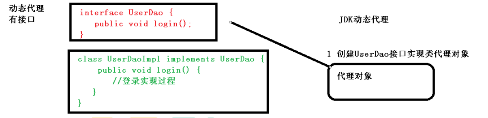
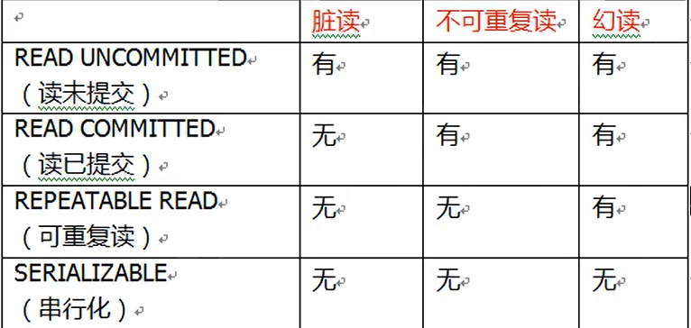

### Spring面试题

参考：[Spring面试题](https://blog.csdn.net/a745233700/article/details/80959716)  [Spring Bean作用域](https://blog.csdn.net/qq_41083009/article/details/90743719)  [Spring源码分析](https://blog.csdn.net/nuomizhende45/article/details/81158383)  [Spring 中的观察者模式](https://www.cnblogs.com/dubhlinn/p/10725636.html))


参考： [IOC容器结构](https://www.bilibili.com/video/BV1EE411u7YV?p=26)  [IOC父子容器](https://blog.csdn.net/fhjdzkp/article/details/78687513)

```
例如：
我们事务注解支持(<tx:annotation-driven/>)放入了spring-context.xml，它的注解范围在service dao以及entity；
如果将事务注解支持放入spring-mvc.xml，事务注解(@Transaction)放在service上无效.

又或者，我们共有三个文件spring-context.xml、spring-security.xml、spring-mvc.xml，spring-context.xml引入了spring-security.xml
如果想启用security注解权限的配置，在controller生效，应放入spring-mvc.xml
如果想启用security注解权限的配置，在service、dao、entity生效，应放入spring-context.xml或者spring-security.xml
```


#### IOC基本原理

```java
1、IOC 思想基于 IOC 容器完成，IOC 容器底层就是对象工厂
2、Spring 提供 IOC 容器实现两种方式：（两个接口）
	1).BeanFactory：IOC 容器基本实现，是 Spring 内部的使用接口，不提供开发人员进行使用
	* 加载配置文件时候不会创建对象，在获取对象（使用）才去创建对象
	
	2).ApplicationContext：BeanFactory 接口的子接口，提供更多更强大的功能，一般由开发人员进行使用
	* 加载配置文件时候就会把在配置文件对象进行创建
	
	虽然第一种方式比较好，但我们通常是Web项目，在项目启动时加载时全部加载，后期访问更快，费时费力放在启动
	
String classValue = class属性;//xml解析得到
Class class = Class.forName(className);//通过反射创建对象
User user = (User)class.newInstance();//创建实例
```


#### IOC 操作Bean管理

> 参考：[bean 生命周期](https://www.cnblogs.com/zrtqsk/p/3735273.html) [bean生命周期](https://www.jb51.net/article/154487.htm)

```xml
1、生命周期
	1).从对象创建到对象销毁的过程
	
2、bean 生命周期
    1).通过构造器创建bean实例（无参数构造）
    2).为bean的属性设置值和对其他bean引用（调用set方法）
    3).把bean实例传递给bean 后置处理器方法执行初始化之前调用方法 -> postProcessBeforeInitialization
    4).调用bean的初始化的方法（需要进行配置初始化的方法:init-method）
    5).把bean实例传递给bean 后置处理器方法执行初始化之后调用方法 -> postProcessAfterInitialization
    6).bean可以使用了（对象获取到了）
    7).当容器关闭时候，调用bean的销毁的方法（需要进行配置销毁的方法）

<bean id="myUser" 
      class="cn.cps.User" 
      init-method="myInitMethod"
      destroy-method="myDestroyMethod"
 ></bean>


后置处理器方法需要实现BeanPostProcess接口,也需要把后置处理器实现类注入容器中
重写两个方法postProcessBeforeInitialization、postProcessAfterInitialization
```


#### AOP基本原理

```java
1、AOP底层使用动态代理
    1).有两种情况动态代理，使用 JDK 动态代理，创建接口实现类代理对象，增强类的方法
    	//创建接口实现类代理对象
 		Class[] interfaces = {UserDao.class};
		UserDaoImpl userDao = new UserDaoImpl();
        UserDao dao = (UserDao)Proxy.newProxyInstance(
            JDKProxy.class.getClassLoader(),
            interfaces,
            new UserDaoProxy(userDao)
        );
		//创建代理对象代码
        class UserDaoProxy implements InvocationHandler {
         //1 把创建的是谁的代理对象，把谁传递过来
         //有参数构造传递
         private Object obj;
         public UserDaoProxy(Object obj) {
             this.obj = obj;
         }
         //增强的逻辑
         @Override
         public Object invoke(Object proxy, Method method, Object[] args){
             //方法之前
             System.out.println(
                 "方法之前执行"+method.getName()
                 +":传递的参数..."
                 + Arrays.toString(args)
             );
             //被增强的方法执行
             Object res = method.invoke(obj, args);
             //方法之后
             System.out.println("方法之后执行...."+obj);
             return res;
          }
    2).没有接口情况，使用 CGLIB 动态代理，创建子类的代理对象，增强类的方法
        自定义当前类的代理对象 继承被代理类，重写该的方法，在该方法中调用父类的方法，执行自己的增强逻辑
```





#### Spring中的观察者模式

参考：[监听者模式和观察者模式的区别与联系](https://blog.csdn.net/lovexiaotaozi/article/details/102579360)  [Spring 中的观察者模式](https://www.cnblogs.com/jmcui/p/11054756.html)

```
律师是被观察者(Subject)，需要存储所有拍卖的人员，当价格改变，律师需要通知所有拍卖人员价格改变

张三和李四准备上演一场抢劫银行的行动,张三负责抢劫,李四负责放哨,
他们两约定,如果李四这边看到警察来就立即通知张三,张三收到通知后立马逃跑...
在上面的例子中,张三的角色其实就是观察者,李四是被观察者.
```


#### 事务传播行为

> 多事务方法直接进行调用，这个过程中事务是如何进行管理的

> + REQUIRED：
>
>   如果add方法本身有事务，调用update方法之后，update使用当前add方法中的事务。
>
>   如果add方法本身没有事务，调用update方法之后，创建新事务。
>
> + REQUIRED_NEW：
>
>   如果add方法本身有事务，调用update方法之后，开启新的事务。
>
>   如果add方法本身没有事务，调用update方法之后，开启新的事务。


```java
// 同一个对象内事务方法互调默认失效，原因绕过了代理对象
// *事务使用代理对象来控制的
@Transactional(timeout = 30) //a事务的所有设置就传播到了和他公用一个事务的方法
public void a() {
	// b，c做任何设置都没用。都是和a公用一个事务(要使用代理对象才会有事务的传播性)
    this.b();
	this.c();
    
    // 引入了aspectj 这样调用本类的service方法事务隔离传播性才生效
    OrderServiceImpl orderService = (OrderServiceImpl)AopContext.currentProxy();
	orderService.b();
	orderService.c();
    
	// bService.b(); // a事务
	// cService.c();//新事务(不回滚)int i = 10/0;
}
```


##### 事务失效问题

>本地事务失效间题：同一个对象内事务方法互调默认失效，原因绕过了代理对象，事务使用代理对象来控制
>
>解决:使用代理对象来调用事务方法
>
>+ 引入aop-starter;spring-boot-starter-aop;引入了aspectj
>
>+ @EnableAspectJAutoProxy;开启aspectj动态代理功能。以后所有的动态代理都是aspectj创建的(即使没有接口也可以动态代理)。
>
>+ ```java
>  // 启动类启用aop代理
>  @EnableAspectAutoProxy(exposeProxy = true)
>  
>  // 引入了aspectj 这样调用本类的service方法事务隔离传播性才生效
>  OrderServiceImpl orderService = (OrderServiceImpl)AopContext.currentProxy();
>  orderService.b();
>  orderService.c();
>  ```


#### 事务隔离级别

>事务有特性成为隔离性，多事务操作之间不会产生影响。不考虑隔离性产生很多问题

> + 脏读：一个未提交事务读取到另一个未提交事务的数据
> + 不可重复读：一个未提交事务读取到另一提交事务修改数据
> + 幻读：一个未提交事务读取到另一提交事务添加数据

> 隔离级别

> + READ_UNCOMMITTED（读未提交）
>
>   该隔离级别的事务会读到其它未提交事务的数据，此现象也称之为脏读。
>
> + READ_COMMITTED（读提交）
>
>   一个事务可以读取另一个已提交的事务，多次读取会造成不一样的结果，此现象称为不可重复读问题，Oracle和SQLServer的默认隔离级别。
>
> + REPEATABLE_READ（可重复读）
>
>   该隔离级别是MySQL默认的隔离级别，在同一个事务里，select的结果是事务开始时时间点的状态，因此，同样的select操作读到的结果会是一致的，但是，会有幻读现象。MySQL的InnoDB引擎可以通过next-keylocks机制（参考下文"行锁的算法"一节）来避免幻读。
>
> + SERIALIZABLE（序列化）
>
>   在该隔离级别下事务都是串行顺序执行的，MySQL数据库的InnoDB引擎会给读操作隐式加一把读共享锁，从而避免了脏读、不可重读复读和幻读问题。


##### 事务隔离级别图解




