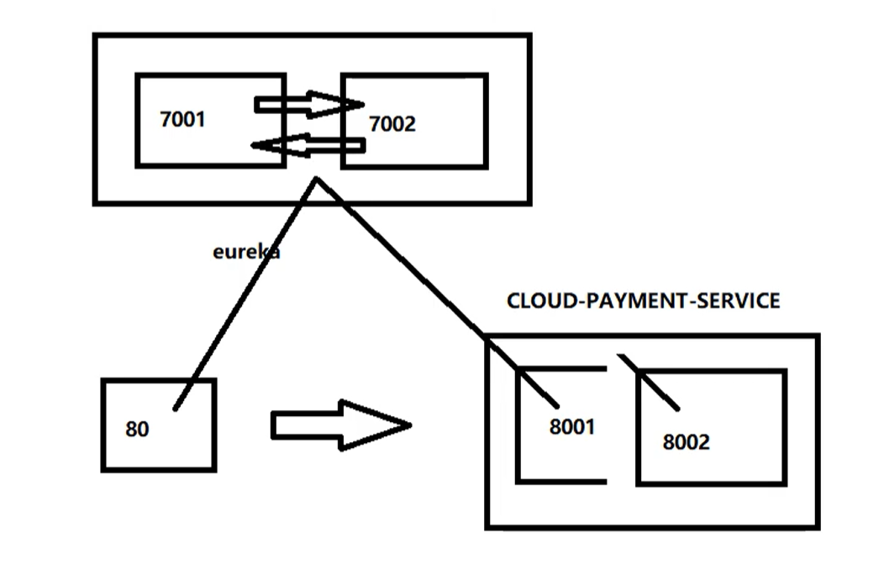

# Spring Cloud

参考：[尚硅谷SpringCloud2020](https://www.bilibili.com/video/BV18E411x7eT?p=1)


## 微服务：

```
但通常而言，微服务是一种架构模式或者说是一种架构风格, 它提倡将单一应用程序划分成一组小的服务，每个服务运行，在其独立的自己的进程中，服务之间互相协调、互相配合,为用户提供最终价值。

服务之间采用轻量级的通信机制互相沟通(通常是基于HTTP的RESTful API)。每个服务都围绕着具体业务进行构建,并粗能够被独立地部署到生产环境、类生产环境等。

另外,尽量避免统一的、集中式的服务管理机制，对具体的一个服务而言,应根据业务上下文，选择合适的语言、工具对其进行构建，可以有一个非常轻量级的集中式管理来协调这些服务，可以使用不同的语言来编写服务,也可以使用不同的数据存储。

-----------------------------------------------------------------------------------------

微服务化的核心就是将传统的一站式应用，根据业务拆分成一个一个的服务,彻底地去耦合每一个微服务提供单个业务功能的服务,一个服务做一件事,从技术角度看就是一种小而独立的处理过程，类似进程概念，能够自行单独启动或销毁，可以拥有自己独立的数据库。
```


## SpringCloud

### 服务模块


### 技术升级


### P6 父工程pom文件

```xml
<?xml version="1.0" encoding="UTF-8"?>
<project xmlns="http://maven.apache.org/POM/4.0.0" xmlns:xsi="http://www.w3.org/2001/XMLSchema-instance"
    xsi:schemaLocation="http://maven.apache.org/POM/4.0.0https://maven.apache.org/xsd/maven-4.0.0.xsd">

  <modelVersion>4.0.0</modelVersion>

  <groupId>com.atguigu.springcloud</groupId>
  <artifactId>cloud2020</artifactId>
  <version>1.0-SNAPSHOT</version>
  <packaging>pom</packaging>

  <modules>
    <module>cloud-provider-payment8001</module>
  </modules>

  <!--统一管理jar包版本-->
  <properties>
    <project.build.sourceEncoding>UTF-8</project.build.sourceEncoding>
    <maven.compiler.source>1.8</maven.compiler.source>
    <maven.compiler.target>1.8</maven.compiler.target>
    <junit.version>4.12</junit.version>
    <log4j.version>1.2.17</log4j.version>
    <lombok.version>1.18.10</lombok.version>
    <mysql.version>8.0.19</mysql.version>
    <druid.version>1.1.16</druid.version>
    <mybatis.spring.boot.version>2.1.1</mybatis.spring.boot.version>
  </properties>

  <!--子模块继承之后，提供作用：锁定版本+子modlue不用写groupId和version-->
  <dependencyManagement>
    <dependencies>
      <!--springboot2.2.2-->
      <dependency>
        <groupId>org.springframework.boot</groupId>
        <artifactId>spring-boot-dependencies</artifactId>
        <version>2.2.2.RELEASE</version>
        <type>pom</type>
        <scope>import</scope>
      </dependency>
      <!--springcloudHoxton.SR1-->
      <dependency>
        <groupId>org.springframework.cloud</groupId>
        <artifactId>spring-cloud-dependencies</artifactId>
        <version>Hoxton.SR1</version>
        <type>pom</type>
        <scope>import</scope>
      </dependency>
      <!--springcloudalibaba2.1.0.RELEASE-->
      <dependency>
        <groupId>com.alibaba.cloud</groupId>
        <artifactId>spring-cloud-alibaba-dependencies</artifactId>
        <version>2.1.0.RELEASE</version>
        <type>pom</type>
        <scope>import</scope>
      </dependency>
      <dependency>
        <groupId>mysql</groupId>
        <artifactId>mysql-connector-java</artifactId>
        <version>${mysql.version}</version>
      </dependency>
      <dependency>
        <groupId>com.alibaba</groupId>
        <artifactId>druid</artifactId>
        <version>${druid.version}</version>
      </dependency>
      <dependency>
        <groupId>org.mybatis.spring.boot</groupId>
        <artifactId>mybatis-spring-boot-starter</artifactId>
        <version>${mybatis.spring.boot.version}</version>
      </dependency>
      <dependency>
        <groupId>junit</groupId>
        <artifactId>junit</artifactId>
        <version>${junit.version}</version>
      </dependency>
      <dependency>
        <groupId>log4j</groupId>
        <artifactId>log4j</artifactId>
        <version>${log4j.version}</version>
      </dependency>
      <dependency>
        <groupId>org.projectlombok</groupId>
        <artifactId>lombok</artifactId>
        <version>${lombok.version}</version>
        <optional>true</optional>
      </dependency>
    </dependencies>
  </dependencyManagement>


  <build>
    <plugins>
      <plugin>
        <groupId>org.springframework.boot</groupId>
        <artifactId>spring-boot-maven-plugin</artifactId>
        <configuration>
          <fork>true</fork>
          <addResources>true</addResources>
        </configuration>
      </plugin>
    </plugins>
  </build>
</project>
```


### P8 支付模块构建(上)

```xml
<?xml version="1.0" encoding="UTF-8"?>
<project xmlns="http://maven.apache.org/POM/4.0.0"
         xmlns:xsi="http://www.w3.org/2001/XMLSchema-instance"
         xsi:schemaLocation="http://maven.apache.org/POM/4.0.0 http://maven.apache.org/xsd/maven-4.0.0.xsd">
    <parent>
        <groupId>cn.cps.springcloud</groupId>
        <artifactId>sprngcloud2020</artifactId>
        <version>1.0-SNAPSHOT</version>
    </parent>

    <modelVersion>4.0.0</modelVersion>

    <artifactId>cloud-provider-payment8001</artifactId>

    <dependencies>
        <dependency>
            <groupId>org.springframework.boot</groupId>
            <artifactId>spring-boot-starter-web</artifactId>
        </dependency>
        <dependency>
            <groupId>org.springframework.boot</groupId>
            <artifactId>spring-boot-starter-actuator</artifactId>
        </dependency>
        <dependency>
            <groupId>org.mybatis.spring.boot</groupId>
            <artifactId>mybatis-spring-boot-starter</artifactId>
        </dependency>
        <dependency>
            <groupId>com.alibaba</groupId>
            <artifactId>druid-spring-boot-starter</artifactId>
            <version>1.1.10</version>
        </dependency>
        <!--mysql-connector-java-->
        <dependency>
            <groupId>mysql</groupId>
            <artifactId>mysql-connector-java</artifactId>
        </dependency>
        <!--jdbc-->
        <dependency>
            <groupId>org.springframework.boot</groupId>
            <artifactId>spring-boot-starter-jdbc</artifactId>
        </dependency>
        <dependency>
            <groupId>org.springframework.boot</groupId>
            <artifactId>spring-boot-devtools</artifactId>
            <scope>runtime</scope>
            <optional>true</optional>
        </dependency>
        <dependency>
            <groupId>org.projectlombok</groupId>
            <artifactId>lombok</artifactId>
            <optional>true</optional>
        </dependency>
        <dependency>
            <groupId>org.springframework.boot</groupId>
            <artifactId>spring-boot-starter-test</artifactId>
            <scope>test</scope>
        </dependency>
    </dependencies>

</project>
```


### P9 建表

```sql
CREATE DATABASE cloud;

SET NAMES utf8mb4;
SET FOREIGN_KEY_CHECKS = 0;

-- ----------------------------
-- Table structure for payment
-- ----------------------------
DROP TABLE IF EXISTS `payment`;
CREATE TABLE `payment`  (
  `id` bigint(0) NOT NULL AUTO_INCREMENT COMMENT 'ID',
  `serial` varchar(200) CHARACTER SET utf8 COLLATE utf8_unicode_ci NULL DEFAULT NULL,
  PRIMARY KEY (`id`) USING BTREE
) ENGINE = InnoDB AUTO_INCREMENT = 5 CHARACTER SET = utf8 COLLATE = utf8_unicode_ci ROW_FORMAT = Dynamic;

-- ----------------------------
-- Records of payment
-- ----------------------------
INSERT INTO `payment` VALUES (1, '尚硅谷');
INSERT INTO `payment` VALUES (2, 'alibaba');
INSERT INTO `payment` VALUES (3, '京东');
INSERT INTO `payment` VALUES (4, '头条');

SET FOREIGN_KEY_CHECKS = 1;

```


### Eureka服务注册与发现

> + Eureka Server 提供服务注册服务  key服务名   value调用地址(集合)
>   
>+ Eureka Client 通过注册中心进行访问
> 
>是一个Java客户端，用于简化Eureka Server的交互，客户端同时也具备一个内置的、使用轮询(round-robin)负载算法的负载均衡器。在应用启动后，将会向Eureka Server发送心跳(默认周期为30秒)。如果Eureka Server在多个心跳周期内没有接收到某个节点的心跳，EurekaServer将会从服务注册表中把这个服务节点移除(默认90秒)


#### Eureka工作原理

> 1. 先启动eureka注册中心
> 2. 启动服务提供者，服务提供者启动后回把自身信息注册金eureka
> 3. 消费者服务在需要调用接口时，使用服务别名去注册中心获取实际的RPC远程调用地址
> 4. 消费者获得调用地址后，底层实际是利用HttpClient技术实现远程调用
> 5. 消费者获取服务地址后会缓存在本地jvm内存中，默认每隔30秒更新一次服务调用地址


#### Eureka集群高可用

> 高可用原理：互相注册，相互守望




#### Eureka保证AP

>Eureka看明白了这一点, 因此在设计时就优先保证可用性。Eureka各个节点都是平等的,几个节点挂掉不会影响正常节点的工作，剩余的节点依然可以提供注册和查询服务。而Eureka的客户端在向某个Eureka注册或时如果发现连接失败,则会自动切换至其它节点，只要有一台Eureka还在,就能保证注册服务可用(保证可用性)，只不过查到的信息可能不是最新的(不保证强一致性)。
>
>除此之外，Eureka还有一种自我保护机制， 如果在15分钟内超过85%的节点都没有正常的心跳，那么Eureka就认为客户端 与注册中心出现了网络故障，此时会出现以下几种情况:
>
>1. Eureka不再从注册列表中移除因为长时间没收到心跳而应该过期的服务
>2. Eureka仍然能够接受新服务的注册和查询请求,但是不会被同步到其它节点上(即保证当前节点依然可用)
>   3.当网络稳定时，当前实例新的注册信息会被同步到其它节点中
>   因此，Eureka可以很好的应对因网络故障导致部分节 点失去联系的情况，而不会像zookeeper那样使整 个注册服务瘫痪。


#### Zookepper保证CP

>当向注册中心查询服务列表时，我们可以容忍注册中心返回的是几分钟以前的注册信息，但不能接受服务直接down掉不可用。也就是说，服务注册功能对可用性的要求要高于一致性。
>
>但是zk会出现这样一种情况， 当master节 点因为网络故障与其他节点失去联系时，剩余节点会重新进行leader选举。问题在于，选举leader的时间太长， 30 ~ 120s,且选举期间整个zk集群都是不可用的,这就导致在选举期间注册服务瘫痪。
>
>在云部署的环境下，因网络问题使得zk集群失去master节点是较大概率会发生的事,虽然服务能够最终恢复，但是漫长的选举时间导致的注册长期不可用是不能容忍的。


#### 自我保护机制

>默认情况下，如果没有自我保护，EurekaServer在一定时间内没有接收到某个微服务实例的心跳，EurekaServer将会注销该实例(默认90秒)。但是当网络分区故障发生时，微服务与EurekaServer之间无法正常通信，以上行为可能变得非常危险了一因为微服务本身其实是健康的，此时本不应该注销这个微服务。
>
>Eureka通过"自我保护模式"来解决这个问题一当EurekaServer节点在短时间内丢失过多客户端时(可能发生了网络分区故障)，那么这个节点就会进入自我保护模式。一旦进入该模式，EurekaServer就会保护服务注册表中的信息，不再删除服务注册表中的数据(也就是不会注销任何微服务)。当网络故障恢复后,该Eureka Server节点会自动退出自我保护模式。
>
>更容易理解的方式
>在自我保护模式中，Eureka Server会保护服务注册表中的信息,不再注销任何服务实例。当它收到的心跳数重新恢复到阈值以上时，该Eureka Server节点就会自动退出自我保护模式。它的设计哲学就是宁可保留错误的服务注册信息，也不盲目注销任何可能健康的服务实例。一句话讲解:好死不如赖活着 AP(可用和容错)


> 服务端关闭自我保护机制

```yml
server:
  port: 7001


eureka:
  instance:
    hostname: eureka7001.com        # eureka服务端的实例名称
  client:
    register-with-eureka: false     # false表示不向注册中心注册自己。
    fetch-registry: false           # false表示自己端就是注册中心，我的职责就是维护服务实例，并不需要去检索服务
    service-url:
      #单机指向自己
      #defaultZone: http://${eureka.instance.hostname}:${server.port}/eureka/
      #集群指向其它eureka
      defaultZone: http://eureka7002.com:7002/eureka/
  server:
    #关闭自我保护机制，保证不可用服务被及时踢除
    enable-self-preservation: false
    #剔除超时两秒的服务
    eviction-interval-timer-in-ms: 2000
```


> 客户端与服务端心跳配置

```yml
server:
  port: 8001


eureka:
  instance:
    #实例名
    instance-id: payment8001
    #访问路径可以显示IP
    prefer-ip-address: true
    #Eureka客户端向服务端发送心跳的时间间隔，单位为秒(默认是30秒)
    lease-renewal-interval-in-seconds: 1
    #Eureka服务端在收到最后一次心跳后等待时间上限，单位为秒(默认是90秒)，超时将剔除服务
    lease-expiration-duration-in-seconds: 2
  client:
    #表示是否将自己注册进EurekaServer默认为true。
    register-with-eureka: true
    #是否从EurekaServer抓取已有的注册信息，默认为true。单节点无所谓，集群必须设置为true才能配合ribbon使用负载均衡
    fetchRegistry: true
    service-url:
      #单机版
      #defaultZone: http://localhost:7001/eureka
      #集群
      defaultZone: http://eureka7001.com:7001/eureka,http://eureka7002.com:7002/eureka
```


### Ribbon负载均衡

> 负载均衡+RestTemplate调用(getForObject方法/getForEntity方法)

> 主要功能是提供客户端的软件负载均衡算法和服务调用。

> 负载均衡策略：比如轮询(RoundRobinRule)、随机(RandomRule)和重试(RetyRule)、根据响应时间加权

> Ribbon本地负载均衡客户端 VS Nginx服务端负载均衡区别
>
> 1. Nginx是服务器负载均衡，客户端所有请求都会交给nginx，然后由nginx实现转发请求。即负载均衡是由服务端实现的。
>
> 2. Ribbon本地负载均衡，在调用微服务接口时候，会在注册中心上获取注册信息服务列表之后缓存到VM本地，从而在本地实现RPC远程服务调用技术。


#### 如何使用

> 主启动类添加注解

```java
@EnableEurekaClient
@SpringBootApplication
@RibbonClient(name = "CLOUD-PAYMENT-SERVICE", configuration = MyRule.class) // 使用自定义负载均衡才需要添加
public class OrderMain80
{
    public static void main(String[] args) {
        SpringApplication.run(OrderMain80.class, args);
    }
}
```


> 负载均衡配置算法

```java
@Configuration
public class ApplicationContextConfig {
    @Bean
    @LoadBalanced // 当为集群时，必须要启用负载均衡策略，不然多个服务不知道调用哪一个
    public RestTemplate getRestTemplate() {
        return new RestTemplate();
    }
}
```


> 服务调用

```java
@Slf4j
@RestController
public class OrderController {

    @Resource
    private RestTemplate restTemplate;
    
    // 集群时，需要指明一种负载均衡策略，不然多个服务，不知道调用哪一个 -> 在RestTemplate配置上添加@LoadBalanced
    public static final String PAYMENT_URL = "http://CLOUD-PAYMENT-SERVICE";

    @GetMapping("/consumer/payment/get/{id}")
    public CommonResult<Payment> getPayment(@PathVariable("id") Long id) {
        return restTemplate.getForObject(PAYMENT_URL+"/payment/get/"+id,CommonResult.class);
    }
   
}
```


#### 组件IRule

> IRule：根据特定算法中从服务列表中选择一个要访问的服务

> + RoundRobinRule 轮询
> + RandomRule 随机 
> + RetryRule  先按照RoundRobinRule的策略获取服务，如果获取失败则再指定时间内重试，获取可用服务
> + WeightResponseTimeRule   对RoundRobinRule的扩展，响应速度越快的实例选择权重越大
> + BestAvailableRule   会先过滤掉由于多次访问故障而处于断路器跳闸状态的服务，然后选择一个并发量最小的服务
> + AvailabilityFilterRule 先过滤掉故障实例，再选择并发较小的实例
> + ZoneAvoidanceRule 默认规则，复合判断server所在区域的性能和server的可用性选择服务器


#### 如何替换

>1. 新建包但不能放在@ComponentScan的扫描范围内
>
>   ```java
>   cn.cps
>       myrule
>       	MySelfRule
>       springcloud
>       	OrderMain80
>   ```
>
>   
>
>2. 新建自己的负载均衡算法配置类 myRule
>
>   ```java
>   @Configuration
>   public class MySelfRule
>   {
>       @Bean
>       public IRule myRandomRule()
>       {
>           return new RandomRule();//定义为随机
>       }
>   }
>   ```
>
>3. 主启动类添加注解@RibbonClient
>
>   ```java
>   @EnableEurekaClient
>   @SpringBootApplication
>   // 注意必须要和服务中的名字大小写一样
>   @RibbonClient(name = "CLOUD-PAYMENT-SERVICE", configuration=MySelfRule.class)
>   public class OrderMain80
>   {
>       public static void main(String[] args) {
>               SpringApplication.run(OrderMain80.class, args);
>       }
>   }
>   ```


#### 负载均衡算法

> 原理：获取某个服务的实例，然后定义算法进行获取去执行请求。使用CAS自旋锁实现原子性。
>
> List<Servicelnstance> instances = discoveryClient.getIlnstances("CLOUD-PAYMENT-SERVICE");
>
> + 轮询：次数(索引) % 实例数 = 实际调用服务实例位置下标，每次服务重启动后rest接口计数从0开始。
>


### OpenFeign负载均衡

> 微服务调用接口 + @FeignClient


>Feign旨在使编写Java Http客户端变得更容易。
>
>前面在使用Ribbon + RestTemplate时，利用RestTemplate对http请求的封装处理，形成了一套模版化的调用方法。但是在实际开发中，由于对服务依赖的调用可能不止一处，往往一个接口会被多处调用，所以通常都会针对每个微服务自行封装一 些客户端类来包装这些依赖服务的调用。
>
>所以Feign在此基础上做了进一 步封装，由他来帮助我们定义和实现依赖服务接口的定义。在Feign的实现下，我们只需创建一个接并使用注解的方式来配置它(以前是Dao接口，上面标注Mapper注解现在是一 个微服务接口上面标注一个Feign注解即可)， 即可完成对服务提供方的接口绑定,简化了使用Spring cloud Ribbon时，自动封装服务调用客户端的开发量。


#### Feign与 OpenFeign

> + Feign：Feign是Spring Cloud组件中的一个轻量级RESTful的HTTP服务客户端Feign内置了Ribbon，用来做客户端负载均衡，去调用服务注册中心的服务。Feign的使用方式是:使用Feign的注解定义接口，调用这个接口，就可以调用服务注册中心的服务。
> + OpenFeign：OpenFeign是Spring Cloud 在Feign的基础上支持了SpringMVC的注解，如@RequesMapping等等。OpenFeign的@FeignClient可以解析SpringMVC的@RequestMapping注解下的接口，并通过动态代理的方式产生实现类，实现类中做负载均衡并调用其他服务。


#### 如何使用

> 主启动类添加注解

```java
@EnableFeignClients
@SpringBootApplication
public class OrderFeignMain80 {
    public static void main(String[] args) {
        SpringApplication.run(OrderFeignMain80.class, args);
    }
}
```


> Service添加注解

```java
@Service
@FeignClient(value = "CLOUD-PAYMENT-SERVICE") // 调用服务
public interface PaymentFeignService {

    @GetMapping(value = "/payment/get/{id}") // 服务的具体路径
    public CommonResult<Payment> getPaymentById(@PathVariable("id") Long id);

    @GetMapping(value = "/payment/feign/timeout")
    public String paymentFeignTimeout();

}
```


#### OpenFeign超时控制

```yml
#设置feign客户端超时时间(OpenFeign默认支持ribbon)
ribbon:
  #指的是建立连接所用的时间，适用于网络状况正常的情况下,两端连接所用的时间
  ReadTimeout: 5000
  #指的是建立连接后从服务器读取到可用资源所用的时间
  ConnectTimeout: 5000
```


#### OpenFeign日志打印功能

> 日志级别

```java
/*
    NONE:默认的,不显示任何日志;
    BASIC:仅记录请求方法、URL、响应状态码及执行时间;
    HEADERS:除了BASIC中定义的信息之外，还有请求和响应的头信息;
    FULL除了HEADERS 中定义的信息之外，还有请求和响应的正文及元数据。
*/
@Configuration
public class FeignConfig {
    @Bean
    Logger.Level feignLoggerLevel(){
        return Logger.Level.FULL;
    }
}
```


> yml文件开启日志打印

```yml
logging:
  level:
    cn.cps.springcloud.service.PaymentFeignService: debug
```


### Hystrix断路器

> Hystrix是一个用于处理分布式系统的延迟和容错的开源库,在分布式系统里,许多依赖不可避免的会调用失败,比如超时、异常等，Hystrix能够保证在一个依赖出问题的情况下，不会导致整体服务失败,避免级联故障,以提高分布式系统的弹性。
>
> 向调用方返回一个符合预期的、可处理的备选响应，而不是长时间的等待或者抛出调用方无法处理的异常


#### 熔断器

> “断路器”本身是一种开关装置，当某个服务单元发生故障之后，通过断路器的故障监控（类似熔断保险丝)，向调用方返回一个符合预期的、可处理的备选响应(FallBack)，而不是长时间的等待或者抛出调用方无法处理的异常，这样就保证了服务调用方的线程不会被长时间、不必要地占用，从而避免了故障在分布式系统中的蔓延，乃至雪崩。


#### 服务雪崩

```
多个微服务之间调用的时候，假设微服务A调用微服务B和微服务C，微服务B和微服务C又调用其它的微服务,这就是所谓的“扇出”。
如果扇出的链路上某个微服务的调用响应时间过长或者不可用，对微服务A的调用就会占用越来越多的系统资源,进而引起系统崩溃,所谓的“雪崩效应”.

对于高流量的应用来说，单一的后端依赖可能会导致所有服务器上的所有资源都在几秒钟内饱和。比失败更糟糕的是,这些应用程
序还可能导致服务之间的延迟增加，备份队列，线程和其他系统资源紧张，导致整个系统发生更多的级联故障。这些都表示需要对
故障和延迟进行隔离和管理，以便单个依赖关系的失败，不能取消整个应用程序或系统。
```

> 


#### 服务降级

>所谓降级， 一般是从整体负荷考虑。就是当某个服务熔断之后，服务器将不再被调用
>此时客户端可以自己准备一个本地的fallback回调， 返回一个缺省值。
>这样做，虽然服务水平下降，但好歹可用，比直接挂掉要强。
>
>整体资源快不够了，忍痛将某些服务先关掉，待渡过难关，再开启回来
>服务降级处理是在客户端实现完成的，与服务端没有关系
>让客户端在服务端不可用时也会获得提示信息而不会挂起耗死服务器


#### 服务熔断

> 一般是某个服务故障或者异常引起类似现实世界中的“保险丝“， 当某个异常条件被触发，直接熔断整个服务，而不是一直等到此服务超时导致雪崩。

```
熔断机制是应对雪崩效应的一种微服务链路保护机制。
当扇出链路的某个微服务不可用或者响应时间太长时，会进行服务的降级,进而熔断该节点微服务的调用,快速返回”错误”的响应信息。
当检测到该节点微服务调用响应正常后恢复调用链路。在SpringCloud框架里熔断机制通过Hystrix实现。
Hystrix会监控微服务x间调用的状况，当失败的调用到一定阈值,缺省是5秒内20次调用失败就会启动熔断机制。熔断机制的注解是@HystrixCommand.
```


#### 如何使用

> 主启动类添加注解@EnableHystrix / @EnableCircuitBreaker

```java
@EnableHystrix
@EnableEurekaClient
@SpringBootApplication
public class PaymentHystrixMain8001
{
    public static void main(String[] args) {
            SpringApplication.run(PaymentHystrixMain8001.class, args);
    }
}
```


>标明处理的方法

```java
@GetMapping("/consumer/payment/hystrix/timeout/{id}")
@HystrixCommand(fallbackMethod = "paymentTimeOutFallbackMethod", commandProperties = {
    @HystrixProperty(name="execution.isolation.thread.timeoutInMilliseconds",value="1000")
})
public String paymentInfo_TimeOut(@PathVariable("id") Integer id)
{
    String result = paymentHystrixService.paymentInfo_TimeOut(id);
    return result;
}
public String paymentTimeOutFallbackMethod(@PathVariable("id") Integer id) {
    return "我是消费者80,对方支付系统繁忙请10秒钟后再试或者自己运行出错请检查自己,o(╥﹏╥)o";
}
```


#### 全局处理

> 给controller类添加注解

```java
@RestController
@DefaultProperties(defaultFallback = "payment_Global_FallbackMethod")
public class OrderHystirxController {

	@HystrixCommand
    public String paymentInfo_TimeOut(@PathVariable("id") Integer id) {
        int age = 10/0;
        String result = paymentHystrixService.paymentInfo_TimeOut(id);
        return result;
    }
    
    // 下面是全局fallback方法
    public String payment_Global_FallbackMethod() {
        return "Global异常处理信息，请稍后再试，/(ㄒoㄒ)/~~";
    }
    
}
```


#### 优美解决方案

> yml配置

```yml
#启用feign对hystrix支持
feign:
  hystrix:
    enabled: true
```


> 在接口处处理，@FeignClient中添加属性 fallback -> 降级处理

```java
@Component
@FeignClient(value = "CLOUD-PROVIDER-HYSTRIX-PAYMENT", fallback = PaymentFallbackService.class)
public interface PaymentHystrixService {
    @GetMapping("/payment/hystrix/ok/{id}")
    public String paymentInfo_OK(@PathVariable("id") Integer id);

    @GetMapping("/payment/hystrix/timeout/{id}")
    public String paymentInfo_TimeOut(@PathVariable("id") Integer id);
}
```


> 创建实体类继承Feign接口

```java
@Component
public class PaymentFallbackService implements PaymentHystrixService
{
    @Override
    public String paymentInfo_OK(Integer id) {
        return "-----PaymentFallbackService fall back-paymentInfo_OK ,o(╥﹏╥)o";
    }

    @Override
    public String paymentInfo_TimeOut(Integer id) {
        return "-----PaymentFallbackService fall back-paymentInfo_TimeOut ,o(╥﹏╥)o";
    }
}
```


> 服务监控hystrixDashboard

```
除了隔离依赖服务的调用以外，Hystrix还提供了准实时的调用监控（Hystrix Dashboard），Hystrix会持续地记录所有通过Hystrix发起的请求的执行信息，并以统计报表和图形的形式展示给用户，包括每秒执行多少请求多少成功，多少失败等。Netflix通过hystrix-metrics-event-stream项目实现了对以上指标的监控。Spring Cloud也提供了Hystrix Dashboard的整合，对监控内容转化成可视化界面。
```


> 如何看监测数据：7色 1圈 1线

参考： [Hystrix仪表盘监控HystrixDashboard](https://www.cnblogs.com/coding-farmer/p/12032403.html)

```
7色：
	绿 成功色
	蓝 熔断数
	青 错误请求数
	黄 超时数
	紫 线程拒绝数
	红 失败/异常数
	灰 最近10s错误百分比

实心圆：共有两种含义。它通过颜色的变化代表了实例的健康程度，它的健康度从绿色<黄色<橙色<红色递减。
该实心圆除了颜色的变化之外，它的大小也会根据实例的请求流量发生变化，流量越大该实心圆就越大。所以通过该实心圆的展示，就可以在大量的实例中快速的发现 故障实例和高压力实例。

曲线：用来记录2分钟内流量的相对变化，可以通过它来观察到流量的上升和下降趋势。
```


### Zuul路由网关

Zuul包含了对请求的路由和过滤两个最主要的功能：

```
其中路由功能负责将外部请求转发到具体的微服务实例上，是实现外部访问统一入口的基础而过滤器功能则负责对请求的处理过程进行干预，是实现请求校验、服务聚合等功能的基础.

Zuul和Eureka进行整合，将Zuul自身注册为Eureka服务治理下的应用，同时从Eureka中获得其他微服务的消息，也即以后的访问微服务都是通过Zuul跳转后获得。

注意：Zuul服务最终还是会注册进Eureka

提供=代理+路由+过滤三大功能
```

 

 

### Config分布式配置中心

> 是什么

```
SpringCloud Config为微服务架构中的微服务提供集中化的外部配置支持，配置服务器为各个不同微服务应用的所有环境提供了一个中心化的外部配置。
```


> 怎么玩

```
SpringCloud Config分为服务端和客户端两部分。

服务端也称为分布式配置中心，它是一个独立的微服务应用，用来连接配置服务器并为客户端提供获取配置信息,加密/解密信息等访问接口

客户端则是通过指定的配置中心来管理应用资源，以及与业务相关的配置内容,并在启动的时候从配置中心获取和加载配置信息
配置服务器默认采用git来存储配置信息,这样就有助于对环境配置进行版本管理,并且可以通过git客户端工具来方便的管理和访问配置内容。
```


> 分布式面临的配置问题

```
微服务意味着要将单体应用中的业务拆分成一个个 子服务，每个服务的粒度相对较小，因此系统中会出现大量的服务。由于每个
服务都需要必要的配置信息才能运行，所以一集中式的、动态的配置管理设施是必不可少的。SpringCloud提供 了
ConfigServer来解决这个问题，我们每一个微服务自己带着一 个application.yml,. 上百个配置文件的管理...

Config查看配置信息：http://127.0.0.1:3344/application-dev.yml
```


> bootstrap.yml

```
applicaiton.yml是用户级的资源配置项
bootstrap.yml是系统级的，优先级更加高

Spring Cloud会创建一个Bootstrap Context',作为Spring应用的Application Context'的父上下文。
初始化的时候,Bootstrap Context负责从外部源加载配置属性并解析配置。这两个上下文共享一个从外部获取的“Environment'。
Bootstrap'属性有高优先级,默认情况下，它们不会被本地配置覆盖。'Bootstrap context'和Application Context'有着不同的约定,所以新增了一个bootstrap.yml文件, 保证Bootstrap Context'和Application Context'配置的分离。
```


## Spring Cloud Alibaba

```
SpringCloud的几大痛点
    SpringCloud部分组件停止维护更新，部分不再开源，给开发带来不便;
    SpringCloud部分环境搭建复杂，没有完善的可视化界面，我们需要大量的二次开发和定制
    SpringCloud配置复杂，难以上手，部分配置差别难以区分和合理应用

SpringCloud Alibaba的优势:
    阿里使用过的组件经历了考验，性能强悍，设计合理，现在开源出来大家用
    成套的产品搭配完善的可视化界面给开发运维带来极大的便利
    搭建简单，学习曲线低。
    
SpringCloud Alibaba 最终技术搭配方案
    SpringCloud Alibaba - Nacos:注册中心(服务发现/注册)
    SpringCloud Alibaba - Nacos:配置中心(动态配置管理)
    SpringCloud - Ribbon: 负载均衡
    SpringCloud - Feign: 声明式httP客户端(调用远程服务，feign闭源，使用的openFeign)
    SpringCloud Alibaba - Sentinel: 服务容错(限流、降级、熔断)
    SpringCloud - Gateway: API网关(webflux 编程模式)
    SpringCloud - Sleuth: 调用链监控
    SpringCloud Alibaba - Seata: 原Fescar, 即分布式事务解决方案

版本选择
    Spring Cloud Version		Spring Cloud Alibaba 	Version Spring Boot Version
    -----						-----					-----
    Spring Cloud Greenwich		2.1.x.RELEASE			2.1.x. RELEASE
    Spring Cloud Finchley		2.0.x.RELEASE			2.0.x.RELEASE
    Spring Cloud Edgware		1 5.x.RELEASE			1 5.x.RELEASE
    
    
依赖统一管理，然后在新创建dependencies标签中添加自己所需要的以来，无需写版本号
	<dependencyManagement>
        <dependencies>
            <dependency>
                <groupId>com.alibaba.cloud</groupId>
                <artifactId>spring-cloud-alibaba-dependencies</artifactId>
                <version>2.1.0.RELEASE</version>
                <type>pom</type>
                <scope>import</scope>
            </dependency>
        </dependencies>
    </dependencyManagement>
```


### Nacos

> Nacos注册配置中心

```
记录所有的服务信息，以Map<String,List<Object>>存储个服务信息，key为服务名，我们通过服务名就可以取。
自定义负载均衡，获取所有服务，它采用策略模式，就是声明接口，我们只需要去继承该接口，实现返回服务的方法就可以。
```


```
1.引入依赖
    <dependency>
        <groupId>com.alibaba.cloud</groupId>
        <artifactId>spring-cloud-starter-alibaba-nacos-discovery</artifactId>
    </dependency>
    
2.在配置文件中，配置Nacos Server地址
	#一、
	spring.cloud.nacos.discovery.server-addr=127.0.0.1:8848
	spring.application.name=gulimall-coupon
	
	#二、
	#spring:
    #  cloud:
    #    nacos:
    #      discovery:
    #        server-addr: 127.0.0.1:8848
    #  application:
    #    name: gulimall-coupon

3.使用@EnableDiscoveryClient注解开启服务注册与发现功能
    @EnableDiscoveryClient
    @SpringBootApplication
    public class Application{
        public static void main(String[] args) {
            SpringApplication.run(Application.class, args);
        }
    }

4.启动Nacos服务，启动微服务
```


> Nacos配置中心管理

```
本地应用读取我们云端分布式配置中心文件(第一次建立长连接)。
本地应用读取到配置文件之后，本地jvm和硬盘中都会缓存一份。
本地应用与分布式配置中心服务器端一直保持长连接.
当我们的配置文件发生变化(MD5|版本号)实现区分，将变化结果通知给我们的本地应用，及时的刷新我们的配置文件
```


```
1.引入依赖
    <dependency>
        <groupId>com.alibaba.cloud</groupId>
        <artifactId>spring-cloud-starter-alibaba-nacos-config</artifactId>
    </dependency>

2.创建bootstrap.properties文件(优先级别高)
	# 默认根据服务名 获取Nacos中properties文件加载配置 如果没有 则加载程序的application.properties
    spring.application.name=gulimall-coupon
    spring.cloud.nacos.config.server-addr=127.0.0.1:8848

3.给在Nacos配置中心添加数据集(Data Id) gulimall-coupon.properties
	设置该服务的相关配置信息

4.动态刷新配置
    @RefreshScope: 动态获取并刷新配置，给类添加
    @Value("${配置项名}"): 获取配置
```


> Nacos分布式配置管理细节

```
1）、命名空间：配置隔离；
	默认：public(保留空间)；默认新增的所有配置都在public空间。
	1、开发，测试，生产：利用命名空间来做环境隔离。
		注意：在bootstrap.properties; 需要使用哪个命名空间下的配置
		spring.cloud.nacos.config.namespace=9de62e44-cd2a-4a82-bf5c-95878bd5e871
	2、每一个微服务之间互相隔离配置，每一个微服务都创建自己的命名空间，只加载自己命名空间下的所有配置

2）、配置集：所有的配置的集合

3）、配置集ID：类似文件名。
	 Data ID：类似文件名

4）、配置分组：默认所有的配置集都属于：DEFAULT_GROUP；
	1111，618，1212
	spring.cloud.nacos.config.group=prod
	
* 项目中的使用：每个微服务创建自己的命名空间，使用配置分组区分环境，dev，test，prod
    spring.application.name=gulimall-coupon
    spring.cloud.nacos.config.server-addr=127.0.0.1:8848
	spring.cloud.nacos.config.namespace=9de62e44-cd2a-4a82-bf5c-95878bd5e871
	spring.cloud.nacos.config.group=prod

* 同时加载多个配置集
 * 1)、微服务任何配置信息，任何配置文件都可以放在配置中心中
 * 2）、只需要在bootstrap.properties说明加载配置中心中哪些配置文件即可
 * 3）、@Value，@ConfigurationProperties。。。
 * 以前SpringBoot任何方法从配置文件中获取值，都能使用。
 * 配置中心有的优先使用配置中心中的
 
	spring.cloud.nacos.config.server-addr=127.0.0.1:8848
    spring.cloud.nacos.config.namespace=1986f4f3-69e0-43bb-859c-abe427b19f3a
    # 如果不指定分组，默认DEFAULT_GROUP，如果naocs没有，则加载程序的application.properties
    spring.cloud.nacos.config.group=prod 

    spring.cloud.nacos.config.ext-config[0].data-id=datasource.yml
    spring.cloud.nacos.config.ext-config[0].group=dev
    spring.cloud.nacos.config.ext-config[0].refresh=true

    spring.cloud.nacos.config.ext-config[1].data-id=mybatis.yml
    spring.cloud.nacos.config.ext-config[1].group=dev
    spring.cloud.nacos.config.ext-config[1].refresh=true

    spring.cloud.nacos.config.ext-config[2].data-id=other.yml
    spring.cloud.nacos.config.ext-config[2].group=dev
    spring.cloud.nacos.config.ext-config[2].refresh=true
```


> 数据持久化

参考：[Nacos]( https://nacos.io/zh-cn/docs/deployment.html)

```
默认的情况下，分布式配置中心的数据存放到本地data目录下，但是这种情况如果nacos集群的话无法保证数据的同步性。

在0.7版本之前，在单机模式时nacos使用嵌入式数据库实现数据的存储，不方便观察数据存储的基本情况。0.7版本增加了支持mysql数据源能力，具体的操作步骤：

1.安装数据库，版本要求：5.6.5+
2.初始化mysql数据库，数据库初始化文件：nacos-mysql.sql
3.修改conf/application.properties文件，增加支持mysql数据源配置（目前只支持mysql），添加mysql数据源的url、用户名和密码。

spring.datasource.platform=mysql
db.num=1
db.url.0=jdbc:mysql://127.0.0.1:3306/nacos?characterEncoding=utf8&connectTimeout=1000&socketTimeout=3000&autoReconnect=true
db.user=root
db.password=root
```


> 集群配置


```
相关集群配置


创建cluster文件夹
---nacos-server-8848
---nacos-server-8849
---nacos-server-8850

cluster.conf
###ip和端口号 不要用127.0.0.1
192.168.1.22:8848
192.168.1.22:8849
192.168.1.22:8850


Nginx相关配置
轮询分发给三台,关于session共享Nacos自己解决了

客户端连接 
spring.cloud.nacos.config.server-addr=192.168.1.22:8848

注意： 
1.nacos在windows版本下运行默认是单机版本 需要指定startup.cmd -m cluster
2.nacos在linux版本下运行默认是集群版本 如果想连接单机版本 startup.cmd –m standalone

```


> Zookeeper Eureka Nacos区别

```
Zookeeper采用CP保证数据的一致性的问题，原理采用Zab原子广播协议，当我们的zk领导因为某种原因宕机的情况下，会自动出发重新选一个新的领导角色，整个选举的过程为了保证数据的一致性的问题，在选举的过程中整个zk环境是不可以使用，可以短暂可能无法使用到zk，以为者微服务采用该模式的情况下，可能无法实现通讯。(本地有缓存除外)。
注意：可运行节点必须满足过半机制，整个zk采用使用。
三台集群：两台宕机，一台正常，还是没法使用需要过半选举。
zad协议通过比较myid 谁最大谁为领导角色，只要满足过半机制就可以称为领导者。
如何办证数据一致性，所有写的请求都交给我们领导角色实现，领导写完，再将数据同步每个节点(也就是说,选举过程中不能注册服务)


Eureka采用ap的设计理念架构注册中心，完全去中心化思想，也就是没有主从之分。每个节点都是均等，采用相互注册原理，你中有我我中你，只要最后有一个eureka节点存在就可以保证整个微服务可以实现通讯。相互注册


Nacos与Eureka区别.

Nacos.从1.0版本支持CP和AP混合模式集群，默认是采用Ap保证服务可用性，CP的形式底层集群raft协议保证数据的一致性的问题。
如果我们采用Ap模式注册服务的实例仅支持临时注册形式，在网络分区产生抖动的情况正任然还可以继续注册我们的服务列表。
那么选择CP模式必须保证数据的强一致性的问题，如果网络分区产生抖动的情况下，是无法注册我们的服务列表。选择CP模式可以支持注册实例持久。

```


### Feign

> Feign远程调用(openFeign)

```
1.引入依赖
    <dependency>
        <groupId>org.springframework.cloud</groupId>
        <artifactId>spring-cloud-starter-openfeign</artifactId>
    </dependency>

2.开启feign功能
	@EnableFeignClients(basePackages = "com.atguigu.gulimall.member.feign")
    @EnableDiscoveryClient
    @SpringBootApplication
    public class Application {
        public static void main(String[] args) {
            SpringApplication.run(Application.class, args);
        }
    }
    
3.声明远程接口
    @FeignClient("gulimall-coupon")
    public interface CouponFeignService {
        @RequestMapping("/coupon/coupon/member/list")
        public R membercoupons();
    }
```


### GateWay

> Spring Cloud GateWay

```
微服务
微服务网关是整个微服务API请求的入口，可以实现日志拦截、权限控制、解决跨域问题、限流、熔断、负载均衡、黑名单与白名单拦截、授权等
    
过滤器与网关的区别    
过滤器用于拦截单个服务
网关拦截整个的微服务

Zuul与Gateway有那些区别
Zuul网关属于netfix公司开源的产品属于第一代微服务网关
Gateway属于SpringCloud自研发的第二代微服务网关
相比来说SpringCloud Gateway性能比Zuul性能要好：
注意：Zuul基于Servlet实现的，阻塞式的Api，不支持长连接。
SpringCloudGateway基于Spring5构建，能够实现响应式非阻塞式的Api，支持长连接，能够更好的整合Spring体系的产品。

keep+keepAlived
Nignx Nignx Nignx
Gateway Gateway Gateway
订单服务 会员服务 积分服务 商品服务
```


```
构成
    1.route		路由
    2.predicate 断言
    3.Filter	过滤
    * 断言条件判断成功 路由再经过一些过滤，最终到相对应的请求
    
    
使用

	1.引入依赖
        <dependency>
            <groupId>org.springframework.cloud</groupId>
            <artifactId>spring-cloud-starter-gateway</artifactId>
        </dependency>
        
	2.注册服务
		@EnableDiscoveryClient
        @SpringBootApplication(exclude = {DataSourceAutoConfiguration.class}) #排除数据源
        public class Application {
            public static void main(String[] args) {
                SpringApplication.run(Application.class, args);
            }
        }
        
	3.添加bootstrap.properties配置
		spring.application.name=gulimall-coupon
        spring.cloud.nacos.config.server-addr=127.0.0.1:8848
        spring.cloud.nacos.config.namespace=b5d62415-0dea-4747-a65d-874cc6203bf2
        
	4.application.yml网关配置
		spring:
      cloud:
        gateway:
          routes:
    #        - id: test_route
    #          uri: https://www.baidu.com
    #          predicates:
    #            - Query=url,baidu
    #
    #        - id: qq_route
    #          uri: https://www.qq.com
    #          predicates:
    #            - Query=url,qq
	
```


### Sentinel

> 服务限流/熔断

```
服务限流目的是为了更好的保护我们的服务，在高并发的情况下，如果客户端请求的数量达到一定极限（后台可以配置阈值），请求的数量超出了设置的阈值，开启自我的保护，直接调用我们的服务降级的方法，不会执行业务逻辑操作，直接走本地falback的方法，返回一个友好的提示。
```


> 服务降级

```
在高并发的情况下，防止用户一直等待，采用限流/熔断方法，使用服务降级的方式返回一个友好的提示给客户端，不会执行业务逻辑请求，直接走本地的falback的方法。
提示语：当前排队人数过多，稍后重试~
```


> 服务的雪崩效应

```
默认的情况下，Tomcat或者是Jetty服务器只有一个线程池去处理客户端的请求，
这样的话就是在高并发的情况下，如果客户端所有的请求都堆积到同一个服务接口上， 
那么就会产生tomcat服务器所有的线程都在处理该接口，可能会导致其他的接口无法访问。


假设我们的tomcat线程最大的线程数量是为20，这时候客户端如果同时发送100个请求会导致有80个请求暂时无法访问，就会转圈。
```


>服务的隔离的机制

```
服务的隔离机制分为信号量和线程池隔离模式
服务的线程池隔离机制：每个服务接口都有自己独立的线程池，互不影响，缺点就是占用cpu资源非常大。
服务的信号量隔离机制：最多只有一定的阈值线程数处理我们的请求，超过该阈值会拒绝请求。
```


### 