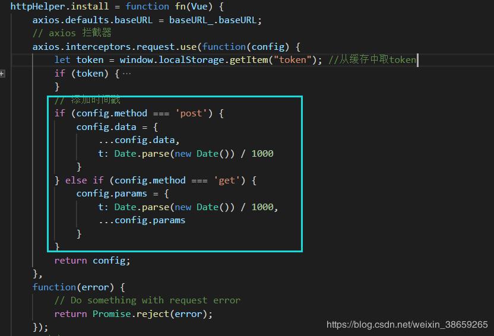

## Vue

框架：nuxt、element、ant、vant

### 过滤器：

```js
{{new Date() || formatDate('yyyy-MM-dd HH:mm:ss')}}

Vue.filter('formatDate'),function(value,format='yyyy-MM-dd'){
	//format='yyyy-MM-dd' es6写法，默认值 yyyy-MM-dd
    return '';
}
```


### 统计：

```js
let items = [1,2,3,4,5];
return this.items.reduce((preTotal,item) => preTotal+item ,0)
```


### 内置指令：

这些指令解析后，查看HTML就会消失，v-cloak就是利用这一点防止闪现

```txt
v:text		更新元素的testContent
v-html		更新元素的innerHTML
v-if		如果为true,当前标签才会输出到页面
v-else 		如果为false,当前标签才会输出到页面
v-show		通过控制display样式来控制显示/隐藏
v-for		遍历数组/对象
v-on		绑定那个事件,一般简写为@
v-bind		强制绑定解析表达式,一般简写为:
v-model		栓香港i昂数据绑定
ref			为某个元素注册一个唯一表示,vue独享通过$rels属性访问这个元素对象
v-cloak		使用它防止闪现表达式,与css配合:[v-cloak]{display:none}
```


### 定义指令：

全局指令

```js
<p v-upper-text="'Just do It'"></p>

Vue.directive('upper-text',function(el,binding){
    console.log(el,binding);
    el.textContent = binding.value.toUpperCase();
})
```

局部指令

```js
<p v-lower-text="msg">Just do It</p>

new Vue({
    el:"#app",
    data:{
       msg:"Just like this"
    },
    directives:{
    	'lower-text':function(el,binding){
        	el.textContent = binding.value.toLowerCase();
            //文本内容变成小写，仅仅是文本内容，msg变量内容不变
    	}
    }
})
```


### 绑定监听：

```js
<button @click="test1()>test1</button>
<button @click="test2('123')">test2</button>
<button @click="test2('123',$event)">test2</button>

new Vue({
    el:"#app",
    data:{
        test1(event){
            alert(event.target.innerHTML);//输出test1
        },
        test2(content){
            alert(content);//输出123
        },
        test1(content,event){
            alert(content);//输出123
            alert(event.target.innerHTML);//输出test
        }
    }
})
```


### 时间修饰符：

```html
<!-- 阻止单击事件冒泡 -->
<a @click.stop="doThis"></a>

<!-- 提交事件不再重载页面，阻止事件默认行为 -->
<form @submit.prevent="onSubmit"></form>

<!-- 修饰符可以串联  -->
<a @click.stop.prevent="doThat"></a>

<!-- 只当事件在该元素本身（而不是子元素）触发时触发回调 -->
<div @click.self="doThat">...</div>

<!-- click 事件只能点击一次，2.1.4版本新增 -->
<a @click.once="doThis"></a>
```


### 按键修饰符：

```html
<input @keyup.enter="submit">
<input @keyup.delete (捕获 "删除" 和 "退格" 键)="submit">
```


### 自定义事件：

```js
1.绑定事件
<TodoHeader @addTodo="addTodo" ref='header'/>
<!-- 声明ref，再js中能调用该组件，this.$refs.header -->

2.触发事件
const data {
    name:'_Cps',
    check:true
};
this.$emit('addTodo',data);
```


### 插件：

```js
/*********Begin-MyPlugin.js*********/
(function (window) {
      const MyPlugin = {}
      MyPlugin.install = function (Vue, options) {
        // 1. 添加全局方法或属性
        Vue.myGlobalMethod = function () {
          console.log('Vue函数对象的myGlobalMethod()')
        }

        // 2. 添加全局资源
        Vue.directive('my-directive',function (el, binding) {
          el.textContent = 'my-directive----'+binding.value
        })

        // 4. 添加实例方法
        Vue.prototype.$myMethod = function () {
          console.log('vm $myMethod()')
        }
      }
      //向外暴露
      window.MyPlugin = MyPlugin
})(window)
/*********End-MyPlugin.js*********/

<div id="test">
  <p v-my-directive="msg"></p>
</div>

<script type="text/javascript" src="../js/vue.js"></script>
<script type="text/javascript" src="vue-myPlugin.js"></script>
<script type="text/javascript">
  Vue.use(MyPlugin) // 声明使用插件,内部会调用插件对象的install()
  const vm = new Vue({
    el: '#test',
    data: {
      msg: 'HaHa'
    }
  });
  Vue.myGlobalMethod();
  vm.$myMethod();
</script>
```


### 生命周期：

```
1.beforeCreate
	数据模型未加载
	方法未加载
	html模板未加载

2.created
	数据模型已加载
    方法已加载
    html模板已加载(可以获取到)
    html模板未渲染(获取的是{{num}})

3.beforeMount
	html模板未渲染

4.mounted
	html已渲染

5.beforeUpdate
	数据模型已更新
	html模板未更新

6.update
	数据模型已更新
	html模板已更新
    	
```


```js
new Vue({
    el:"#app",
    data:{
        isShow = true;
    },
    mounted(){//初始化显示之后立即调用
        this.intervalId = setInterval(
        	consolot.log('-------');
        	this.isShow = !this.isShow
        ),1000)
    },
    beforeDestory(){//死亡之前调用
        //清除定时器
        clearInterval(this.intervalId);//这里能调到intervarId，只因为初始化给了vue实例
    }
})
```


### Vue组件化编码

1. 拆分组件
2. 静态组件
3. 动态组件（初始化显示、交互）


### 消息订阅与发布

组件进行通信，没有任何位置的限制，就不用组件间传递数据了

```js
cnpm install  --save pubsub-js

import PubSub from pubsub-js

//订阅消息
PubSub.subscribe('deleteTodo',function(msg,data){
    //这里面的this就不是代表vue组件了可以这样写下面
})

//发布消息
PubSub.publish('deleteTodo',param)

---------------------------------------------------------------------------------------

//订阅消息
PubSub.subscribe('deleteTodo',(msg,data) => {
	//这里的this就可以代表vue组件，这个函数没有自己的this，就会使用外部的this
})

//发布消息
PubSub.publish('deleteTodo',(msg,data) => {
    //其他知识，如果是要返回对象的话,这样写 => ({
    //
	//})
})

```

### slot

此方式用于父组件向子组件传递`标签数据`

```js
//子组件
<template>
	<div>
        <slotname="xxx">不确定的标签结构 1</slot>
        <div>组件确定的标签结构</div>
        <slotname="yyy">不确定的标签结构 2</slot>
	</div>
</template>

//父组件
<div>
    <divslot="xxx">xxx 对应的标签结构</div>
    <divslot="yyy">yyyy 对应的标签结构</div>
</div>
```


### 路由参数

```js
1、手写完整的 path:
 
    this.$router.push({path: `/user/${userId}`});
 
    //获取参数：this.$route.params.userId
 
2、用 params 传递：
 
    this.$router.push({name:'user', params:{userId: '123'}});
 
    //获取参数：this.$route.params.userId
    //url 形式：url 不带参数，http:localhost:8080/#/user
 
3、用 query 传递：
 
    this.$router.push({path:'/user', query:{userId: '123'}});
 
    //获取参数：this.$route.query.userId
    //url 形式：url 带参数，http:localhost:8080/#/user?userId=123

/**
    this.$router.push({path:'/user', params:{userId}});  //->/user
    //这里的 params 不生效,如果提供了 path，则params 会被忽略
    
    query  相当于 get 请求，页面跳转的时候可以在地址栏看到请求参数，
    params 相当于 post 请求，参数不在地址栏中显示。
    要注意，以 / 开头的嵌套路径会被当作根路径。 这让你充分的使用嵌套组件而无须设置嵌套的路径。
*/
```


### 路由监听

```
//监听
watch:{
	//路由变化发生变化，则会执行该代码块
	$router(to,from){
		//同一个组件点击两次，不会再次执行created方法，所以有时候需求可能要进行一些处理。
	}
}
```


### Ajax请求

一、vue-resource模块

```js
//在项目中安装
cnpm install vue-resource --save

// 引入模块 
importVueResourcefrom'vue-resource' 
// 使用插件 
Vue.use(VueResource)
// 通过 vue/组件对象发送 ajax 请求 
this.$http.get('/someUrl').then((response)=>{ //successcallback 
    console.log(response.data)//返回结果数据
},(response)=>{ //errorcallback
    console.log(response.statusText)//错误信息
})
```

二、axios模块

```js
//在项目中安装
cnpm install axios --save

// 引入模块 
import axios from 'axios'

// 发送 ajax 请求 
axios.get(url) .then(response=>{ 
    console.log(response.data)// 得到返回结果数据 
}) .catch(error=>{ 
    console.log(error.message)//错误信息
})
```


### Vue + Axios 导入Excel

```js
import reqwest from 'reqwest'

//真正的导入
handleOkImport(e) {
    let _this = this;
    const { fileList } = this;
    const formData = new FormData();
    if(fileList.length==0){
        this.$message.warning('请选择文件!');
    }else{
        fileList.forEach((file) => {
            formData.append('file', file);
        });
        //console.log("fileList:"+fileList[0]);
        reqwest({
            url: _this.apiUrl+'importAttendance/importExcel',
            method: 'post',
            processData: false,
            data: formData,
            success: (result) => {
                if(result.code=='200'){
                    this.fileList = []
                    this.uploading = false
                    this.$message.success('导入成功!');
                    this.visibleImport = false;
                }else{
                    this.uploading = false
                    this.$message.error(result.message);
                }
                this.getLogList();
            },
            error: () => {
                this.uploading = false
                this.$message.error('导入失败!');
            },
        });
    }

},
```


### Vue + Ant 兼容IE浏览器

参考：[兼容性](https://blog.csdn.net/lydxwj/article/details/89912983)

babel.config.js`文件

```js
module.exports = {
  presets: [
    '@vue/app',
    // 兼容配置
    [
      '@babel/preset-env',
      {
        'useBuiltIns': 'entry'
      }
    ]
  ],
  // 按需加载配置
  plugins: [
    [
      'import',
      {
        libraryName: 'ant-design-vue',
        libraryDirectory: 'es',
        style: 'css'
      },
    ]
  ]
}
```


`main.js`文件（项目入口）

```js
// 引入@babel/polyfill处理兼容 
import '@babel/polyfill'

import Vue from 'vue'
import App from './App.vue'
import router from './router/router'
import store from './store/store'
import './plugins/antd.js'
new Vue({
  router,
  store,
  render: h => h(App)
}).$mount('#app')
```


防止数据读取缓存

参考：[防止数据读取缓存](https://blog.csdn.net/weixin_38659265/article/details/90265999)



```js
//我们可以在封装axios时，默认给请求加上时间戳，下面是给get和post请求默认添加时间戳：
// 添加时间戳       
 if (config.method === 'post') {            
 	config.data = {                
 		...config.data,                
 		t: Date.parse(new Date()) / 1000           
 	}       
 } else if (config.method === 'get') {          
 	 config.params = {               
 	 	 t: Date.parse(new Date()) / 1000,               
 	 	...config.params            
 	}       
 }
```


IE路由页面路由 不刷新问题，在App.vue页面

```js
mounted() {
    if (!!window.ActiveXObject || "ActiveXObject" in window) {
      window.addEventListener(
        "hashchange",
        () => {
          let currentPath = window.location.hash.slice(1);
          if (this.$route.path !== currentPath) {
            this.$router.push(currentPath);
          }
        },
        false
      );
    }
}
```


`router.js`，要考虑，IE路由问题，IE的URL如果加 ''#'' 号，页面则不会刷新，所以要想办法去掉路由中的 ''#'' 号

```js
export default new Router({
  mode : "history",	//该属性可以去掉 #
  routes: [ 
    {
      path: '/admin',
      component: admin
    },{
      path: '/home',
      component: home
    }
  ]
})
```


如果去掉了#号，Vue打包过后找不到页面解决办法

参考：[页面找不到](https://blog.csdn.net/IsITMan/article/details/85121729)

```

```


### Vue + Ant 中文国际化配置

```vue
<template>
  <a-locale-provider :locale="locale">
    <router-view/>
  </a-locale-provider>
</template>

<script>

import zhCN from "ant-design-vue/lib/locale-provider/zh_CN";
export default {
  data() {
    return {
      locale: zhCN
    };
  }
}
```


### Vue + Ant 表格分页

参考：[表格分页](https://www.cnblogs.com/zhaogaojian/p/11162280.html)

1、设置pagination

```html
 <a-table :columns="columns" :dataSource="data" :rowSelection="rowSelection" 	:pagination="pagination">
     <a slot="action" href="javascript:;">查看</a>
  </a-table>
```

2、自定义pagination，注意写成onChange,change不行，灰色部分请根据自己实际代码修改。

```js
data () {
    let _this = this;
    return {
      collapsed: false,
      data,
      sels,
      columns,
      rowSelection,
      pagination: {
        pageNo: 1,
        pageSize: 20, // 默认每页显示数量
        showSizeChanger: true, // 显示可改变每页数量
        pageSizeOptions: ['10', '20', '50', '100'], // 每页数量选项
        showTotal: total => `Total ${total} items`, // 显示总数
        onShowSizeChange: (pageNo, pageSize) => _this.changePage(1,pageSize),
        onChange:(pageNo,pageSize)=>_this.changePage(pageNo,pageSize),//点击页码事件
        total:0 //总条数
       }
    }
  },
```

3、Ajax读取数据列表时pagination.total赋总条数即可

```js
.then((response) => {
    that.data = response.data.items
    that.pagination.total=response.data.total
    console.log(response)
})
```

4、定义改变页码事件

```js
changePage(pageNo,pageSize){
    that.pagination.pageNo = pageNo;
    that.pagination.pageSize = pageSize;
    searchUser();//请求数据
}
```

5、读取数据时带上当前页、分页大小，过滤条件，后端代码可以简单使用通用分页方法返回Json数据即可，

```js
searchUser () {
    let param= {pageNo:this.pagination.pageNo,pageSize:this.pagination.pageSize};
    this.getUser(param);
},
```


### Vue 组件数据双向绑定

参考：[双向绑定](https://blog.csdn.net/w390058785/article/details/81076569)

```js
<body>
<script src="https://cdn.bootcss.com/vue/2.5.16/vue.js"></script>
<div id="box">
    <new-input v-bind:name.sync="name"></new-input>
    {{name}}
</div>
<script>
	Vue.component('new-input',{
        props: ['name'],
        data: function(){
            return {
                newName: this.name
            }	
        },
        template:'<label><input @keyup="changeName" v-model="newName" />你的名字</label>',
        methods: {
            changeName: function(){
                this.$emit('update:name',this.newName);
            }
        }	
    });
    new Vue({
        el:'#box',	
        data: {
        	name:'nick'		
        }
    });
</script>
</body>

/* ------------------------------------------------------------------------------- */
/*
	通过与方法一进行比较：会发现

    <new-input v-bind:name="name" v-on:update:name="name = $event"></new-input>

    被简化成了

    <new-input v-bind:name.sync="name"></new-input>

    而其他代码不变。

    所以我们在使用.sync修饰符的时候，只需要注意，v-bind:xx，v-on:update:xx，v-bind:xx.sync的差异就行了。

    而且注册事件的时候一定要用this.$emit( 'update:xx' );

*/

```


### VS Code 设置vue模板

```json
{
	"生成vue模板": {
		"prefix": "vue",
		"body": [
			"<template>",
			"  <div></div>",
			"</template>",
			"",
			"<script>",
			"  //这里可以导入其他文件（比如：组件，工具js，第三方插件js，json文件，图片文件等等）",
			"  //例如：import《组件名称》from'《组件路径》';",
			"",
			"  export default {",
			"    //import引入的组件需要注入到对象中才能使用",
			"    components:{},",
			"    props:{},",
			"    data(){",
			"      //这里存放数据",
			"      return{",
			"",
			"      };",
			"    },",
			"    //计算属性类似于data概念",
			"    computed:{},",
			"    //监控data中的数据变化",
			"    watch:{},",
			"    //方法集合",
			"    methods:{",
			"",
			"    },",
			"    //生命周期-创建完成（可以访问当前this实例）",
			"    created(){",
			"",
			"    },",
			"    //生命周期-挂载完成（可以访问DOM元素）",
			"    mounted(){",
			"",
			"    },",
			"    //生命周期-创建之前",
			"    beforeCreate(){},",
			"    //生命周期-挂载之前",
			"    beforeMount(){},",
			"    //生命周期-更新之前",
			"    beforeUpdate(){},",
			"    //生命周期-更新之后",
			"    updated(){},",
			"    //生命周期-销毁之前",
			"    beforeDestroy(){},",
			"    //生命周期-销毁完成",
			"    destroyed(){},",
			"    //如果页面有keep-alive缓存功能，这个函数会触发",
			"    activated(){},",
			"  }",
			"</script>",
			"",
			"<style scoped>",
			"  $4",
			"</style>"
		],
		"description": "生成vue模板"
	},
	"http-get 请求": {
		"prefix": "httpget",
		"body": [
			"this.\\$http({",
			"  url: this.\\$http.adornUrl(''),",
			"  method: 'get',",
			"  params: this.\\$http.adornParams({})",
			"}).then(({data}) => {",
			"",
			"})"
		],
		"description": "httpGET 请求"
	},
	"http-post 请求": {
		"prefix": "httppost",
		"body": [
			"this.\\$http({",
			"  url: this.\\$http.adornUrl(''),",
			"  method: 'post',",
			"  data: this.\\$http.adornData(data, false)",
			"}).then(({ data }) => {",
			"",
			"});"
		],
		"description": "httpPOST 请求"
	}
}
```

