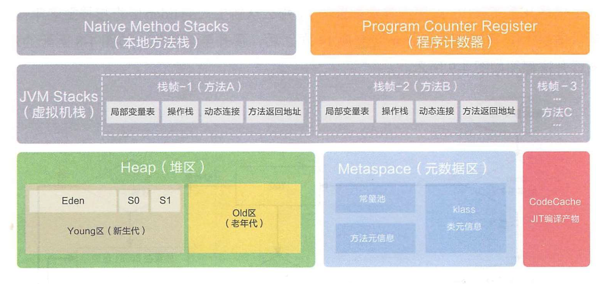
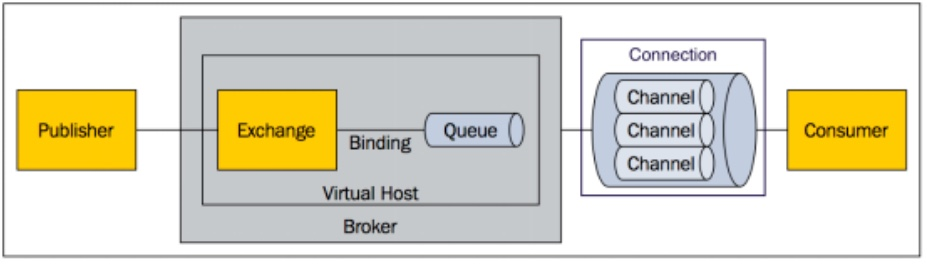

​		

## Keyboard

源码		ctrl + /

目录		[toc]

标题		ctrl + 数字

表格		ctrl+t 

标签		`code`

代码块		ctrl + shift + k

水平线		*** 

超链接		ctrl+k [百度][www.badu.com] <www.baidu.com>

下划线		ctrl+u

表情		😄 

高亮		==高亮==

加粗   		 **内容**	Ctrl+B 

倾斜		*内容*  	Ctrl+I 

删除线		~~内容~~ 	 Alt+Shift+5 

插入图片		ctrl+shift+i

有序列表		数字+英文小数点(.)+空格 

无序列表		+、- 、* + 空格创建


#IDEA快捷键


Ctrl + R, 可以替换	

Ctrl + H,  显示类结构图

Ctrl＋N，可以快速打开类

Ctrl＋E，可以显示最近编辑的文件列表

Ctrl＋F12，可以显示当前文件的结构

Ctrl＋Alt＋L 整理代码

Alt+ left/right 切换代码视图


## 数据库

### SQL	ACID

```
A	原子性
C 	一致性
I 	隔离性
D 	持久性
```


### NoSQL	CAP + BASE

```
C	强一致性
A	高可用性
P	分区容错性
BASE	基本可用 软状态 最终一致

它的思想是通过系统放松某一时刻数据一致性的要求，来换取系统整体伸缩性和性能上改观
```


### CAP

参考：[CAP 定理的含义](http://www.ruanyifeng.com/blog/2018/07/cap.html)


16个库

select 0-15 	切换

DBSIZE		 查看当前库有多少key

plushDB	清除当前库的key

plushALL	 清除所有库的key


### SQL语句

| 操作               | 语句                                                         |
| ------------------ | :----------------------------------------------------------- |
| 表关联更新         | update u set u.money= u.money+10 <br />from user u <br />inner join dept d on d.id = u.deptId and deptName = '开发' |
| 表关联删除         | delete u <br />from user u<br/>inner join dept d on d.id = u.deptId and deptName = '开发' |
| 表关联插入         | insert into user_new(id,name) <br />select  id,name  from user |
| 创建新表并赋予数据 | select id,name <br />into user_new from user                 |


### 索引面试题

参考: [索引面试题](https://www.cnblogs.com/Brambling/p/6754993.html)


### ROW_NUMBER() OVER()函数用法详解 （分组排序 例子多）

参考：[ROW_NUMBER() OVER()函数用法详解](https://blog.csdn.net/qq_25221835/article/details/82762416)

```sql
-- 根据dept_id分组
select name,dept_id,salary,row_number() over (partition by dept_id order by salary desc) rank
from user t
```


### SQL Server 知识点

```sql
三元运算

	iif(布尔,值1,值2)		

截取
	substring(值，开始位置，长度)
	select substring('123456',2,2)

```


### SQL Server JSON转表

```sql
declare @users varchar(max) = '[{"id":1,"name":"Cps"},{"id":2,"name":"Xy"}]'		

SELECT *  INTO #users
FROM OPENJSON(@users)
WITH (
    id  INT,
    name varchar(200)
)
```


### SQL Server 表拼接SQL

```sql
-- 需要修改的排班（那些存在的数据）
DECLARE @update_update VARCHAR(MAX)=''
SELECT @update_update+='UPDATE kt_paiba SET '+col_name+'='''+isnull(value,'')+''',gly_no = '''+@operator+''' WHERE rq='''+year_month+''' AND user_serial='+CAST(user_serial AS VARCHAR(10))+';'
FROM #result_update a

-- 执行拼接的SQL
EXEC(@update_update)	
```


### SQL Server 行专列

参考：[SQL Server 行专列](https://www.cnblogs.com/Rawls/p/11027413.html)


### SQL Server 字段行转列

```sql
-- 拆分数据，行转列
-- APPLY有两种形式，一个是OUTER APPLY，一个是CROSS APPLY，区别在于指定OUTER，意味着结果集中将包含使右表表达式为空的左表表达式中的行，而指定CROSS，则相反，结果集中不包含使右表表达式为空的左表表达式中的行。

SELECT
	v.value
FROM zt_glbc t
CROSS APPLY STRING_SPLIT(CAST(t.Valuse AS VARCHAR(MAX)), ',') v
WHERE bh = 13
```


### SQL Server 判断表或存储过程

```sql
--判断表
if   object_id('tb_table') is not null  
	print 'exist' 
else 
	print'not exist' 

--判断存储过程
if exists (select 1
          from sysobjects
          where  id = object_id('bdSettlementDept')
          and type in ('P','PC'))
   drop procedure bdSettlementDept
go
```


### SQL Server存储过程

```sql
USE scm_main;
-- 需要先创建拆分字符串存储过程（split_str）
if exists (select 1
          from sysobjects
          where  id = object_id('bd_proc_schedule_gui_lv')
          and type in ('P','PC'))
DROP PROCEDURE bd_proc_schedule_gui_lv
GO
CREATE PROCEDURE bd_proc_schedule_gui_lv
	@user_serial_str varchar(max),
	@begin_date date,
	@end_date date,
	@ban_ci int,
	@ip varchar(max),
	@operator varchar(max)
as
BEGIN

-- 关闭打印受影响行数
SET NOCOUNT ON;


-- 定义返回受影响行数结果
	declare @result int = 0;


	--  异常扑捉机制
		BEGIN TRY

			CREATE TABLE #ban_ci(
				id INT IDENTITY,
				name VARCHAR(20)
			)

			CREATE TABLE #user_serial(
				id INT IDENTITY,
				user_serial VARCHAR(20)
			)

			CREATE TABLE #result(
			  user_serial  INT,
			  col_name VARCHAR(20),
			  value VARCHAR(100),
			  date DATE,
			  year_month VARCHAR(10)
			)

			CREATE TABLE #result_insert(
			  user_serial  INT,
			  col_name VARCHAR(20),
			  value VARCHAR(100),
			  date DATE,
			  year_month VARCHAR(10)
			)

			CREATE TABLE #result_update(
			  user_serial  INT,
			  col_name VARCHAR(20),
			  value VARCHAR(100),
			  date DATE,
			  year_month VARCHAR(10)
			)


			CREATE TABLE #kt_paiba (
			  user_serial bigint NOT NULL,
			  rq nvarchar(10) NOT NULL,
			  d1 varchar(100) NULL,
			  d2 varchar(100) NULL,
			  d3 varchar(100) NULL,
			  d4 varchar(100) NULL,
			  d5 varchar(100) NULL,
			  d6 varchar(100) NULL,
			  d7 varchar(100) NULL,
			  d8 varchar(100) NULL,
			  d9 varchar(100) NULL,
			  d10 varchar(100) NULL,
			  d11 varchar(100) NULL,
			  d12 varchar(100) NULL,
			  d13 varchar(100) NULL,
			  d14 varchar(100) NULL,
			  d15 varchar(100) NULL,
			  d16 varchar(100) NULL,
			  d17 varchar(100) NULL,
			  d18 varchar(100) NULL,
			  d19 varchar(100) NULL,
			  d20 varchar(100) NULL,
			  d21 varchar(100) NULL,
			  d22 varchar(100) NULL,
			  d23 varchar(100) NULL,
			  d24 varchar(100) NULL,
			  d25 varchar(100) NULL,
			  d26 varchar(100) NULL,
			  d27 varchar(100) NULL,
			  d28 varchar(100) NULL,
			  d29 varchar(100) NULL,
			  d30 varchar(100) NULL,
			  d31 varchar(100) NULL,
			  gly_no nvarchar(10) NULL,
			  year int ,
			  month int ,
			)


		-- 开启事务
			BEGIN TRAN


				-- 拆分用户编号保存临时表中
				insert into #user_serial
				select * from string_split(@user_serial_str,',');

				-- 先清除表中存在的数据
				--delete a
				--from kt_paiba a
				--inner join #user_serial b on a.user_serial = b.user_serial
				--where a.rq = CONVERT(varchar(7),@begin_date,120) or a.rq = CONVERT(varchar(7),@end_date,120)


				-- 拆分班次保存临时表中
				INSERT INTO #ban_ci
				SELECT v.value FROM zt_glbc t CROSS APPLY STRING_SPLIT(CAST(t.Valuse AS VARCHAR(MAX)), ',') v WHERE bh = @ban_ci

				declare @lx int;
				select @lx = lx from zt_glbc where bh = @ban_ci;

				-- 规律班次类型：周
				IF @lx = 1 BEGIN
					INSERT INTO #result (user_serial, col_name, value, date, year_month)
					select t1.user_serial,t2.* from  (select * from #user_serial) t1,
					(
						SELECT 'd'+CAST(d.date_day AS VARCHAR(2)) colName, b.name,d.date,CONVERT(VARCHAR(7),date,120) date_month
						FROM bd_sys_dim_date d
						LEFT JOIN #ban_ci b ON b.id=d.date_week
						WHERE date >= @begin_date AND date <= @end_date
					) t2
				END
				-- 按月或者日
				ELSE BEGIN
					INSERT INTO #result (user_serial, col_name, value, date, year_month)
					select t1.user_serial,t2.* from  (select * from #user_serial) t1,
					(
						SELECT 'd'+CAST(d.date_day AS VARCHAR(2)) colName, b.name,d.date,CONVERT(VARCHAR(7),date,120) date_month
						FROM bd_sys_dim_date d
						LEFT JOIN #ban_ci b ON b.id=d.date_day
						WHERE date >= @begin_date AND date <= @end_date
					) t2
				END


				-- select * from A,B 不指定条件那么会产生A的所有B数据，刚好满足需求
				--INSERT INTO #result (user_serial, col_name, value, date, year_month)
				--select t1.user_serial,t2.* from  (select * from #user_serial) t1,
				--(
				--	SELECT 'd'+CAST(d.date_day AS VARCHAR(2)) colName, b.name,d.date,CONVERT(VARCHAR(7),date,120) date_month
				--	FROM bd_sys_dim_date d
				--	LEFT JOIN #ban_ci b ON b.id=d.date_week
				--	WHERE date >= @begin_date AND date <= @end_date
				--) t2


				-- 需要新增的数据 #result_insert
				insert into #result_insert(user_serial,col_name,value,date,year_month)
				select a.user_serial,a.col_name,a.value,a.date,a.year_month
				from #result a
				inner join (
					select user_serial,convert(varchar(7),date,120) year_month from #result
					except
					select user_serial,rq as year_month from kt_paiba
				) b on a.user_serial = b.user_serial and a.year_month = b.year_month


				-- 需要修改的数据 #result_update
				insert into #result_update(user_serial,col_name,value,date,year_month)
				select a.user_serial,a.col_name,a.value,a.date,a.year_month
				from #result a
				inner join (
					select user_serial,convert(varchar(7),date,120) year_month from #result
					Intersect
					select user_serial,rq as year_month from kt_paiba
				) b on a.user_serial = b.user_serial and a.year_month = b.year_month


				-- select * from #result_insert
				-- select * from #result_update
				-- select * from #result

				-- 将插入的数据存入到临时排班表中
				-- 下面两段代码将竖着的数据转为了横着的数据
				INSERT INTO #kt_paiba (user_serial, rq, gly_no, year, month)
				SELECT distinct a.user_serial,CONVERT(VARCHAR(7),date,120),@operator,YEAR(date),MONTH(date)
				FROM #result_insert a


				-- 循环拼接需要更新临时表中的字段
				-- 查询（循环）拼接数据（竖着循环）
				DECLARE @update_insert VARCHAR(MAX)=''
				SELECT @update_insert+='UPDATE #kt_paiba SET '+col_name+'='''+value+''',gly_no = '''+@operator+''' WHERE rq='''+year_month+''' AND user_serial='+CAST(a.user_serial AS VARCHAR(10))+';'
				FROM #result_insert a


				-- 执行拼接的语句
				EXEC(@update_insert)


				-- 从临时表插入到真实表中
				insert into kt_paiba
				select * from #kt_paiba


				-- 需要修改的排班（那些存在的数据）
				DECLARE @update_update VARCHAR(MAX)=''
				SELECT @update_update+='UPDATE kt_paiba SET '+col_name+'='''+value+''',gly_no = '''+@operator+''' WHERE rq='''+year_month+''' AND user_serial='+CAST(user_serial AS VARCHAR(10))+';'
				FROM #result_update a


				-- 执行拼接的SQL
				EXEC(@update_update)


				-- 新增的生成日志记录
				insert into wt_log(log_fun,log_type,log_detail,gly_no,log_time,log_computer,log_ip,regserial)
				select distinct 13,1,isnull(@operator,'')+'录入'+isnull(b.user_lname,'')+isnull(a.year_month,'')+'排班',isnull(@operator,''),getdate(),'',isnull(@ip,''),''
				from #result_insert a
				inner join dt_user b on a.user_serial = b.user_serial

				set @result = @result + @@ROWCOUNT;


				--更新的生成日志记录
				insert into wt_log(log_fun,log_type,log_detail,gly_no,log_time,log_computer,log_ip,regserial)
				select distinct 13,1,isnull(@operator,'')+'更新'+isnull(b.user_lname,'')+isnull(a.year_month,'')+'排班',isnull(@operator,''),getdate(),'',isnull(@ip,''),''
				from #result_update a
				inner join dt_user b on a.user_serial = b.user_serial


				set @result = @result + @@ROWCOUNT;


		--  提交事务
			COMMIT TRAN

	--  结束异常捕捉
		END TRY

	--  异常处理
		BEGIN CATCH
			DECLARE @errStr VARCHAR(MAX) = ERROR_MESSAGE();
			IF XACT_STATE() <> 0
			BEGIN
			  ROLLBACK TRANSACTION;
			  RAISERROR (@errStr, 16, 1);
			END;
			ROLLBACK TRAN;
		END CATCH


--  清除临时表
	select @result as result
	DROP TABLE #ban_ci
	DROP TABLE #user_serial
	DROP TABLE #kt_paiba

-- 打开打印受影响行数
SET NOCOUNT OFF;
END;

```


### Oracle 使用SQL备份与恢复

```sql
1.1 完全备份
exp demo/demo@orcl buffer=1024 file=d：\back.dmp full=y

1.2 完全还原
imp demo/demo@orcl file=d:\back.dmp full=y ignore=y log=D:\implog.txt

2.1 导出指定表
exp demo/demo@orcl file=d:\backup2.dmp tables=(teachers,students)

2.2 导入指定表
imp demo/demo@orcl file=d:\backup2.dmp tables=(teachers,students)
```

详情：https://blog.csdn.net/yztezhl/article/details/80451046


### SQL Server 留下的坑

```
循环查询数据赋给变量时，一定要加上 isnull(字段,'') ，这样即使当前没有查到，也不会影响下次遍历的数据
```


### SQL Server Merge用法

参考：[Merge](https://www.cnblogs.com/Vincent-yuan/p/11521229.html)

```sql

MERGE target_table USING source_table
ON merge_condition
WHEN MATCHED
    THEN update_statement
WHEN NOT MATCHED
    THEN insert_statement
WHEN NOT MATCHED BY SOURCE
    THEN DELETE;
------------------------------------------------
MERGE sales.category t 
    USING sales.category_staging s
ON (s.category_id = t.category_id)
WHEN MATCHED
    THEN UPDATE SET 
        t.category_name = s.category_name,
        t.amount = s.amount
WHEN NOT MATCHED BY TARGET 
    THEN INSERT (category_id, category_name, amount)
         VALUES (s.category_id, s.category_name, s.amount)
WHEN NOT MATCHED BY SOURCE 
    THEN DELETE;
    
```


### SQL Server、My SQL、Oracle 数据库分页

取出sql表中第31到40的记录（以自动增长ID为主键）

> MySQL

```sql
select * from t order by id limit 0,10
```


> Oracle

```sql
select * from (select rownum r,* from t where r<=40) where r>30
```

​	

> SQL Server

```sql
select top 10 * from t where id not in (select top 30 id from t order by id ) orde by id

select top 10 * from t where id in (select top 40 id from t order by id) order by id desc


select * from t order by id
offset (4-1) * 10 rows
fetch next @pageSize rows only;
```


## Linux


### CentOS 6系列弹性云服务器如何安装图形化界面？

1. 执行以下命令，查看当前操作系统提供的安装组件。

   ```Linux
   # yum grouplist
   ```

2. 执行以下命令，安装图形桌面组件。

   ```Linux
   # yum groupinstall 'Desktop' -y
   ```

3. 执行命令，切换为图形操作页面

   ```Linux
   # init 5
   ```

   

   ## VM网络适配器

   


**桥接模式：**直接连到物理网络，就是直接分配IP地址，同网络下，别人也可以访问该IP

**NAT模式：**本机会产生另一个IP地址，该IP与虚拟机有关联，同网络下，别人无法访问该虚拟机IP，但虚拟机可以访问别人电脑

**注意：**一般都会用NAT模式，使用NAT模式，需要在虚拟机上点击右上方的网络，该虚拟机就可以连网了


### VM Tools安装步骤


**解压/压缩：**tar -zxvf 文件名 


### Linux赋予权限

```Linux
chmod 777 xx
```

### Linux进程相关

```linux
ps -auxf
ps -ef | grep tomcat
ps -ef | grep java 
kill -9 进程号
```

### Linux后台运行项目

```
nohup ./startup.sh &
nohup java -jar weChat.jar &
```

### Linux置JAVA环境

/etc/profile 文件

```Linux
#JAVA的JDK配置
export JAVA_HOME=/usr/java/jdk1.8.0_102
export PATH=$PATH:$JAVA_HOME/bin
export CLASSPATH=.:$JAVA_HOME/lib/dt.jar:$JAVA_HOME/lib/tools.jar
```

### Linux安装ysql数据库

**安装教程**	

​		https://www.cnblogs.com/sh635208/p/10018334.html

**无法远程**

​		

1. 在装有MySQL的机器上登录MySQL mysql -u root -p密码
2. 执行 `use mysql;`
3. 执行 `update user set host = '%' where user = 'root';` 这一句执行会报错，不用管它
4. 执行 `FLUSH PRIVILEGES;`

**注: 第四步是刷新MySQL的权限相关表，一定不要忘了，就这一步最重要**


### MySQL数据总显示 '' ? ''

1. 编辑my.cnf文件 默认路径都在 `vi /etc/my.cnf`

2. 添加配置

   ```Linux
   [mysqld]
   character-set-server=utf8 //添加该语句
   lower_case_table_names=1  //改配置可以忽略大小写
   
   [client]
   default-character-set=utf8 //添加该语句
   ```

3. 运行代码，重启MySQL服务

   ```Linux
   service mysqld restart
   ```


## Windows


### JAVA 版本

> JAVA SE 标准版开发 主要用于桌面程序,控制台开发(JFC)

> JAVA EE 企业级开发，主要用于web端(JSP,EJB)       

> JAVA ME嵌入式开发(手机,小家电)


### JAVA8 的Stream API使用

参考：[JAVA8 的Stream API使用](https://www.cnblogs.com/jimoer/p/10995574.html)


### JAVA反射机制

参考：[JAVA反射机制](https://www.cnblogs.com/hechenhao/p/8039639.html)  [JAVA反射机制](https://blog.csdn.net/liujiahan629629/article/details/18013523?depth_1-utm_source=distribute.pc_relevant.none-task&utm_source=distribute.pc_relevant.none-task)  

```java
private static object getFieldValueByName(String fieldName, object o) throws Exception {
	String firstLetter = fieldName.substring(0,1).toUpperCase() ;
	String getter = "get" + firstLetter + fieldName.substring(1);
	Method method = o.getClass().getMethod(getter, new Class[] {});
	Object value = method.invoke(o, new Object[] {});
    System.out.println("fieldName>>>>>>"+filedName+" val: "+String.valueOf(value));
	return value;
}
```


### JAVA多线程

参考：[JAVA多线程](https://blog.csdn.net/zl1zl2zl3/article/details/81868173)  [对象锁、锁池、等待池](https://blog.csdn.net/u014561933/article/details/58639411)


### Executors创建的4种线程池的使用 

1. newCachedThreadPool创建一个可缓存线程池，如果线程池长度超过处理需要，可灵活回收空闲线程，若无可回收，则新建线程。
2. newFixedThreadPool 创建一个定长线程池，可控制线程最大并发数，超出的线程会在队列中等待。
3. newScheduledThreadPool 创建一个定长线程池，支持定时及周期性任务执行。
4. newSingleThreadExecutor 创建一个单线程化的线程池，它只会用唯一的工作线程来执行任务，保证所有任务按照指定顺序(FIFO, LIFO, 优先级)执行。


### 多线程使用

```java
ExecutorService cachedThreadPool = Executors.newCachedThreadPool();
            Integer numThread = 200;//每个线程携带200条数据
            Integer count = list.size() % numThread == 0 ? list.size()/numThread : (list.size()/numThread + 1);
            //记录线程个数
            CountDownLatch latch = new CountDownLatch(count);
            for (int i = 0; i < count; i++) {
                int index = i;
                cachedThreadPool.execute(new Runnable() {
                    @Override
                    public void run() {
                        try {
                            if(index == count-1){//最后一次
                                List<ImportAttendance2> subList = list.subList(index * numThread,list.size());
                                importAttendanceMapper.importAttendanceData(subList);
                            }else{//除了最后一次
                                List<ImportAttendance2> subList = list.subList(index * numThread,index * numThread + numThread);
                                importAttendanceMapper.importAttendanceData(subList);
                            }
                        }catch (Exception e){
                            e.printStackTrace();
                        }finally {
                            latch.countDown();
                        }
                    }
                });
            }
            //等待所有线程执行完
            latch.await();
            //异步执行同步存储过程
            cachedThreadPool.execute(new Runnable() {
                @Override
                public void run() {
                    importAttendanceMapper.execAttendanceProc();
                }
            });

```


### JDBC面试题

参考：[JDBC面试题](https://www.cnblogs.com/kevinf/p/3705148.html)


### MyBatis面试题

参考：[MyBatis面试题](https://blog.csdn.net/a745233700/article/details/80977133)


### Spring面试题

参考：[Spring面试题](https://blog.csdn.net/a745233700/article/details/80959716)


### SpringMVC面试题

参考：[ SpringMVC面试题](https://blog.csdn.net/a745233700/article/details/80963758?depth_1-utm_source=distribute.pc_relevant.none-task&utm_source=distribute.pc_relevant.none-task)


### SpringBoot面试

参考：[SpringBoot面试题](https://blog.csdn.net/yuzongtao/article/details/84295732)


### SpringBoot+SpringCloud面试题整理

参考：[SpringBoot+SpringCloud面试题整理](https://blog.csdn.net/qq_40117549/article/details/84944840?depth_1-utm_source=distribute.pc_relevant.none-task&utm_source=distribute.pc_relevant.none-task ) 


### Shiro

参考：[Shiro面试知识点](https://www.jianshu.com/p/e6ca8cd7d823)

```
Apache Shiro是Java的一个安全(权限)框架

Shiro可以非常容易的开发出足够好的应用,其不仅可以用在JavaSE环境,也可以用在JavaEE环境

Shiro可以完成:认证、授权、加密、会话管理、与Web集成、缓存等
```


使用MD5盐值加密：

```java
1.在doGetAuthenticationInfo 方法返回创建SimpleAuthenticationInfo对象的时候，需要使用SimpleAuthenticionInfo("认证实体信息","密码","盐值","Realm")构造器，realName → getName()
2.使用ByteSource.Util,byte("盐值") 计算盐值（一般使用ID，唯一标识）
3.使用New SimpleHash("加密算法","密码","盐值","加密次数");计算盐值加密后的值
```


认证流程

```java
1.首先收集信息，创建UsernamePasswordToken对象，再由SecurityUtils得到Subject对象，调用它的login方法，同时传参UsernamePasswordToken对象，其会自动委托给SecurityManager
2.SecurityManager 负责真正的身份验证逻辑，它会委托给 Authenticator 进行身份验证； 
（Authenticator 才是真正的身份验证者，它会调用认证策略对Realm进行身份验证，同时把token传入Realm，从Realm获取分身验证信息，返回SimpleaAuthenticaionInfo对象，进行逻辑判断）
3.Authenticator 才是真正的身份验证者，Shiro API 中核心的身份认证入口点，此处可以自定义插入自己的实现；
4.Authenticator 可能会委托给相应的 AuthenticationStrategy 进行多 Realm 身份验证，默认 ModularRealmAuthenticator 会调用 AuthenticationStrategy 进行多 Realm 身份验证； 
5.Authenticator 会把相应的 token 传入 Realm，从 Realm 获取 身份验证信息，如果没有返回/抛出异常表示身份验证失败了。此处 可以配置多个Realm，将按照相应的顺序及策略进行访问。
```


授权流程

```java
1.首先调用 Subject.isPermitted*/hasRole* 接口，其会委托给 SecurityManager，而 SecurityManager 接着会委托给 Authorizer
2.Authorizer是真正的授权者，如果调用如 isPermitted(“user:view”)，其首先会通过PermissionResolver 把字符串转换成相应的 Permission 实例； 
3.在进行授权之前，其会调用相应的 Realm 获取 Subject 相应的角色/权限用于匹配传入的角色/权限；（授权）
（返回SimpleAuthorizationInfo对象，Authorizer 会判断Realm的角色/权限是否和传入的匹配，）
4.Authorizer 会判断Realm的角色/权限是否和传入的匹配，如果有多个Realm，会委托给 ModularRealmAuthorizer进行循环判断，如果匹配如isPermitted*/hasRole*会返回true，否则返回false表示 授权失败。
```


### 前端知识点

> js解决乱码问题

```js
window.open('revoke/export?'+'&userName='+encodeURIComponent(this.userName));
```


> 对象使用key

```
p{
	//不换行
	white-space: nowrap
}

var user = {};
user["id"] = 1;
console.log(user); //{id:1}

//另外多提一个知识点
return、break不能终止forEach()循环
```


> 引用JS静态数据

```js
/* js数据 */
let list_data = [
  { id: '1', name: '甲', age: '18' },
  { id: '2', name: '乙', age: '14' },
  { id: '3', name: '丙', age: '22' },
  { id: '4', name: '丙', age: '17' }
];
module.exports = {list_data};

/* 使用数据 */
let datas = require('../../datas/listData');
console.log(typeof datas, datas);

--------------------------------------------------------------------------------

export default function request(){
    console.log("request");
}

//引用
let request = require('../../request');
//使用
request();


```


### 静态资源文件无法访问

```xml
<build>
	<resources>
		<resource>
			<directory>src/main/resources</directory>
		</resource>
	</resources>
</build>
```


### TCP协议和HTTP协议的区别

参考：[TCP协议和HTTP协议的区别](https://www.php.cn/faq/421548.html)

```
TCP协议对应于传输层，而HTTP协议对应于应用层，从本质上来说，二者没有可比性。因为Http协议是建立在TCP协议基础之上的，当浏览器需要从服务器获取网页数据的时候，会发出一次Http请求。(传输层的作用就是传输数据，而应用层是对于数据的识别和处理)

Http会通过TCP建立起一个到服务器的连接通道，当本次请求需要的数据完毕后，Http会立即将TCP连接断开，这个过程是很短的。所以Http连接是一种短连接，是一种无状态的连接。所谓的无状态，是指浏览器每次向服务器发起请求的时候，不是通过一个连接，而是每次都建立一个新的连接。如果是一个连接的话，服务器进程中就能保持住这个连接并且在内存中记住一些信息状态。而每次请求结束后，连接就关闭，相关的内容就释放了，所以记不住任何状态，成为无状态连接。
```


### TCP的三次握手与四次挥手理解及面试题

参考：[TCP的三次握手与四次挥手理解及面试题](https://blog.csdn.net/qq_38950316/article/details/81087809)   [TCP三次握手详细过程](https://blog.csdn.net/huaishu/article/details/93739446)

```
seq是序列号，这是为了连接以后传送数据用的，ack是对收到的数据包的确认，值是等待接收的数据包的序列号。
在第一次消息发送中，A随机选取一个序列号作为自己的初始序号发送给B；第二次消息B使用ack对A的数据包进行确认，因为已经收到了序列号为x的数据包，准备接收序列号为x+1的包，所以ack=x+1，同时B告诉A自己的初始序列号，就是seq=y；第三条消息A告诉B收到了B的确认消息并准备建立连接，A自己此条消息的序列号是x+1，所以seq=x+1，而ack=y+1是表示A正准备接收B序列号为y+1的数据包。
seq是数据包本身的序列号；ack是期望对方继续发送的那个数据包的序列号。
```


### JVM & GC

参考：[一篇文章彻底搞定所有GC面试问题](https://blog.csdn.net/liewen_/article/details/83151227)



**JVM运行时数据区**

```
JVM运行时数据区主要分为：栈、堆、本地方法栈、程序计数器、方法区（jdk8无）、
其中栈、本地方法栈、程序计数器，3个区域随线程生灭(因为是线程私有)，不共享数据。而Java堆和方法区则不一样

Java堆：Java虚拟机管理的内存中最大的一块，所有线程共享，几乎所有的对象实例和数组都在这里分配内存。GC主要就是在Java堆中进行的。JVM根据对象存活周期不同，同时也为了提高对象内存分配和垃圾回收的效率，把堆内存划分为几块。
	1.新生代（新生代又分为Eden80%，SurvivorFrom10%，SurvivorTo10%）
	2.老年代经过了多次GC依然存活，不会频繁做GC

流程：
-----------------------------------------------------------------------------------------
1.新生代有一个Eden区和两个survivor区，首先将对象放入Eden区，如果空间不足就向其中的一个survivor区上放，如果仍然放不下就会引发一次发生在新生代的Minor GC，将存活的对象放入另一个survivor区中，然后清空Eden和之前的那个survivor区的内存。在某次GC过程中，如果发现仍然又放不下的对象，就将这些对象放入老年代内存里去。

2.大对象以及长期存活的对象直接进入老年代。

3.触发Minor GC之前，会检查晋升到老年代的对象大小，是否大于老年代剩余空间，如果大于，则直接触发Full GC
-----------------------------------------------------------------------------------------

GC一共分三种：MinorGC,Major GC 和Full GC。Full GC是清理整个堆空间—包括年轻代和永久代。

方法区：对于JVM的方法区，可能听得最多的是另外一个说法——永久代（Permanent Generation），呼应堆的新生代和老年代。在永久代移除后，字符串常量池也不再放在永久代了，但是也没有放到新的方法区---元空间里，而是留在了堆里（为了方便回收？）。运行时常量池当然是随着搬家到了元空间里，毕竟它是装静态变量、字节码等信息的，有它的地方才称得上方法区。

元空间是方法区的在HotSpot jvm 中的实现，方法区主要用于存储类的信息、常量池、方法数据、方法代码等。方法区逻辑上属于堆的一部分，但是为了与堆进行区分，通常又叫“非堆”。元空间的本质和永久代类似，都是对JVM规范中方法区的实现。不过元空间与永久代之间最大的区别在于：元空间并不在虚拟机中，而是使用本地内存。
```


### JVM中堆和栈的区别

[JVM中堆和栈的区别](https://www.cnblogs.com/benon94/p/10626798.html)

[JVM中堆和栈到底存放了什么](https://www.cnblogs.com/toSeeMyDream/p/5251918.html)


### 负载均衡

[负载均衡分类](https://www.jianshu.com/p/c48af7936329)

[介绍负载均衡的面试话术](https://blog.csdn.net/yuanaili/article/details/81191408)


### Nginx

参考：[Nginx面试](<https://blog.csdn.net/a303549861/article/details/88672901>)

参考：[Nginx是什么 ? 能干嘛 ？](<https://blog.csdn.net/forezp/article/details/87887507>)

参考： [Windows 下Nginx重启项目不重新加载](https://www.cnblogs.com/zjfblog/p/11854946.html) 

```
Nignx是一个开源的、高性能的轻量级的HTTP服务器和反向代理服务器；
Nginx可以作为一个HTTP服务器进行网站的发布处理，另外Nginx可以作为反向代理进行负载均衡的实现。

正向代理、反向代理、负载均衡
```


### List Map 

参考：[JAVA中的集合](https://blog.csdn.net/weixin_36027342/article/details/79972399)


### HashMap红黑树

参考：[HashMap红黑树](https://www.jianshu.com/p/2c7a4a4e1f53)   [HashMap理解](https://blog.csdn.net/wenyiqingnianiii/article/details/52204136)


### Tomcat做成系统服务

参考：[Tomcat做成系统服务](<https://jingyan.baidu.com/article/597a0643680371312b52431a.html>)

一：下载tomcat

二：配置tomcat

1.解压tomcat至自定义目录下。


2.如果电脑上面有多个tomcat的话，请修改一下tomcat服务端口，否则tomcat启动将因为端口冲突会失败。

主要对解压目录下conf/server.xml文件进行修改

```xml
<Server port="9001" shutdown="SHUTDOWN">  
<Connector port="9090" protocol="HTTP/1.1"  connectionTimeout="20000" redirectPort="9061" />  
<Connector port="9081" protocol="AJP/1.3" redirectPort="9061" />
```


3.修改tomcat中bin/目录下的service.bat文件

1) 在文件开头部分添加以下内容

```xml
SET JAVA_HOME=C:\Program Files\Java\jdk1.7.0_67  
SET CATALINA_HOME=D:\server\tomcat  
SET PR_DISPLAYNAME=项目名或其他自定义名称 
```

2) 在文件中找到rem Set default Service name  部分并将内容修改为：

```xml
set SERVICE_NAME=myporject(自定义名称)
```


4.修改bin目录下shutdown.bat和startup.bat文件，在文件开头添加内容：

```xml
SET JAVA_HOME=C:\Program Files\Java\jdk1.7.0_67  
SET CATALINA_HOME=D:\server\tomcat
```


5.添加服务

1)在DOS界面下,进入Tomcat解压目录的bin目录,输入命令:

```windows
service.bat remove tomcat6

service.bat install
```

如果安装成功,会提示:The service 'Tomcat6（或者你修改一后的SERVICE_NAME）' has
been installed


### Maven定义规范

```
groupId：定义当前Maven项目隶属的实际项目，例如org.sonatype.nexus，此id前半部分org.sonatype代表此项目隶属的组织或公司，后部分代表项目的名称，如果此项目多模块话开发的话就子模块可以分为org.sonatype.nexus.plugins和org.sonatype.nexus.utils等。特别注意的是groupId不应该对应项目隶属的组织或公司，也就是说groupId不能只有org.sonatype而没有nexus。

例如：我建立一个项目，此项目是此后所有项目的一个总的平台，那么groupId应该是org.jsoft.projectName，projectName是平台的名称，org.jsoft是代表我个人的组织，如果以我所在的浪潮集团来说的话就应该是com.inspur.syncdata。

artifactId：是构件ID，该元素定义实际项目中的一个Maven项目或者是子模块，如上面官方约定中所说，构建名称必须小写字母，没有其他的特殊字符，推荐使用“实际项目名称－模块名称”的方式定义，例如：spirng-mvn、spring-core等。

推荐格式：使用实际项目名称作为artifactId的前缀，紧接着为模块名称

举例：nexus-indexer、spring-mvc、hibernate-c3po……这些id都是以实际项目名称作为前缀，然后接着一个中划线，再紧跟项目的模块名称，默认情况下maven会在artifactId添加version作为最后生成的名称。例如：spirng-mvn-2.0.0.jar

version：版本号，不要使用日期作为版本，推荐例如这样的命名：2.0、2.0.1、1.3.1，如果为快照版本（SNAPSHOT），那么会自动在版本号后面加上快照的标识。
```


### SpringBoot打war包部署

1. pom.xml配置修改

```pom.xml
<packaging>war</packaging>
```

2. 排除spring boot中内嵌的tomcat依赖包：

```pom.xml
<dependency>
   <groupId>org.springframework.boot</groupId>
   <artifactId>spring-boot-starter-tomcat</artifactId>
   <scope>provided</scope><!-- provided打包时不加载此包 -->
</dependency>
```

3. 修改maven打war包插件

```
<build>
    <finalName>war包名</finalName>
    <plugins>
        <plugin>
            <artifactId>maven-war-plugin</artifactId>
            <version>3.0.0</version>
        </plugin>
        <plugin>
            <groupId>org.apache.maven.plugins</groupId>
            <artifactId>maven-compiler-plugin</artifactId>
            <version>3.3</version>
            <configuration>
                <source>1.8</source>
                <target>1.8</target>
            </configuration>
        </plugin>
    </plugins>
</build>
```

4. 如果是发布jar包，程序的入口时main函数所在的类，使用@SpringBootApplication注解；如果是war包发布，需要增加SpringBootServletInitializer子类，并重写其configure方法，或者将main函数所在的类继承SpringBootServletInitializer子类，并重写configure方法，当时打包为war时上传到tomcat服务器中访问项目始终报404错就是忽略了这个步骤！！！

```java
//继承SpringBootServletInitializer子类
@SpringBootApplication
public class DemoApplication extends SpringBootServletInitializer {

    //重写configure方法
    @Override
    protected SpringApplicationBuilder configure(SpringApplicationBuilder application) {
        return application.sources(DemoApplication.class);
    }
    public static void main(String[] args) {
        SpringApplication.run(DemoApplication.class, args);
    }
}
```


### Maven跳过测试环节打包

```cmd
mvn clean package -Dmaven.test.skip=true
```


### 日期格式问题

1. 后台接受前台日期问题

   一、@DateTimeFormat(pattern = "yyyy-MM-dd")

   二、创建配置类注入Spring中

   ```java
   @Configuration
   public class DateConverterConfig implements Converter<String, Date> {
   
           private static final List<String> formarts = new ArrayList<>(4);
   
           static {
               formarts.add("yyyy-MM");
               formarts.add("yyyy-MM-dd");
               formarts.add("yyyy-MM-dd hh:mm");
               formarts.add("yyyy-MM-dd hh:mm:ss");
           }
   
           @Override
           public Date convert(String source) {
               String value = source.trim();
               if ("".equals(value)) {
                   return null;
               }
               if (source.matches("^\\d{4}-\\d{1,2}$")) {
                   return parseDate(source, formarts.get(0));
               } else if (source.matches("^\\d{4}-\\d{1,2}-\\d{1,2}$")) {
                   return parseDate(source, formarts.get(1));
               } else if (source.matches("^\\d{4}-\\d{1,2}-\\d{1,2} {1}\\d{1,2}:\\d{1,2}$")) {
                   return parseDate(source, formarts.get(2));
               } else if (source.matches("^\\d{4}-\\d{1,2}-\\d{1,2} {1}\\d{1,2}:\\d{1,2}:\\d{1,2}$")) {
                   return parseDate(source, formarts.get(3));
               } else {
                   throw new IllegalArgumentException("Invalid boolean value '" + source + "'");
               }
           }
   
           /**
            * 格式化日期
            *
            * @param dateStr String 字符型日期
            * @param format  String 格式
            * @return Date 日期
            */
           public Date parseDate(String dateStr, String format) {
               Date date = null;
               try {
                   DateFormat dateFormat = new SimpleDateFormat(format);
                   date = dateFormat.parse(dateStr);
               } catch (Exception e) {
   
               }
               return date;
           }
   
       }
   
   ```

2. JSON格式字符串日期问题

   一、@JSONField(format = "yyyy-MM-dd HH:mm:ss")

   二、@JsonFormat(pattern="yyyy-MM-dd",timezone="GMT+8")

   三、JSONArray.toJSONStringWithDateFormat(this,"yyyy-MM-dd HH:mm:ss");


### MyBatis date类型引发问题

date类型在判断非空时，这种写法会引发异常：invalid comparison: java.util.Date and java.lang.String

```xml
<if test="createDate != null and createDate !='' " >  
  date(createDate) = #{createDate}  
</if>
```

正确写法应为：

```xml
<if test="createDate != null" >  
  date(createDate) = date#{createDate}
</if> 
```

### MyBatis Could not set parameters for mapping

参考：[MyBatisCould not set parameters for mapping](https://blog.csdn.net/Z__Sheng/article/details/90171283 )

```
两种解决方案：
01: 删除注释的sql语句 
02： 用 <!- -需要注释的内容–> 注释即可，注释中间不能有空格
```


### Ajax传输JSON数据

```js
$.ajax({
    url:"/user/export",
    data:JSON.stringify(data),
    type:"post",
    contentType:"application/json",//重点
    success:function(fileName){
        console.log(fileName);
        window.open("../user/downLoad?fileName=" + fileName);
    },error:function(){
    	console.log("失败！");
    }
})
```

```java
@ResponseBody
@RequestMapping(value = "/export")
public void export(@RequestBody JSONObject data){
   	 //将字符串解析成JSONObject对象
}
```


### POI报表引入pom出现jar包冲突

```xml
<!--POI报表-->
<dependency>
    <groupId>org.apache.poi</groupId>
    <artifactId>poi</artifactId>
    <version>3.6</version>
    <exclusions>
        <exclusion>
            <artifactId>jsp-api</artifactId>
            <groupId>javax.servlet.jsp</groupId>
        </exclusion>
        <exclusion>
            <artifactId>servlet-api</artifactId>
            <groupId>javax.servlet</groupId>
        </exclusion>
    </exclusions>
</dependency>
```

### Excel导出导出 - 阿里巴巴

参考：[Excel导入导出](http://www.pianshen.com/article/4672412475/)


### 前后端分离 - JWT用户认证

参考：[JWT用户认证](https://www.cnblogs.com/wenqiangit/p/9592132.html)


**传统方式**

```
前后端分离通过Restful API进行数据交互时，如何验证用户的登录信息及权限。在原来的项目中，使用的是最传统也是最简单的方式，前端登录，后端根据用户信息生成一个token，并保存这个 token 和对应的用户id到数据库或Session中，接着把 token 传给用户，存入浏览器 cookie，之后浏览器请求带上这个cookie，后端根据这个cookie值来查询用户，验证是否过期。

但这样做问题就很多，如果我们的页面出现了 XSS 漏洞，由于 cookie 可以被 JavaScript 读取，XSS 漏洞会导致用户 token 泄露，而作为后端识别用户的标识，cookie 的泄露意味着用户信息不再安全。尽管我们通过转义输出内容，使用 CDN 等可以尽量避免 XSS 注入，但谁也不能保证在大型的项目中不会出现这个问题。
```


### Restful风格

```
// 需求:
//   1. 查询
//        * URI: emps
//        * 请求方式: GET
//   2. 添加所有员工信息
//        2.1 显示添加页面:
//                * URI: emp
//                * 请求方式: GET
//        2.2 添加员工
//                * URI: emp
//                * 请求方式: POST
//                * 添加完成后,重定向到 list 页面
//   3. 删除
//        * URI: emp/{id}
//        * 请求方式: DELETE
//   4. 修改操作 (其中 lastName 不可修改!!)
//       4.1 显示修改页面
//              * URI: emp/{id}
//              * 请求方式: GET
//       4.2 修改员工信息
//              * URI: emp
//              * 请求方式: PUT
//              * 完成修改,重定向到 list 页面
```


### 树形结构

```java
public class TreeUtil {
    //Node: Integer id; String name; Integer parentId; List<Node> children
    
    // 入口方法
    public static List<Node> getTree(List<Node> nodeList) {
        List<Node> list = new ArrayList<Node>();
        // 遍历节点列表
        for (Node node : nodeList) {
            if (node.getParentId().equals("0")) {
                // parentID为-1（根节点）作为入口
                node.setChildren( getChildrenNode(node.getId(), nodeList));
                list.add(node);
            }
        }
        return list;
    }

    // 获取子节点的递归方法
    private static List<Node> getChildrenNode(String id, List<Node> nodeList) {
        List<Node> list = new ArrayList<Node>();
        for (Node node : nodeList) {
            if (node.getParentId().equals(id)) {
                // 递归获取子节点
                node.setChildren(getChildrenNode(node.getId(), nodeList));
                list.add(node);
            }
        }
        return list;
    }
}
```


```java
 	/**
     * 获取该节点的子节点
     * @param nodeId
     * @param data
     * @return
     */
    public List<JSONObject> getChildren(String nodeId,List<JSONObject> data){
        List<JSONObject> child = new ArrayList<JSONObject>();
        for(JSONObject object : data){
            if(nodeId.equals(object.getString("depParent"))){
                child.add(object);
            }
        }
        return child;
    }

    /**
     * 部门树
     * 递归处理   数据库树结构数据->树形json
     * @param nodeId
     * @param nodes
     * @return
     */
    public JSONArray getNodeJson(String nodeId, List<JSONObject> nodes){

        //当前层级当前点下的所有子节点（实战中不要慢慢去查,一次加载到集合然后慢慢处理）
        List<JSONObject> childList = getChildren(nodeId,nodes);
        JSONArray childTree = new JSONArray();
        for (JSONObject node : childList) {
            JSONObject o = new JSONObject();
            o.put("key",node.getString("id"));
            o.put("title",node.getString("depName"));
            JSONArray child = getNodeJson(node.getString("id"),nodes);  //递归调用该方法
            if(!child.isEmpty()) {
                o.put("children",child);
            }
            childTree.fluentAdd(o);
        }
        return childTree;
    }

    /**
     * 部门树
     * @param
     * @return
     */
    public JSONArray findDeptRoleTree(){
        List<JSONObject> data = this.iDeptDao.findDeptRoleTree();
        JSONArray treeData =  getNodeJson("0",data);
        return treeData;
    }

	/*
		select depSerial, depNo, depName, depParent from dt_dep
    */
```


### Git提交

.git目录中的config文件

```
[core]
	repositoryformatversion = 0
	filemode = false
	bare = false
	logallrefupdates = true
	symlinks = false
	ignorecase = true
[remote "origin"]
	url = http://guoyongchao@192.168.2.211:1010/r/dormitory-management-web.git
	fetch = +refs/heads/*:refs/remotes/origin/*
[branch "master"]
	remote = origin
	merge = refs/heads/master

```


### 时间转换多少分钟前、几天前

```js
var minute = 1000 * 60;
var hour = minute * 60;
var day = hour * 24;
var month = day * 30;

//获取个性化时间差 
export function getDateDiff(dateStr){
  let dateTimeStamp = dateStr;// Date.parse(dateStr.replace(/-/gi,"/")); //字符串转换为时间戳
  var now = new Date().getTime();
  var diffValue = now - dateTimeStamp;
  if(diffValue < 0){
      //若日期不符则弹出窗口告之
      console.log("结束日期不能小于开始日期！");
  }
  var yearC = diffValue/(12*month);
  var monthC = diffValue/month;
  var weekC = diffValue/(7*day);
  var dayC = diffValue/day;
  var hourC = diffValue/hour;
  var minC = diffValue/minute;
  let result = null;
  if(yearC >= 1){
      result = parseInt(yearC) + "年前";
  }
  else if(monthC >= 1){
      result = parseInt(monthC) + "个月前";
  }
  else if(weekC>=1){
      result = parseInt(weekC) + "周前";
  }
  else if(dayC>=1){
      result = parseInt(dayC) +"天前";
  }
  else if(hourC>=1){
      result = parseInt(hourC) +"个小时前";
  }
  else if(minC>=1){
      result = parseInt(minC) +"分钟前";
  }else{
      result="刚刚";
  }
  return result;
}
```


### 跨域问题

```js
1.JSONP	-- 原理就是利用了script标签，添加了一个script标签，利用标签特性达到跨域加载资源的效果。
    JSONP由两部分组成，回调函数和数据
    优点：
    （1）兼容性好，在多古老的浏览器都能运行。
    （2）能直接访问响应文本，支持在浏览器与服务器之间双向通信。
    缺点：
    （1）只支持GET请求，不支持POST请求；
    （2）不够安全。因为JSONP是从其他域中加载代码执行，如果其他域不安全，可能会在响应中带有恶意代码。
    （3）不容易确认请求是否失败。
    
    //jsonp请求，默认携带callback参数，方法回调success上面
    //http://localhost:9090/student?callback=jQuery172022456231109176& =1483893661922
     $.ajax({
         url: "http://localhost:9090/student",
         type: "GET",
         dataType: "jsonp", //指定服务器返回的数据类型
         success: function (data) {
             var result = JSON.stringify(data); //json对象转成字符串
         }
     });
    
2、CORS -- 跨站资源共享，它是跨域的官方解决方案，升级版的JSONP。
	原理是使用自定义的HTTP头部让浏览器与服务器进行沟通，从而决定请求或响应是应该成功还是失败。请求和响应都	不包含cookie信息。
	CORS需要浏览器和后院同时支持，浏览器会自动进行CORS通信，实现CORS通信的关键是后端，只要后端实现了		CORS，就实现了跨域，服务端设置Access-Control-Allow-Origin 就可以开启CORS，该属性表示哪些域名可	以访问资源，如果设置通配符则表示所有网站都可以访问资源。
```


### RabbitMQ

参考：[RabbitMQ](https://blog.csdn.net/hellozpc/article/details/81436980#8SpringbootRabbitMQ_1273) [Rabbit面试](https://blog.csdn.net/weixin_43496689/article/details/103159268)





> RabbitMQ有四种Exchange类型，分别是Direct 、Topic、Fanout 、Headers

```
Direct Exchange 路由模式：默认类型，根据路由键（Routing Key）将消息投递给对应队列。
Topic Exchange 通配符模式：通过对消息的路由键（Routing Key）和绑定到交换机的队列，将消息路由给队列。符号“#”匹配一个或多个词，符号“*”匹配不多不少一个词
Fanout Exchange 发布/订阅：将消息路由给绑定到它身上的所有队列，而不理会绑定的路由键（Routing Key）。
Headers Exchange 直连交换机：发送消息时匹配 Header 而非 Routing Key，性能很差，几乎不用。
```


### Redis缓存

SpringBoot与Redis整合

> pom.xml配置

```pom.xml
<!-- redis -->
<dependency>
    <groupId>org.springframework.boot</groupId>
    <artifactId>spring-boot-starter-data-redis</artifactId>
</dependency>

<!-- spring2.X集成redis所需common-pool2-->
<dependency>
    <groupId>org.apache.commons</groupId>
    <artifactId>commons-pool2</artifactId>
    <version>2.6.0</version>
</dependency>
```


> application.properties配置

```properties
spring.redis.host=127.0.0.1
spring.redis.port=6379
spring.redis.database=0
spring.redis.timeout=1800000

spring.redis.lettuce.pool.max-active=20
spring.redis.lettuce.pool.max-wait=-1
#最大阻塞等待时间(负数表示没限制)
spring.redis.lettuce.pool.max-idle=5
spring.redis.lettuce.pool.min-idle=0
```


> Redis缓存配置类

```java
@EnableCaching //开启缓存
@Configuration  //配置类
public class RedisConfig extends CachingConfigurerSupport {

    @Bean
    public RedisTemplate<String, Object> redisTemplate(RedisConnectionFactory factory) {
        RedisTemplate<String, Object> template = new RedisTemplate<>();
        RedisSerializer<String> redisSerializer = new StringRedisSerializer();
        Jackson2JsonRedisSerializer jackson2JsonRedisSerializer = new Jackson2JsonRedisSerializer(Object.class);
        ObjectMapper om = new ObjectMapper();
        om.setVisibility(PropertyAccessor.ALL, JsonAutoDetect.Visibility.ANY);
        om.enableDefaultTyping(ObjectMapper.DefaultTyping.NON_FINAL);
        jackson2JsonRedisSerializer.setObjectMapper(om);
        template.setConnectionFactory(factory);
        //key序列化方式
        template.setKeySerializer(redisSerializer);
        //value序列化
        template.setValueSerializer(jackson2JsonRedisSerializer);
        //value hashmap序列化
        template.setHashValueSerializer(jackson2JsonRedisSerializer);
        return template;
    }

    @Bean
    public CacheManager cacheManager(RedisConnectionFactory factory) {
        RedisSerializer<String> redisSerializer = new StringRedisSerializer();
        Jackson2JsonRedisSerializer jackson2JsonRedisSerializer = new Jackson2JsonRedisSerializer(Object.class);
        //解决查询缓存转换异常的问题
        ObjectMapper om = new ObjectMapper();
        om.setVisibility(PropertyAccessor.ALL, JsonAutoDetect.Visibility.ANY);
        om.enableDefaultTyping(ObjectMapper.DefaultTyping.NON_FINAL);
        jackson2JsonRedisSerializer.setObjectMapper(om);
        // 配置序列化（解决乱码的问题）,过期时间600秒
        RedisCacheConfiguration config = RedisCacheConfiguration.defaultCacheConfig()
                .entryTtl(Duration.ofSeconds(600))
                .serializeKeysWith(RedisSerializationContext.SerializationPair.fromSerializer(redisSerializer))
                .serializeValuesWith(RedisSerializationContext.SerializationPair.fromSerializer(jackson2JsonRedisSerializer))
                .disableCachingNullValues();
        RedisCacheManager cacheManager = RedisCacheManager.builder(factory)
                .cacheDefaults(config)
                .build();
        return cacheManager;
    }
}
```


> SpringBoot缓存注解

```
//key加上单引号
@Cacheable(key="'getUserList'",value="userList")
根据方法对其方法结果进行缓存，下次请求时，如果缓存存在，则直接读取缓存数据返回；如果缓存不存在，则执行方法， 并将返回结果存入缓存中。一般用在查询方法上。

@CachePut
使用该注解标志的方法，每次都会执行并将结果存入指定的缓存中。其他方法可以直接从响应的缓存中读取缓存数据，
而不需要再去查询数据库。一般用在新增方法上。

@CacheEvict
使用该注解标志的方法，会清空指定的缓存，一般用在更新或者删除方法上。allEntries清空所有缓存属性
```


### Redis常见面试题

参考：[几率大的Redis面试题](https://blog.csdn.net/Butterfly_resting/article/details/89668661)  [Redis常见面试题](https://www.cnblogs.com/jasontec/p/9699242.html) [哨兵模式](https://www.jianshu.com/p/06ab9daf921d)


### Redis+RabbitMQ 实现订单秒杀

参考：[秒杀思路](https://blog.csdn.net/WayneLee0809/article/details/100930245)


### GET和POST两种基本请求方法的区别

参考：[GET和POST两种基本请求方法的区别](http://cnblogs.com/songanwei/p/9387815.html)

```
除了一些常见的区别，他们在请求速度上也会所区别，
GET产生一个TCP数据包；POST产生两个TCP数据包。
对于GET方式的请求，浏览器会把http header和data一并发送出去，服务器响应200（返回数据）；
而对于POST，浏览器先发送header，服务器响应100 continue，浏览器再发送data，服务器响应200 ok（返回数据）。

也就是说，GET只需要汽车跑一趟就把货送到了，而POST得跑两趟，第一趟，先去和服务器打个招呼“嗨，我等下要送一批货来，你们打开门迎接我”，然后再回头把货送过去。
因为POST需要两步，时间上消耗的要多一点，看起来GET比POST更有效。因此Yahoo团队有推荐用GET替换POST来优化网站性能。但这是一个坑！跳入需谨慎。为什么？
1. GET与POST都有自己的语义，不能随便混用。
2. 据研究，在网络环境好的情况下，发一次包的时间和发两次包的时间差别基本可以无视。而在网络环境差的情况下，两次包的TCP在验证数据包完整性上，有非常大的优点。
3. 并不是所有浏览器都会在POST中发送两次包，Firefox就只发送一次。
```


### 两个数组取差集

```js
let newUser = res.result;
newUser = newUser.filter(a => {
    return !this.lr.peopleData.find(b => {
     	return a.userSerial == b.userSerial   
    })
})
this.lr.peopleData.push(...newUser)
```


### 过滤器与拦截器的区别

参考：[过滤器与拦截器的区别](https://blog.csdn.net/zxd1435513775/article/details/80556034)


### 单点登录

> 什么是单点登录?

```
单点登录全称single Sign On (以下简称SSO)，是指在多系统应用群中登录- -个系统，便可在其他所有系统中得到授权而无需再次登录，包括单点登录与单点注销两部分.
```


> 登录

```
相比于单系统登录，sso需要一个独立的认证中心，只有认证中心能接受用户的用户名密码等安全信息，其他系统不提供登录入口，只接受认证中心的间接授权。
间接授权通过令牌实现，sso认证中心验证用户的用户名密码没问题，创建授权令牌，在接下来的跳转过程中，授权令牌作为参数发送给各个子系统，子系统拿到令牌，即得到了授权，可以借此创建局部会话，局部会话登录方式与单系统的登录式相同。这个过程，也就是单点登录的原理，用下图说明
```


> 流程

```
1.访问A域名
2.验证没有登陆 重定向到统一登陆认证中心
3.验证是否有全局对话 ①没有则响应到同意登录页面 ②有 则相应到A域名主页
4.没有的话 则进行登录创建全局
```


### Https配置

> 生成密钥文件

```cmd
keytool -genkey -v -alias nianshaoyouwei -keyalg RSA -keystore C:/keys/nianshaoyouwei.keystore -validity 36500
```

> 生成证书

```cmd
keytool -export -alias nianshaoyouwei -storepass a9530.A. -file C:/keys/nianshaoyouwei.cer -keystore C:/keys/nianshaoyouwei.keystore
```

> 导入证书 需要先删除 jre\lib\security\cacerts 文件

```cmd
keytool -import -keystore "C:\Program Files\Java\jdk1.8.0_131\jre\lib\security\cacerts" -storepass changeit -keypass changeit -alias emailcert -file C:/keys/nianshaoyouwei.cer
```


### MyBatis-Plus

> Mybatis-Plus（简称MP）是一个 Mybatis 的增强工具，在 Mybatis 的基础上只做增强不做改变，为简化开发、提高效率而生 

```
<!--mybatis-plus-->
<dependency>
    <groupId>com.baomidou</groupId>
    <artifactId>mybatis-plus-boot-starter</artifactId>
    <version>3.0.5</version>
</dependency>

<!--mysql-->
<!--mysql6以及以上是com.mysql.cj.jdbc.Driver 并且在url之后要指定时区-->
<!--如果你的配置数据库文件是 com.mysql.jdbc.Driver 这个jar包版本换成5.1.8的-->
<dependency>
    <groupId>mysql</groupId>
    <artifactId>mysql-connector-java</artifactId>
    <version>5.1.8</version>
</dependency>

mapper 继承 BaseMapper<Entity>
```


> 主键生成策略

```java
/*
    AUTO、INPUT、NONE、
    mp自带策略：ID_WORKER(19位数字)、ID_WORKER_STR(19位字符)
*/
@TalbleId(type=IdType.AUTO)
private Loing id;

1.自动增长
	AUTO_INCREMENT
2.UUID
	每次生成随机唯一的值
3.Redis实现
    可以使用Redis集群来获职更高的贡吐里。假如一个集群中有5台Redis.
    可以初始化每台Redis的值分别是1,2,3,4,5,然后步长都是S。备个Redis生成的ID为:
        A: 1,6,11,16,21
        B: 2,7,12,17,22
        C: 1,3,8,13,18,23
        D: 4,9,14,19,24
        E: 5,10,15,20,25
4.mp自带策略
	snowflake算法
	核心思想是:
		使用41bit作为毫秒数，10bit作为机器的ID (5个bit是数据中心，5个bit的机器ID)
		12bit作为毫秒内的流水号意昧着每个节点在每毫秒可以产生4096个ID)
```


> 自动填充

```java
1.在实体类属性添加注解
	@TableField(fill=Field.INSERT)
	private Date createTime;
	@TableField(file=Field.INSERT_UPDATE)
	private Date updateTime;
2.创建类，实现MetaObjectHandle实现接口的方法
    @Component
    public class MyMetaObjectHandler implements MetaObjectHandler {
        //自动填充：执行插入操作
        @Override
        public void insertFill(MetaObject metaObject) {
            this.setFieldValByName("version",1,metaObject);
            this.setFieldValByName("createDateTime",new Date(),metaObject);
            this.setFieldValByName("updateDateTime",new Date(),metaObject);
        }

        //自动填充：执行更新操作
        @Override
        public void updateFill(MetaObject metaObject) {
            this.setFieldValByName("updateDateTime",new Date(),metaObject);
        }
    }
```


> 乐观锁

```
悲观锁 乐观锁是一种思想。

悲观锁这是一种对数据的修改抱有悲观态度的并发控制方式。我们一般认为数据被并发修改的概率比较大，所以需要在修改之前先加锁。但是在效率方面，处理加锁的机制会让数据库产生额外的开销，还有增加产生死锁的机会。使用的话，先将自动提交事务关闭，开启事务，select…for update会把数据给锁住，更新数据，关闭事务

乐观锁在对数据库进行处理的时候，乐观锁并不会使用数据库提供的锁机制。一般的实现乐观锁的方式就是记录数据版本。解决丢失更新，更新时带上版本号条件。使用的话update items set age = 2where id = 1 and version = 3;
```


> 乐观锁：MyBatisPlus实现

```java
1.再实体类属性添加注解
    @Version
    @TableField(fill = FieldFill.INSERT)
    private Integer version;
2.添加乐观锁插件
    @Bean
    public OptimisticLockerInterceptor optimisticLockerInterceptor() {
        return new OptimisticLockerInterceptor();
    }
3.代码实现
    //测试乐观锁：先查询 再修改
    User user = userMapper.selectById(2);
    user.setUserName("二哥");
    int num = userMapper.updateById(user);
    System.out.println(num);
```


> 分页查询

```java
1.添加分页插件
    //分页插件
    @Bean
    public PaginationInterceptor paginationInterceptor() {
        return new PaginationInterceptor();
    }
2.代码实现
    Page<User> userPage = new Page<>(1,3);
    userPage.setDesc("id");
    userMapper.selectPage(userPage,null);

    System.out.println(userPage.getCurrent());
    System.out.println(userPage.getSize());
    System.out.println(userPage.getTotal());
    System.out.println(userPage.getRecords().toString());
```


> 逻辑删除

```java
1.再实体类属性添加注解
    @TableLogic
	private Integer is_delete;
2.添加逻辑删除插件
    @Bean
    public ISqlInjector sqlInjector() {
        return new LogicSqlInjector();
    }
3.实现代码
    //逻辑删除，底层执行的更新操作
    int num = userMapper.deleteById(2);
	//配置逻辑删除插件，查询时会带上is_delete条件，想查询删除的数据，只能通过.xml查询
    List<User> userList = userMapper.selectList(null);
```


> 性能分析

```java
1.添加性能分析插件
    @Bean
    @Profile({"dev","test"})// 设置 dev test 环境开启
    public PerformanceInterceptor performanceInterceptor() {
        PerformanceInterceptor performanceInterceptor = new PerformanceInterceptor();
        performanceInterceptor.setMaxTime(500);//ms，超过此处设置的ms则sql不执行
        performanceInterceptor.setFormat(true);
        return performanceInterceptor;
    }
```


> 复杂查询

```java
//Wrapper实现类
QueryWrapper<User> userQueryWrapper = new QueryWrapper<>();
//查询条件
userQueryWrapper.eq("user_name","采先生i");
//查询需要的字段
userQueryWrapper.select("id","user_name","create_date_time");
//执行查询
List<User> userList = userMapper.selectList(userQueryWrapper);
```


### ES6

> 解构

```
let user = {name:'张三',age:18}
let {name,age} = user;
```


> 箭头函数

```
var f1 = function(m){
	return m;
}
var f2 = m => m;
```


> 模板字符串

```0
let name = '张三';
let str = `我是${name}`;//我是张三

function f1(){
	return '李四'
}
let str = `我是${f1()}`;//我是李四
```


> 巧妙：

```js
var a = "";
console.log(a || '默认值');//当a为空的时候，会输出默认值

printNum(2);
function printNum(num='默认值'){
    console.log(num);//当不传参数时，会输出默认值
}
```


> 排序：

```js
let fPersons = persons.sort(function(x,y){
    return x-y;//升序
    //reutrn y-x;//降序
})
```


> 过滤：

```js
let fPersons = persons.filter(p => p.name.indexOf())
```


> 过滤属性：

```js
let fPersons = persons.map(item => ({
	id:item.userId,
	name:item.userName
    //重新定义对象属性的key
}))
```


> 模块化

参考：[ES6模块花化](https://blog.csdn.net/qq_33295794/article/details/75338575)

```js
/*es5模块化*/

//创建模块化
const num1 = 1;
const num2 = 2;
module.export = {
	num1,num2
}
//引用模块化
const m = request('./文件名.js');
console.log(m.num1);


/*es6模块化：es6实现模块化操作，不能直接在node.js中直接运行，需要用babel转为ess5*/
//创建模块化
export function fun1(){
    console.log('fun1');
}
export function fun2(){
    console.log('fun2');
}
//引用模块化
import {fun1,fun2} from './文件名.js'
fun1();
fun2();
```


### 阿里云OSS

参考：[阿里云](https://www.aliyun.com/ )  [学习路径](https://help.aliyun.com/learn/learningpath/oss.html?spm=5176.7933691.1309819.8.7f392a66swxJkC&aly_as=3eLSnC9NS)

```java
//解决Failed to configure a DataSource: 'url' attribute is not specified and no embedded datasource could be configured.
@SpringBootApplication(exclude = DataSourceAutoConfiguration.class)
```


### 阿里云短信验证

参考：[阿里云](https://www.aliyun.com/ )  


### 阿里云ICON

参考：[阿里云ICON](https://www.iconfont.cn/)


### OAuth2

> OAuth2针对特定问题的一种解决方案(JWT是实现)，按照一定规则生成字符串，字符串包含用户信息

```
主要解决两个问题

1.开放系统间的授权

2.分布式访问问题
```


### SSO单点登陆

> 1.session广播

```
session复制
```


> 2.cookie+redis

```
1.在项目中任何一个模块进行登录，賽录之后，把数据放到两个地方
(1) redis,在key生成唯一随机值(ip、用户id等等)。在value获取用户数据
(2) cookie;把redis里面生成key值放到cookie里面
2、访问项目中其他模块，发送请求带着cookie进行发送。获取cookie值，拿着cookie做事情
(1)把cookie获取值，到redis进行查询，根据key进行查询，如果查询数据就是登录
```


> 3.使用token

```
token：按照一定规则生成字符串，字符串可以包含用户信息
1.在项目某个模块进行查录，查录之后，按照规则生成字符串，把登录之后用户包含到生成字符串里面，把字符串返回
(1)可以把字符串通过cookie返回
(2)把字符串通过地址栏返回
2、再去访问项目其他模块，每次访问在地址栏带着生成字符串，在访问模块里面获取地址栏字符串,根据字符串获取用户信息。如何可以获取到，就是登录
```


### JWT实现Token验证

参考：[JWT](https://www.jianshu.com/p/e88d3f8151db)   [JWT常见问题](https://blog.csdn.net/u013089490/article/details/84443667)  [JWT面试](https://blog.csdn.net/MINGJU2020/article/details/103039418?depth_1-utm_source=distribute.pc_relevant.none-task-blog-BlogCommendFromBaidu-1&utm_source=distribute.pc_relevant.none-task-blog-BlogCommendFromBaidu-1)

```
1.调用登录接口返回token
2.前端把token放入cookie中(使用插件cnpm install js-cookie)
3.创建前端拦截器，判断cookie里面是否有token字符串，如果有把token字符串放入header(请求头中)
4.根据token值，调用接口根据token获取用户信息，为了首页显示，把返回用户信息放入cookie中
5.首页面显示用户信息，从cookie中获取
```


> pom.xml

```xml
<!-- JWT-->
<dependency>
    <groupId>io.jsonwebtoken</groupId>
    <artifactId>jjwt</artifactId>
    <version>0.7.0</version>
</dependency>
```


> JWTUtils

```java
package com.atguigu.commonutils;

import io.jsonwebtoken.Claims;
import io.jsonwebtoken.Jws;
import io.jsonwebtoken.Jwts;
import io.jsonwebtoken.SignatureAlgorithm;
import org.springframework.http.server.reactive.ServerHttpRequest;
import org.springframework.util.StringUtils;

import javax.servlet.http.HttpServletRequest;
import java.util.Date;

public class JwtUtils {
    //常量
    public static final long EXPIRE = 1000 * 60 * 60 * 24; //token过期时间
    public static final String APP_SECRET = "ukc8BDbRigUDaY6pZFfWus2jZWLPHO"; //秘钥

    //生成token字符串的方法
    public static String getJwtToken(String id, String nickname){
        String JwtToken = Jwts.builder()
                .setHeaderParam("typ", "JWT")
                .setHeaderParam("alg", "HS256")

                .setSubject("guli-user")
            	//从什么时间计算
                .setIssuedAt(new Date())
            	//过期时间
                .setExpiration(new Date(System.currentTimeMillis() + EXPIRE))
				
            	//设置token主体部分 ，存储用户信息
                .claim("id", id)  
                .claim("nickname", nickname)

                .signWith(SignatureAlgorithm.HS256, APP_SECRET)
                .compact();

        return JwtToken;
    }

    /**
     * 判断token是否存在与有效
     * @param jwtToken
     * @return
     */
    public static boolean checkToken(String jwtToken) {
        if(StringUtils.isEmpty(jwtToken)) return false;
        try {
            Jwts.parser().setSigningKey(APP_SECRET).parseClaimsJws(jwtToken);
        } catch (Exception e) {
            e.printStackTrace();
            return false;
        }
        return true;
    }

    /**
     * 判断token是否存在与有效
     * @param request
     * @return
     */
    public static boolean checkToken(HttpServletRequest request) {
        try {
            String jwtToken = request.getHeader("token");
            if(StringUtils.isEmpty(jwtToken)) return false;
            Jwts.parser().setSigningKey(APP_SECRET).parseClaimsJws(jwtToken);
        } catch (Exception e) {
            e.printStackTrace();
            return false;
        }
        return true;
    }

    /**
     * 根据token字符串获取会员id
     * @param request
     * @return
     */
    public static String getMemberIdByJwtToken(HttpServletRequest request) {
        String jwtToken = request.getHeader("token");
        if(StringUtils.isEmpty(jwtToken)) return "";
        Jws<Claims> claimsJws = Jwts.parser().setSigningKey(APP_SECRET).parseClaimsJws(jwtToken);
        Claims claims = claimsJws.getBody();
        return (String)claims.get("id");
    }
}
```


### Vue

框架：nuxt、element、ant、vant

> 过滤器：

```js
{{new Date() || formatDate('yyyy-MM-dd HH:mm:ss')}}

Vue.filter('formatDate'),function(value,format='yyyy-MM-dd'){
	//format='yyyy-MM-dd' es6写法，默认值 yyyy-MM-dd
    return '';
}
```


> 统计：

```js
let items = [1,2,3,4,5];
return this.items.reduce((preTotal,item) => preTotal+item ,0)
```


> 内置指令：

这些指令解析后，查看HTML就会消失，v-cloak就是利用这一点防止闪现

```txt
v:text		更新元素的testContent
v-html		更新元素的innerHTML
v-if		如果为true,当前标签才会输出到页面
v-else 		如果为false,当前标签才会输出到页面
v-show		通过控制display样式来控制显示/隐藏
v-for		遍历数组/对象
v-on		绑定那个事件,一般简写为@
v-bind		强制绑定解析表达式,一般简写为:
v-model		栓香港i昂数据绑定
ref			为某个元素注册一个唯一表示,vue独享通过$rels属性访问这个元素对象
v-cloak		使用它防止闪现表达式,与css配合:[v-cloak]{display:none}
```


> 定义指令：

全局指令

```js
<p v-upper-text="'Just do It'"></p>

Vue.directive('upper-text',function(el,binding){
    console.log(el,binding);
    el.textContent = binding.value.toUpperCase();
})
```

局部指令

```js
<p v-lower-text="msg">Just do It</p>

new Vue({
    el:"#app",
    data:{
       msg:"Just like this"
    },
    directives:{
    	'lower-text':function(el,binding){
        	el.textContent = binding.value.toLowerCase();
            //文本内容变成小写，仅仅是文本内容，msg变量内容不变
    	}
    }
})
```


> 绑定监听：

```js
<button @click="test1()>test1</button>
<button @click="test2('123')">test2</button>
<button @click="test2('123',$event)">test2</button>

new Vue({
    el:"#app",
    data:{
        test1(event){
            alert(event.target.innerHTML);//输出test1
        },
        test2(content){
            alert(content);//输出123
        },
        test1(content,event){
            alert(content);//输出123
            alert(event.target.innerHTML);//输出test
        }
    }
})
```


> 时间修饰符：

```html
<!-- 阻止单击事件冒泡 -->
<a @click.stop="doThis"></a>

<!-- 提交事件不再重载页面，阻止事件默认行为 -->
<form @submit.prevent="onSubmit"></form>

<!-- 修饰符可以串联  -->
<a @click.stop.prevent="doThat"></a>

<!-- 只当事件在该元素本身（而不是子元素）触发时触发回调 -->
<div @click.self="doThat">...</div>

<!-- click 事件只能点击一次，2.1.4版本新增 -->
<a @click.once="doThis"></a>
```


> 按键修饰符：

```html
<input @keyup.enter="submit">
<input @keyup.delete (捕获 "删除" 和 "退格" 键)="submit">
```


> 自定义事件：

```js
1.绑定事件
<TodoHeader @addTodo="addTodo" ref='header'/>
<!-- 声明ref，再js中能调用该组件，this.$refs.header -->

2.触发事件
const data {
    name:'_Cps',
    check:true
};
this.$emit('addTodo',data);
```


> 插件：

```js
/*********Begin-MyPlugin.js*********/
(function (window) {
      const MyPlugin = {}
      MyPlugin.install = function (Vue, options) {
        // 1. 添加全局方法或属性
        Vue.myGlobalMethod = function () {
          console.log('Vue函数对象的myGlobalMethod()')
        }

        // 2. 添加全局资源
        Vue.directive('my-directive',function (el, binding) {
          el.textContent = 'my-directive----'+binding.value
        })

        // 4. 添加实例方法
        Vue.prototype.$myMethod = function () {
          console.log('vm $myMethod()')
        }
      }
      //向外暴露
      window.MyPlugin = MyPlugin
})(window)
/*********End-MyPlugin.js*********/

<div id="test">
  <p v-my-directive="msg"></p>
</div>

<script type="text/javascript" src="../js/vue.js"></script>
<script type="text/javascript" src="vue-myPlugin.js"></script>
<script type="text/javascript">
  Vue.use(MyPlugin) // 声明使用插件,内部会调用插件对象的install()
  const vm = new Vue({
    el: '#test',
    data: {
      msg: 'HaHa'
    }
  });
  Vue.myGlobalMethod();
  vm.$myMethod();
</script>
```


生命周期：


```js
new Vue({
    el:"#app",
    data:{
        isShow = true;
    },
    mounted(){//初始化显示之后立即调用
        this.intervalId = setInterval(
        	consolot.log('-------');
        	this.isShow = !this.isShow
        ),1000)
    },
    beforeDestory(){//死亡之前调用
        //清除定时器
        clearInterval(this.intervalId);//这里能调到intervarId，只因为初始化给了vue实例
    }
})
```


> Vue组件化编码

1. 拆分组件
2. 静态组件
3. 动态组件（初始化显示、交互）


消息订阅与发布

组件进行通信，没有任何位置的限制，就不用组件间传递数据了

```js
cnpm install  --save pubsub-js

import PubSub from pubsub-js

//订阅消息
PubSub.subscribe('deleteTodo',function(msg,data){
    //这里面的this就不是代表vue组件了可以这样写下面
})

//发布消息
PubSub.publish('deleteTodo',param)

---------------------------------------------------------------------------------------

//订阅消息
PubSub.subscribe('deleteTodo',(msg,data) => {
	//这里的this就可以代表vue组件，这个函数没有自己的this，就会使用外部的this
})

//发布消息
PubSub.publish('deleteTodo',(msg,data) => {
    //其他知识，如果是要返回对象的话,这样写 => ({
    //
	//})
})

```

> slot

此方式用于父组件向子组件传递`标签数据`

```js
//子组件
<template>
	<div>
        <slotname="xxx">不确定的标签结构 1</slot>
        <div>组件确定的标签结构</div>
        <slotname="yyy">不确定的标签结构 2</slot>
	</div>
</template>

//父组件
<div>
    <divslot="xxx">xxx 对应的标签结构</div>
    <divslot="yyy">yyyy 对应的标签结构</div>
</div>
```


> 路由参数

```js
1、手写完整的 path:
 
    this.$router.push({path: `/user/${userId}`});
 
    //获取参数：this.$route.params.userId
 
2、用 params 传递：
 
    this.$router.push({name:'user', params:{userId: '123'}});
 
    //获取参数：this.$route.params.userId
    //url 形式：url 不带参数，http:localhost:8080/#/user
 
3、用 query 传递：
 
    this.$router.push({path:'/user', query:{userId: '123'}});
 
    //获取参数：this.$route.query.userId
    //url 形式：url 带参数，http:localhost:8080/#/user?userId=123

/**
    this.$router.push({path:'/user', params:{userId}});  //->/user
    //这里的 params 不生效,如果提供了 path，则params 会被忽略
    
    query  相当于 get 请求，页面跳转的时候可以在地址栏看到请求参数，
    params 相当于 post 请求，参数不在地址栏中显示。
    要注意，以 / 开头的嵌套路径会被当作根路径。 这让你充分的使用嵌套组件而无须设置嵌套的路径。
*/
```


> 路由监听

```
//监听
watch:{
	//路由变化发生变化，则会执行该代码块
	$router(to,from){
		//同一个组件点击两次，不会再次执行created方法，所以有时候需求可能要进行一些处理。
	}
}
```


> Ajax请求

一、vue-resource模块

```js
//在项目中安装
cnpm install vue-resource --save

// 引入模块 
importVueResourcefrom'vue-resource' 
// 使用插件 
Vue.use(VueResource)
// 通过 vue/组件对象发送 ajax 请求 
this.$http.get('/someUrl').then((response)=>{ //successcallback 
    console.log(response.data)//返回结果数据
},(response)=>{ //errorcallback
    console.log(response.statusText)//错误信息
})
```

二、axios模块

```js
//在项目中安装
cnpm install axios --save

// 引入模块 
import axios from 'axios'

// 发送 ajax 请求 
axios.get(url) .then(response=>{ 
    console.log(response.data)// 得到返回结果数据 
}) .catch(error=>{ 
    console.log(error.message)//错误信息
})
```


> Vue + Axios 导入Excel

```js
import reqwest from 'reqwest'

//真正的导入
handleOkImport(e) {
    let _this = this;
    const { fileList } = this;
    const formData = new FormData();
    if(fileList.length==0){
        this.$message.warning('请选择文件!');
    }else{
        fileList.forEach((file) => {
            formData.append('file', file);
        });
        //console.log("fileList:"+fileList[0]);
        reqwest({
            url: _this.apiUrl+'importAttendance/importExcel',
            method: 'post',
            processData: false,
            data: formData,
            success: (result) => {
                if(result.code=='200'){
                    this.fileList = []
                    this.uploading = false
                    this.$message.success('导入成功!');
                    this.visibleImport = false;
                }else{
                    this.uploading = false
                    this.$message.error(result.message);
                }
                this.getLogList();
            },
            error: () => {
                this.uploading = false
                this.$message.error('导入失败!');
            },
        });
    }

},
```


> Vue + Ant 兼容IE浏览器

参考：[兼容性](https://blog.csdn.net/lydxwj/article/details/89912983)

babel.config.js`文件

```js
module.exports = {
  presets: [
    '@vue/app',
    // 兼容配置
    [
      '@babel/preset-env',
      {
        'useBuiltIns': 'entry'
      }
    ]
  ],
  // 按需加载配置
  plugins: [
    [
      'import',
      {
        libraryName: 'ant-design-vue',
        libraryDirectory: 'es',
        style: 'css'
      },
    ]
  ]
}
```


`main.js`文件（项目入口）

```js
// 引入@babel/polyfill处理兼容 
import '@babel/polyfill'

import Vue from 'vue'
import App from './App.vue'
import router from './router/router'
import store from './store/store'
import './plugins/antd.js'
new Vue({
  router,
  store,
  render: h => h(App)
}).$mount('#app')
```


防止数据读取缓存

参考：[防止数据读取缓存](https://blog.csdn.net/weixin_38659265/article/details/90265999)


```js
//我们可以在封装axios时，默认给请求加上时间戳，下面是给get和post请求默认添加时间戳：
// 添加时间戳       
 if (config.method === 'post') {            
 	config.data = {                
 		...config.data,                
 		t: Date.parse(new Date()) / 1000           
 	}       
 } else if (config.method === 'get') {          
 	 config.params = {               
 	 	 t: Date.parse(new Date()) / 1000,               
 	 	...config.params            
 	}       
 }
```


IE路由页面路由 不刷新问题，在App.vue页面

```js
mounted() {
    if (!!window.ActiveXObject || "ActiveXObject" in window) {
      window.addEventListener(
        "hashchange",
        () => {
          let currentPath = window.location.hash.slice(1);
          if (this.$route.path !== currentPath) {
            this.$router.push(currentPath);
          }
        },
        false
      );
    }
}
```


`router.js`，要考虑，IE路由问题，IE的URL如果加 ''#'' 号，页面则不会刷新，所以要想办法去掉路由中的 ''#'' 号

```js
export default new Router({
  mode : "history",	//该属性可以去掉 #
  routes: [ 
    {
      path: '/admin',
      component: admin
    },{
      path: '/home',
      component: home
    }
  ]
})
```


如果去掉了#号，Vue打包过后找不到页面解决办法

参考：[页面找不到](https://blog.csdn.net/IsITMan/article/details/85121729)

```

```


> Vue + Ant 中文国际化配置

```vue
<template>
  <a-locale-provider :locale="locale">
    <router-view/>
  </a-locale-provider>
</template>

<script>

import zhCN from "ant-design-vue/lib/locale-provider/zh_CN";
export default {
  data() {
    return {
      locale: zhCN
    };
  }
}
```


> Vue + Ant 表格分页

参考：[表格分页](https://www.cnblogs.com/zhaogaojian/p/11162280.html)

1、设置pagination

```html
 <a-table :columns="columns" :dataSource="data" :rowSelection="rowSelection" 	:pagination="pagination">
     <a slot="action" href="javascript:;">查看</a>
  </a-table>
```

2、自定义pagination，注意写成onChange,change不行，灰色部分请根据自己实际代码修改。

```js
data () {
    let _this = this;
    return {
      collapsed: false,
      data,
      sels,
      columns,
      rowSelection,
      pagination: {
        pageNo: 1,
        pageSize: 20, // 默认每页显示数量
        showSizeChanger: true, // 显示可改变每页数量
        pageSizeOptions: ['10', '20', '50', '100'], // 每页数量选项
        showTotal: total => `Total ${total} items`, // 显示总数
        onShowSizeChange: (pageNo, pageSize) => _this.changePage(1,pageSize),
        onChange:(pageNo,pageSize)=>_this.changePage(pageNo,pageSize),//点击页码事件
        total:0 //总条数
       }
    }
  },
```

3、Ajax读取数据列表时pagination.total赋总条数即可

```js
.then((response) => {
    that.data = response.data.items
    that.pagination.total=response.data.total
    console.log(response)
})
```

4、定义改变页码事件

```js
changePage(pageNo,pageSize){
    that.pagination.pageNo = pageNo;
    that.pagination.pageSize = pageSize;
    searchUser();//请求数据
}
```

5、读取数据时带上当前页、分页大小，过滤条件，后端代码可以简单使用通用分页方法返回Json数据即可，

```js
searchUser () {
    let param= {pageNo:this.pagination.pageNo,pageSize:this.pagination.pageSize};
    this.getUser(param);
},
```


> Vue 组件数据双向绑定

参考：[双向绑定](https://blog.csdn.net/w390058785/article/details/81076569)

```js
<body>
<script src="https://cdn.bootcss.com/vue/2.5.16/vue.js"></script>
<div id="box">
    <new-input v-bind:name.sync="name"></new-input>
    {{name}}
</div>
<script>
	Vue.component('new-input',{
        props: ['name'],
        data: function(){
            return {
                newName: this.name
            }	
        },
        template:'<label><input @keyup="changeName" v-model="newName" />你的名字</label>',
        methods: {
            changeName: function(){
                this.$emit('update:name',this.newName);
            }
        }	
    });
    new Vue({
        el:'#box',	
        data: {
        	name:'nick'		
        }
    });
</script>
</body>

/* ------------------------------------------------------------------------------- */
/*
	通过与方法一进行比较：会发现

    <new-input v-bind:name="name" v-on:update:name="name = $event"></new-input>

    被简化成了

    <new-input v-bind:name.sync="name"></new-input>

    而其他代码不变。

    所以我们在使用.sync修饰符的时候，只需要注意，v-bind:xx，v-on:update:xx，v-bind:xx.sync的差异就行了。

    而且注册事件的时候一定要用this.$emit( 'update:xx' );

*/

```


### 微信支付接口

通俗来讲，我们就是要和微信进行打交道，你调我API，我调你的API。这里大体思路是先 生成预订单，然后支付完成，但是生成订单需要一些准备条件（code、openId、sign等等）

1. 获取code
2. 通过code获取openId
3. 生成预订单，需要传很多参数（这里的获取sign稍微麻烦了一点），返回与订单信息，然后用户确认支付


#### JSAPI支付

参考：[JSAPI支付](https://www.cnblogs.com/wuer888/p/7839139.html)	 [JSAPI支付官网](https://pay.weixin.qq.com/wiki/doc/api/jsapi.php?chapter=7_1)

> 1.统一下单，得到预支付id
>
> ```sql
> 其中会用到很多参数，appid mch_id openid sign这些，而openid和sign需要进行一些处理才能得到，
> 		按照规定将Map的参数转换成一个字符串的形式(字段名=字段值&字段名=字段值)并且进行字段名字典排序
> 		其实我们最终下单的参数是一个xml的String类型，所以我们还要把那些参数放入Map中转换成xml
> ```

> 2.组装调起支付的参数
>
> ```
> 这个步骤其实就是封装参数，预支付id、其他的配置信息sign签名生成请求数据
> ```

> 3.调起支付
>
> ```
> 使用jssdk或者h5接口调起支付进行支付，根据支付结果再进行相对应的操作
> ```


```js
//JS拉取支付
function onBridgeReady(){
   WeixinJSBridge.invoke(
      'getBrandWCPayRequest', {
         "appId":"wx2421b1c4370ec43b",     //公众号名称，由商户传入     
         "timeStamp":"1395712654",         //时间戳，自1970年以来的秒数     
         "nonceStr":"e61463f8efa94090b1f366cccfbbb444", //随机串     
         "package":"prepay_id=u802345jgfjsdfgsdg888",     
         "signType":"MD5",         //微信签名方式：     
         "paySign":"70EA570631E4BB79628FBCA90534C63FF7FADD89" //微信签名 
      },
      function(res){
      if(res.err_msg == "get_brand_wcpay_request:ok" ){
      // 使用以上方式判断前端返回,微信团队郑重提示：
            //res.err_msg将在用户支付成功后返回ok，但并不保证它绝对可靠。
      } 
   }); 
}
if (typeof WeixinJSBridge == "undefined"){
   if( document.addEventListener ){
       document.addEventListener('WeixinJSBridgeReady', onBridgeReady, false);
   }else if (document.attachEvent){
       document.attachEvent('WeixinJSBridgeReady', onBridgeReady); 
       document.attachEvent('onWeixinJSBridgeReady', onBridgeReady);
   }
}else{
   onBridgeReady();
}


//微信小程序
wx.chooseWXPay({
    timestamp: 0, // 支付签名时间戳，注意微信jssdk中的所有使用timestamp字段均为小写。但最新版的支付后台生成签名使用的timeStamp字段名需大写其中的S字符
    nonceStr: '', // 支付签名随机串，不长于 32 位
    package: '', // 统一支付接口返回的prepay_id参数值，提交格式如：prepay_id=***）
    signType: '', // 签名方式，默认为'SHA1'，使用新版支付需传入'MD5'
    paySign: '', // 支付签名
    success: function (res) {
        // 支付成功后的回调函数
    }
});
```


#### Native支付

参考：[Native支付](<https://pay.weixin.qq.com/wiki/doc/api/native.php?chapter=9_1>)

1. 使用场景：用户扫描商户展示在各种场景的二维码进行支付。

2. Native支付流程：也称之为扫码支付，是支付指定的商品，所以不需要用户选择商品，客户端直接准备好所有的订单信息，直接调用微信下单API生成预订单，同时接受微信返回的code_url，生成二维码给用户。用户扫码链接，微信会验证该链接有效性，满足的话返回支付授权，也就是拉起支付，输入密码过后，提交授权直接到微信，微信会给予支付的结果，同时也会异步通知客户端。


### Docker

> 三大要素：镜像 容器 仓库


> 镜像

```
Docker 镜像（Image）就是一个只读的模板。镜像可以用来创建 Docker 容器，一个镜像可以创建很多容器。
```


> 容器

```
 Docker 利用容器（Container）独立运行的一个或一组应用。容器是用镜像创建的运行实例。
 
它可以被启动、开始、停止、删除。每个容器都是相互隔离的、保证安全的平台。
 
可以把容器看做是一个简易版的 Linux 环境（包括root用户权限、进程空间、用户空间和网络空间等）和运行在其中的应用程序。


容器的定义和镜像几乎一模一样，也是一堆层的统一视角，唯一区别在于容器的最上面那一层是可读可写的。
```


> 仓库

```
 仓库（Repository）是集中存放镜像文件的场所。
仓库(Repository)和仓库注册服务器（Registry）是有区别的。仓库注册服务器上往往存放着多个仓库，每个仓库中又包含了多个镜像，每个镜像有不同的标签（tag）。
 
仓库分为公开仓库（Public）和私有仓库（Private）两种形式。
最大的公开仓库是 Docker Hub(https://hub.docker.com/)，
存放了数量庞大的镜像供用户下载。国内的公开仓库包括阿里云 、网易云 等
```


> 总结

```
需要正确的理解仓储/镜像/容器这几个概念:
 
Docker 本身是一个容器运行载体或称之为管理引擎。我们把应用程序和配置依赖打包好形成一个可交付的运行环境，这个打包好的运行环境就似乎 image镜像文件。只有通过这个镜像文件才能生成 Docker 容器。image 文件可以看作是容器的模板。Docker 根据 image 文件生成容器的实例。同一个 image 文件，可以生成多个同时运行的容器实例。
 
*  image 文件生成的容器实例，本身也是一个文件，称为镜像文件。
 
*  一个容器运行一种服务，当我们需要的时候，就可以通过docker客户端创建一个对应的运行实例，也就是我们的容器
 
* 至于仓储，就是放了一堆镜像的地方，我们可以把镜像发布到仓储中，需要的时候从仓储中拉下来就可以了。
```


### Spring Security

Spring Security主要包含两个部分：用户认证和用户授权，本质上是Filter过滤器，对请求进行过滤


> 用户认证

如果访问的登录路径(/auth/login)，那么执行登录授权存储token操作，之后发放该请求；

如果访问不是则验证请求头中的token获取权限，之后发放该请求

```
如果系统的模块众多，每个模块都需要就行授权与认证，所以我们选择基于token的形式进行授权与认证，用户根据用户名密码认证成功，然后获取当前用户角色的一系列权限值，并以用户名为key;权限列表为value的形式存入redis缓存中
根据用户名相关信息生成token返回，浏览器将token记录到cookie中，每次调用api接口都默认将token携带到header请求头中，Spring-security解析header头获取token信息，解析token获取 当前用户名，根据用户名就可以从redis中获取权限列表，这样Spring -security就能够判断当前请求是否有权限访问
```


> 用户授权


### Spring Cloud

微服务：

```
但通常而言，微服务是一种架构模式或者说是一种架构风格, 它提倡将单一应用程序划分成一组小的服务，每个服务运行，在其独立的自己的进程中，服务之间互相协调、互相配合,为用户提供最终价值。

服务之间采用轻量级的通信机制互相沟通(通常是基于HTTP的RESTful API)。每个服务都围绕着具体业务进行构建,并粗能够被独立地部署到生产环境、类生产环境等。

另外,尽量避免统一的、集中式的服务管理机制，对具体的一个服务而言,应根据业务上下文，选择合适的语言、工具对其进行构建，可以有一个非常轻量级的集中式管理来协调这些服务，可以使用不同的语言来编写服务,也可以使用不同的数据存储。

-----------------------------------------------------------------------------------------

微服务化的核心就是将传统的一站式应用，根据业务拆分成一个一个的服务,彻底地去耦合每一个微服务提供单个业务功能的服务,一个服务做一件事,从技术角度看就是一种小而独立的处理过程，类似进程概念，能够自行单独启动或销毁，可以拥有自己独立的数据库。
```


#### Eureka服务注册与发现

> Eureka Server 提供服务注册和发现

> Service Provider服务提供方将自身服务注册到Eureka，从而使服务消费方能够找到

> Service Consumer服务消费方从Eureka获取注册服务列表，从而能够消费服务


```
Spring Cloud 封装了 Netflix 公司开发的 Eureka 模块来实现服务注册和发现(请对比Zookeeper)。
 
Eureka 采用了 C-S 的设计架构。Eureka Server 作为服务注册功能的服务器，它是服务注册中心。
 
而系统中的其他微服务，使用 Eureka 的客户端连接到 Eureka Server并维持心跳连接。这样系统的维护人员就可以通过 Eureka Server 来监控系统中各个微服务是否正常运行。SpringCloud 的一些其他模块（比如Zuul）就可以通过 Eureka Server 来发现系统中的其他微服务，并执行相关的逻辑。
请注意和Dubbo的架构对比

Eureka包含两个组件：Eureka Server和Eureka Client
Eureka Server提供服务注册服务
各个节点启动后，会在EurekaServer中进行注册，这样EurekaServer中的服务注册表中将会存储所有可用服务节点的信息，服务节点的信息可以在界面中直观的看到
 
 
EurekaClient是一个Java客户端，用于简化Eureka Server的交互，客户端同时也具备一个内置的、使用轮询(round-robin)负载算法的负载均衡器。在应用启动后，将会向Eureka Server发送心跳(默认周期为30秒)。如果Eureka Server在多个心跳周期内没有接收到某个节点的心跳，EurekaServer将会从服务注册表中把这个服务节点移除（默认90秒）
```


> Eureka保证AP

```
Eureka看明白了这一点, 因此在设计时就优先保证可用性。Eureka各个节点都是平等的,几个节点挂掉不会影响正常节点的工作，剩余的节点依然可以提供注册和查询服务。而Eureka的客户端在向某个Eureka注册或时如果发现连接失败,则会自动切换至其它节点，只要有一台Eureka还在,就能保证注册服务可用(保证可用性)，只不过查到的信息可能不是最新的(不保证强一致性)。

除此之外，Eureka还有一种自我保护机制， 如果在15分钟内超过85%的节点都没有正常的心跳，那么Eureka就认为客户端 与注册中心出现了网络故障，此时会出现以下几种情况:

1. Eureka不再从注册列表中移除因为长时间没收到心跳而应该过期的服务
2. Eureka仍然能够接受新服务的注册和查询请求,但是不会被同步到其它节点上(即保证当前节点依然可用)
3.当网络稳定时，当前实例新的注册信息会被同步到其它节点中
因此，Eureka可以很好的应对因网络故障导致部分节 点失去联系的情况，而不会像zookeeper那样使整 个注册服务瘫痪。
```


> Zookepper保证CP

```
当向注册中心查询服务列表时，我们可以容忍注册中心返回的是几分钟以前的注册信息，但不能接受服务直接down掉不可用。也就是说，服务注册功能对可用性的要求要高于一致性。

但是zk会出现这样一种情况， 当master节 点因为网络故障与其他节点失去联系时，剩余节点会重新进行leader选举。问题在于，选举leader的时间太长， 30 ~ 120s,且选举期间整个zk集群都是不可用的,这就导致在选举期间注册服务瘫痪。

在云部署的环境下，因网络问题使得zk集群失去master节点是较大概率会发生的事,虽然服务能够最终恢复，但是漫长的选举时间导致的注册长期不可用是不能容忍的。
```


> 自我保护机制

```
默认情况下，如果没有自我保护，EurekaServer在一定时间内没有接收到某个微服务实例的心跳，EurekaServer将会注销该实例(默认90秒)。但是当网络分区故障发生时，微服务与EurekaServer之间无法正常通信，以上行为可能变得非常危险了一因为微服务本身其实是健康的，此时本不应该注销这个微服务。

Eureka通过"自我保护模式"来解决这个问题一当EurekaServer节点在短时间内丢失过多客户端时(可能发生了网络分区故障)，那么这个节点就会进入自我保护模式。一旦进入该模式，EurekaServer就会保护服务注册表中的信息，不再删除服务注册表中的数据(也就是不会注销任何微服务)。当网络故障恢复后,该Eureka Server节点会自动退出自我保护模式。

-- 更容易理解的方式
在自我保护模式中，Eureka Server会保护服务注册表中的信息,不再注销任何服务实例。当它收到的心跳数重新恢复到阈值以上时，该Eureka Server节点就会自动退出自我保护模式。它的设计哲学就是宁可保留错误的服务注册信息，也不盲目注销任何可能健康的服务实例。一句话讲解:好死不如赖活着 AP(可用和容错)
```


Bibbon负载均衡

Ribbon提供了多种负载均衡策略：比如轮询(RoundRobinRule)、随机(RandomRule)和撞南墙(RetyRule)、根据响应时间加权

```
Spring Cloud Ribbon是基于Netflix Ribbon实现的一套 客户端 负载均衡的工具。
 
简单的说，Ribbon是Netflix发布的开源项目，主要功能是提供客户端的软件负载均衡算法，将Netflix的中间层服务连接在一起。Ribbon客户端组件提供一系列完善的配置项如连接超时，重试等。简单的说，就是在配置文件中列出Load Balancer（简称LB）后面所有的机器，Ribbon会自动的帮助你基于某种规则（如简单轮询，随机连接等）去连接这些机器。我们也很容易使用Ribbon实现自定义的负载均衡算法。

LB，即负载均衡(Load Balance)，在微服务或分布式集群中经常用的一种应用。
负载均衡简单的说就是将用户的请求平摊的分配到多个服务上，从而达到系统的HA。
常见的负载均衡有软件Nginx，LVS，硬件 F5等。
相应的在中间件，例如：dubbo和SpringCloud中均给我们提供了负载均衡，SpringCloud的负载均衡算法可以自定义。 
```


Feign负载均衡

Feign是一个声明式的Web服务客户端， 使得编写Web服务客户端变得非常容易,
**只需要创建一个接口，然后在上面添加注解即可**。
参考官网: https://github.com/OpenFeign/feign


> Feign能干什么

```
Feign旨在使编写Java Http客户端变得更容易。
前面在使用Ribbon + RestTemplate时，利用RestTemplate对http请求的封装处理，形成了一套模版化的调用方法。但是在实际
开发中，由于对服务依赖的调用可能不止一处，往往一个接口会被多处调用，所以通常都会针对每个微服务自行封装一 些客户端
类来包装这些依赖服务的调用。所以Feign在此基础上做了进一 步封装，由他来帮助我们定义和实现依赖服务接口的定义。在
Feign的实现下，我们只需创建一个接并使用注解的方式来配置它(以前是Dao接口，上面标注Mapper注解现在是一 个微服务接口
上面标注一个Feign注解即可)， 即可完成对服务提供方的接口绑定,简化了使用Spring cloud Ribbon时，自动封装服务调用客户
端的开发量。
```


#### Ribbon与Feign

```
1.微服务名字获得调用地址
2.就是通过接口+注解，，获得我们的调用服务。
```


#### Hystrix断路器

向调用方返回一个符合预期的、可处理的备选响应(FallBack) ,而不是长时间的等待或者抛出调用方无法处理的异常

```
复杂分布式体系结构中的应用程序有数十个依赖关系，每个依赖关系在某些时候将不可避免地失败。
Hystrix是一个用于处理分布式系统的延迟和容错的开源库,在分布式系统里,许多依赖不可避免的会调用失败,比如超时、异常等，Hystrix能够保证在一个依赖出问题的情况下，不会导致整体服务失败,避免级联故障,以提高分布式系统的弹性。
"断路器”本身是一种开关装置,当某个服务单元发生故障之后,通过断路器的故障监控(类似熔断保险丝)，向调用方返回一个符合预期的、可处理的备选响应(FallBack) ,而不是长时间的等待或者抛出调用方无法处理的异常,这样就保证了服务调用方的
线程不会被长时间、不必要地占用，从而避免了故障在分布式系统中的蔓延，乃至雪崩。
```


>服务雪崩

```
多个微服务之间调用的时候，假设微服务A调用微服务B和微服务C，微服务B和微服务C又调用其它的微服务,这就是所谓的“扇出”。
如果扇出的链路上某个微服务的调用响应时间过长或者不可用，对微服务A的调用就会占用越来越多的系统资源,进而引起系统崩溃,所谓的“雪崩效应”.

对于高流量的应用来说，单一的后端依赖可能会导致所有服务器上的所有资源都在几秒钟内饱和。比失败更糟糕的是,这些应用程
序还可能导致服务之间的延迟增加，备份队列，线程和其他系统资源紧张，导致整个系统发生更多的级联故障。这些都表示需要对
故障和延迟进行隔离和管理，以便单个依赖关系的失败，不能取消整个应用程序或系统。
```


> 服务熔断

一般是某个服务故障或者异常引起类似现实世界中的“保险丝“， 当某个异常条件被触发，直接熔断整个服务，而不是一直等到此服务超时导致雪崩。

```
熔断机制是应对雪崩效应的一种微服务链路保护机制。
当扇出链路的某个微服务不可用或者响应时间太长时，会进行服务的降级,进而熔断该节点微服务的调用,快速返回”错误”的响应信息。
当检测到该节点微服务调用响应正常后恢复调用链路。在SpringCloud框架里熔断机制通过Hystrix实现。
Hystrix会监控微服务间调用的状况，当失败的调用到一定阈值,缺省是5秒内20次调用失败就会启动熔断机制。熔断机制的注解是@HystrixCommand.
```


> 服务降级

所谓降级， 一般是从整体负荷考虑。就是当某个服务熔断之后，服务器将不再被调用

此时客户端可以自己准备一个本地的fallback回调， 返回一个缺省值。

这样做，虽然服务水平下降，但好歹可用，比直接挂掉要强。

```
整体资源快不够了，忍痛将某些服务先关掉，待渡过难关，再开启回来
服务降级处理是在客户端实现完成的，与服务端没有关系
让客户端在服务端不可用时也会获得提示信息而不会挂起耗死服务器
```


> 服务监控hystrixDashboard

```
除了隔离依赖服务的调用以外，Hystrix还提供了准实时的调用监控（Hystrix Dashboard），Hystrix会持续地记录所有通过Hystrix发起的请求的执行信息，并以统计报表和图形的形式展示给用户，包括每秒执行多少请求多少成功，多少失败等。Netflix通过hystrix-metrics-event-stream项目实现了对以上指标的监控。Spring Cloud也提供了Hystrix Dashboard的整合，对监控内容转化成可视化界面。
```


> 如何看监测数据：7色 1圈 1线

参考： [Hystrix仪表盘监控HystrixDashboard](https://www.cnblogs.com/coding-farmer/p/12032403.html)

```
7色：
	绿 成功色
	蓝 熔断数
	青 错误请求数
	黄 超时数
	紫 线程拒绝数
	红 失败/异常数
	灰 最近10s错误百分比

实心圆：共有两种含义。它通过颜色的变化代表了实例的健康程度，它的健康度从绿色<黄色<橙色<红色递减。
该实心圆除了颜色的变化之外，它的大小也会根据实例的请求流量发生变化，流量越大该实心圆就越大。所以通过该实心圆的展示，就可以在大量的实例中快速的发现 故障实例和高压力实例。

曲线：用来记录2分钟内流量的相对变化，可以通过它来观察到流量的上升和下降趋势。
```


#### Zuul路由网关

Zuul包含了对请求的路由和过滤两个最主要的功能：

```
其中路由功能负责将外部请求转发到具体的微服务实例上，是实现外部访问统一入口的基础而过滤器功能则负责对请求的处理过程进行干预，是实现请求校验、服务聚合等功能的基础.

Zuul和Eureka进行整合，将Zuul自身注册为Eureka服务治理下的应用，同时从Eureka中获得其他微服务的消息，也即以后的访问微服务都是通过Zuul跳转后获得。

注意：Zuul服务最终还是会注册进Eureka

提供=代理+路由+过滤三大功能
```

 

 

#### Config分布式配置中心

> 是什么

```
SpringCloud Config为微服务架构中的微服务提供集中化的外部配置支持，配置服务器为各个不同微服务应用的所有环境提供了一个中心化的外部配置。
```


> 怎么玩

```
SpringCloud Config分为服务端和客户端两部分。

服务端也称为分布式配置中心，它是一个独立的微服务应用，用来连接配置服务器并为客户端提供获取配置信息,加密/解密信息等访问接口

客户端则是通过指定的配置中心来管理应用资源，以及与业务相关的配置内容,并在启动的时候从配置中心获取和加载配置信息
配置服务器默认采用git来存储配置信息,这样就有助于对环境配置进行版本管理,并且可以通过git客户端工具来方便的管理和访问配置内容。
```


> 分布式面临的配置问题

```
微服务意味着要将单体应用中的业务拆分成一个个 子服务，每个服务的粒度相对较小，因此系统中会出现大量的服务。由于每个
服务都需要必要的配置信息才能运行，所以一集中式的、动态的配置管理设施是必不可少的。SpringCloud提供 了
ConfigServer来解决这个问题，我们每一个微服务自己带着一 个application.yml,. 上百个配置文件的管理...

Config查看配置信息：http://127.0.0.1:3344/application-dev.yml
```


> bootstrap.yml

```
applicaiton.yml是用户级的资源配置项
bootstrap.yml是系统级的，优先级更加高

Spring Cloud会创建一个Bootstrap Context',作为Spring应用的Application Context'的父上下文。
初始化的时候,Bootstrap Context负责从外部源加载配置属性并解析配置。这两个上下文共享一个从外部获取的“Environment'。
Bootstrap'属性有高优先级,默认情况下，它们不会被本地配置覆盖。'Bootstrap context'和Application Context'有着不同的约定,所以新增了一个bootstrap.yml文件, 保证Bootstrap Context'和Application Context'配置的分离。
```


